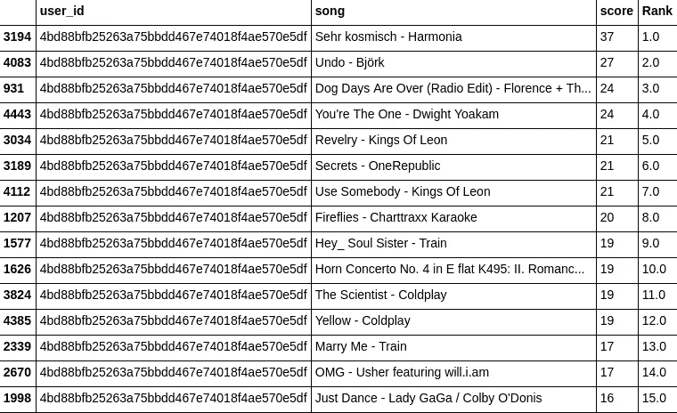

# 用 Python 编写你自己的基于流行度的推荐系统，不需要库

> 原文：<https://medium.com/hackernoon/popularity-based-song-recommendation-system-without-any-library-in-python-12a4fbfd825e>


[Source](http://thedatascientist.com/right-way-recommender-system-startup/)

推荐系统现在无处不在，像亚马逊、网飞和 Airbnb。所以，这可能会让你想知道这些引擎是如何工作的，所以在这篇文章中，我将尝试解释基于流行度的推荐系统。

推荐系统的类型如下:

1.  基于流行度的推荐系统
2.  协同推荐系统
3.  基于内容的推荐系统
4.  基于人口统计的推荐系统
5.  基于效用的推荐系统
6.  基于知识的推荐系统
7.  混合推荐系统

## 基于流行度的推荐系统

顾名思义，基于流行度的推荐系统顺应了这一趋势。它基本上使用了现在流行的东西。例如，如果任何产品通常被每个新用户购买，那么就有可能向刚刚注册的用户推荐该产品。

基于流行度的推荐系统也存在一些问题，并且它也解决了一些问题。

基于流行度的推荐系统的问题在于，这种方法不能实现个性化，也就是说，即使你知道用户的行为，你也不能相应地推荐项目。

所以，我希望你现在对基于流行度的推荐系统有足够的了解。所以，让我们用代码弄脏我们的手。我的笔记本和数据的链接是[这里](https://github.com/vyashemang/popularity_based_recommendation)。

## 让我们开始编码部分

```
**import** **pandas**
**import** **numpy** **as** **np**
**import** **Recommender**
```

首先，我们将导入我们将经常使用的熊猫和熊猫，以及我们创建的[类](https://github.com/vyashemang/popularity_based_recommendation/blob/master/Recommender.py)，它包括像*创建*这样的方法，它基本上创建了推荐和*推荐*，它向用户推荐项目。

```
triplets_file = 'https://static.turi.com/datasets/millionsong/10000.txt'songs_metadata_file = 'song_data.csv'
```

在本节中，我们将数据集导入为一个*三元组 _ 文件*和*歌曲 _ 元数据 _ 文件。**三元组文件*包含*用户标识、歌曲标识和收听计数*。 *songs_metadata_file* 包含 *song_id、title、release_by 和 artist_name* 。

```
song_df_1 = pandas.read_table(triplets_file,header=**None**)
song_df_1.columns = ['user_id', 'song_id', 'listen_count']
```

之后，我们必须合并我们导入的两个数据集。

```
song_df_2 = pandas.read_csv(songs_metadata_file)
song_df = pandas.merge(song_df_1, song_df_2.drop_duplicates(['song_id']), on="song_id", how="left")
```

在这一节中，我们通过删除重复的歌曲 id 来合并两者。

```
song_df = song_df.head(10000)
```

因为这是一个大型数据集，所以我只考虑了前 10k 行。

改变数据集的长度后，我做了一些额外的修改。

```
song_df['song'] = song_df['title'].map(str) + " - " + song_df['artist_name']
```

其中我包含了一个名为 *song* 的列，它连接了歌曲的标题和艺术家。

```
song_df_grouped = song_df.groupby(['song']).agg({'listen_count': 'count'}).reset_index()
song_df_grouped.sort_values('listen_count',ascending = 0)
```

在上面所示的步骤中，数据集使用 pandas 函数 *groupby* by *song* 字段进行分组，并使用 *listen_count* 字段进行聚合，之后根据 *listen_count 对值进行非递增排序。*

```
users = song_df['user_id'].unique()
len(users)items = song_df['song'].unique()
len(items)
```

这一步找出数据集中唯一的用户和项目。

```
from sklearn.cross_validation import train_test_split
train_data, test_data = train_test_split(song_df, test_size = 0.20, random_state=0)
```

这部分代码使用 80–20 的比率将数据集分为训练数据集和测试数据集。

```
pr = Recommender.Popularity_Recommender()
pr.create(train_data, 'user_id', 'song')
```

这里，实例是由类 *Popularity_Recommender()创建的。*函数 *create* 接受三个参数:训练数据、为其创建推荐的用户 id 以及您想要为其进行推荐的项目的列(在我们的示例中是 *song)。*

```
pr.recommend(users[5])
```

正如我之前说过的，方法 recommend 向用户提供推荐，并作为参数传递。因此，它为用户返回流行歌曲的列表，但是因为它是基于流行度的推荐系统，所以对用户的推荐不会受到影响。



Result of the recommendation system for 6th user

```
pr.recommend(users[100])
```

因此，正如你在这里看到的，虽然我们改变了用户，但我们从系统中得到的结果是相同的，因为它是一个基于流行度的推荐系统。


Result of the recommendation system for 99th user

别忘了鼓掌，放下对文章的想法。谢谢:)

来源:

1.  [Divya Sardana |使用 Python 构建推荐系统](https://www.youtube.com/watch?v=39vJRxIPSxw&t=734s)
2.  [https://github.com/llSourcell/recommender_live](https://github.com/llSourcell/recommender_live)