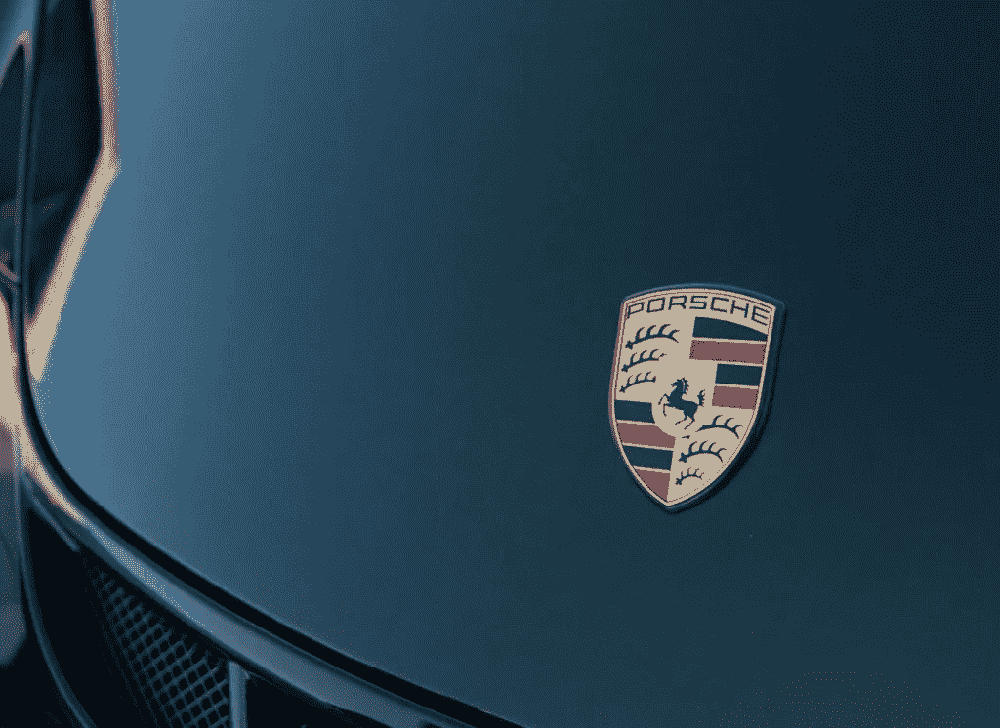

# 保时捷将区块链引入车辆，让汽车共享更加简单高效

> 原文：<https://medium.com/hackernoon/porsche-introduces-blockchain-to-vehicles-to-make-car-sharing-easier-and-more-efficient-f75d1151508a>

根据保时捷的新闻稿，这家汽车巨头正在大力推动将区块链技术集成到其汽车中。

在与柏林初创企业 XAIN 的合作中，保时捷目前正在测试区块链在汽车上的直接应用。这使得总部位于 Zuffenhausen 的公司成为第一家在汽车上实施并成功测试区块链的汽车制造商。

基于这种技术的交易既安全，处理速度也比以前快得多。测试的应用程序包括通过应用程序锁定和解锁车辆、临时访问授权和基于加密数据记录的新业务模式。这可以进一步开发，例如，改善自动驾驶功能。

> “个人数据的去中心化是一个绝对必要的发展，将深刻地决定数字的未来，”行为交换公司的首席执行官 Marijan Jurenec 说。

区块链是商业伙伴之间数据交易的去中心化协议。它也是众所周知的加密货币比特币和以太坊的基础。每一个变化都被记录在按时间顺序排列的数据块中，使其透明和防篡改。保时捷金融策略师 Oliver Dö ring 表示，这可能具有巨大的潜力:“我们可以使用区块链更快、更安全地传输数据，让我们的客户在未来更加安心，无论他们是在充电、停车还是需要让第三方(如包裹递送代理)临时使用车辆。我们将创新技术转化为客户的直接利益。”

# 这些服务又快又安全

在区块链的基础上开发的服务是快速和非常安全的。汽车成为区块链的一部分，使直接离线连接成为可能——也就是说，不需要通过服务器转移。只需 1.6 秒，通过一个 app 打开和关闭汽车的过程比以前快了 6 倍。此外，还会进行有效的加密。此过程确保所有活动都以防止被修改的方式记录在区块链中，并且可以使用应用程序查看。例如，访问授权可以以数字方式安全地分发，并且可以由车主随时监控。Access 也可以远程工作。

此外，该技术还能以安全高效的方式为车辆分配临时通行授权。使用区块链可以建立到车辆数据和功能的受保护连接。同时，它保护参与者之间的所有通信。第三方提供商无需额外硬件即可集成，只需使用“智能合约”。智能合约是在出现之前定义的条件时触发交易的自动化合约。这意味着通过技术来确保遵守合同。

# 基于区块链的新商业模式

保时捷还在研究基于区块链的新业务模式:通过可审计的数据记录，待处理的数据在分布式区块链中进行本地加密。用户控制着数据，根据情况决定如何使用数据。所有活动都记录在区块链中，使删除变得透明。在此基础上，自动驾驶的未来将会看到改进的功能:本地数据可以用来获得区域学习效果，可以与其他车辆安全地共享。客户可以利用同时受到保护的群体数据。