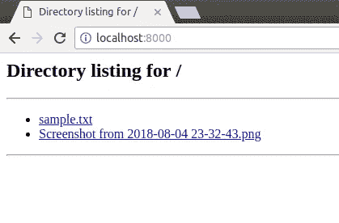
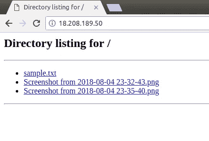
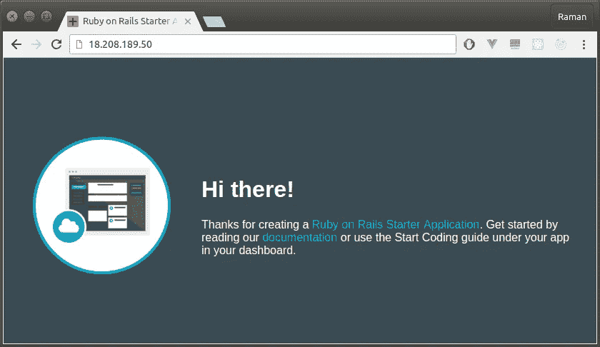
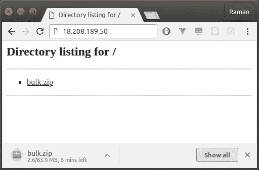

# 将本地开发服务器转发到万维网的端口

> 原文：<https://medium.com/hackernoon/port-forwarding-your-local-development-server-to-the-world-wide-web-3c10ed887216>

PS:小心行事，这可能很危险😃


我:有没有想过你是否正在做一个项目，并且希望你可以将你的[开发](https://hackernoon.com/tagged/development)服务器镜像到[互联网](https://hackernoon.com/tagged/internet)。如果你的同事想使用你的 API，或者产品经理想看看 W.I.P 特性，该怎么办？

你:我有一台临时服务器闲置着。我要做的就是按下密码。或者更好的是，我可以使用像 Surge (surge.sh)这样的免费服务。

我:考虑你的远程朋友也在同时编程。

你:哦，那可能不太好…

我:别担心，我的朋友，我来救你了！

当您运行一个开发服务器时，应用程序将自己绑定到一个本地端口，对于一个 Rails 项目来说可以是 3000。挑战在于让互联网上的人能够访问你的端口。

但是等等！您的 ISP 很可能没有授予您一个静态 IP 地址，也阻止了所有的传入端口。现在该怎么办？

一个典型的开发者一生中至少用过一次 AWS。现在，您在云上有了一台拥有专用公共 IP 的机器。网络上的任何人都可以访问你的服务器。你可以访问服务器。如果您可以将本地端口镜像到服务器，那么服务器就可以成为您的机器的网关。从技术上讲，如果你把你的端口转发给服务器，它就可以把它代理转发给 web。

## TL；灾难恢复—镜像您的“本地主机:8000”

*   在端口 8000 上运行 Python 文件服务器

```
cd Desktop
python -m SimpleHTTPServer
```

*   打开本地主机:8000。你可以看到目录的内容。



*   创建一个新的 EC2 实例。纳米配置绰绰有余
*   注意新创建的实例的公共 IP 地址。对我来说，是 18.208.189.50
*   嘘

```
chmod 400 your-key.pem
ssh -i your-key.pem ubuntu@18.208.189.50
```

*   安装 nginx 服务器

```
sudo apt-get update
sudo apt-get install nginx
sudo service nginx start
```

打开默认配置

```
sudo nano /etc/nginx/sites-available/default
```

浏览*位置的*区块。注释掉文件访问并键入:

```
# try_files $uri $uri/ =404;
proxy_pass http://127.0.0.1:8000;
```

保存文件并重启 nginx 服务器

```
sudo service nginx restart
```

退出实例

```
exit
```

将您的本地端口转发到服务器

```
ssh -i your-key.pem -R 8000:localhost:8000 ubuntu@18.208.189.50
```

如果一切顺利，打开浏览器并导航到[*http://18.208.189.50*](http://18.208.189.50)



瞧啊。

# 应用程序

## 向远程团队公开本地 Rails API 以供使用

感谢 [IBM Cloud](https://github.com/IBM-Cloud) 提供的示例 Rails 设置

```
git clone [https://github.com/IBM-Cloud/ruby-rails-helloworld](https://github.com/IBM-Cloud/ruby-rails-helloworld)
gem install bundler
bundler install
rails server
## Repeat the above steps (port forwarding) but with port 3000
```



## React 项目可以实时访问，以展示产品

感谢安德鲁·法默给我们举了一个优雅的例子

```
git clone [https://github.com/ahfarmer/calculator](https://github.com/ahfarmer/calculator)
cd calculator
npm install
npm start
## Repeat the above steps (port forwarding) but with port 3000
```


On the Internet

## 通过互联网传输大文件

```
cd Desktop
python -m SimpleHTTPServer
## Repeat the above steps (port forwarding)
```



如果你觉得这个有趣，请鼓掌😄

你们中的一些人可能会想，为什么我一开始就发出警告，那是因为我曾经开发过一个 Rails 应用程序。我曾经在本地数据库中放满了有趣的种子数据。有一天，我写了这篇博客，并应用这种技术来测试和迭代我的客户的项目。不知不觉地，我向我的客户公开了我的开发环境。无论如何，他指出了这一点，他笑得很开心。此外，我们仍然使用相同的数据进行暂存😅。