# 投资组合多样性:技术分析

> 原文：<https://medium.com/hackernoon/portfolio-diversity-a-technical-analysis-c2c49f4d3a77>

Welcome to peak performance.

> 多元化给投资组合增加了多少价值？

这是我们希望通过这篇文章解决的核心问题。虽然没有人能预测未来，但我们可以回顾过去来研究趋势。这可以帮助我们在挑战未来时做出更好的决定。

> “不学历史的人注定要重蹈覆辙”

我们之前的研究探讨了一年的 HODLing 与一年的 rebalancing 之间的性能差异。您可以在此阅读更多关于该分析的信息:

 [## 再平衡与 HODL:技术分析

### 这项研究的目的是描绘一幅公平的画面，说明再平衡作为一种策略如何符合霍德林。为了…

blog.shrimpy.io](https://blog.shrimpy.io/blog/rebalance-vs-hodl-a-technical-analysis) 

> 这项研究有何不同？

虽然围绕投资组合的多样化进行了大量的讨论，但在构建多样化投资组合的案例方面却鲜有建树。我们希望这将引发对市场的进一步技术分析。

## 贸易和数据

> 收集了哪些数据？

从交易所收集了整整一年的市场数据。数据开始于 2017 年 5 月 4 日，结束于 2018 年 5 月 3 日。这些精确的数据用于评估交易，就像交易发生时一样。

> 交易的费用是多少？

所有交易都包括标准的 0.25%的费用。

> 贸易途径是什么？

所有交易都以 BTC 为中介。这意味着如果交易发生在 ETH 和 LTC 之间，ETH 将首先被交易到 BTC，然后被交易到 LTC。在这种情况下，这两笔交易都会产生 0.25%的交易费。

## 再平衡期

> 什么是再平衡？

再平衡是从一段时间内表现良好的硬币中取出一些价值，并将这些价值重新分配给表现较差的硬币的过程。最终结果是，每次重新平衡后，投资组合中的每种资产都将达到预期的比例。因此，让我们举一个例子，一个投资组合希望分配 50%的 ETH 和 50%的 BTC。当市场变动时，双方的持股比例可能会变成 60%的 ETH 和 40%的 BTC。然后，当重新平衡发生时，它将进行交易，因此分配再次是 50% ETH 和 50% BTC。

> 什么是再平衡期？

在最简单的情况下，重新平衡会在指定的时间间隔发生。每次重新平衡之间的具体时间称为重新平衡期。这意味着 1 天的重新平衡期将导致每天在同一时间进行重新平衡。这项研究将检查一系列的再平衡期，从 1 小时到 1 个月。 [**了解有关加密货币再平衡的更多信息。**](https://hackernoon.com/portfolio-rebalancing-for-cryptocurrency-7a129a968ff4)

## 投资组合规模

如果不改变投资组合的规模，这就不是对多样性的研究。在这种情况下，投资组合规模是指投资组合中的资产数量。

> 投资组合规模的范围是什么？

在这项研究中，我们选择了从 2 到 10 的投资组合。步长为 2，这意味着有 5 个单独的投资组合大小；2, 4, 6, 8, 10.

> 投资组合中每项资产的权重是多少？

每项资产在投资组合中的权重是平均的。所以一个 2 资产的投资组合将包含每种资产的 50%。

## 资产选择

> 研究中包括哪些资产？

对于包括或排除哪些资产，没有有意的选择过程。简单的标准是，我们需要有一整年的数据，任何资产都要包括在内。这将自动消除超过一年不存在的硬币，以及在停机期间丢失数据的硬币。 [**研究中包含的硬币的完整列表可以在我们的回溯测试工具中找到。**](https://www.shrimpy.io/backtest)

> 创建投资组合时如何选择资产？

单个资产是从资产池中随机选择的。这一过程一直持续到投资组合中的资产达到预期数量。

> 为什么要随机选择资产？

随机选择资产以消除投资组合设计中的偏差。我们不关心单个投资组合在这项研究中的表现。我们关心一个规模的所有投资组合与另一个规模的所有投资组合相比如何。这给了我们一个更一般的比较，从中我们可以得出结论。

## 回溯测试

> 什么是回溯测试？

回溯测试是利用历史市场数据测试交易策略的过程。这个过程确保了投资前的技术质量。回溯测试类似于在一段时间内根据策略进行交易的模拟。结果有助于说明盈利能力和风险。

> 我们做了多少回溯测试？

我们对每个投资组合规模和再平衡期对进行了 1000 次回溯测试。这为我们提供了一个可以用来观察趋势的大样本集。 [**阅读更多关于回溯测试的内容或自己运行。**](https://blog.shrimpy.io/blog/the-crypto-portfolio-rebalancing-backtest-tool)

> 每个投资组合的起始价值是多少？

在每次回溯测试开始时，投资组合被分配了 5000 美元。

# 表演

在这项研究中，我们将了解多样性如何在 5 种不同的情况下影响绩效:HODL、每月重新平衡、每周重新平衡、每日重新平衡和每小时重新平衡。一旦我们完成了每一个案例，我们将结合结果来构建一个完整的投资组合多样性的表现含义。

不要忘记阅读后续研究，该研究对这一主题进行了扩展。

 [## 多样化的加密用户表现更好

### 这是你投资组合的一小步，回报的一大步。我们的上一篇文章讨论了这种关系…

blog.shrimpy.io](https://blog.shrimpy.io/blog/crypto-users-who-diversify-perform-better) 

## HODL

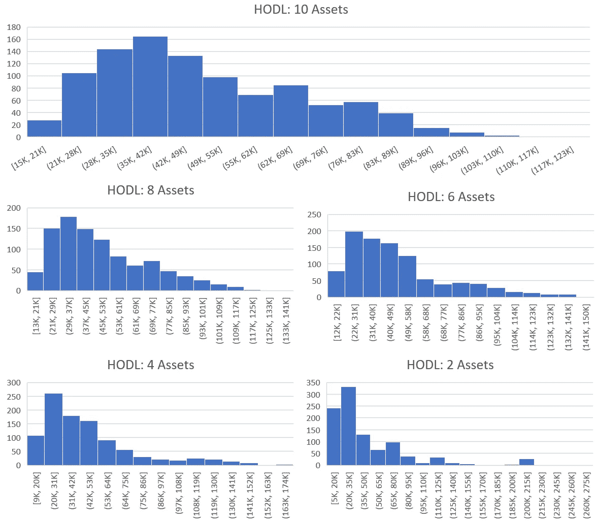

We have grouped HODL into 5 seperate groups that differ by the number of assets. The asset number varies from 2 (bottom right) to 10 (top) with a step size of 2\. Each histogram represents exactly 1,000 backtests. The x-axis is the value of the portfolio after 1 year in US Dollars. The y-axis is the number of backtests which fell into the value buckets that are defined on the x-axis. (Example: If a backtest was run with 2 assets and the results were a portfolio value of 55k USD. This would result in a 1 being added to the bottom right histogram in the x-axis bucket which has the range 50k to 65k. The process is then repeated 1,000 times for each number of assets in the study.)

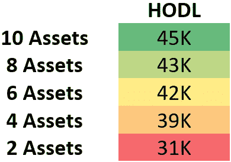

This demonstrates the median value in USD of portfolios after one year of HODLing. The varying dimension being the number of assets held in each group.

HODL 是一个传奇。一个简单的策略，一个不断增长的市场，一个史诗般的迷因。每个人都会时不时地享受一次美好的 HODL。不幸的是，对于投资组合中的资产数量如何随着时间的推移影响业绩，还没有足够的研究。在不考虑实际持有的资产的情况下，这可以对过去一年多样性对投资组合表现的影响程度进行评估。

> 结果如何？

在您的投资组合中有 2 种资产的情况下，我们可以从上面的图表中看到，在 20k-35k 美元附近有一个大的早期峰值。这个峰值很快下降到少数异常值。这种低端聚集显示了相当差的结果分配。增加投资组合中的资产数量会使业绩分布更加均匀，随机异常值会减少。这意味着增加投资组合中的资产数量会产生更加一致和可靠的结果。

我们还可以从业绩中看到，一个投资组合包含的资产越多，一年结束时的中值越高。结合一致性，这表明更高的资产数量产生更多的高价值投资组合。由于这些回溯测试的唯一变量是 HODL 中的资产数量，我们可以有把握地得出结论，在过去的一年中，增加投资组合中的资产数量往往会增加价值。

> 将资产数量从 2 个增加到 10 个，一年后投资组合价值增加了 45%。

## 1 个月重新平衡

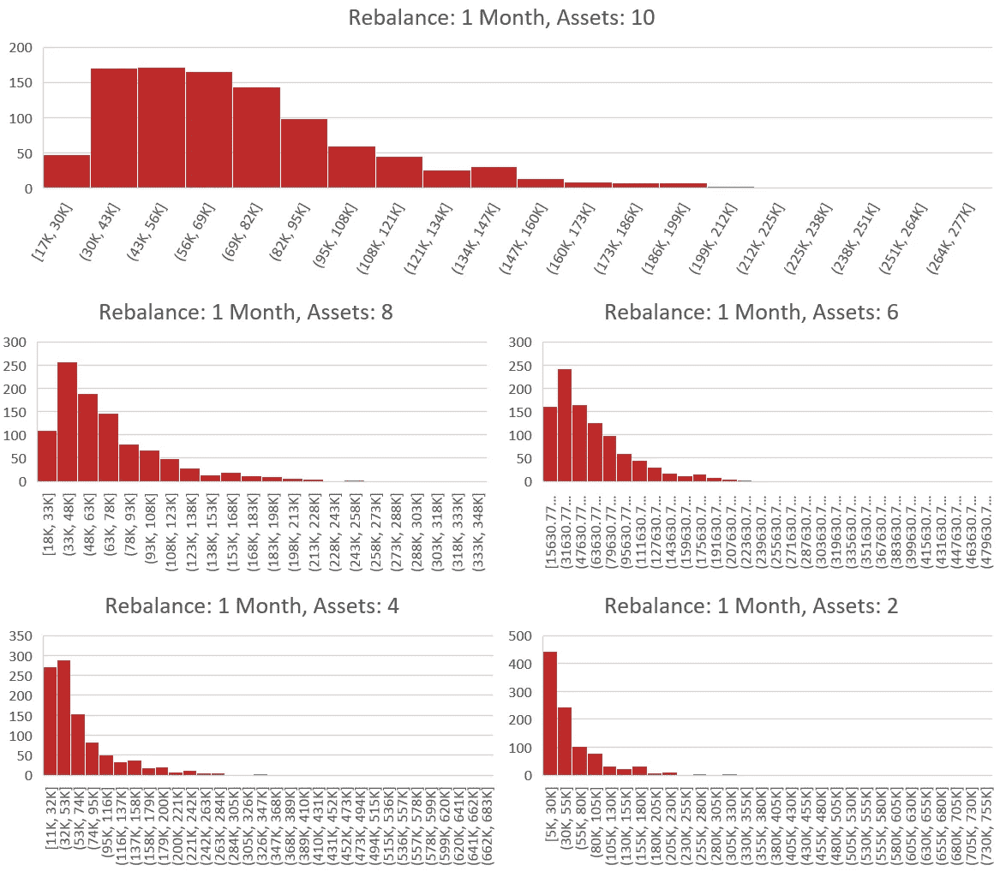

We have grouped the 1 month rebalance backtests into 5 seperate groups that differ by the number of assets. The asset number varies from 2 (bottom right) to 10 (top) with a step size of 2\. Each histogram represents exactly 1,000 backtests. The x-axis is the value of the portfolio after 1 year in US Dollars. The y-axis is the number of backtests which fell into the value buckets that are defined on the x-axis. (Example: If a backtest was run with 2 assets and the results were a portfolio value of 60k USD. This would result in a 1 being added to the bottom right histogram in the x-axis bucket which has the range 55k to 80k. The process is then repeated 1,000 times for each number of assets in the study.)

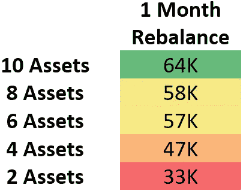

This demonstrates the median value in USD of portfolios after one year of rebalancing. The varying dimension being the number of assets held in each group.

HODL 的比较显示了令人信服的证据，即投资组合的多样性提高了投资组合的长期表现。在最初的资产分配后，无需进行任何交易，多元化已经显示出有希望的结果。继续这项调查，我们将检查这一趋势是否会随着再平衡的引入而继续。我们将考察的第一个再平衡周期是 1 个月的再平衡。

> 结果如何？

在 HODL 案例中观察到的趋势在本分析中继续存在。随着我们增加投资组合中的资产数量，我们看到了业绩的明确增长。

> 将资产数量从 2 个增加到 10 个，一年后投资组合价值增加了 94%。

## 1 周重新平衡

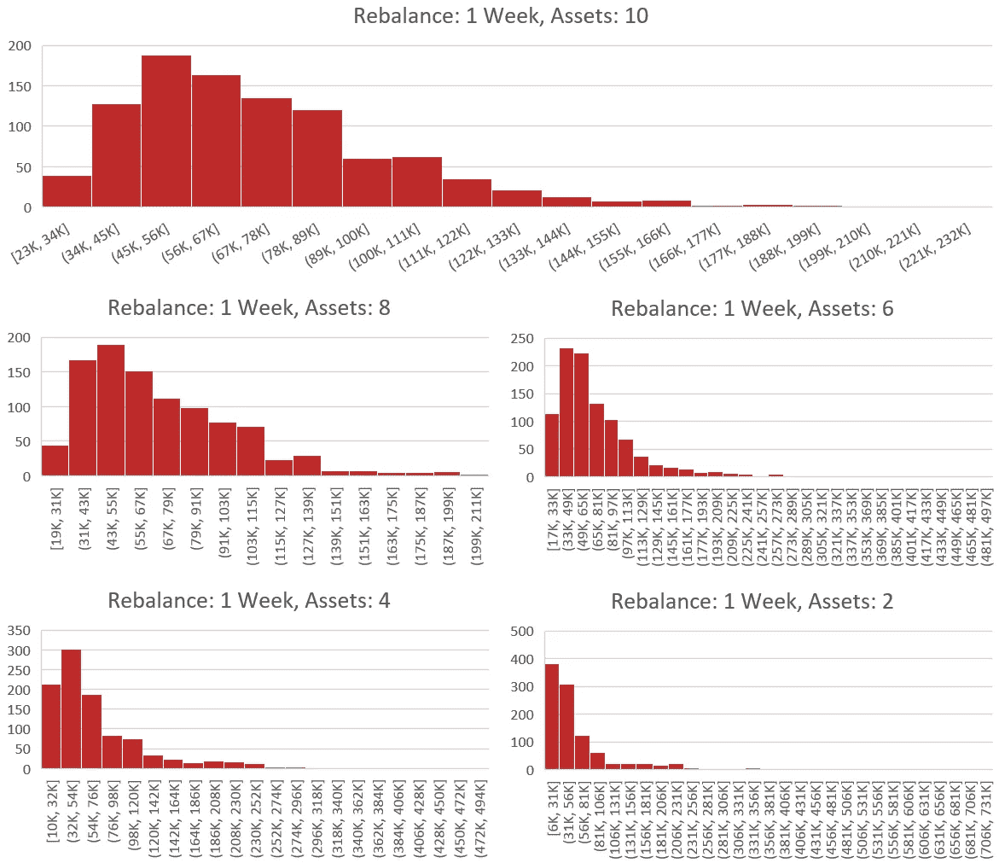

We have grouped the 1 week rebalance backtests into 5 seperate groups that differ by the number of assets. The asset number varies from 2 (bottom right) to 10 (top) with a step size of 2\. Each histogram represents exactly 1,000 backtests. The x-axis is the value of the portfolio after 1 year in US Dollars. The y-axis is the number of backtests which fell into the value buckets that are defined on the x-axis. (Example: If a backtest was run with 2 assets and the results were a portfolio value of 60k USD. This would result in a 1 being added to the bottom right histogram in the x-axis bucket which has the range 56k to 81k. The process is then repeated 1,000 times for each number of assets in the study.)

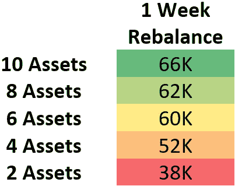

This demonstrates the median value in USD of portfolios after one year of rebalancing. The varying dimension being the number of assets held in each group.

我们研究的下一步是继续缩短再平衡期。这样做的原因是为了确定短期的长期影响。尽管传统资产类别很少进行再平衡，但加密市场的波动性为提高频率以改善性能提供了一个独特的机会。市场大幅波动是典型的，因此再平衡是这种情况下的理想策略。

> 结果如何？

随着我们继续缩短再平衡周期，我们开始观察到类似于我们上一篇文章[“再平衡与 HODL:技术分析”](/@ShrimpyApp/rebalance-vs-hodl-a-technical-analysis-6f341b0db9cd)中讨论的结果。总之，这些结果发现，在过去一年中，缩短再平衡期有提高投资组合绩效的总体趋势。一周的再平衡期不仅优于霍德林，而且优于一个月的再平衡期。

> 将资产数量从 2 个增加到 10 个，一年后投资组合价值增加了 74%。

## 1 天重新平衡

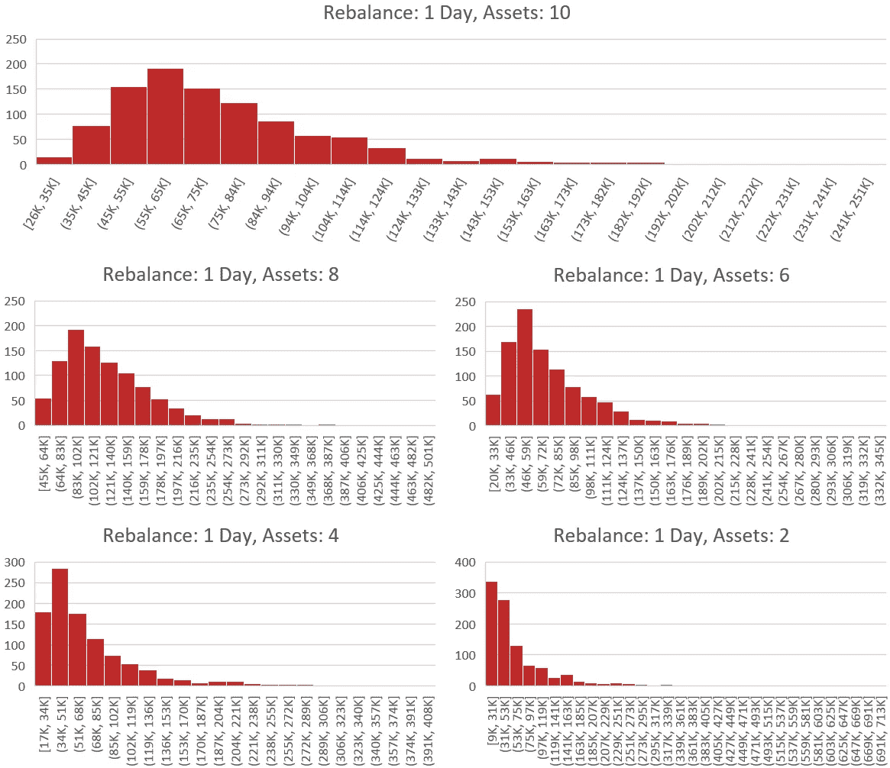

We have grouped the 1 day rebalance backtests into 5 seperate groups that differ by the number of assets. The asset number varies from 2 (bottom right) to 10 (top) with a step size of 2\. Each histogram represents exactly 1,000 backtests. The x-axis is the value of the portfolio after 1 year in US Dollars. The y-axis is the number of backtests which fell into the value buckets that are defined on the x-axis. (Example: If a backtest was run with 2 assets and the results were a portfolio value of 60k USD. This would result in a 1 being added to the bottom right histogram in the x-axis bucket which has the range 53k to 75k. The process is then repeated 1,000 times for each number of assets in the study.)

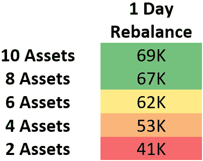

This demonstrates the median value in USD of portfolios after one year of rebalancing. The varying dimension being the number of assets held in each group.

在下一个案例中，我们将继续将重新平衡周期缩短至 1 天。在前面的案例中看到的许多观察结果也将在这里揭示出来。这包括每周再平衡的业绩增长、拥有更多资产的投资组合带来的业绩增长，以及当存在更多资产时更平衡的分布曲线。

> 结果如何？

在 5 张图集中，我们可以看到一个明显的趋势，即增加投资组合中的资产数量可以改善价值分布。虽然 2 个资产投资组合的权重很大，因此大多数结果都集中在价值的低端，但 10 个资产投资组合的分布提供了更一致的更高投资组合价值。

> 将资产数量从 2 个增加到 10 个导致一年后投资组合价值增加了 68%。

## 1 小时重新平衡

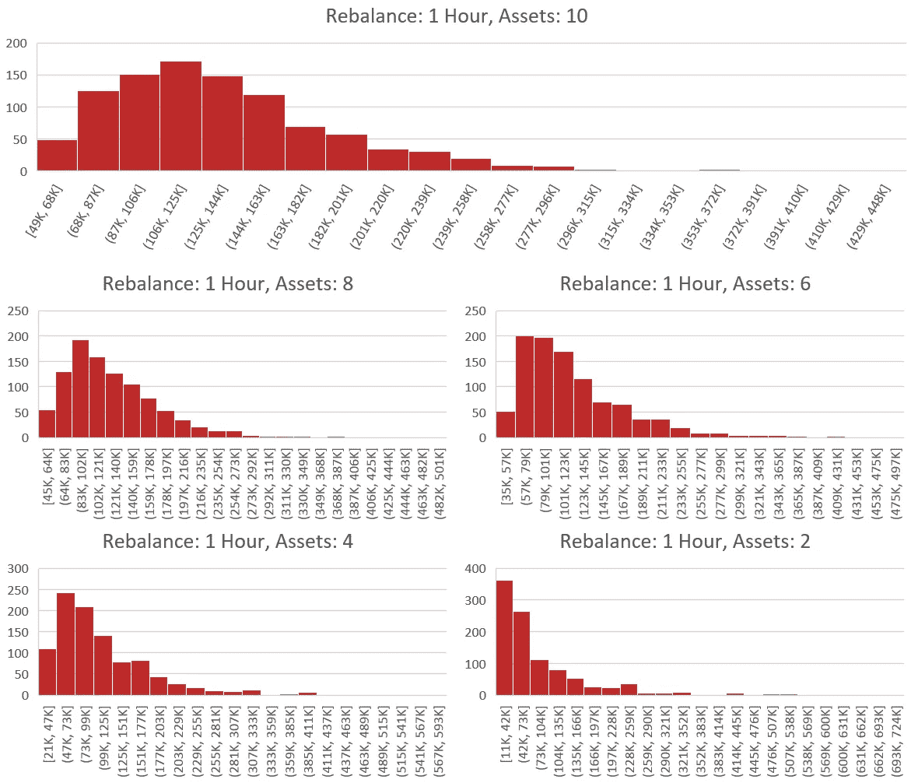

We have grouped the 1 hour rebalance backtests into 5 seperate groups that differ by the number of assets. The asset number varies from 2 (bottom right) to 10 (top) with a step size of 2\. Each histogram represents exactly 1,000 backtests. The x-axis is the value of the portfolio after 1 year in US Dollars. The y-axis is the number of backtests which fell into the value buckets that are defined on the x-axis. (Example: If a backtest was run with 2 assets and the results were a portfolio value of 60k USD. This would result in a 1 being added to the bottom right histogram in the x-axis bucket which has the range 42k to 73k. The process is then repeated 1,000 times for each number of assets in the study.)

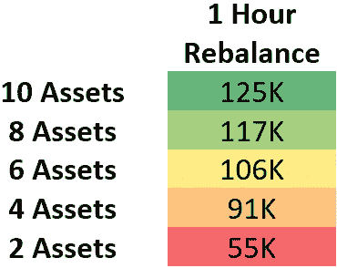

This demonstrates the median value in USD of portfolios after one year of rebalancing. The varying dimension being the number of assets held in each group.

我们将评估的最短重新平衡周期是 1 小时重新平衡。这意味着我们在一整年中每时每刻都在重新平衡。手动执行，这将是一个令人难以置信的承诺壮举。甚至可能是不可能的。从之前的结果来看，目前的预期是 1 小时的重新平衡将优于迄今为止的所有其他案例研究。

> 结果如何？

结果表明，本研究中观察到的最高总投资组合平均值为 125，000 美元。1 小时的重新平衡显示了所有其他时间段以及 HODL 的性能提升。当从 2 项资产增加到 10 项资产时，1 小时的再平衡期也具有最高的投资组合价值增加。

> 将资产数量从 2 个增加到 10 个，一年后投资组合价值增加了 127%。

## 完全比较

对于这些结果中的每一个，我们可以将它们缝合在一起，以获得中值性能如何基于再平衡期漂移的完整视图。

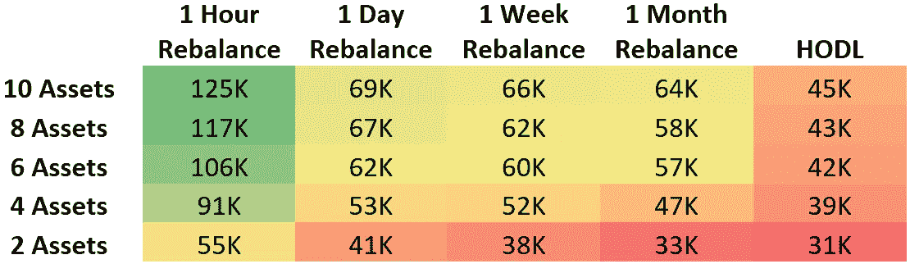

The median performance demonstrates that the higher the rebalance period with the higher number of assets presents the highest gains for rebalancing. Each value represents the complete holdings of the median portfolio. This amount is in USD.

既然我们已经看到了再平衡期如何影响投资组合的表现，我们可以结合所有这些数据来大致了解再平衡相对于 HODL 的表现。当我们累积每个单独测试的所有结果时，我们可以看到再平衡和 HODL 的明显趋势。

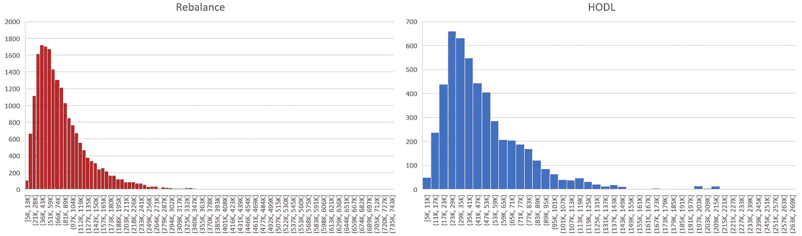

These charts are the combined results of all rebalance backtests (left) and the combined results of all HODL backtests (right).

有了这些综合数据，我们得到了 6.6 万美元重新平衡的综合中值。综合 HODL 测试的结果得出的中值为 4.05 万美元。这是 2.55 万美元的惊人差额

> 再平衡中值:6.6 万美元，HODL 中值:4.05 万美元

> 为什么是中位数？

在这个比较中使用了中值，因为在检查投资组合结果时有大量令人难以置信的异常值。虽然这些结果是可能的，但我们认为这些不太可能成为合理预期的因素。我们希望呈现包含最可能结果的数据。

中位数代表了对结果更现实的预期。中位数告诉我们，有一半的投资组合比这个数字表现得更好，有一半表现得更差。基本上，有一半的机会。

在这种情况下，这意味着如果你随机选择资产，将其纳入一个有随机再平衡期的投资组合，该投资组合的价值有 50%的机会在一年后超过 66000 美元。

> 为什么是偶然？

呈现的结果是基于投资组合的随机选择。这意味着，如果你在同一时期随机选择一批投资组合，你会发现类似的结果。我们希望这不是你选择投资组合的策略。我们将继续提供市场研究，但是您可以做出明智的决定，将哪些资产纳入您的投资组合。 [**你可以阅读我们之前的一篇文章，获得一些关于如何构建杀手级投资组合的建议。**](https://blog.shrimpy.io/blog/10-tips-for-creating-a-killer-cryptocurrency-portfolio)

# 结论

> 免责声明:过去的表现并不保证未来的结果。

这项研究评估了回测的结果。使用同样的方法并不能保证将来会成功。把它当作一种工具，可以帮助我们每个人在未来构建投资组合时做出更好的决策。

> 这项研究揭示了什么？

这项研究揭示了几个明显的趋势。在过去的一年里，资产数量在投资组合的表现中扮演了重要角色。简单地增加资产的数量，无论是闲置还是重新平衡，通常都会提高一整年的绩效。

除了资产数量之外，还观察到更频繁再平衡的投资组合与业绩之间存在密切联系。这意味着，在过去一年里，那些更频繁地进行再平衡的投资组合比那些没有再平衡的投资组合提供了更高的回报。考虑到这两个因素，我们可以看到去年的最优投资组合有大量的资产，并经常重新平衡。

> 在过去的一年里，仅仅是将投资组合中的资产数量从 2 个增加到 10 个，业绩就提高了 77%的中位数。

# 用 Shrimpy 重新平衡

在过去的一年里，我们已经看到，重新平衡多样化的投资组合可以显著提高业绩。Shrimpy 网站可以帮助自动化整个过程。快速选择资产，即时分配投资组合，并在一致的时间段内重新平衡。Shrimpy 是管理投资组合最简单的方法。

点击[这里](https://www.shrimpy.io/)，立即报名。

如果您仍然不确定，请尝试演示，看看我们提供的一切！

 [## Shrimpy 演示

### Shrimpy 是管理您的加密组合的最简单的方法。试试我们的演示，看看我们能提供什么！

www.shrimpy.io/demo](https://www.shrimpy.io/demo) 

# 附加阅读

[***多样化的加密用户表现更好***](https://blog.shrimpy.io/blog/crypto-users-who-diversify-perform-better)

[***再平衡 vs HODL:技术分析***](https://blog.shrimpy.io/blog/rebalance-vs-hodl-a-technical-analysis)

[***针对加密货币的投资组合再平衡***](https://blog.shrimpy.io/blog/portfolio-rebalancing-for-cryptocurrency)

[***加密组合再平衡回溯测试工具***](https://blog.shrimpy.io/blog/the-crypto-portfolio-rebalancing-backtest-tool)

[***再平衡是加密的乐土***](https://hackernoon.com/rebalancing-is-the-crypto-promised-land-6cc37264a4a3)

[***创建黑仔加密货币投资组合的 10 个技巧***](https://blog.shrimpy.io/blog/10-tips-for-creating-a-killer-cryptocurrency-portfolio)

[***如何用这 24 种加密货币红旗避免骗局***](https://blog.shrimpy.io/blog/how-to-avoid-scams-with-these-24-cryptocurrency-red-flags)

别忘了查看一下 [Shrimpy 网站](https://www.shrimpy.io/)，在 [Twitter](https://twitter.com/ShrimpyApp) 和[脸书](https://www.facebook.com/ShrimpyApp)上关注我们的更新，并在[Telegram](https://t.me/ShrimpyGroup)&[Discord](https://discord.gg/gXyy95y)上向我们令人惊叹的活跃社区提问。

留下你的评论，让我们知道你的平衡经验！

*捕虾队*