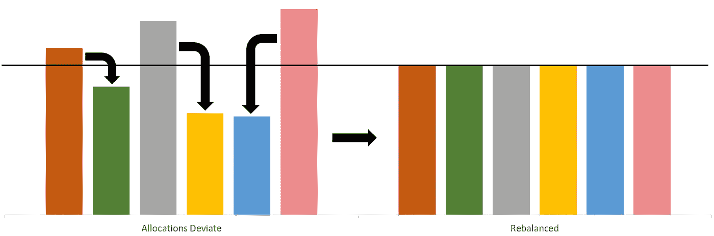
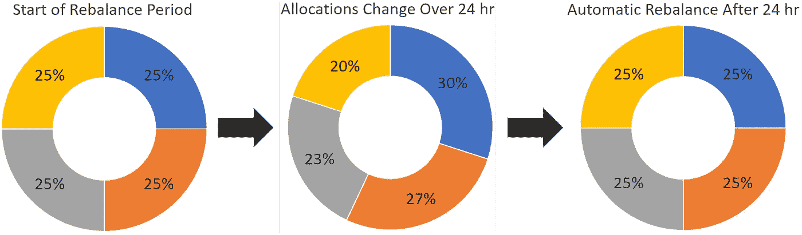
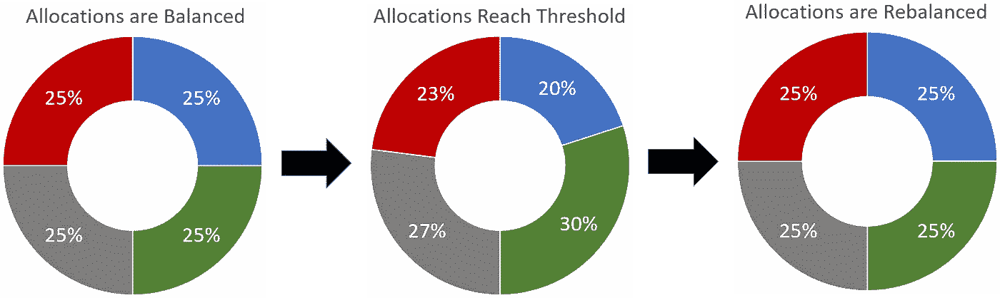

# 加密货币的投资组合再平衡

> 原文：<https://medium.com/hackernoon/portfolio-rebalancing-for-cryptocurrency-7a129a968ff4>

投资组合再平衡是投资者使用了几十年的策略。首先，投资者必须确定他们的投资组合中有多少资产是他们想要分配给每种资产的。在加密货币的情况下，每项资产都是一枚硬币。这些分配只是每个硬币在组合投资组合总价值中所占的百分比。当到了重新平衡投资组合的时候，硬币被交易，使得每种资产的价值再次等于最初指定的百分比。

让我们看一个例子。假设你有一个投资组合，其中有 4 种不同的加密货币:BTC、瑞士法郎、长期货币和 XMR。您已经决定希望这四种加密货币在您的投资组合中各占 25%的份额。这意味着，在再平衡结束时，你的投资组合将由这 4 种资产的 25%组成。由于每枚硬币的价格通常不一样，所以价值应该用法定货币或基础货币来计算，所以不同的硬币在数量上不相等，而是在价值上相等。因此，如果你在这四项资产中总共有 100 美元，那么在重新平衡之后，你在每项资产中会有 25 美元。

This image shows a visual representation of what happens when a portfolio with equal weights is rebalanced.

# 再平衡的优势

随着秘密投资者“囤积”投资的趋势，再平衡提供了一个机会，通过利用价格的快速波动，有可能提高这些持有的收益。当一枚硬币经历强劲收益时，再平衡会将这些收益分配给其他资产。这意味着，即使硬币的价值回到上涨前的原始价格，再平衡也能让投资组合在此期间获得正收益。

为了证明持有硬币的潜在优势，我们对过去 1 年的真实市场数据进行了详细分析。根据我们的研究结果，再平衡比 HODL 高出 64%的中位数。税后，这代表了所有可能的加密货币投资组合的 92%。没有任何涉及管理硬币、执行交易或改变分配的工作，再平衡将持有提升到了一个全新的水平。你可以在这里看到其余的分析:

 [## 再平衡与 HODL:技术分析

### 这项研究的目的是描绘一幅公平的画面，说明再平衡作为一种策略如何符合霍德林。为了…

hackernoon.com](https://hackernoon.com/rebalance-vs-hodl-a-technical-analysis-6f341b0db9cd) 

通过使用我们简单的[回溯测试工具](https://www.shrimpy.io/backtest)，你可以看到其他投资组合在过去一年的表现。

# 常见的再平衡策略

有许多再平衡策略，但我们将只讨论两个最常见的策略。

## 周期的

Simple illustration depicting how periodic rebalancing takes place at specific times. After 24 hours, the allocations are not equal, so a rebalance will make them equal once again.

这些策略中最简单的是定期再平衡，在每次再平衡之间使用固定的时间。由于快速的价格波动，加密货币的这一时间通常比其他资产类别短。例如，选择 1 天的投资组合再平衡时间是合理的。这意味着在每天的同一时间，你的投资组合会重新平衡。

## 阈值

This demonstrates a threshold rebalance when a portfolio reaches a 10% deviation. Notice the difference between the green and the blue allocation is 10%. This gap between the two allocations triggers a rebalance.

基于分配容差范围的重新平衡检查分配相对于彼此的漂移。通过将它们相互关联，每枚硬币之间的差异随着时间的推移而被跟踪。因此，当单个硬币的分配百分比偏离时，当任何两个硬币之间的差异超过阈值时，就会发生再平衡。例如，在波动幅度为+-5%的情况下，如果一枚硬币代表了整个投资组合的 5%或更多或更少，那么投资组合将被重新平衡。想象一下之前讨论的情况，我们有 4 个不同的硬币，每个硬币持有投资组合价值的 25%。在这种方法中，一旦其中一种资产消耗了投资组合价值的 20%或 30%以上，就会发生再平衡。然而，这也意味着，如果投资组合中的所有硬币一起升值或贬值，而不改变它们在总投资组合中的百分比，那么就不会发生再平衡。

# 虾肉中的再平衡

在 [Shrimpy](http://shrimpy.io/) 应用中，我们使用周期性再平衡策略来帮助新投资者进入加密货币投资，而不必担心复杂的交易策略。预测加密市场的每日动向是困难的，因此再平衡提供了一种消除这种预测需要的方法。这意味着您可以为您想要投资的每种货币定义分配，以及重新平衡该投资组合的频率。如果你在开始创建投资组合时需要一些帮助，一定要看看我们在[之前的帖子](https://hackernoon.com/10-tips-for-creating-a-killer-cryptocurrency-portfolio-447f1a191a9c)，里面详细介绍了我们选择强势投资的技巧。现在就免费试用[虾肉](https://www.shrimpy.io/)！

别忘了查看一下 [Shrimpy 网站](https://www.shrimpy.io/)，在 [Twitter](https://twitter.com/ShrimpyApp) 和[脸书](https://www.facebook.com/ShrimpyApp)上关注我们的更新，并在[Telegram](https://t.me/ShrimpyGroup)&[Discord](https://discord.gg/gXyy95y)上向我们令人惊叹的活跃社区提问。

留下你的评论，让我们知道你的平衡经验！

*捕虾队*