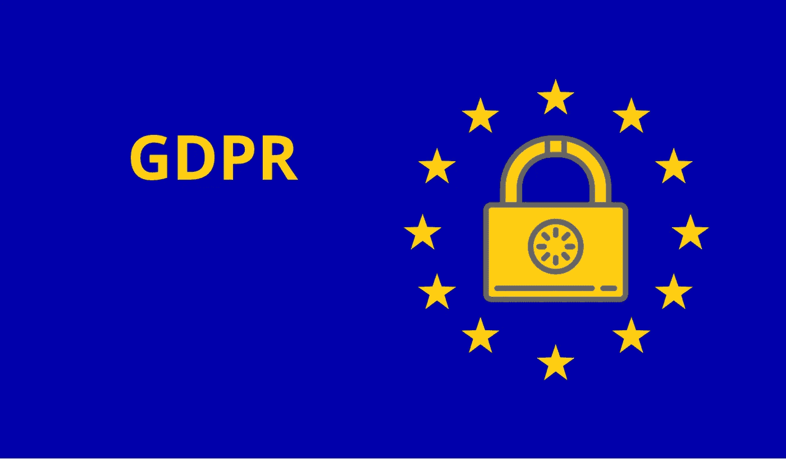

# 后 GDPR 世界:后果和诉讼

> 原文：<https://medium.com/hackernoon/post-gdpr-world-consequences-and-lawsuits-44c778dc9827>

虽然企业已经为 GDPR 做了多年的准备，但即使在该法规于 5 月 25 日生效后，大多数企业仍在努力合规。根据 Trust Arc 的一项调查，超过四分之一(27%)的公司甚至还没有开始使自己符合 GDPR 标准的过程。只有 20%的企业认为自己已经完全准备好了，而其余的企业都处于采用 GDPR 的不同阶段。

这些数字可能远非完美，但与去年的调查结果相比，这是一个巨大的进步。2017 年，美国只有 38%的公司致力于 GDPR 合规(英国为 37%)。更重要的是，近四分之三的受访者希望在 2018 年底实现合规。再过一年，93%的人希望完全达到 GDPR 的要求。

奇怪的是，大多数企业采用 GDPR 来获得客户的信任并满足他们的期望。企业价值观和合作伙伴要求是实施新隐私政策的三大原因之一。GDPR 规定的天文数字罚款在通过的理由清单中排在第四位。

# GDPR 的惊人结果

每个人的收件箱里都会收到大量详细说明隐私政策变化的电子邮件，这并不是 GDPR 法案实施的唯一后果。一些结果出乎意料，让企业措手不及:

*   世界各地的政府正在举起大旗，通过国家数据保护法。中国、巴西和加州(美国)率先推动了后 GDPR 时代的变革。
*   许多美国网站限制欧盟公民访问，以避免与 GDPR 合规的麻烦。然而，从长远来看，这种方法是不可持续的，因此大多数企业在匆忙满足新要求的同时采用了这种方法。
*   电子邮件营销遭受了严重打击，因为用户开始了大规模的退订活动，以摆脱不想要的简讯。一些公司报告丢失了 80%的邮件列表。
*   企业收到大量用户要求被遗忘的请求。根据 7Stars 的调查，三分之一的英国公民计划行使 GDPR 规定的权利，而 78%的英国公司遭受不合理的合规费用。
*   选择退出第三方服务(如分析和广告工具)的机会大大减少了网站加载时间，并改善了欧盟公民的用户体验。
*   与第三方信息相比，第一手数据的价值增加了。用户期望个性化的体验和优惠，以换取他们向所选企业提供的详细个人信息。
*   英国皇家邮政损失了 6%的包裹量和 7%的收入，因为企业减少了主动寄信的数量，以避免 GDPR 罚款。

# GDPR 事件后的诉讼和罚款

除了亲用户的口吻，GDPR 还因其天文数字的罚款而臭名昭著。他们可以达到公司营业额的 4%或 2000 万欧元。尽管已经有一些诉讼援引了 GDPR 的要求，但还没有公司因不遵守 GDPR 而被罚款的先例。

不出所料，谷歌和脸书等互联网巨头最先受到抨击。来自澳大利亚的隐私权活动家 Max Schrems 对脸书、谷歌、Instagram 和 WhatsApp 提起了几起诉讼。罚款总额可达 88 亿美元。这位活动家声称，这些公司强迫用户通过一个选择框分享个人信息，而这个选择框并没有提供 GDPR 所要求的详细同意。谷歌和脸书都反驳了这些指控，并为他们的产品进行了辩护，声称这是一种隐私设计方法，并为满足新法规的要求进行了多项修改。

与此同时，Ticketmaster 可能成为 GDPR 罚款的第一个受害者。该公司没有报告 2017 年 9 月至 2018 年 6 月期间泄露超过 40，000 名国际用户个人数据的持续违规行为。Ticketmaster 本应更好地保护个人数据，并在发现漏洞后 72 小时内报告。现在，世界各地的企业都在等待这项裁决，因为它将为 GDPR 的采用和实施开创一个先例。

世界并没有在 2018 年 5 月 25 日结束，但许多企业未能利用 GDPR 生效前的时间完全合规。尽管有意想不到的不利影响，大多数公司还是接受了新的要求，以获得客户的信任和忠诚。你的企业如何应对后 GDPR 时代的局面？

你想了解更多关于要求和罚款的信息吗？如果有，请在评论区告诉我们。请在社交媒体上分享这篇文章，不要忘记订阅 FreshCode 博客，成为第一个了解最新 IT 新闻和趋势的人。

*原文* [*后 GDPR 世界:后果与官司*](https://freshcodeit.com/freshcode-post/post-gdpr-world-consequences-and-lawsuits) *发表于*[*freshcodeit.com*](https://freshcodeit.com/)*。*