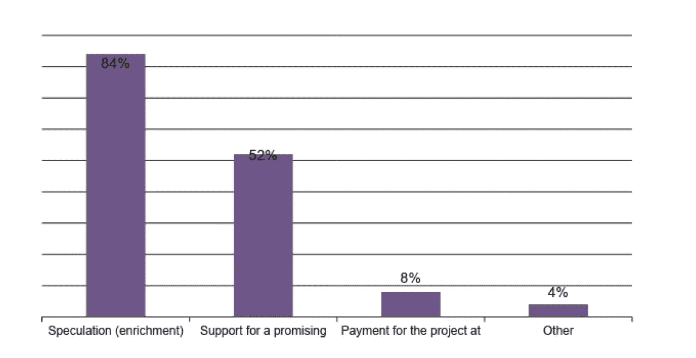
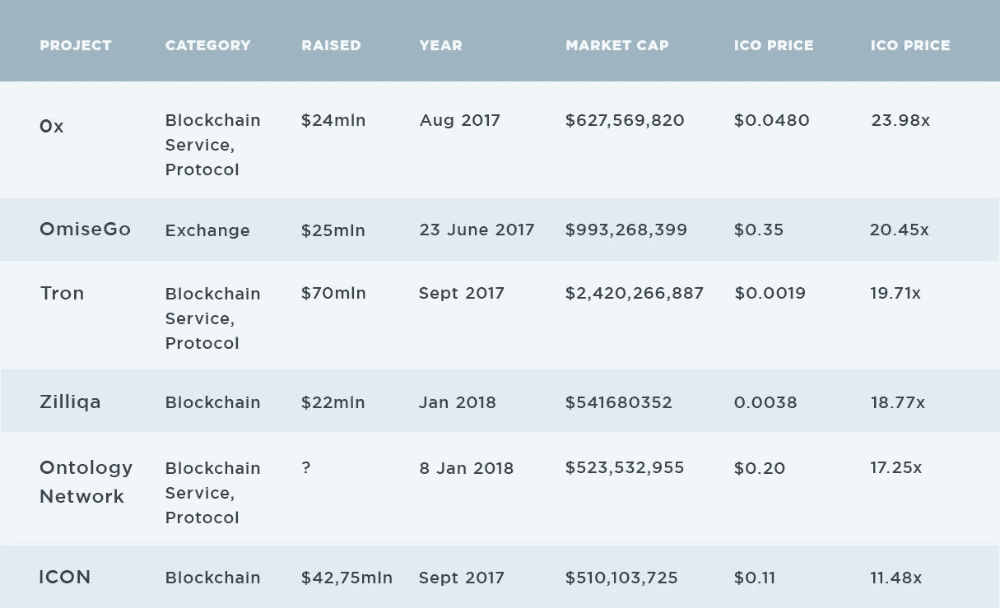
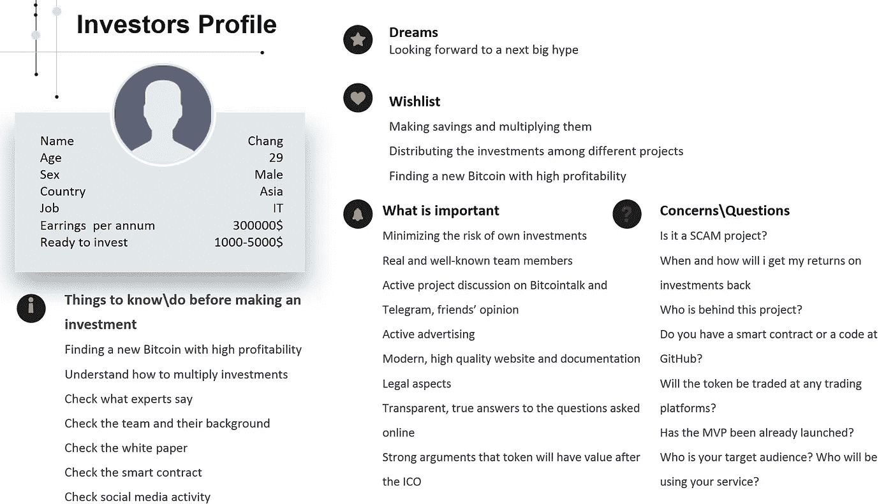

# 投资方是谁？又有哪些 ICO 项目取得了成功？

> 原文：<https://medium.com/hackernoon/post-hype-data-analysis-who-is-investor-and-what-kind-of-ico-were-successful-b10050028f1f>

在这份研究总结中，你将了解普通散户投资者，他的信念和恐惧，以及平均投资金额。您还将了解什么是成功的 ICO 项目，以及如何构建您的战略来满足投资者的目标。

数据提供商是营销机构 [Olshansky and Partners](https://olshansky.org/) ，专门从事数据和客户研究。

每一个代币购买者都在担心自己购买的 ICO 代币的价格。没有人想得到一些他不能使用或交易的零价值硬币。

*ICO 是一个筹资之旅，公司不分享股权，而是通过首次发行硬币/代币的方式出售代币。*

因此，让我们回顾一下目前 ICODrops.com 排名前 300 位的项目和 ICOBench.com 排名近 4000 位的项目取得成功的象征性增长和营销活动。

Olshansky 和他的合作伙伴使用来自 ETHPlorer.com、ahrefs.com、ethprice.com、Similarweb.com 等地的工具。

他们不会重新检查实际的 ICO 令牌价格(在 ICO 结束时)，而是使用 2018 年 7 月至 8 月的数据，价格为 350-500 ETH/USD 和 7500-8500 BTC/USD。

今天，他们看到了一个真实项目的评估，而没有任何对整个加密利基的炒作。没有关于 ICO 阶段最大和平均折扣的数据，因此这项研究显示代币购买者的投资回报极小(公开)。

## 词汇表

*X，X opportunity——意思是双倍、三倍、四倍等的机会。购买代币
公用代币——这种代币不是用来交易和/或赚快钱的。*

## 你会学到什么

**有多少项目仍为美元正值？
谁是一般投资者？**

# 有多少项目的美元仍然是正数？

不同的代币持有者选择不同的代币购买策略。有些人认为代币只是一种工具，并计划长期持有，以便以后使用；其他人在寻找短期买卖机会。

根据 O&P 当地的调查/研究，我们可以看到 84%的买家正在寻找 2018 年的短期机会。

*Purpose of Token Purchase, based on O&P research*

超过一半的代币持有者计划在有机会时退出并出售代币。

ICOBench (3977)列出了近 4000 个 ICO 项目，icoDrops 列出了约 300 个。

## 有两种类型的正投资回报(美元)项目

**第一种是两个 XX%
第二种是一个 X%**

*Based on O&P research*

ICODrops 上列出的 ico 中只有 6 个两位数的 xer(美元值)。例如，如果你在 OmiseGo 的 ICO 期间投资了 100 美元，今天它的价值将高达 20 450 美元。

## 让我们仔细看看它们:

*   5 个中有 4 个是区块链/区块链相关的服务项目或协议。
*   **本体**不共享关于代币销售号码的信息；看起来像私人销售关闭项目。
*   大部分项目在 2017 年做 ico，2018 年初。
*   **Omise.co**从 2015 年开始活跃(web.archive 数据)，ICO 日期与 2017 年 5 月至 6 月的 ETH 增长相关(100-300 美元/ETH)。该项目是首批发送、兑现和提取现金的点对点服务之一。得到了一家大型风险投资基金的资助。
*   0xproject.com 创建于 2017 年 5 月 20 日(网络存档)，作为代币交易协议。白皮书中的分散交换协议、DApps、潘迪拉、Polychain Capital 作为合作伙伴和项目毫无争议地筹集了资金，并于 2017 年 8 月完成了代币销售。
*   **Tron Protocol** 由福布斯 30 位 30 岁以下知名创始人创立，投资人名单扎实。面向全球数字娱乐行业的基于区块链的开源协议。
*   2017 年 ICO 融资是将比特币资本收益(即其中的 5-10%)分散到新资产中。由于低供应和高需求，加上机会主义和缺乏治理，2017 年 ico 在几分钟内就销售一空。

# **这个投资的家伙是谁？**

## 根据[研究](https://poseidon01.ssrn.com/delivery.php?ID=895008008009094088025064120006020119019084025012059023087064126099073125105031010070117058032027051013021109084102109124090120008090090084081026106082088126065027069078083000124114102114005064069083106027030106019011107001107094008072005075077095122&EXT=pdf)，有 4 种类型的 ICO 买家:

1.  非理性繁荣或泡沫——玩家明白这是一个很好的泡沫。
2.  传统智慧。毒品投资。
3.  加密奖金。从以前的 ETH 多样化密码持有，BTC 价格下降。
4.  聪明的钱。风投，家族理财室。泡沫对精明的投资者来说也是有利可图的，只要他们能在音乐停止前套现。

作为营销人员，O&P 使用购买者角色方法，他们将目标访问者群体作为目标行为，比如代币购买。这些人被称为散户。他们使用了一组问题，进行了数百次采访和调查。O&P 想出了这个投资者简介:

常担心的是新的大炒作，他不能错过。他梦想着一个他能及时发现的新项目或新技术。他通常会投资 1-2 个 ETH，如果有一群朋友或合作伙伴支持，他会投资 150 个 ETH，而且他们对这个项目很有把握。这是他的爱好，突然变成了他真正的事业。在几次糟糕的出场后，一切都停止了，离他最初买入的象征性价格只有 0.5 倍，0.3 倍。

常明白这主要是一种彩票，一个大奖就能赢得一切。与美元相比，他持有的密码仍然比他购买时更有价值。因此，他仍在寻找新的浪潮，并相信加密空间。

在购买新令牌之前，他有自己的评估清单，他的常见问题是:

> 团队是谁？
> 
> 这个项目是关于什么的？
> 
> 实现现实吗？或者我们可以靠炒作赚点钱？
> 
> 还有谁信？博主？顾问？公司？

他的平均投资从 5000-10000 美元/项目急剧下降到 12000 美元/项目。他现在甚至需要更多的时间来评估一个项目，他至少需要 7-14 天来完成他的决策。

如果你想从这家公司的研究中获得更多的数据，你可以直接联系 [**亚历山大·费多托夫**](https://www.linkedin.com/in/fedotovalex) 。