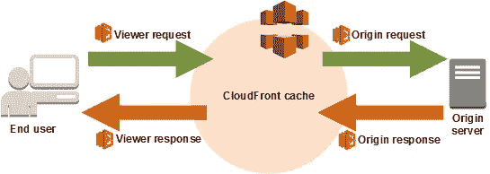

# Lambda @ the Edge 的明信片。

> 原文：<https://medium.com/hackernoon/postcards-from-lambda-the-edge-11a43f215dc1>

亲爱的读者们，我终于到达了云锋的边缘，那里的空气就像文档中描述的那样稀薄。但是你可以在这里做一些令人惊奇的事情。


At The Edge of CloudFront, a lone developer looks for the help file.

几年前，我第一次在 re:Invent 上看到 Lambda@Edge，当时我不确定它是怎么回事。演示展示了如何在飞行中操纵 http 头，但观众在午餐后陷入了一场充满“那又怎样？”的甜蜜危机。这不是演示者的错——一些更高层次的概念没有得到大众的认可。我是说，谁需要干涉 CDN，对吧？

最近，我们启动了一个 CloudFront-heavy 项目，对网页进行各种优化。这时我想起了 Lambda@Edge 演示，一些灯泡开始闪烁。为了测试这一点，我们很快将一些代码移到边缘的函数中，并看到了一些*般的*性能提升。虽然我们写的代码没有什么特别令人惊奇的地方，但是让它工作起来却是一个前所未有的考验。让我们在拿到金牌之前先解决这些问题。


# 文献是一个罕见的发现。

追踪一些 AWS 服务的例子就像是技术上的观鸟。尽管我很喜欢 AWS，但我们都知道它们倾向于*咳咳*，稍微解释一下事情是如何运作的。L@E 将这一点提升到了一个全新的水平，就像在云中找到复活节彩蛋一样。

说真的，我只在边上找到了十几个有用的网页，感谢那些人在我到达之前解决了混乱的局面。有必要的 Slideshare 封面[用例](https://www.slideshare.net/AmazonWebServices/building-serverless-websites-with-lambdaedge-aws-online-tech-talks)，一些[非常基础的例子](https://docs.aws.amazon.com/AmazonCloudFront/latest/DeveloperGuide/lambda-examples.html)，一个[神秘的工作室](https://github.com/aws-samples/aws-lambda-edge-workshops)，和一个[有前途的教程](https://aws.amazon.com/blogs/networking-and-content-delivery/resizing-images-with-amazon-cloudfront-lambdaedge-aws-cdn-blog/)，当它使用 Sharp inside Docker 而不是原生的 ImageMagick(复杂性，人！).写得这么少真的很奇怪。

也有一些旧的代码流传。快速 PSA——在 L@E 处于技术预览版时有一些很好的例子，它们要么现在不工作，要么早期的发现者在前沿发现了一些错误，这些错误已经被修复。如果这些能更新就太好了，但是无论如何，我们在一些虚幻的问题上浪费了时间。

我发现重温一下 CloudFront 实际上如何与大量的官方文档一起工作是很有用的——白名单标题、它如何决定何时缓存什么，以及如果只是将它作为一个普通的 CDN 来处理，通常可以避免的所有细节。在深入了解 Lambda 是如何参与进来的之前，这是一个相当有启发性的好地方，并且至少在所有事情都令人着迷的时候给你一些线索。

# 生活在边缘。

本质上，您可以将您的功能附加到基本 CloudFront 生命周期中的四个事件上。CloudFront 存在于查看者(用户)和源(包含内容的实际服务器)之间:



*   查看器请求:当用户发出请求时，就会出现这种情况。CloudFront 还没有检查内容是否被缓存，但是在这里您可以对传入的请求进行修改。
*   Origin request:这个 *only* 发生在缓存未命中时(即 CloudFront 没有内容)。它发生在提取之前，但如果存在缓存命中，则根本不会发生。
*   Origin response:这是在 Origin 提供内容后触发的。
*   查看者响应:最后，这发生在响应被转发之前。

在确定将代码挂接到哪些事件时，有一些微妙之处。眼尖的读者会立即发现您希望尽可能避免查看者请求事件，因为它每次都会运行，并且会增加延迟和每月账单的费用。

我对 Lambda 的通常做法是找到一个模拟事件和尽可能短的测试代码，看看什么有效。我想运行四个函数(每个 CloudFront 事件一个),将一些东西写到日志中，这样我就可以对它的成功运行感到兴奋。这花了一整天的时间。

首先，我找不到任何模拟事件。这实际上是一个问题，因为您的函数必须返回一个响应，而这个响应总是传入事件的修改形式。CloudFront 会给你一个很长的 JSON，你的代码在返回之前会对它进行调整。所以我想出了这个简单的主意:

```
'use strict';exports.handler = (event, context, callback) => {
    console.log('Welcome from the Edge!');
    const response = event.Records[0].cf.response;
    console.log(JSON.stringify(response));
    callback(null, response);
};
```

在我们编写任何真正的代码之前，这是一种廉价而愉快的方式来记录那些到来的事件。几乎成功了。

# 兰姆达斯的沉默。

老练的云本地人熟悉管理区域的乐趣，但在 Edge 过程中有一个扭结，这让我困惑了几次。当您的代码在边缘运行时，日志记录发生在该边缘服务器的 CloudWatch 区域。日志可能不在您认为的位置。

一个典型的例子是——我住在新罕布什尔州(与技术人员交谈时也称为大波士顿地区)。我通常使用 us-east-1，并总是假设它是离我最近的地区，所以在测试一些功能时，想象一下当 CloudWatch 日志在弗吉尼亚州为空时我有多惊讶。我调试了我的 IAM 权限，我的函数代码，用尽了我知道的大部分咒骂语，才意识到一些事情——我最近的地区是俄亥俄州。


Out in New Hampshire, we’re north of The Wall.

当然，这要么是我低于标准的地理或 CloudFront 测量电缆距离，而不是实际距离。我花了几个小时进入了一个 AWS 区域，这个区域我从来没有在控制台上打开过。在一个没有服务运行的区域生成日志似乎有点奇怪，但现在我知道了。自然，没有任何迹象表明这正在发生。

我后来测试了我手机上的一个网页，这个网页和我的笔记本电脑连接在同一个无线网络上。伐木又停止了。挖了一圈后，我的电话测试又回到了 us-east-1，原因我完全不明白。然后，就在我习惯在俄亥俄州和弗吉尼亚州之间切换时，日志完全消失了。我的函数正在运行，只是没有记录日志，我正要重新考虑 Azure 时，我注意到了一些事情…


日志流名称的变化取决于该函数是在您的控制台中运行还是在 CloudFront 中运行，所以我搜索了错误的日志流名称。你知道你的日志流名称在 Lambda 中可以改变吗？由于您只能通过前缀而不是“contains”进行搜索，所以我花了很长时间来查找第二个日志组。

好消息是，许多其他人完全被这个栈溢出弄糊涂了，不仅仅是我。一名开发人员报告说，尽管日志的分布仅限于美国/北美地区，但它却出现在世界各地。去想想。


Day 1 of writing functions for Lambda@Edge.

**教训**:如果你找不到你的日志，也没有 502/503 错误，那么 Edge 几乎肯定是在另一个区域登录。它肯定在某处记录。

# 工作流程很笨拙。

部署您的功能是一个容易出错、混乱的过程。如果你使用 GUI，你必须记住函数版本是边缘的一等公民。我们遇到的许多错误都是由于在给定的发行版上运行了错误的版本，因为你不能将一个发行版链接到 function 的最新版本。

当您有几个运行少量功能的 CloudFront 发行版时，这看起来并不太糟糕。当你试图将 CloudFormation 编写成脚本来完成所有这些工作，然后你想推出新版本的功能时，这就成了一项真正的任务。

再一次，我们在[无服务器](https://serverless.com/)的好朋友已经在我们之前解决了这个问题，并且用 L@E 插件平滑了一些粗糙的边缘。如果你是一个无服务器用户，这将使你的生活看起来更像一个开发人员，它有助于编排这个版本问题。只要确保你没有在 YAML 删除旧版本(是的，那很有趣)，不要期望它是完全完美的。

一般来说，我们发现管理 Edge 代码有点困难，尤其是如果多个开发人员在同一个空间。当结合 CloudFront 的 20 分钟部署时间(是的，这也影响了您的 Lambdas)时，不知道谁在做什么以及哪个代码在运行会有点奇怪。

我们还发现，将 Lambda 更新部署到产品发行版是一件绝对可怕的二进制事情，成功率或失败率都是 100%。向 us-east-1 推出您的新版本总是在全球范围内复制，回滚可能需要一段时间。如果您有客户在您的 Edge 代码上运行，那么部署更新的唯一明智的方法似乎是创建新的 CloudFront 发行版，并跨其迁移用户。如果客户的 DNS 指向你的 CloudFront 发行版，这就不那么容易了。


It has a happy ending, don’t worry.

# 但是等等…还有更多！

在边缘不是规则的λ。首先，AWS 的简介中充斥着许多限制。每个 AWS 帐户只能创建 25 个 Lambda@Edge 函数，每个发行版只能创建 25 个触发器，并且不能通过在其他帐户中将 Lambdas 与 CloudFront 关联来作弊。25 个发行版的硬性限制是任何大规模 SaaS 式实现的最佳选择。

您的所有功能必须驻留在 us-east-1 中，并且您的 IAM 权限必须具有正确的信任权限，以允许复制。你只有 30 秒的时间来完成任务(5 分钟是给热爱土地的兰姆达斯的，而不是在边缘)，而且你不能使用 VPCs。您的响应被限制在 1 MB 以内(这对任何梦想即时处理图像的人来说都是个坏消息),并且您的功能包不能超过 1MB。唷，是这样吗？一点也不！


# 从边缘看到的景色令人惊叹。

我已经不是第一次经历 AWS 产品的怪癖和烦恼，并发现挑战已经有了回报。边缘是与常规 Lambda 不同的地方，也是与 EC2 完全不同的地方，与内部部署非常不同。基本上，我们在月球上。

CloudFront 是一个非常巧妙的工程，你现在可以使用它了。面临的挑战是做得很少，速度极快，以避免增加延迟。当我们意识到延迟限制以及 CloudFront 在您的代码完成之前不会向用户返回任何内容的事实时，我们最初想在边缘将一切都塞进 Lambda 函数的梦想很快就破灭了。这种阻塞行为必须从一开始就影响你的设计。

最初，我认为我可以检查 DynamoDB，在 S3 保存一些文件，并在对 CloudFront 的一次调用中重新处理 HTML。在实践中，我们发现了一种更好的方法——确定哪些事情可以异步完成，并让 CloudFront 向 SQS 发送消息以分离流程。这使我们能够对 Edge 功能进行最小的更改，保持较低的延迟，但以我们以前想象不到的各种创新和聪明的方式使用这个“钩子”。


如果你运行任何类型的静态站点——比如平面 HTML 或者 SPAs，那么这个优势就是你的了。htaccess 文件。在一个简单的 Lambda 函数中进行 URL 重写、重定向或自定义处理非常容易。它是高度可扩展的，无服务器的，便宜的——我提到过它的性能是*级的*吗？

如果您想在静态站点中添加个性化，处理表单或用户帖子，或者在返回到应用程序之前预处理其他数据，那么 Edge 是理想之选。你也可以在这里用 JWTs[管理 auth](https://aws.amazon.com/blogs/networking-and-content-delivery/authorizationedge-how-to-use-lambdaedge-and-json-web-tokens-to-enhance-web-application-security/) ，运行简单的 [A/B 测试](/buildit/a-b-testing-on-aws-cloudfront-with-lambda-edge-a22dd82e9d12)，并使用 WAF[即时阻挡攻击](https://engineering.contaazul.com/instant-block-of-attacks-to-aws-websites-using-cloudfront-lambda-edge-dynamodb-waf-a94281cb5bde)。虽然我们还处于 edge 使用的早期，但看起来除了 Edge 功能向外扩展之外，没有任何重大的冷启动问题。

奇怪的是，总是与 Lambda 相提并论的一个陈词滥调的用例——即图像优化——看起来像一个反模式，可能不是一个好主意。从 S3 抓取图像并动态调整大小或优化可能会遇到前面提到的限制，并且通常会提供缓慢的用户体验。使用普通的 Ol' Lambda 也有更好的方法。

我在 Lambda@Edge 上的冒险真的很有趣，尽管在最初的几天里有一些令人难以置信的恼人的时间。这是我的云工具箱中的一个有用的新工具，我不会在每个应用程序中使用它，但当它真正需要时，它没有替代物。正如 Lambda 改变了我看待拼凑解决方案的方式一样，我现在发现边缘正在悄悄进入我的设计，我很兴奋地发现接下来我可以用它做什么。