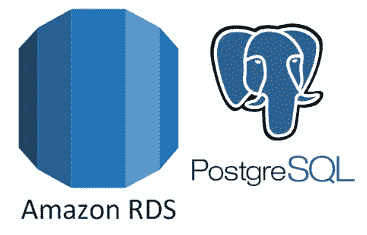

# AWS 中的 PostgreSQL RDS 创建/迁移

> 原文：<https://medium.com/hackernoon/postgresql-rds-creation-migration-in-aws-cbae2901d460>

本文描述了在 AWS 中从现有数据库创建数据库的过程，我们将介绍将模式和数据从现有数据库迁移到新数据库的步骤。当需要为基础设施中的不同环境(系统测试、集成测试或性能测试)创建 RDS 实例时，或者在将数据库从一个版本迁移到另一个版本的过程中，您可能会遇到这种情况。由于大多数组织正在进入您构建您自己的模型阶段，如果我们知道一些简单的步骤来自行管理数据库更改，就不需要依赖 DBA 团队来处理每个更改请求。我之所以写这篇文章，是因为它可以节省一些时间，让我们更快地完成那些需要用必要的模式和数据来启动 RDS 实例的工作。

从上述角度来看，本页将向您展示如何使用实用工具 psql 和 pgdump 使用 PostgreSQL RDS。

1.  【psql 的设置路径& pgdump

psql 和 pgdump 是 PostgreSQL 安装附带的实用工具。如果您已经安装了，可以在系统中的类似位置找到上述可执行文件，如下所示。

> /Library/PostgreSQL/9.6/bin

将该位置添加到现有路径中，如下所示。

> 导出路径=/Library/PostgreSQL/9.6/bin/:$ PATH；

**2。从模式**中提取 DDL & DML 命令

在执行下面给出的任何说明之前，请确保在 RDS 实例安全组中为特定 IP 范围启用了 TCP 的端口 5432(Postgres 的默认端口),该 IP 范围将允许从您的笔记本电脑访问 RDS 实例。这个检查是必需的，因为您将从您的机器上执行所有的 create 和 insert 语句。

以下命令有助于根据 RDS 实例中可用的现有模式生成 DDL 脚本，其中包括旧数据库中存在的所有配置(如主键、外键约束)，这些配置将在生成的文件中可用。

> pg _ dump-h<aws instance="" name="">-p<port>-d<database name="">-U<username>-s-F p-n<schema name="">></schema></username></database></port></aws>

下面的第二个命令通过提供适当的插入脚本，帮助从旧数据库生成数据转储。

> pg _ dump-h<aws instance="" name="">-p<port>-d<database name="">-U<username>-a-F p-n<schema name="">———插页></schema></username></database></port></aws>

**执行插入脚本**

每当您尝试从您的机器执行 SQL 脚本时，系统都会提示您输入密码。

> psql-f<sql script="">-h<aws db="" name="">-p<port>-d<database name="">-U<username></username></database></port></aws></sql>

一旦 SQL 脚本执行完成，您就可以使用您的数据库了。

如果您只有一个超级用户，您可以使用“登录/组角色”下的 pgadmin 工具添加新用户，开始向您的数据库添加具有有限权限的新用户，并在您的应用程序中使用它。

上述方法可以在数据库从一个版本迁移到另一个版本(比如从 9.6 到 9.8)的过程中使用。这些生成的脚本可能需要的唯一更改是，如果新版本不支持任何数据类型，则在新版本的 DB 上运行它之前，需要进行额外的检查以使其工作。