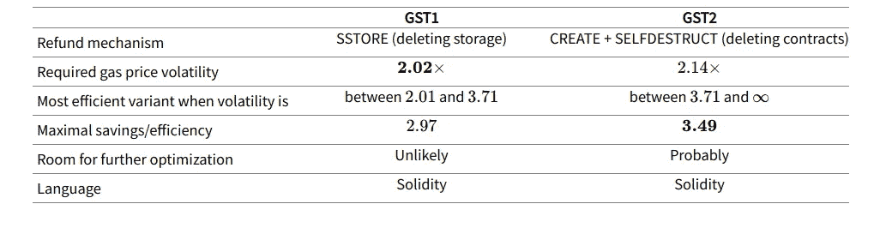
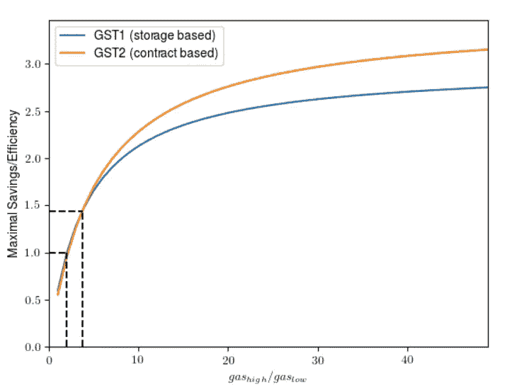

# 对以太坊网络的潜在攻击

> 原文：<https://medium.com/hackernoon/potential-attack-on-ethereum-network-to-mint-gastokens-5cf05a7e0303>


[https://btcmanager.com/overview-of-recent-ethereum-attacks-impact-on-the-network/](https://btcmanager.com/overview-of-recent-ethereum-attacks-impact-on-the-network/)

> 由 [QuillAudits](https://audits.quillhash.com) 的安全审计员 Abhishek sharma 。

## 以太坊网络漏洞

由 [levelk](https://www.levelk.io/) 揭露的以太坊框架中的最新漏洞，潜在地允许不良行为者制造大量毒气或耗尽资金。

## 被谁发现的？

在 [levelk 的](https://www.levelk.io/)假设研究或案例研究中，有可能在获得 ETH 或任何 ERC20 或其他标准令牌的同时铸造大量 GasTokens。

当接收方契约的回退功能能够执行由交易生成方支付费用的反复无常的计算时，该漏洞就会暴露出来，并带来**“griefing”**的风险。

## 什么是悲伤者？

恶意玩家是指在多人视频游戏中故意激怒和骚扰游戏中的其他玩家，有意或无意地使用游戏的某些方面的玩家。据[维基百科](https://www.wikipedia.org/)。

## 什么是气体？

气体是以太坊区块链的基本资源，以太坊网络上的每一笔交易都需要一定量的气体来执行一笔交易，它可能是 1 gwei，也可能是两三位数。

## 什么是 GasToken？

燃气令牌是一种基于以太坊区块链的智能合约，允许以太坊区块链的用户在燃气价格低时将燃气令牌化，并在燃气价格高时消费。

这也成为第一个用户或业主能够在以太坊网络上销售和购买天然气的智能合同。

## 气体令牌是如何工作的？

gas tokens 利用以太坊中的存储退款概念，激励智能合同删除存储变量，以太坊网络在存储变量被删除时提供退款，直到合同交易的一半。

●如果变量从零变为非零值，有**气费**
●如果变量从非零值变为零，有**气费退款**

**从 gasToken 获利:** ●gas price 低时造币代币:将一个变量从零值改为非零值。
●gas price 高时烧代币:将一个变量从非零改为零。

**举例:**

写永久区块链州耗费了大量的天然气。例如，当向存储器写入非零值时，存储指令当前消耗 20000 gas。擦除存储额外花费 5000 汽油，但也提供 15000 汽油的退款。

假设我们在汽油价格低的时候写存储，在汽油价格高的时候用代币兑换退款。我们每个存储字的总费用是:

```
**20000⋅gaslow + 5000⋅gashigh**
```

我们收到每个单词的退款:

```
**15000⋅gashigh**
```

无论何时，我们都有望实现节约:

```
**gashigh > 2⋅gaslow**
```

GasToken 实际上有两个版本:一个使用存储来存储天然气(在 GST1 上使用)，另一个通过创建合同来存储天然气。后者利用删除整个合同(GST2)时获得的气体退款。



[https://gastoken.io](https://gastoken.io/#GST2)

# GasToken 两个版本的比较



[https://gastoken.io/#comparison](https://gastoken.io/#comparison)

## 攻击者如何获得利益？

当汽油价格高时，汽油持有者或所有者可以通过燃烧汽油价格低时制造的汽油来降低交易成本，或者通过攻击交易所，或者通过调用发起任何 ERC 令牌的资金转移的任何交易所的函数 withdraw 来降低交易成本，该函数调用攻击者的智能合约的回退函数，并且它将能够挖掘汽油或执行可能耗尽交易发起者资金的交易。

## 避免这些类型攻击的建议

*大多数交易所已经意识到这些类型的铸造攻击，但仍然无法覆盖所有的攻击，这些背后的原因是缺乏开发人员的知识，对这些攻击的认识和现有的工具无法验证智能合约中所有潜在的 bug 和漏洞大多与* ***代表调用*** *有关。这种攻击对于没有实现适当的 KYC 过程的交换来说更加有害，因为攻击者可以使用不同的地址重复地制造 GasTokens。*

*对所有交易实施燃气限额，*

```
required_gas_limit * gas_price
```

*再来讨论一下区块链安全，在我的电报手柄上 ping 我—*[@ abhi _ 区块链](https://t.me/abhi_blockchain) *！*