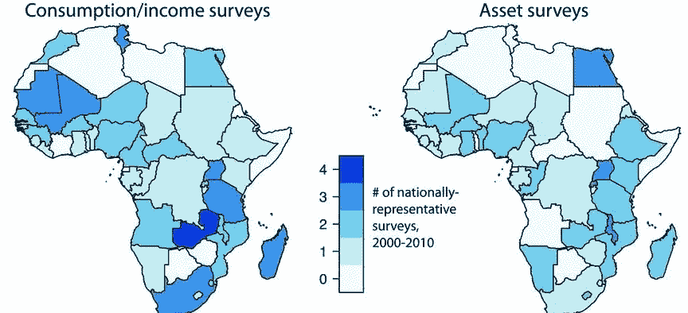
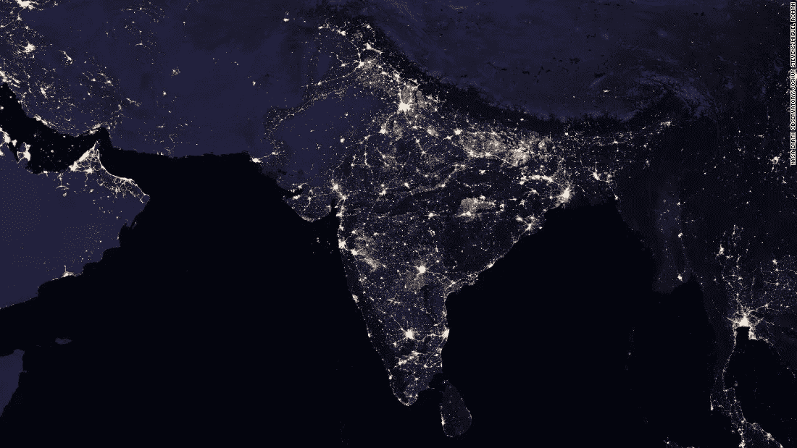
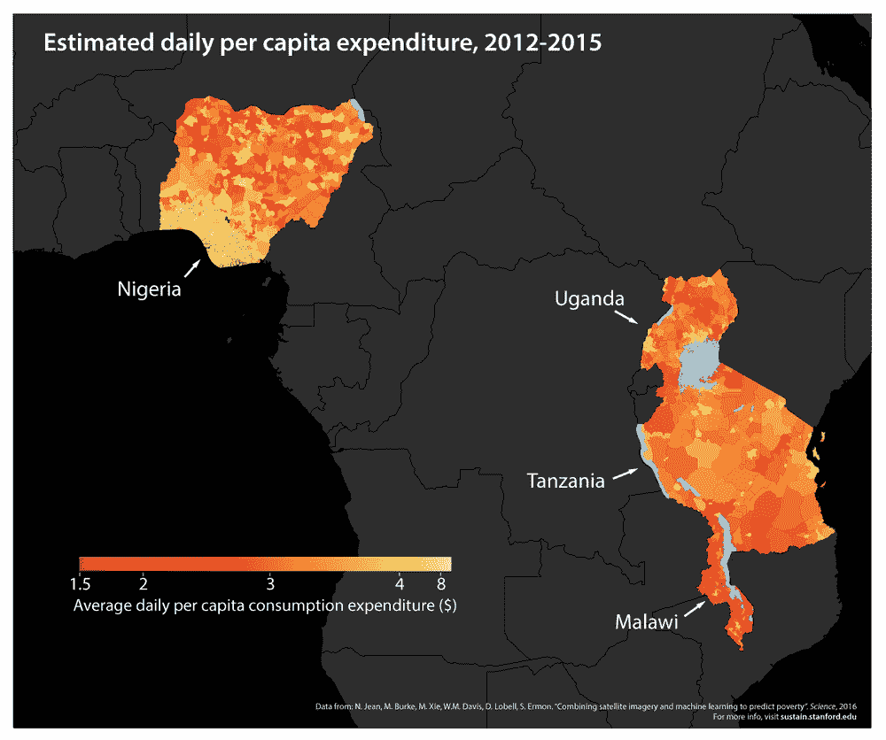

# 使用卫星图像和机器学习进行贫困分析

> 原文：<https://medium.com/hackernoon/poverty-analysis-using-satellite-imagery-and-machine-learning-3e4a8546859d>

*作者:* [***阿格拉哈***](https://www.facebook.com/agraha.jigyasu)

在发展中国家，关于经济生计的可靠数据仍然很少，这阻碍了研究这些结果和设计改善这些结果的政策的努力。虽然发展中国家现有经济数据的数量和质量近年来有所提高，但大部分发展中国家仍然缺乏经济发展关键指标的数据。这一数据缺口阻碍了确定和理解这些结果的差异以及将干预措施有效地针对最需要的领域的努力。

根据世界银行的数据，在 2000 年至 2010 年期间，59 个非洲国家中有 39 个进行了不到两次调查，从中可以构建具有全国代表性的贫穷衡量标准。在这些国家中，有 14 个国家在此期间没有进行过此类调查，已进行调查的大部分数据不在公共领域。然而，一项新的研究消除了被动调查的需要，它通过派遣官员到每个家庭收集信息，而是使用计算机视觉和机器学习的力量来实现同样的目的。利用白天和夜晚的灯光[卫星](https://hackernoon.com/tagged/satellite)图像，可以对贫困和财富进行精确的估计。这种评估对于制定以地区为中心的发展政策非常有用，这样可以实现最大的利益转移。

事实证明，夜灯卫星图像在提取一个地方的经济信息方面非常有用，因为闪电越多，经济状况就越好。

Economically advanced places in India have greater night light density

然而，使用夜灯图像进行预测并不总是正确的，因为人口密度较低的地方似乎具有较低的夜灯密度，但同时可能并不经济落后。例句:农舍。为了解决这个问题，科学家们想到在模型中引入日光图像，日光图像解决了这个问题，因为在其中可以很容易地看到房屋的密度和大小。

这种贫困分析方法效率高，成本低。但是它也有一些局限性。世界的每个地方都有自己的文化和生活方式，因此在世界的一个地方训练出来的模式在其他地方并不有效。因此，我们首先需要在某个地区的平衡数据集上训练我们的模型，以对其他具有相同生活方式的地方做出高度精确的预测。这样的分析肯定会有助于世界的发展和确保财富的平等分配。

***跟随 NITWTechnoreview 上*** [***推特***](https://twitter.com/NTechnoreview) ***和*** [***脸书***](https://www.facebook.com/NITWTechnoreview/)