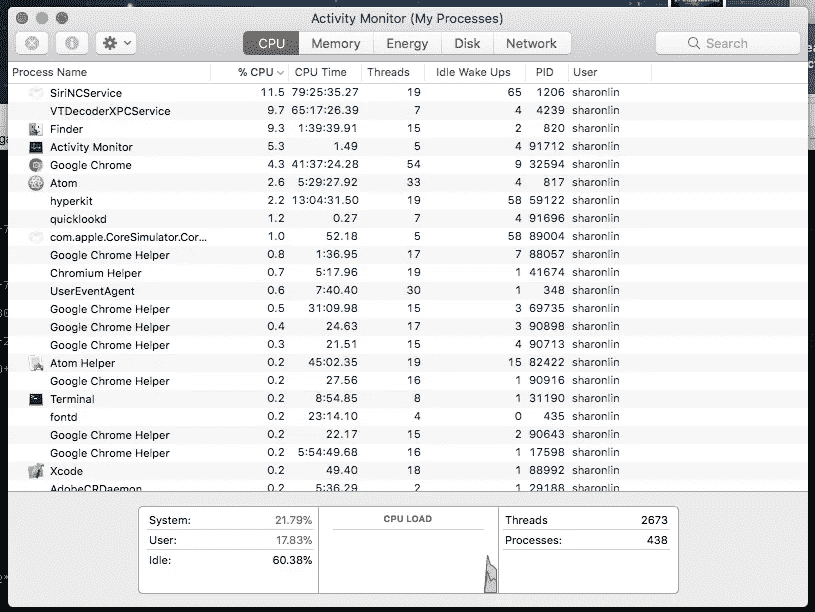

# macOS 的电源管理

> 原文：<https://medium.com/hackernoon/power-management-for-macos-88855c01aea3>

最近，我的朋友对使用 PowerTOP 来降低他的戴尔 XPS running Arch 的功耗感到非常兴奋。这是一个很棒的工具，可以在终端中显示一个最小化的后台活动监视器，但不幸的是，它只适用于 Linux 系统。

我经常使用 Activity Monitor 来监控我的 CPU 和内存使用情况，但我开始想知道是否有可能为 Mac 系统提供一个非 GUI 助手。

