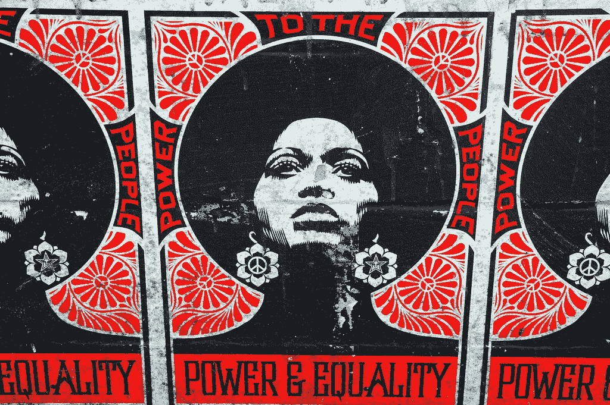

# 人民的力量？

> 原文：<https://medium.com/hackernoon/power-to-the-people-ac95ad0b8fb4>

对所谓的密码货币空间的普遍看法是，它赋予人们创造自己的硬币并在公开市场上与之竞争的能力，从而增强了他们的能力。我们听说过网络 3.0、象征性经济和区块链革命。对于 T2 和区块链实际上做了什么，为什么它很重要，以及比特币与所有其他密码货币的区别，似乎没有什么真正的理解。现在，所有区块链的支持者们，一劳永逸地通过你们的厚脑壳了解这一点——让比特币变得有价值的关键因素是它的*固定货币供应*。就这样。区块链的发明只有一个目的。这对其他任何事情都没有好处。地球上没有人能创造新的比特币。任何能够在键盘上按 ctrl-c 和 ctrl-v 的人都可以创建一个新的密码货币。黄金是稀有的，假黄金不是。

比特币将权力传递给人民的方式不是通过网络 3.0、象征性经济或区块链革命，而是通过持有比特币。没有一个政府税务员、吸血鬼银行家或蛇油推销员能够利用比特币。无论如何，它都不是一个社会主义的想法。在当前的凯恩斯主义定义中，它也不是资本主义的。这更像是一个掌权者从人民手中窃取钱财的时代，因为这涉及到拜访他们，并使用暴力抢夺他们的黄金和贵重物品。比特币是抵御盗窃的盾牌，无论盗窃是伪装成税收、通货膨胀还是费用进行的，都不重要。这就是比特币的作用。它在时间和空间上保持不变。从短期来看，这听起来可能不太有说服力，但比特币不是短期思维。它是关于打破短期思维的破坏性。你可以把它代代相传，传到你后代的大脑中，没有人能阻止它的发生。此*将*发生。它*正在*发生。现在。

就像几个世纪前给予封建领主的头衔所带来的特权在今天仍然回响并给予他们的后代优势一样，今天的比特币持有者的后代在未来可能会享受特权地位。然而，这一次不再由现在的反社会者来决定谁的孙子可以享受寄宿学校的生活方式。这一次，把财富传给你的孩子的权力掌握在你自己手中，这至少应该给你一些激励，为不太幸运的时候保存一些资产。

一般来说，人们会继续做出糟糕的财务决策。任何政府或金融顾问都无法阻止这一点。人们会参与金字塔计划，人们在考虑他们的经济时会忽略通货膨胀。由于共产主义的失败所证明的众多原因，让一个群体获得平等的财务结果不仅是不可能的，而且也是不可取的。然而，机会均等应该是每个地方都要努力争取的。中本聪给了我们人类一个工具，让我们从零开始，建造一些耐用的东西。机会不可能比这更平等了。这是*权力赋予人民*的唯一有意义的表达方式。如果机会从不敲门，就造一扇门。