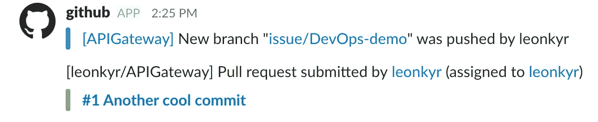
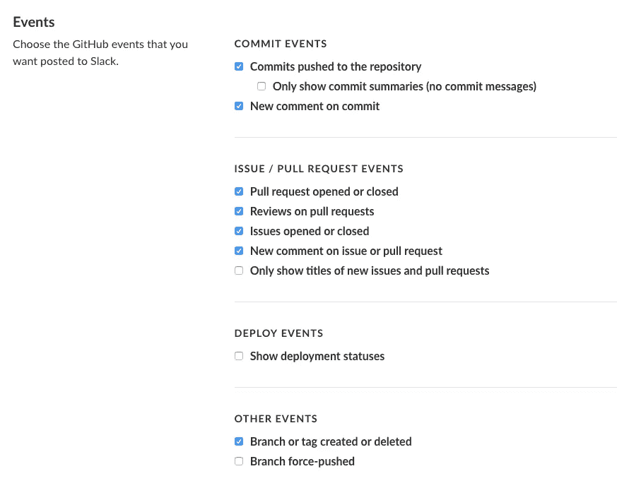
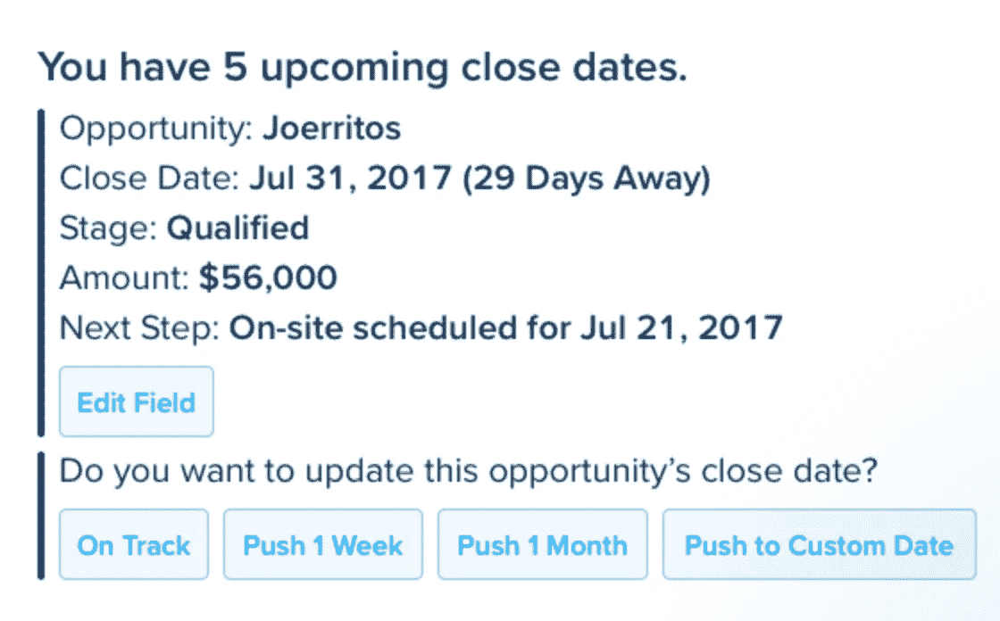
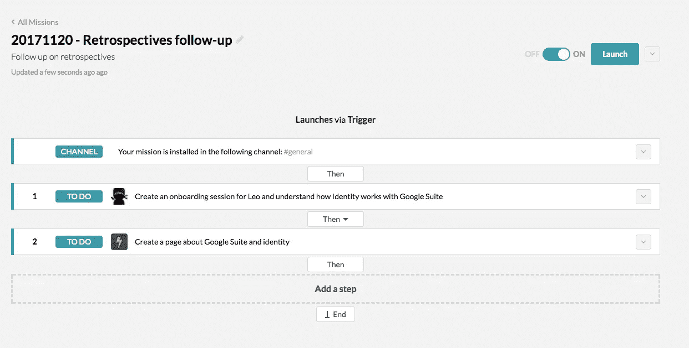
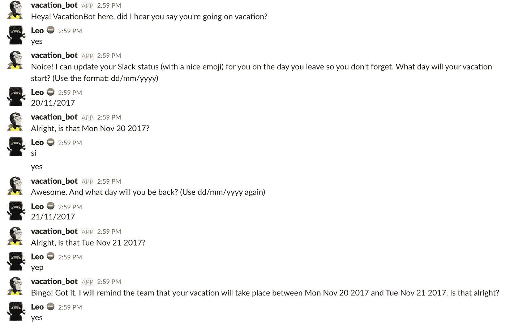
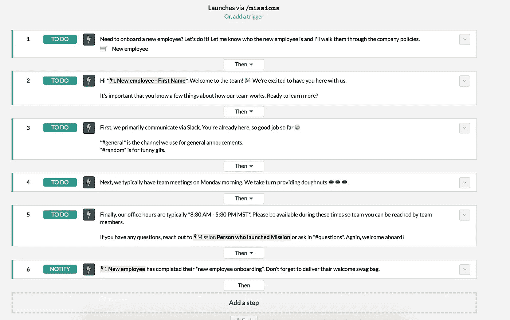

# 使用 ChatOps 让您的组织充满活力

> 原文：<https://medium.com/hackernoon/power-up-your-organization-with-chatops-d2a1f33a022a>

# 如果可以选择，两个都要！

让我简单介绍一下我自己。我是 Leo，我从事软件开发已经有 14 年了。我的日子看起来彼此非常相似，也和其他软件工程师的日子非常相似。然而，几个月前，我开始开发一些小型聊天机器人和自动化工具，以帮助更快更有效地做事。

# 照章办事，但要做作者

我的老朋友，一家小型 [DevOps](https://hackernoon.com/tagged/devops) 公司的首席执行官，向我挑战，要我设想并开发一种用 ChatOps 增强组织能力的最佳方式。

挑战被接受了。我知道什么是持续交付，以及如何制造一个机器人。我不知道的是，当使用消息传递系统和无数其他工具时，一个企业或团队想要达到的目标是什么。

你想自动化什么？

谁是典型的用户角色？

这个角色如何将聊天机器人与其他服务结合使用？

我花了一些时间四处查看，玩了一些聊天机器人，并做了额外的研究，看看聊天系统是如何在 Atlassian 内部使用的。我放弃了。没有太多可以玩或研究的东西。

# 能跑就不要走！

去年 10 月，我飞到奥地利的维也纳，谈论聊天机器人的产品化，以及做一个好的聊天机器人意味着什么。在那里，我有一个很好的机会去会见不同的机器人开发者和那些想要建造一个机器人或者只是好奇的人。这让我大开眼界。这个领域太新了，没有最佳实践或任何东西。

我回来后又参加了几次聚会，与人们讨论他们如何使用聊天平台和其他工具。我真的很惊讶，每个人都告诉我同样的故事:我们使用多种服务和多种聊天平台；我们只使用从服务到聊天平台的通知；但是我们希望获得更多的自动化、报告、工作流，但是所有系统都不支持这一点，而且我们没有资源和专业知识来自己构建一些东西。

# 你得到你奖励的东西

我一直是一个好胜的人。我甚至参加过铁人三项和超跑。因此，我接受了挑战，去寻找一种用 ChatOps 为一个组织提供动力的最佳方式。此外，我不想停留在工程方面。还有许多其他部门需要帮助并使用消息系统。

我的旅程从一个简单的案例开始，在这个案例中，我决定每个人都应该获得他们感兴趣的信息。我尝试的大多数服务都有一个 bot 或 webhook 集成，允许你接收通知。

进入我的聊天工具的通知看起来很不错，并且很有帮助，直到你收到太多通知(或者你需要将它们链接在一起以做出更大的决定)。过了一段时间，我开始忽略他们。我看到的另一个问题是，我不能从内部聊天与他们做任何事情。我必须点击一个链接并访问一个连接的系统才能继续在那里工作。

我找到了一位同志，他帮我设置了一些我认为应该是任何通知解决方案的一部分的东西。你能猜出来吗？是的，这是一种过滤、推迟或暂停通知的能力。大多数聊天工具都不提供这种现成的功能。

好的。现在，我可以过滤通知，音量下降了。好样的。但连接服务的数量开始拖累我，在标签之间跳来跳去，真的耗尽了我的精力。所以我决定扭转局面，让服务为我服务。我希望能够利用收到的通知采取行动。然后，我寻找我已经连接的系统，并意识到要代表我采取行动，我需要将我的聊天帐户与连接服务中的帐户进行映射。

收到。但是我有个问题，船长。我打算对我使用的每个服务都这样做，但这并不容易。大多数系统不支持可操作的通知。我找到了几个如何做到这一点的例子，并开发了自己的解决方案来简化这一过程。

我还决定查看其他工具，如 Salesforce 和 Workday，看看我是否能收到符合我所有要求的通知。对于 Salesforce，我找到了一个定制的解决方案，允许这样做。您可以将聊天帐户绑定到军队帐户，军队帐户可以连接到 Salesforce 帐户。

我感觉棒极了。另一方面，Workday 完全让我失望。

# 早失败，勤失败，勇往直前！

在通知设置好之后，我可以继续我的自动化快乐之路。
自动化。这个词有多少含义。我不能一次去所有的地方，所以我选择了一些有意义的事情来自动化:

*   回顾会议后的跟进行动
*   编排待办事项列表
*   拉动式请求跟进
*   休假和差旅审批
*   员工入职

每隔几周我都会参加不同的回顾会议，这些会议通常会记录在 Atlassian's Confluence 中。页面上总会创建一些任务供人们跟进。我看到的另一件事是在下一个 sprint 期间创建吉拉问题来跟进任务。

我一直看到的是，大多数人没有正确地跟进任务，经常会忘记。

我决定自动化这个过程，所以当一个回顾页面被创建时，我创建了一个任务列表，并把它们分配给人们。如果一个任务依赖于另一个任务，我需要确保所有的上游任务都完成了。此外，我希望任务有截止日期和提醒。

我记得早在九月份就和迈克·布雷沃特谈过他的新服务，名为 [Missions.ai](http://missions.ai/) ，我记得它的目标是实现聊天流程的自动化。我决定跳上火车，做一次更深入的测试。

我设法释放了一些我的大脑，现在队友们不必为了跟进回顾的行动而互相打扰了。这很简单明了。

那天晚些时候，我意识到 retros 的自动化使我能够自动化任何分布式待办事项列表。呃！检查过了。

许多开发人员没有持久的记忆力，经常忘记跟进他们的拉取请求。(或者，他们只是拖延。)结果，特定功能的开发周期变得更长。这对 Scrum 团队来说可能不是很重要，但是我是一个真正的看板爱好者，不喜欢有很多工作在进行中。我决定自动追踪我的队友，以便更快地审查我的拉取请求。我还做了一个 chaser，当我需要更新一个 pull 请求、提供评论或为别人做评论时，它会 ping 我。

# 当面对没有挑战时，创造一个挑战。

我想用[任务做更多的事情。ai](http://missions.ai/) ，然而，它不能观看我需要积极参与的 PRs。我尝试了几种不同方法。我写了自定义代码。失败了。我想尝试 Hubot，但它需要更多的编码，我当时没有心情这样做。

我决心完成我的使命，所以决定另辟蹊径，不依赖任何现有的机器人。我决定开发一个 AWS Lambda，它将监听 Github webhooks，当有我需要知道的东西(主要是 PRs)时，它会通过 Slack webhook 集成给我发送消息。可以创建另一个 Lambda，计划每隔几个小时运行一次，检查是否有需要您注意的事情。

我的时间有限，我需要充分利用时间，所以这个小任务的最后一部分是自动批准休假。它演变成了什么？我梦想的自动化是让它几乎一键完成，然后永远忘记它。这些步骤可能如下所示:

1.  使用命令安排 PTO。“/PTO 从 2018 年 2 月 29 日到 2018 年 2 月 31 日，我将在不存在的二月会议上发言”
2.  一个聊天机器人[会将这个 PTO 通知我的经理。如果需要，获得批准。](https://hackernoon.com/tagged/chatbot)
3.  这将标志着我的工作和我的团队日历，因为利奥是 OOO。
4.  它会在我 PTO 的第一天通知我的团队“Leo 在 2018 年 3 月 1 日之前不在这里”。
5.  这将改变我的步幅/松弛度通知设置
6.  邮件，我用的不多。但是它也可以设置 OOO 回复我的邮件。

好的。如果只有我一个人知道，我真的应该设置我的 PTO 吗？:)

研究了一下，我发现了一个度假机器人。它的质量很差，但我设法让它运行起来。它可以做上面列表中的一些事情。

这一天还没有结束，我梦想着我的超级 PTO 自动化，但我的梦想并没有帮助它成为现实。

我建议的方法是开发一个简单的聊天机器人，它能做到以上 5 点。如果你想使用的系统有开放的 API，它将会很棒。太阳下山了，决定前进。

# 如果容易的话，早就做完了

第二周，我们的团队里来了一名新毕业生，我同意成为他的伙伴，帮助他开始新的生活。在我内心深处，我知道该是我在何身上尝试一些新东西的时候了。我的想法是，他的入职是一些自动化的完美候选，所以这个挑战被接受了！

令我惊讶的是， [Missions.ai](http://missions.ai/) 这次符合要求，他们甚至有一个员工入职模板，实际上是一个待办事项列表。我只需要设置一些任务并让它运行。这与带有复选框的文档没有太大区别。

梦想中的入职类似于工作流自动化与在员工需要做某事时集成其他服务的能力的结合。这可以用定制的粘合代码来完成，它非常适合无服务器架构或 web 任务框架。这里唯一的缺点是，您需要能够访问您想要推送更新的所有系统。然而，有一些捷径可以帮助你——if TTT 和 Zapier。

看起来我基本上成功地将自己从许多常规和无聊的过程中自动化出来。我说完了吗？我不觉得我是。

# 没有目标，你每次都会错过

有一天我遇到了 Arik，他是一个分析师，我和他下过象棋。他问我对敏捷软件团队中的 KPI 了解多少，并给我推荐了一本相关的书。我开始深入挖掘团队 KPI 领域以及团队通常关注的内容。我发现了多种人工制品:吉拉仪表盘、excel 报告和多种墙板，它们都试图增加团队对进度的可见性，并允许人们或多或少地看到他们周围发生的事情。

除此之外，我决定检查其他团队如何收集 KPI 并使用 ChatOps 监控它们。我发现了 Statsbot，这是一个基于来自不同分析服务(如谷歌分析)的数据提供预定报告的机器人。我试了一下，然后就上瘾了。它很容易安装和使用。我开始想如果有这样的东西会很棒。

# 找到你愿意为之而死并为之而活的东西

为什么我要和你分享这个故事？这是一个非常好的问题。我的想法是与你分享我和我的团队如何使用聊天机器人来提高我们的工作效率并获得更多乐趣！此外，这次小小的旅行让我有了一次飞跃，我学到了很多东西。

总而言之，聊天机器人是一个相当新的领域。有很多议论，但它仍然不成熟，你可能需要自己做一些胶水代码。最重要的是，现有的解决方案往往没有得到很好的开发，并且功能有限，所以要准备好整合第三方和您自己的机器人。我们每天都在使用多个机器人，我个人使用的甚至更多，所以我建议你把聊天机器人想象成另一个需要全方位关注的网络应用，包括错误处理、调试、安全、支持和产品分析。

你为什么会使用聊天机器人？因为你不喜欢做重复的任务，所以你把事情自动化，并把它们连接到一个聊天平台，你通常用它来与你的同事和朋友交流。另一个答案可能是，制作它们并将所有的点连接在一起要容易得多。

我今天呼吁大家尝试一些不错的聊天机器人，并尝试制作一个。**你不需要鼓掌，但请和我分享你的经历**。

*Correr o morir！*

由[为您带来向前推进](https://www.moveworkforward.com/) — [微软团队吉拉连接器](https://www.moveworkforward.com/product/microsoft-teams-jira-connector)开发者。