# 用宇宙 js 驱动 React + Next.js 博客

> 原文：<https://medium.com/hackernoon/powering-a-react-next-js-blog-with-cosmic-js-bc182b2b2c94>


**TLDR；**
[*宇宙 JS*](https://cosmicjs.com/) 为博客提供了优秀的后台。这是一个功能齐全的内容管理系统(CMS ),具有直观的用户界面，非技术客户可以使用它来管理他们的网站内容。

有关代码和演示，请访问以下链接:

# TL；博士:

[React + Next.js 博客 App](https://cosmicjs.com/apps/cosmic-react-blog)
[React + Next.js 博客演示](https://cosmicblog.chriso.io/)
[React + Next.js 博客代码库](https://github.com/chrisoverstreet/cosmic-blog)

每个博客都需要一个可靠的内容管理系统。这使得内容所有者可以控制他们的内容，而不必雇佣开发人员来对他们的网站进行每一项更改。许多开发者在考虑 CMS 时会立刻想到 WordPress。不过，我想建议用宇宙 JS 作为替代。从开发人员的角度来看，集成非常简单，从客户的角度来看，管理也非常简单。在这篇操作方法文章中，我们将连接一个[*React*](https://reactjs.org/)+[*next . JS*](https://nextjs.org/)app 到 [*Cosmic JS*](https://cosmicjs.com/) 并回顾一些特性。

**入门**
首先你需要用 *Cosmic JS* 创建一个免费账户。导航到[https://cosmicjs.com](https://cosmicjs.com/)。点击标题中的“创建免费账户”按钮。


然后填写您的信息或点击“使用 GitHub 注册”。

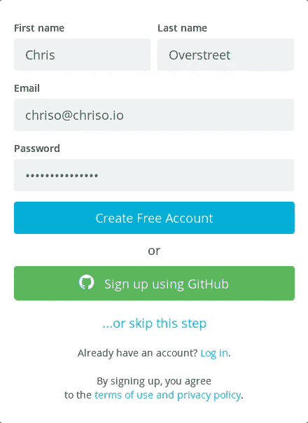

用 *Cosmic JS* 创建后端的第一步是创建一个*桶*。一个*桶*可以被认为是一个*对象*的容器。*对象*是你想要存储的任何一段数据。一个*对象*可以是一篇博客文章、一张图片、任何种类的元数据，或者任何种类的东西。我们将在下一节更多地讨论*对象*。现在，只需要知道你需要一个*桶*来保存你所有的项目数据。你现在应该在 https://cosmicjs.com/buckets。点击“添加新存储桶”。键入项目名称，然后单击“保存存储桶”。

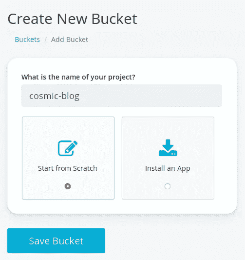

**仪表盘和设置**
你现在应该在[https://cosmicjs.com/****/dashboard,](https://cosmicjs.com/****/dashboard,)* * * *作为一个独特的字符串来标识你的铲斗(也称为 *slug* )。您站点的所有数据都可以在仪表板中管理。我们要做的第一件事是定义一个*对象类型*。一个*对象类型*定义了一个数据结构。对于本教程，我们将定义 4 种不同的*对象类型:* **全局**，**帖子**，**作者**，以及**社交链接**。让我们从**的帖子**开始。对象将保存在我们的站点上显示一篇博客文章所需的所有信息。单击“添加对象类型”按钮。

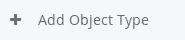

在“单数名称”字段中键入“Post”。“复数名称”和“API 端点”字段应自动填充。

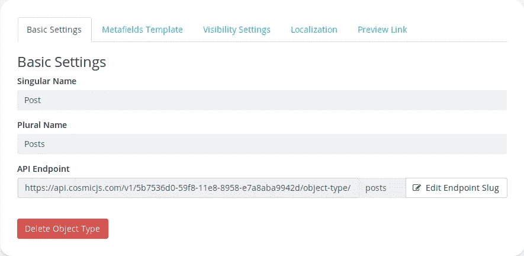

然后单击“图元字段模板”选项卡。单击“添加元字段”。

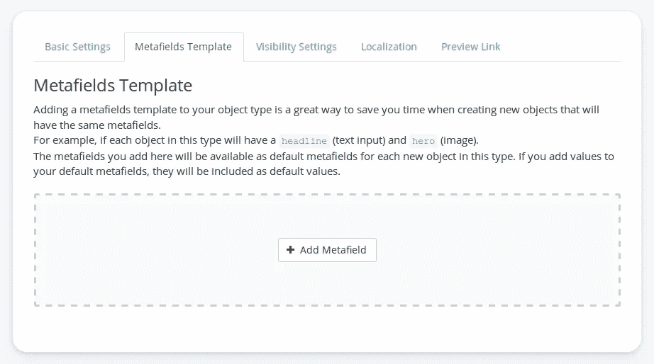

选择“图像/文件”。

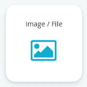

在“标题”字段中输入“英雄”。“关键”字段应自动填入“英雄”。

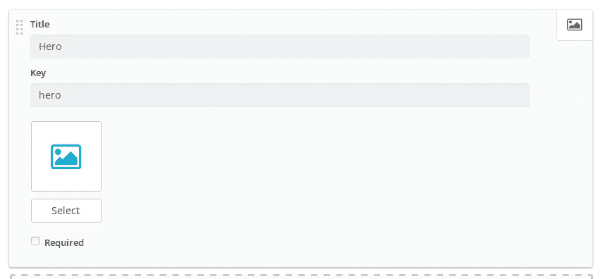

让我们再添加一个元字段。再次单击“添加元字段”。这次选择“HTML 文本区域”。

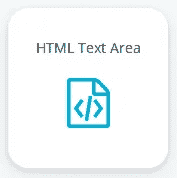

给它起名叫‘挑逗者’。然后单击“保存对象类型”。


厉害！您已经创建了第一个*对象类型*。让我们再做三次！

1.  创建一个*对象类型*，**作者**。这代表一个博客文章作者。添加一个“图像/文件”元字段，并将其命名为“图像”。
2.  创建一个*对象类型*，**全局**。这是我们存储博客元数据的方式，比如标题、标签和徽标。不要添加任何元字段。
3.  创建一个*对象类型*、**社交链接**。我们将使用它来存储关于外部社交链接的数据。添加一个“纯文本输入”元字段，并将其命名为“Url”。添加一个“图像/文件”元字段，并将其命名为“图标”。

我们差不多完成设置了。让我们回到我们的**帖子** *对象类型*并添加一个元字段。我们刚刚定义了另一个*对象类型*，**作者**。如果我们能把每个**帖子**和它的**作者**联系起来，那不是很好吗？再次单击“添加元字段”。这次选择“单一对象关系”。在出现的对话框中，为“标题”键入“作者”。然后选择“按对象类型限制搜索”并选择“作者”。然后点击“保存”。

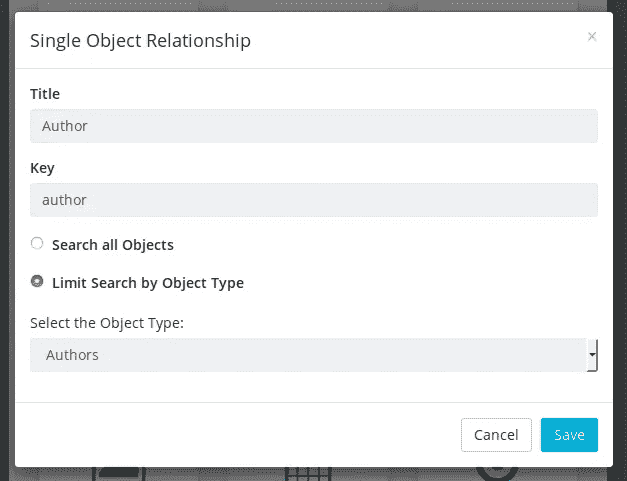

安装完成！您已经为您的项目创建了一个完整的后端。不需要配置数据库或服务器！😀 🎉

# 添加一些内容

在我们继续将*宇宙 JS* 连接到我们的应用程序之前，让我们先添加一些数据。单击仪表板菜单中的“全局”。然后单击“添加全局”。


在“标题”字段中，键入“标题”。然后我们将添加 3 个元字段。

1.  添加“纯文本输入”元字段。键入“网站标题”作为“标题”，键入“我的宇宙博客”作为“值”。选中“必需”复选框。
2.  添加另一个“纯文本输入”元字段。为“标题”键入“站点标签”，为“价值”键入“一个由 Cosmic JS 驱动的干净、简约、内容第一的博客”。
3.  添加“图像/文件”元字段。键入“网站徽标”作为“标题”，然后从您的计算机中选择一个图像。

点击“发布”。

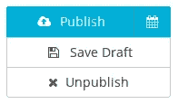

现在，让我们添加一个**作者**。点击“作者”，然后点击“添加作者”。为“标题”输入您的姓名。在“内容”部分添加一份简短的个人简历。选择一个图像。然后点击“发布”。

然后，我们再加一个**岗位**。点击“文章”，然后点击“添加文章”。输入一个标题，一些内容，一个预告，添加一个英雄形象，然后从作者下拉菜单中选择你的名字。

希望您现在已经掌握了使用仪表板的窍门。这很直观。

我们要做的最后一件事是添加一些社交链接。重复与其他*对象类型*相同的过程。添加至少两个社交链接。

# 内容✔️，让我们写一些代码

现在我们可以得到代码了！克隆、下载或在 https://github.com/chrisoverstreet/cosmic-blog[查看源代码。](https://github.com/chrisoverstreet/cosmic-blog)

这不是一个 *React* 或 *Next.js* 教程，所以我只关注`/server.js`文件。 *Next.js* 允许您通过在项目的根目录下创建一个 *server.js* 文件来实现自己的服务器。我们将创建一个[快速服务器](https://expressjs.com/)。

连接到您的 *Cosmic JS* 后端的最简单方法是使用[官方 Cosmic JS JavaScript 客户端](https://www.npmjs.com/package/cosmicjs)。要安装客户端，请在终端中键入:

```
npm i -S cosmicjs
```

回到 *server.js* ，导入并初始化 cosmicjs:

```
const Cosmic = require('cosmicjs');
const api = Cosmic();
```

现在我们要实现自己的 API 来连接到 *Cosmic JS* 。我们这样做是为了在我们的应用和数据之间创建一个层。每当我们想在应用程序中获取数据时，我们都可以使用 cosmicjs 客户端，但是这样我们的敏感桶数据就会暴露给客户端(就像 API 写访问键)。回到*宇宙 JS* 仪表盘，找到你的水桶鼻涕虫。在“设置”菜单下，选择“基本设置”。你的“水桶鼻涕虫”应该是可见的。复制它。

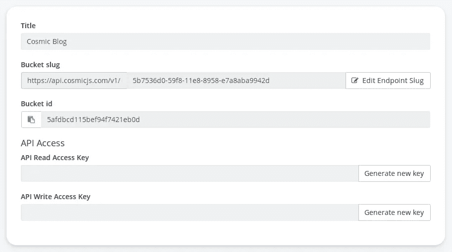

回到 *server.js* ，我们将创建一个我们的 API 可以使用的 bucket 对象。

```
const bucket = api.bucket({ slug: 5b7536d0-59f8-11e8-8958-e7a8aba9942d });
```

使用 bucket 对象，我们可以通过以下方式获取和返回数据:

`bucket.getObject()`中的 slug 是用来定义你的对象的 slug。您还可以获取对象列表。

下面是完整的 *server.js* 代码:

现在，我们可以点击应用程序中的 API 端点来检索数据。例如，要检索一篇文章，我们可以使用下面的代码:

就这么简单！

# 结尾部分

这只是对使用 *Cosmic JS* 和 *React* + *Next.js* 的高级概述。如果你和我一样，学习的最好方法就是直接投入并尝试。我邀请您下载这个项目的源代码，并对其进行修改。宇宙 JS 比这篇文章中提到的要多得多。在“开发者”标签下查看他们网站上的文章和其他信息。

感谢阅读！编码快乐！

> 本文最初作为[宇宙 JS 文章](https://cosmicjs.com/articles/powering-a-react-nextjs-blog-with-cosmic-js-jhjckj2d)出现。