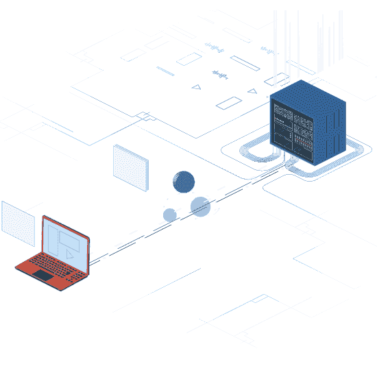
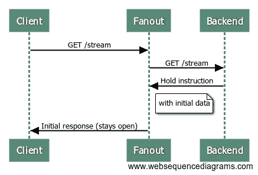
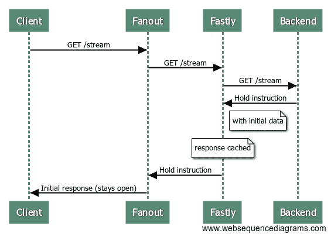
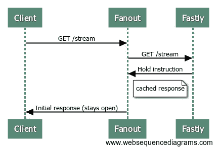
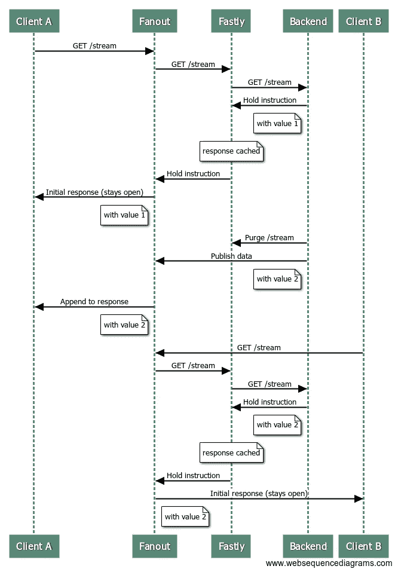

# 如何使用实时数据 CDN 为您的应用提供支持

> 原文：<https://medium.com/hackernoon/powering-your-app-with-a-realtime-messaging-cdn-13d92a6df5f3>

## 结合 Fastly(大规模拉取)和 Fanout(大规模推送)在边缘支持实时消息传递



[Varnish Software](https://www.varnish-software.com/solutions/cdn/) CDN

# CDN —内容交付网络

让我们从定义 CDN 开始。*内容交付网络* (CDN)是一个分布式服务器系统，传统上根据用户的地理位置、网页的来源和内容交付服务器向用户交付 web 内容。我传统上使用术语*是因为我们正在进入一个时代，cdn 不仅仅提供网络内容。*

一个例子是 Cloudflare [Workers](https://www.cloudflare.com/products/cloudflare-workers/) ，它让你使用他们的 CDN 在边缘运行代码，而不仅仅是提供网页/缓存内容。基本上，您可以在远离原始服务器的地方部署和运行 JavaScript 允许您将代码与用户的设备分离。根据 Cloudflare 的说法，“这些工作人员还支持路由、过滤和响应 HTTP 请求的编程功能，否则这些功能将需要在客户的原始服务器上运行。”

要点是 cdn 和边缘计算正在不断发展，在这个高可扩展性至关重要的时代，这两者开始融合在一起。


# 融合实时数据推送和实时数据拉取

许多实时应用程序需要处理推送和拉取的数据(例如实时体育比分、拍卖、聊天)。分开来看，数据推送和数据拉取作为独立的实体相当简单。在初始化时，可以从拉 CDN 中检索过去的内容，并且可以从单独的服务中推送新的/未来的更新。

但是，如果你能把这些机制连在一起会怎么样呢？

# 具有快速扇出的代理链接

[Fastly](https://www.fastly.com/edge-cloud-platform) 是一个边缘云平台，支持应用在网络边缘处理、服务和保护数据。它本质上是高度可扩展的数据拉取和响应，使用一个可以实时监听和响应用户需求的平台。与传统的 CDN 类似，Fastly 允许您缓存内容，但也允许您在边缘交付应用程序逻辑。

另一方面， [Fanout](http://fanout.io) 是高可伸缩的数据推送——充当反向代理，处理长期客户端连接，并在数据可用时推送数据。

Fastly 和 Fanout 都作为反向代理工作，因此有可能让 Fanout 代理流量通过 Fastly，而不是将流量直接发送到您的原始服务器。总之，这个耦合系统有一些有趣的好处:

1.  **高可用性** —如果您的原始服务器出现故障，Fastly 可以向扇出提供缓存的数据和指令。这意味着客户端可以连接到您的 API 端点，接收历史数据，并激活一个流连接，所有这些都不需要访问源服务器。
2.  **缓存的初始数据** — Fanout 允许您构建服务于历史和未来内容的 API 端点，例如，在切换到推送模式之前返回一些初始数据的 HTTP 流连接。Fastly 可以提供初始数据，减少原始服务器的负载。
3.  **缓存扇出指令** —扇出的行为(如传输模式、订阅的频道等。)是由源服务器响应中提供的指令确定的(使用称为 Grip 的特殊头系统)。Fastly 随后可以缓存这些指令和头。
4.  **高可扩展性** —通过缓存扇出指令和头，Fastly 可以进一步降低原始服务器的负载，使处理逻辑更接近边缘。

# 映射网络流

使用 Fanout 和 Fastly，我们来绘制网络流，看看这些推和拉机制是如何协同工作的。

让我们假设有一个 API 端点`/stream`返回一些初始数据，然后保持打开，直到有新的更新要推送。使用扇出，这可以通过让源服务器响应指令来实现:

```
**HTTP/**1.1 200 **OK**
Content-Type: text/plain
Content-Length: 29
Grip-Hold: stream
Grip-Channel: updates

{"data": "current value"}
```

当 Fanout 从源服务器接收到这个响应时，它会将其转换成一个流响应发送给客户端:

```
**HTTP/**1.1 200 **OK**
Content-Type: text/plain
Transfer-Encoding: chunked
Connection: Transfer-Encoding

{"data": "current value"}
```

Fanout 和源服务器之间的请求现在已经完成，但是客户机和 Fanout 之间的请求仍然打开。这是流程的序列图:



由于对源服务器的请求只是一个普通的短暂的请求/响应交互，它也可以通过一个缓存服务器(比如 Fastly)来提供服务。

下面是 Fastly 参与的流程:



现在，当下一个客户机向`/stream`端点发出请求时，源服务器完全不参与:



换句话说，Fastly 用那些特殊的 HTTP 头和初始数据向 Fanout 提供相同的响应，Fanout 建立与客户机的流连接。

当然，这只是连接设置。要向连接的客户端发送更新，必须将数据发布到扇出。

# 清除快速缓存

如果触发发布的事件导致源服务器响应改变，那么我们可能还需要清除快速缓存。

例如，假设`/stream`端点所服务的“值”已经被改变。新值可以发布给所有当前的连接，但是我们也希望任何后来到达的新连接也接收这个最新的值，而不是旧的缓存值。这可以通过同时从 Fastly 清除和发布到 Fanout 来解决。

此序列图说明了一个客户端连接、接收更新，然后另一个客户端连接:



# 有效处理限速

如果您的发布数据速率相对较高，那么这会抵消使用 Fastly 的缓存优势。

有效利用 Fastly 缓存的理想数据速率是:

*   **访问频繁**——每秒钟有许多新访客
*   **变化频繁** —每隔几秒或几分钟更新一次
*   **即时交付**——以毫秒计

这方面的一个例子是一个实时博客，其中大多数请求可以从缓存中得到服务和处理。

但是，如果您的数据每秒改变多次(或者在高峰时刻有可能改变如此之快)，并且您希望频繁访问，那么您真的不希望每秒清除缓存多次。

解决方法是限制清除的速率。例如，在高吞吐量期间，您可能会以大约每秒一次的最大速率清除和发布。通过这种方式，可以从缓存中为大多数新访问者提供服务，并且数据会在不久后更新。

# 演示

可以参考 [Github 源代码](https://github.com/fanout/livecounter)进行 Fastly/Fanout 高比例[直播计数器](http://livecounter.org/)演示。请求首先到达 Fanout，然后到达 Fastly，然后到达管理计数器 API 逻辑的 Django 后端服务器。每当计数器递增时，快速缓存被清除，数据通过扇出发布。清除和发布过程也有速率限制，以最大限度地提高缓存效益。

# 最后的想法:消息 CDN 的出现？

广义地说，我们可以将**消息传递**内容交付网络定义为一组地理上分布的服务器，它们一起工作以提供动态数据和 web 内容的近乎实时的交付。

这种新类型的 CDN 可以让数据处理发生在边缘，远离应用程序的源头——从而开创一个经济实惠、可扩展的实时计算新时代。