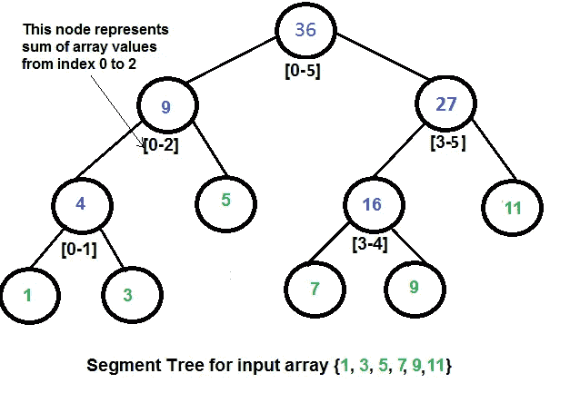
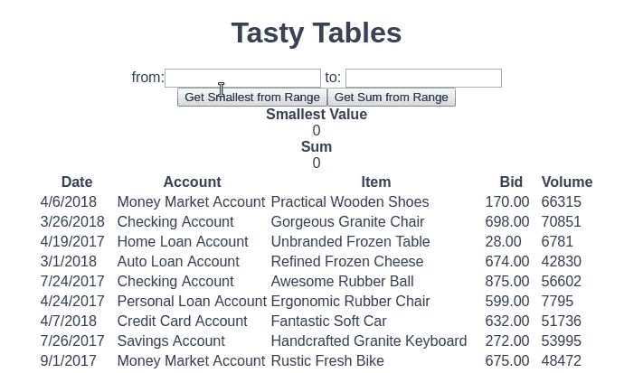
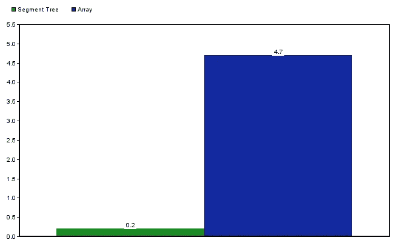
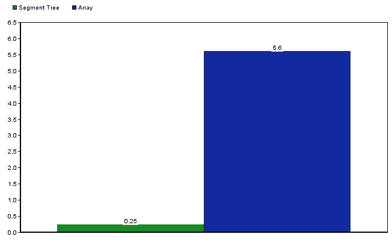

# 前端应用的实用数据结构:何时使用段树

> 原文：<https://medium.com/hackernoon/practical-data-structures-for-frontend-applications-when-to-use-segment-trees-9c7cdb7c2819>

网上有很多教程向开发者展示如何编写各种数据结构。没有很多教程显示如何、何时或是否使用它们。在本系列中，我将介绍数据结构在前端应用程序中的实际用途和含义。在本期中，我们将回顾细分市场树。

# 什么是细分树

细分树是一种数据结构，可用于执行范围查询和范围更新。它是一个高度平衡的二叉树，通常建立在数组之上。分段树可用于在 O(log n)时间内解决范围最小/最大&和查询和范围更新查询。

分段树的工作方式类似于其他树数据结构。它创建的查询路径限制了返回数据所需的处理量。树的每个中间节点代表数据集的一个*段*。根节点包含树中所有数字的总和。其子节点包含各自范围内所有数字的总和，依此类推，沿树向下到叶节点。

# 何时使用细分树

当你经常使用大量的数字数据时，分段树是很有用的。细分树最常见的使用案例有:

1.  对一个范围内的所有元素求和。
2.  查找一个范围内元素的最小值或最大值。
3.  更新一个范围内的所有元素。

这并不意味着使用段树仅限于处理数字。例如，您可以使用段树来查找符合特定标准的所有区间(或范围)。这方面的经典例子是[支架问题](https://www.geeksforgeeks.org/range-queries-longest-correct-bracket-subsequence/)。

# 在前端应用程序中使用分段树

注意:*各种 JavaScript 引擎都会实现 JavaScript 规范。不一样。因此，不同环境的性能结果可能会有所不同。*

JavaScript 中表示集合的最常见方式是使用数组。为了找出在前端应用中使用段树是否有意义，让我们对比一下在相同的任务中使用段树和数组。以下是我们用来评估他们的标准:

*   性能(运行时间和加载时间)
*   易用性和可读性

## 设置

*   我在 Vue 中用`vue cli`写了一个快速投标表格。它看起来是这样的:

*   我找不到我喜欢的 JavaScript 中的段树实现。所以，在[算法书](https://algs4.cs.princeton.edu/home/)网站的一点帮助下，我[推出了自己的](https://github.com/joe-crick/practical-data-structures)。
*   我用`[faker](https://github.com/marak/Faker.js/)`生成了一组 10000 的出价。

## 密码

这是网格的基本代码。注意，它不使用任何特定的集合数据结构。分段树和阵列的实现细节如下。

以下是基于数组的代码:

以下是基于细分树的代码:

## 表演

我测试了三样东西的性能:

1.  将数据项加载到数据结构中。
2.  在数据结构中搜索一个范围内的最小值。
3.  对一个范围内的值求和。

所有测试都是使用 Chrome 65.x 进行的。每个查询使用的数据范围是 1-3000。

**加载数据项
段树初始化时间为 O(n*log(n))。为了让您实际了解这一点，向细分树添加 10，000 个项目平均需要 2.6 秒。**

在大多数情况下，在前端，类似 BidGrid 中的数据将从数组中的后端 API 提供给应用程序。在这种情况下，我们的数据结构中已经有了数据；没必要讨论加载时间。

**范围最小值查询** :
该查询查找范围内的最小值。

基于段树的查询比基于数组的查询快得多。速度快了 2250%。

**范围求和** :
该查询对范围内的所有值求和。

再次，细分树是惊人的。它比数组方法快 2140%。

*注意*:在上面的测试中，最初的 sum 查询花费了大约 1 秒钟。所有后续的 sum 查询大约都是 0.25 秒，即使查询范围发生了变化。

## 易用性

使用段树完成这项任务比使用数组更容易。没有必要创建`filter` 或`reduce` 方法来获得想要的结果。细分树内置了所有的查询方法。

下面的代码片段对比了段树和数组所需的代码:

# 结论

当您有一个搜索密集型应用程序对数据集执行大量特定范围的查询(例如，sum、min 和 max 查询)时，细分树是一个*惊人的*数据结构。如果应用程序需要，在前端应用程序中使用段树肯定是有意义的。

使用段树而不是数组可能会有一些性能成本，例如:

*   段树初始化。这是每个细分树的一次性成本。因此，建议您将段树的初始化推迟到页面加载之后。