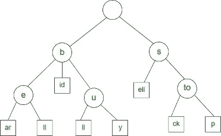
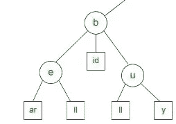
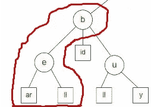
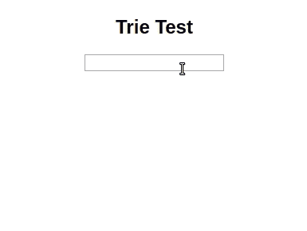

# 前端应用的实用数据结构:何时使用 try

> 原文：<https://medium.com/hackernoon/practical-data-structures-for-frontend-applications-when-to-use-tries-5428a565eba4>

Trie(通常读作“try”)是一种针对特定类型的搜索而优化的树形数据结构。当您想要获取部分值并返回一组可能的完整值时，可以使用 Trie。这方面的经典例子是自动完成。

上图显示了 Trie 的结构，暗示了它的工作原理。您可以将 Trie 视为一组相关的值。这些值的共同点是它们的前缀。

当您搜索更具体的前缀时，您会得到更具体的返回值。使用上图所示的 Trie，搜索前缀“b”的匹配将返回 6 个值:be、bear、bell、bid、bull、buy。

搜索前缀“be”的匹配将返回 2 个值:bear、bell

# 何时使用尝试

每当您想要将前缀与可能的完整值进行匹配时，可以使用 Trie。这就是特里这个有趣的名字的由来。单词“Trie”是单词“re **trie** val”的中缀。

尝试通常用于实现以下内容:

*   自动完成/键入标题
*   搜索
*   拼写检查器
*   分类

你不局限于前缀匹配词。尝试可以存储:

*   IP 地址，
*   电话号码，
*   对象(您可以搜索对象的属性)，
*   还有更多…

# 你应该在前端应用程序中使用 Tries 吗？

在使用非 JavaScript 自带的数据结构之前，需要考虑一些实际因素，例如:

*   这种结构能给我带来性能提升吗？性能提升值得吗？
*   这种结构更容易使用吗——或者至少不会更难？
*   这种结构为我的数据提供了更多的语义吗？它让我的代码更容易理解吗？
*   这个结构对我的建造规模有多大影响？这种建筑规模的增加值得吗？

为了回答这些问题，我们将对比尝试和数组——数组是 JavaScript 中最常用的集合结构。

**对比尝试和数组** 注意:*各种 JavaScript 引擎都会实现 JavaScript 规范。不一样。因此，不同环境的性能结果可能会有所不同。*

下面是我们用来对比尝试和阵列的标准:

*   性能(运行时间和加载时间)
*   易用性和可读性
*   构建大小(数组不增加额外的代码。我们会分析特里。)

## 设置

*   我在 React 中使用`create-react-app`编写了一个快速自动完成功能。它看起来是这样的:

*   我使用 Josh Jung 的`[trie-search](https://www.npmjs.com/package/trie-search)`作为我的 Trie 实现。
*   我用`[faker](https://github.com/marak/Faker.js/)`生成了一组 10，000 个名字。我不在乎名字是否唯一。

## 密码

这是自动完成的基本代码。注意，它不使用任何特定的集合数据结构。下面是 Trie 和数组的实现细节。

以下是基于数组的代码:

以下是基于 TrieSearch 的代码:

## 表演

我测试了代码中的两个地方的性能:

1.  将数据项加载到数据结构中。
2.  在数据结构中搜索项目。

所有测试都是使用 Chrome 65.x 进行的。

**加载数据项** 使用 Trie，你会经历比数组更长的初始化时间。尝试在 O(n*m)时间内初始化。为了让您实际了解这一点，在测试代码中向 Trie 添加 10，000 个项目平均需要 90 毫秒。这是一次性成本。初始化可以(即应该)推迟到页面加载之后。

最常见的是，从数组中初始化 Trie。如果需要添加更多数据，可以手动向 Trie 添加项目。

当搜索是一个应用程序的主要焦点之一时，尝试增加好的价值。由于它们的初始化成本，如果用户不经常搜索，使用 Trie 可能不太适合您的应用程序。

**运行时** 在每次测试中，我在自动完成输入中键入“Cath ”,并测量搜索需要多长时间。

TrieSearch 表现优于`Array.filter`。速度快了 50%。

## 易用性

如上面的代码示例所示，使用 TrieSearch 并不比使用数组复杂。但是，需要记住一些不同之处:

有关使用 TrieSearch 的更多详细信息，请查阅 is [文档](https://www.npmjs.com/package/trie-search)。

## 大小

TrieSearch 未混合 7.4kb。它有 13 个依赖项。整个生产版本的大小约为 10kb。这是否会对您的应用程序产生重大影响取决于您。

# 摘要

当你有一个做大量搜索的应用程序时，Trie 是一个极好的数据结构。尝试相对容易使用，而且速度很快。

在数组上使用 Trie 会有一些性能成本，例如:

*   Trie 初始化。(因此，建议您将 Trie 的初始化推迟到页面加载之后)。
*   更大的捆尺寸。