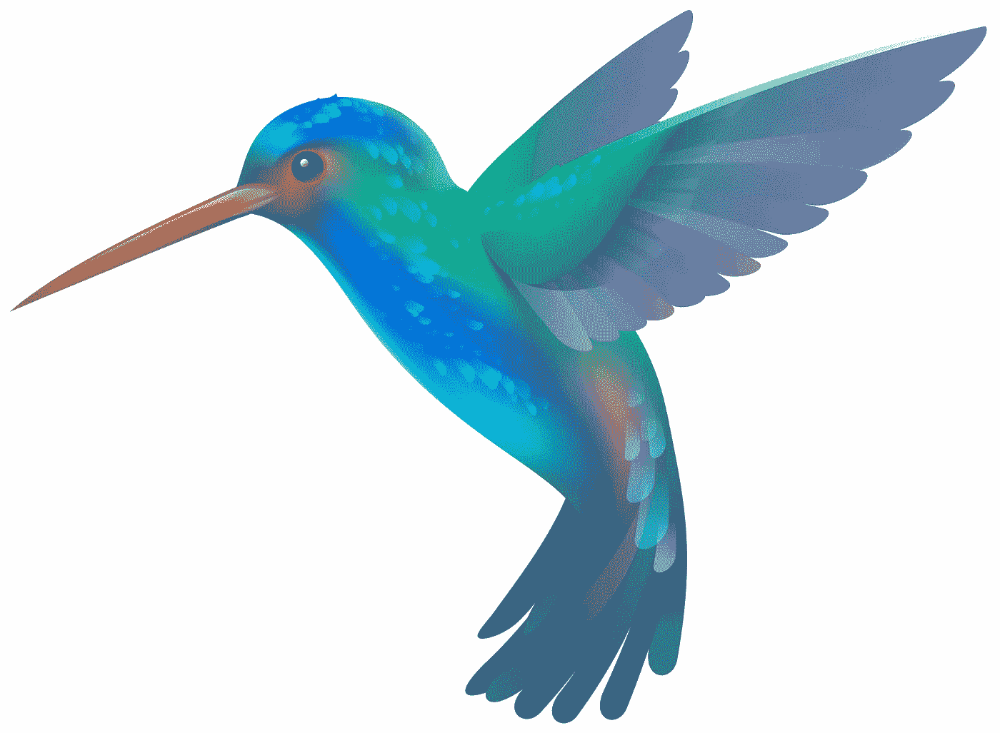

# 实用技巧:给新人的 6 个建议

> 原文：<https://medium.com/hackernoon/practical-flutter-my-personal-6-tips-for-newcomers-dfbe44a29246>

我刚刚在[谷歌 Play 商店](https://play.google.com/store/apps/details?id=com.manninglabs.steady)上提交了[稳定日历](https://www.steadycalendar.com)，这是一个极简主义的习惯追踪应用程序，由我的妻子[伊琳娜](https://www.behance.net/irinamanning)设计，并由你真正在我作为一个新父亲的一点点空闲时间里快速开发。该应用是从 iOS 到 Flutter 的一个端口。在讲述了@ [flutterfyi](https://twitter.com/flutterfyi) 上周组织的[颤振营](https://flutter.camp)的经历([幻灯片](https://docs.google.com/presentation/d/1YQP7Qz1-4xRQWmOhwhswDTexmOl456RZPko45lhh-KU/edit#slide=id.gcb9a0b074_1_0))之后，我决定将我的演讲浓缩为更有意义的内容，并作为即将到来的颤振课程[实用颤振](https://mailchi.mp/5a27b9f78aee/practical-flutter)的前奏。

好吧，在编写这个应用程序后，几乎没有空闲时间，也没有走太多捷径，我浪费了很多时间分心在我认为我必须学习的关于 Flutter 的东西上，这最终不是很有用，而且有点浪费时间。

所以说，这里有一些给新人的建议。

# 1.开始使用小部件时保持简单

Flutter 在示例和大部分库中大量使用了[材质设计](https://material.io/design/)小部件。如果你想快速凑个 UI 或者没时间写安卓和 iOS 的 app，坚持材料设计。

然而，材料设计的问题是，除非定制得当，否则它可能会疏远你的 iOS 用户。谷歌最近一直在努力使其图书馆更加灵活，并展示其适应性，鼓励开发者打破枯燥、重复的用户界面，这些界面看起来都像谷歌文档。

Flutter 确实提供了“Cupertino”[iOS 风格的窗口小部件](https://flutter.io/widgets/cupertino/)，但这是以需要做一些繁重的代码分割为代价的，因为这些窗口小部件需要其他[父窗口小部件](https://www.crossdart.info/p/flutter/0.0.32-dev/src/cupertino/scaffold.dart.html)才能正常工作。此外，在最近的一次活动中与一名员工交谈后，谷歌并没有重点关注提供一整套完整的 iOS 小工具。

在我的下一个应用程序中，我将大量定制材料设计以满足设计需求，但这里有一些你现在可能想学习的小工具，以保持灵活性并充分利用你的时间:

*   [Scaffold](https://docs.flutter.io/flutter/material/Scaffold-class.html) 和 AppBar(分别用于屏幕和导航条的容器)
*   [布局](https://flutter.io/tutorials/layout/)，带列、行
*   [容器](https://docs.flutter.io/flutter/widgets/Container-class.html)(能够设置‘填充’、‘装饰’等)
*   [正文](https://flutter.io/widgets/text/)
*   [资产评估](https://flutter.io/assets-and-images/) ( [网络图像](https://flutter.io/cookbook/images/network-image/)作为奖励)
*   RaisedButton(暂时忘记图标)

# 2.忘记从第一天开始学习飞镖

Flutter 使用了 Dart，这是一种非常容易掌握的语言，即使对于软件开发新手来说也是如此。然而，运行一个应用程序并呈现一些简单的 UI 根本不需要任何 Dart 知识。

当你熟悉了布局的基础知识，在屏幕上显示了一些内容后，再花一天的时间来阅读 Dart。在那之后，你将准备好学习诸如处理事件(例如，点击一个按钮)，甚至可能从一个 API 获取数据，这取决于你的经验水平。

# 3.现在坚持使用无状态小部件

' StatelessWidget '是任何 Widget 在 Flutter 中扩展的默认类。顾名思义，它们用于呈现不需要保存任何状态的小部件。

就其对应的“state fullWidget”而言，Flutter 的文档通过展示如何说、处理事件和改变屏幕上的一些信息来展示这一点。如果你是编程新手，甚至是初级开发人员，那么一开始就学习这个并不是必须的。我这样说是因为在开始学习任何东西的时候，动机是坚持下去的关键，你的主要注意力应该是舒适地呈现一个有一些内容的好看的屏幕。

# 4.建立一些“激励里程碑”

再次强调，当学习任何东西时，达到一些重要的里程碑是保持动力的关键。以下是我推荐的一些学习里程碑:

*   里程碑一:能够开发一个具有简单布局、文本、非工作按钮和图像的屏幕。
*   里程碑二:能够在你真正的手机上运行你的应用程序。这非常酷，真的很激励人。
*   里程碑三:学习如何通过使用 StatefulWidget 来挂接一个按钮、更改一些状态并将其呈现在屏幕上。
*   第四个里程碑:花几个小时阅读 Dart(如果你愿意，这一步甚至可以在前一个里程碑之前)。
*   里程碑五:能够从公共 API 获取一些数据([示例](https://github.com/toddmotto/public-apis))并将其呈现在屏幕上。了解如何使用 JSON 和反序列化它。
*   里程碑六:向朋友发布实际的 iOS 和/或 Android 版本。这可能会让你吃惊，但是我真的相信应该尽早这么做，除非你还在评估 Flutter 是否适合你。向朋友和家人展示你写的应用程序，即使它一点用都没有，并通过 iTunesConnect 或谷歌 Play 商店(更容易)发送给测试用户，在早期这样做是保持动力和信心的一种非常神奇的方式，有一天你可以向公众推出一款应用程序。

# 5.了解如何获得帮助

如果你找不到堆栈溢出问题的答案，就去[的谷歌团队](https://groups.google.com/forum/#!forum/flutter-dev)吧。实际提问时我推荐前者 over Stack Overflow。你可以在这里阅读更多建议[。](https://flutter.io/faq/#where-can-i-get-support)

试着找几个能帮助你的导师。你会发现 Flutter 社区参与度极高，热情洋溢。

# 6.分享你的作品

我发现推特是分享你所做的事情的好方法。哪怕是很简单的事情，简单的贴一张你的 app 截图，提一下@ [flutterio](http://twitter.com/flutterio) 真的很激励人。

# 关于学习的最后思考

总的来说，就学习资源而言，有很多可用的资源，但我发现没有足够的真正的、端到端的、经过战斗测试的关于 Flutter 的教程。当然，有谷歌制作的 YouTube 视频和 Udacity 课程，这些都很棒，但很多时候它们只涵盖了你将一个真正的应用程序放入应用程序商店所需学习内容的 1/5。我这样说是因为在为我写的一个简单的应用 Steady Calendar 编写了一个从 iOS 到 Flutter 的端口后，我最近发现，像使用 JSON、API、管理多个构建环境、本地化、缓存、代码组织、状态管理、调整真正定制的 ui 的材料设计等事情需要一些挖掘。

因此，**我计划发布一个 beta 版的 Flutter 课程**，它将把我学习 Flutter 的经验总结为实用的、更“端到端”类型的教程，这些教程将关注 Flutter 和编写一个真正的应用程序可能需要的所有其他知识。

如果你想在我于 2018 年 7 月发布第一课时得到通知，请在这里报名:[实用招摇](https://mailchi.mp/5a27b9f78aee/practical-flutter)。

快乐飘飘。