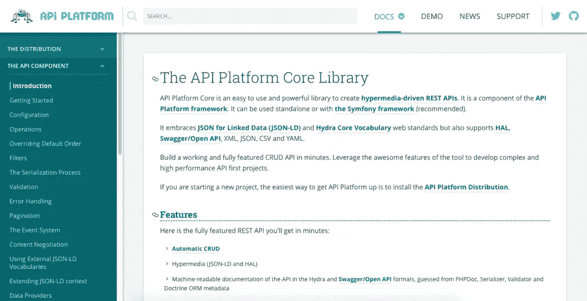

# API 平台实用指南:如何判断它是否适合你

> 原文：<https://medium.com/hackernoon/practical-guide-to-api-platform-how-to-tell-if-its-the-right-framework-for-you-6cb8f06c7c9b>

有可能在一两天内创建一个有用的 API 吗？这正是 [**的作者们对我们承诺的叫做 API 平台**](https://api-platform.com/) **的新框架。然而，您可能想知道是否值得花时间去了解另一种工具。嗯，看情况。**

软件开发中最重要的挑战之一是“不要重新发明轮子”。这就是为什么从编码历史的开始，开发人员就试图通过自动化最重复的过程来创建加速他们工作的解决方案。然而，选择真正满足您需求的工具几乎总是一个痛苦的过程。

最近在 PHP 世界中出现的最有前途的框架/工具是 API 平台。在我的工作中，我经常向我的客户咨询解决方案——他们通常和我一样是 CTO。现在，我越来越经常地收到关于 API 平台的问题。它真的是一个有用的框架还是只是一些临时的炒作？我们已经在十几个项目中使用了软件之家的 API 平台，因此，我觉得我已经有足够的经验来与你分享我们的一些想法。

# 好吧，那是什么？

API 平台由 Symfony 专家 Kévin Dunglas 于 2015 年创建。它被称为是巴黎 SymfonyCon 上最重要的开发活动之一，与 Platform.sh 和 Blackfire.io 并列，在这三个中，我认为 API 平台是最成功的一个。虽然第一个版本确实有一些烦人的机制，但是这个框架在版本 2 中得到了极大的增强。但是让我们从头开始:它实际上是做什么的？

> *简而言之，这是一个基于 PHP Symfony 框架的工具，可以帮助你加速构建项目的后端部分。*

特别是在开发过程的开始阶段(但有时在后面的阶段也是如此)，我们必须一遍又一遍地编写相同的代码，而不做任何修改或稍做修改，例如在实现分页机制或授权系统时。不管你是为书店还是汽车租赁公司创建应用程序，肯定会有一些项目的列表，一个你可以添加项目、编辑项目，当然还有删除项目的地方。

允许你加速那些部分的开发的机制被称为 CRUD 或样板文件。市场上有很多。您可能已经使用过 Symfony 1 的管理生成器或 Ruby on Rails 的脚手架。API 平台的新特点是时代已经改变，现在我们面对的是一种完全不同的架构方法。所有以前的解决方案都是在服务器端创建后端和前端的整体代码。现在，我们倾向于实施更加面向服务的架构，使用后端 API 来服务数据和消费数据的客户端，例如前端 SPA 应用程序或移动应用程序。API 平台只关注 API，把表示层留给别人。

# API 平台从一开始到底给了我们什么？

以下是我最喜欢的列表:

*   **基于 REST 的现成 API，多种格式可供选择** — JSON、XML、CSV，应有尽有。您也可以通过在配置文件中做一个简单的修改来改变格式。所有方法都提供 POST、PUT、GET 和 DELETE 选项。
*   **API 安全地建立在最佳编程实践**之上，使用了现在最流行的 PHP 框架之一——Symfony。
*   **它已经过优化**，并配有缓存机制(清漆)。
*   **有一个自动生成的文档**(我们都知道开发人员有多讨厌写任何文档，更不用说长期支持他们了)。再加上一个别致的迷你控制台来运行简单的查询和使用示例。
*   你不必担心过滤器、分页机制或错误信息等问题。只需几行代码就可以实现这些功能。

如果我要提出从头构建一个 API 的估计，例如，处理大约 3 个数据库实体(比如说，我们有一个学校，有班级、教师和学生，需要构建一个真正简单的 CRM)以及一些授权、过滤器、分页和文档，我会说实现它需要大约 2-3 周。有了 API 平台，我们可以在一天内准备好。

好吧，我知道你此刻在想什么:

# RAD 只在开始时是好的，因为当你深入了解时，总会出现问题。这里不也一样吗？

是的——在这种情况下也是如此。在基本设置完成后，事情往往会比 API 平台网站上的教程(BTW:一个非常好的教程)复杂一点。在您按照自己的意愿创建了一个数据库并配置了所有关系之后，您可能需要为您的 API 创建一些定制字段或定制业务逻辑。你开始寻找代码，结果发现根本没有！你必须通过特殊的过滤器或创建定制的控制器来做任何事情。这两种解决方案都需要对 Symfony 有很好的了解——这里的一切都是建立在这个框架上的(我稍后会回到这个框架上)。

API Platform’s documentation used to be one of its biggest flaws but now it’s updated and very useful

# 这是用于基础项目还是高级项目？

实际上，两者都是——主要问题是两者之间的差距。如果你是一个初学者，只是想创建一个非常简单的 API，你当然可以使用这个工具，但请不要期望你能完全按照自己的意愿定制它。我也见过前端开发人员，他们希望使用现代 SPA 框架(例如 Angular 或 React)在前端专门开发他们的应用程序，但仍然需要一个简单的 API 来为他们提供一些后端数据——API 平台对他们来说非常好。

手机应用也是同样的情况。我知道现在有类似的解决方案只是在云中为你提供简单的后端服务，如 Firebase，但对我来说，在我的服务器上运行 API 平台比使用一些云面板来配置它更容易和更快。这也给了我更多的灵活性。如果您只是按照教程将示例数据库的名称改为您自己的名称，那么您应该最多在一天之内就能得到您的应用程序。它也可以作为 Docker 容器使用，但是我的建议是，如果你以前和 Docker 没有任何共同点，就不要使用它——你只会在开始时感到沮丧，并失去许多宝贵的时间和精力。在我看来，通过 composer 安装它(本教程中的第二种安装方法)更加直观。

# 但是如果我想创建一个更复杂的应用程序呢？

是的，你几乎可以创造你想要的一切。但只有一个条件——在你开始之前，你必须先真正了解 Symfony。这是该解决方案的最大优势和最大缺陷——它完全建立在另一个框架之上。此外，正如我上面提到的，API 平台不会生成一个你可以随意修改的 CRUD 代码。我曾经使用过这样的代码生成解决方案，它们在开始时非常好(你只需获得一些代码，无需阅读任何进一步的说明就可以轻松地修改它),但是存在某些问题:

*   如果你不是一个有经验的开发人员，很快就会变得非常混乱。有时即使遵循了非常好的编程实践。
*   **修改预生成代码的任何部分后，就不能回头了**。对于某些数据库更改，您不能再次生成它。有一些解决方案允许这样做，但是你需要处理相当混乱的覆盖机制。

API 平台不生成任何代码——它“动态地”创建内容。这并不是一个真正的新解决方案，因为我记得几年前就有类似的工具可用(甚至是 API 平台的前身，Symfony 1 的管理面板)，但这些旧机制的问题是，通常你可以创建的东西的灵活性非常低——仅限于作者允许你做的事情。这里的事情有点不同，因为 API 平台是按照事情应该如何工作的“Symfony 方式”构建的，这意味着它基于事件驱动的机制。

# 在使用 API 平台之前应该对 Symfony 有多深的了解？

就像我上面写的，如果你真的需要在 API 平台做高级的东西，你需要先了解 Symfony。如果你以前创建过几个基于 Symfony 的应用程序，并且你喜欢它，API Platform 将会是你的一个完美的增强。如果没有，你应该首先着重了解 Symfony 是如何工作的。以下是需要学习的三件最重要的事情:

*   这基本上是你真正需要了解的 Symfony 的第一个也是最重要的部分。你可以在这里找到文档:【https://symfony.com/doc/current/components/http_kernel.html[。您可以在 API 中修改任何东西的唯一方法是挂接其中一个事件。正确地做它，避免当你问自己“为什么这个@#$没有做它应该做的事情？”，你真的需要知道事件是如何在 Symfony 中工作的，以及哪个事件 API 平台正在使用。](https://symfony.com/doc/current/components/http_kernel.html)
*   **序列化器** —所有通过 API 传输的数据都经过 Symfony 内置的序列化组件。你可以在这里找到文档:[https://symfony.com/doc/current/components/serializer.html](https://symfony.com/doc/current/components/serializer.html)。如果您想知道为什么给定的字段或结构没有显示在 GET 方法中，问题可能出在序列化上。
*   **依赖注入** —你可能在其他现代框架中遇到过这种模式。总的想法是，所有的东西应该彼此独立，然后在最后阶段通过“注入一个到另一个”结合在一起——这提高了代码的可持续性，是目前现代应用程序中的必备组件。下面是 Symfony 如何处理它的描述:[http://Symfony . com/doc/current/components/dependency _ injection . html](http://symfony.com/doc/current/components/dependency_injection.html)。正如您可能怀疑的那样，API 平台也将其代码注入到其他服务中，并且也可以从您希望注入的服务中受益。

还有一件事一些 PHP 开发人员可能不熟悉——注释。注释最初是 Java 中流行的解决方案，并很快移植到其他平台，包括 PHP。基本概念是，通过在类或方法之上以适当的方式对其进行注释，来定义该类或方法应该如何表现。一些框架大量使用注释，以至于在很多情况下，方法名前的注释包含的数据和指令比代码本身还要多——API 平台无疑是其中之一。我将这种方法称为“注释编程”。它可能非常有用并且具有描述性，但是如果你以前不熟悉这些东西，你现在需要习惯它。下面是进一步阅读的链接:[http://PHP-annotations . readthedocs . io/en/latest/using annotations . html](http://php-annotations.readthedocs.io/en/latest/UsingAnnotations.html)。当然，您仍然可以使用 XML 或 YAML，但是我强烈建议您了解注释，因为它们似乎是编程的未来。

# 这是一个相当大的门槛。值得吗？

如果你非常了解 Symfony，那么除了 API 平台，你手中还有一个非常强大的工具。创建 API 将变得更加简单和划算，一切都基于一个非常坚实的框架，即 Symfony。但是，如果您不太熟悉我上面提到的解决方案，该怎么办呢？学习所有这些东西需要大量的时间和练习。作为回报，您将获得加速创建 API 最常见元素的能力。

然而，在我看来，这是值得的。如果你计划创建一个长期项目，无论如何你都必须学习这些组件中的大部分——如果不在这个框架中，它们仍然会出现在其他框架中。虽然一开始这个解决方案可能很难实现(你可能会因为事情没有像你预期的那样工作而感到沮丧)，但它这样工作是有很好的理由的，因为它可以防止开发人员在代码中制造混乱，这是 PHP 前段时间最大的问题之一。

API Platform’s pet spider showing his love for other frameworks — especially Symfony

# 看起来你是在捍卫 API 平台。它有什么缺陷吗？

像所有的框架一样，API 平台也有一些恼人的问题，你只需要应付。对我来说，最重要的一点是，对于你正在处理的问题，你通常无法在互联网上直接找到帮助。如果你只是在谷歌中键入“API 平台<the problem="" you="" have="">”，你可能找不到任何解决方案，并且可能会觉得这个社区非常小。</the>

> *这是因为 90%关于 API 平台的问题实际上都是关于 Symfony 本身的问题。*

Symfony 社区回答了这些问题，幸运的是，这是一个相当大的社区。因此，为了找到你的答案，你应该搜索 Symfony 论坛，而不是 API 平台的论坛。当然，这意味着你必须问正确的问题，并且(再次)非常了解 Symfony。你也可以在 GitHub 上寻求帮助——通常是从 kévin Dunglas(API 平台的创造者)本人那里。

第二件事是命名惯例。像任何其他 CRUD 解决方案一样，API 平台必须自己生成一些类和方法的名称。通常，这些名称反映了数据库中使用的名称，但是您仍然必须猜测特定方法或过滤器是如何命名的。例如，当在软件公司中使用 API 平台时，我们有一个名为“语言口语”的表，我们有一个检索用户说的所有语言的方法。关于自动生成的名字有很多困惑:它会是“getLanguagesSpoken”还是“getlanguagesspokens”或者其他什么？我们最终从 Symfony 获得了一个调试器工具(我也建议您应该这样做)来查看调用堆栈，并发现实际上生成的名称是什么。

正如我在市场上看到的其他 CRUD 解决方案一样，API 平台也有虚拟字段的问题。基本上，这种自动化工具的概念是，我们有一些数据库，这是所有数据和结构的主要来源。然而，有时我们需要返回的值不是直接存储在数据库中，而是根据一些业务逻辑计算出来的(例如，从某个第三方来源获取的)。在这些情况下，您仍然可以将这样的字段添加到 API 中，但是它们不会得到 100%的支持，您可能会遇到一些问题。例如，默认情况下，排序是作为数据库查询执行的，因此对于虚拟字段，您不能轻易地添加排序(即使您实现了一些提供排序规则的函数)。

另外值得一提的是，虽然你可以在你的其他 Symfony 捆绑包中使用 API 平台提供的任何输出，但要让 API 平台使用任何其他捆绑包，并用它们制作 API，这是非常复杂的。例如，如果您正在使用 SonataAdminBundle 或 Sylius(这是 Symfony 中非常流行的解决方案),您不能指望 API 平台从那里提供的代码创建 API。

# 摘要

我在游戏社区长大，那里有这样一句话:好的游戏“容易学习，但很难掌握”——我想这句话也适用于 API 平台。如果你只是想快速创建一个非常简单的 API，这个工具会非常适合你。如果你想要更多——这也是可能的，但是，除非你是 Symfony 专家，否则你需要一些时间和练习来实现它。虽然我总是有所保留地接近新鲜的项目(API 平台现在才 2 岁，对我来说是很短的一段时间)，但我认为这个框架是一个非常有前途的解决方案。

通过在大约半年前发布第二个版本，核心团队的成员已经真正表明他们能够修复自己的错误，并听取社区的意见。第一个版本中大多数恼人的问题都得到了解决，例如，现在有可能使用父资源中的子资源，而不是为此创建两个单独的 API 端点。这是框架向好的方向发展的标志。

老实说，我也想写一些关于文档中的缺口的东西。我们甚至计划发布我们的内部附属文档，解释他们网站上的文档和真实代码情况之间的差异。但是，与此同时，文档已经更新——这也表明框架仍在发展，我们可能会期待未来更好的版本。

**这篇文章由 Marek Gajda 撰写，最初发表在软件之家博客** **的** [**上。访问博客，获得更多关于最佳开发实践和软件外包技巧的文章。**](http://www.tsh.io/blog)