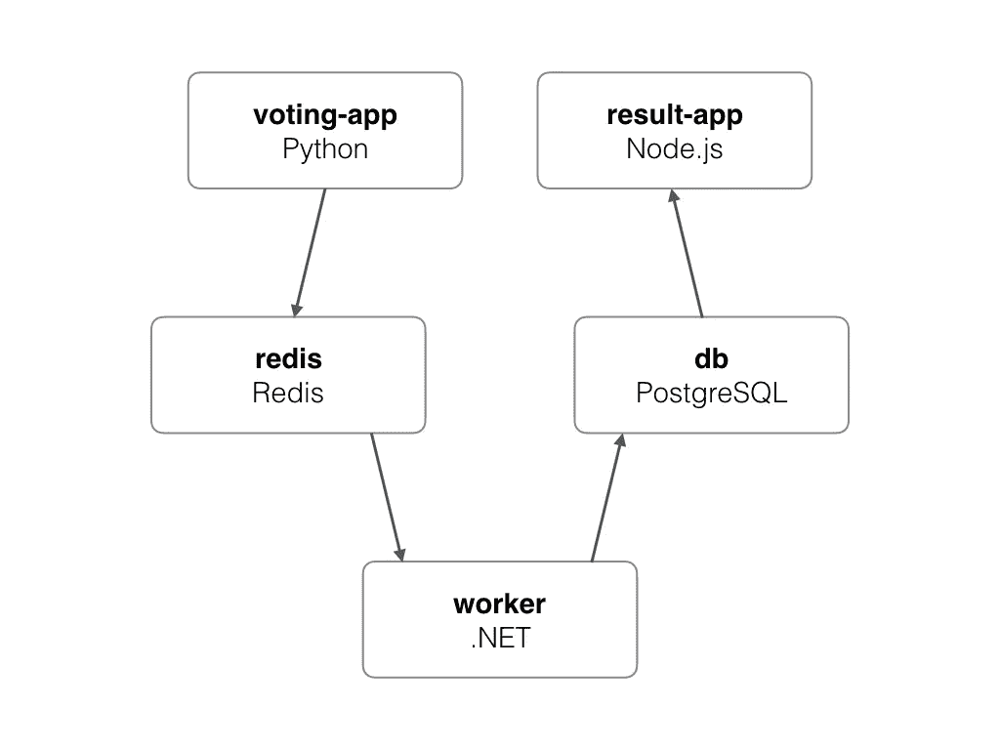
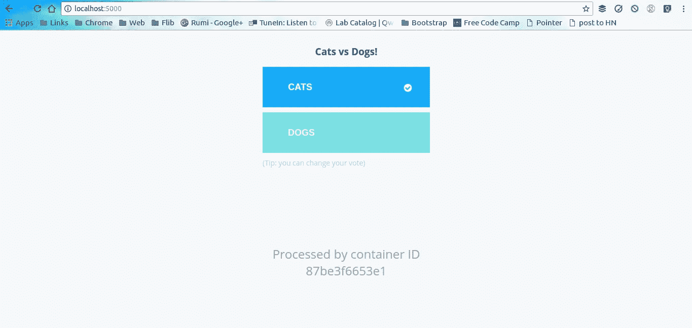
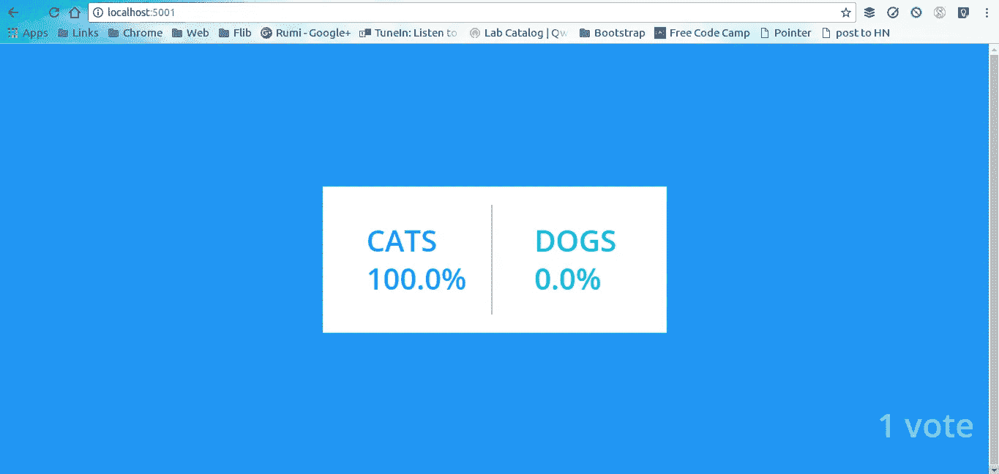

# Docker 编写实用介绍

> 原文：<https://medium.com/hackernoon/practical-introduction-to-docker-compose-d34e79c4c2b6>


# TL；速度三角形定位法(dead reckoning)

Docker containers 为技术社区打开了一个可能性的世界，设置新软件的麻烦减少了，不像过去那样需要通过一种令人悲伤的格式来整理混乱的局面，它减少了设置和使用新软件的时间，这最终为技术人员学习新东西、在容器中推出新软件并在完成后将其废弃发挥了重要作用。事情变得容易了，最好的事情是它的开源，任何人都可以使用它，尽管需要一点学习曲线。

在无数的可能性中，有一种可能性是为我们的应用程序实现复杂的技术堆栈，这在以前是专家的领域。今天，在容器的帮助下，对底层系统有良好理解的软件工程师可以实现一个复杂的堆栈，为什么不呢？这是当前的需要，比喻“万金油”得到了一个奇特的升级；根据时代的需要“掌握一些”。简单说就是“T”形技能。

在一个文件中定义一个复杂的堆栈并用一个命令运行它的可能性，很诱人吧。Docker 公司的人选择称之为 Docker compose。


在本文中，我们将使用 Docker 的示例投票应用程序，并使用 Docker compose 部署它。

# Docker 撰写

用 Docker 公司的话说。

> Compose 是一个定义和运行多容器 Docker 应用程序的工具。使用 Compose，您可以使用 YAML 文件来配置应用程序的服务。然后，只需一个命令，您就可以从您的配置中创建并启动所有服务。

# 投票应用程序

介绍 Docker 社区最喜欢的演示应用程序“投票应用程序”，好像它根本不需要介绍。这是一个基于微服务架构的简单应用程序，由 5 个简单的服务组成。



Voting app architecture [[https://github.com/docker/example-voting-app](https://github.com/docker/example-voting-app)]

1.  **Voting-App** :用 Python 编写的应用程序前端，供用户投票使用。
2.  **Redis** :内存数据库，用作中间存储。
3.  **工人**:。Net 服务，用于从 Redis 获取选票并存储在 Postres 数据库中。
4.  **DB** : PostgreSQL 数据库，用作数据库。
5.  **Result-App**:node . js 编写的应用程序前端，显示投票结果。

投票报告有一个名为`docker-compose.yml`的文件。该文件包含用于创建容器、公开端口、绑定卷和通过网络连接容器的配置，投票应用程序需要这些配置才能工作。听起来像很多很长的`docker run`和`docker network create`命令，否则，docker compose 允许我们将所有这些东西放在一个 docker-compose 文件中，格式为 [yaml](http://yaml.org/start.html) 。

Git `clone`和`cd`进入投票 app repo。

[](https://github.com/dockersamples/example-voting-app) [## docker samples/示例投票应用程序

### 示例-投票-应用-示例 Docker 编写应用

github.com](https://github.com/dockersamples/example-voting-app) 

# 作曲时间

由于我们所有的应用程序都定义在一个单独的 compose 文件中，我们可以松一口气，放松下来，简单地运行应用程序。compose 的美妙之处在于，一个简单的命令就可以创建所有的服务，连接网络(字面意思)，装载所有的卷并公开端口。是时候欢迎`up`命令了，它执行所有前述的任务。

```
$ docker-compose up 
```

在大量的“拉取完成”之后，几百兆字节和几分钟(也许更多)。。。

瞧，我们有了投票应用程序并开始运行。

命令`docker ps`列出了所有正在运行的容器

```
$ docker ps -a --format="table {{.Names}}\t{{.Image}}\t{{.Ports}}" 
NAMES               IMAGE               PORTS
voting_worker_1     voting_worker      
db                  postgres:9.4        5432/tcp
voting_vote_1       voting_vote         0.0.0.0:5000->80/tcp
voting_result_1     voting_result       0.0.0.0:5858->5858/tcp, 0.0.0.0:5001->80/tcp
redis               redis:alpine        0.0.0.0:32768->6379/tcp
```

上面的命令显示所有正在运行的容器、各自的映像和公开的端口号。

投票应用程序可在 [http://localhost:5000](http://localhost:5000) 上访问



同样，投票结果应用程序可以在 [http://localhost:5001](http://localhost:5001) 上访问



投票应用程序上的每一张选票首先存储在 Redis 内存数据库中。Net worker 服务获取投票并将其存储在 Postgres 数据库中，该数据库由 Node.js 前端访问。

# 合成特征

Compose 提供了使用项目名称将环境相互隔离的灵活性，项目名称是包含项目的目录的基本名称。在我们的投票应用程序中，这由容器的名称`voting_worker_1`表示，其中`voting`是目录的基本名称。我们可以使用`-p`标志后跟自定义名称来设置自定义项目名称。

Compose 保留了 compose 文件中定义的服务使用的所有卷，因此当使用`docker-compose up`重新创建容器时，不会丢失任何数据。另一个很酷的特性是只重新创建已经改变的容器，状态没有改变的容器保持不变。

另一个很酷的特性是支持组合文件中的变量，我们可以在一个`.env`文件中定义变量，并在 docker-compose 文件中使用它们。这里的`POSTGRES_VERSION=9.4`可以在环境文件中定义，也可以在 shell 中定义。它在合成文件中的使用方式如下:

```
db:
  image: "postgres:${POSTGRES_VERSION}"
```

# 命令备忘单

使用 compose 可以轻松启动、停止和弹奏。

```
$ docker-compose up -d
$ docker-compose down
$ docker-compose start
$ docker-compose stop
$ docker-compose build
$ docker-compose logs -f db
$ docker-compose scale db=4
$ docker-compose events
$ docker-compose exec db bash
```

# 摘要

Docker Compose 是一个快速部署和废弃容器的伟大工具，Compose 文件可以在任何安装了 docker-compose 的机器上无缝运行。实验和学习技术只是一个组合文件；).

我希望这篇文章有助于理解 Docker Compose。我很想听听你是如何在项目中使用 Docker Compose 的。鼓掌如果它增加了你的知识，帮助它接触到更多的人。