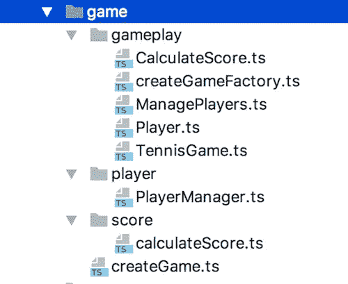
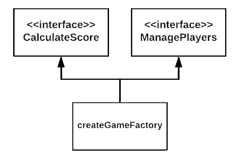
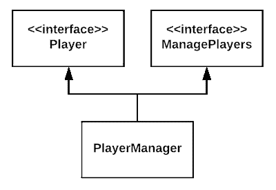
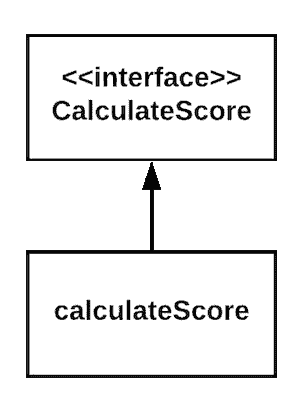
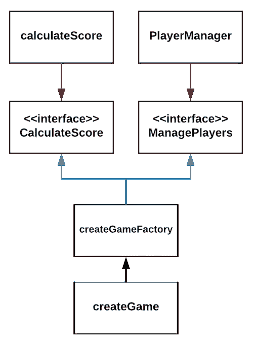

# 具有函数扭曲的打字稿中的实际控制反转

> 原文：<https://medium.com/hackernoon/practical-inversion-of-control-in-typescript-42a7364511af>

大家好，欢迎来到一个在分布式团队中工作时在 TypeScript 中实现控制反转(IOC)的真实例子。

## 剧透警报！都是外挂！

Photo by rawpixel on Unsplash

# 灵感

昨天，我们在工作中表演了艾米丽·巴切的《网球重构式》。

> 你的任务是编写一个包含逻辑的“TennisGame”类，它将正确的分数以字符串的形式输出，并显示在记分牌上。当一个玩家得分时，它触发一个方法在你的类上被调用，让你知道谁得分了。稍后，您将从记分板收到一个调用“score()”，询问它应该显示什么。这个方法应该返回一个带有当前分数的字符串。[1]

六个开发人员试图解开代码，太棒了！

在[形](https://github.com/emilybache/Tennis-Refactoring-Kata)中有了游戏的本质细节，我只是要强调它的游戏性。

**玩家一**开始强势，到了对他有利的“三十比十五”，但是 p **层二**召唤他的内劲，赢了！

我们重构了 [**TennisGame**](https://github.com/emilybache/Tennis-Refactoring-Kata/blob/master/typescript/src/TennisGame1.ts) 类，该类向调用者公开了 **wonPoint** 和 **getScore** 方法，使其[测试](https://github.com/emilybache/Tennis-Refactoring-Kata/blob/master/typescript/tests/TennisTest.test.ts)保持绿色。在重构过程中，我感觉到像玩家和分数这样的概念正试图浮现出来。

那天晚上晚些时候，我和一个朋友一起喝啤酒，也许喝得更多，讨论罗伯特·c·马丁的坚实原理。

两件事打动了我:

1.  我没有生活，在酒馆里谈论 IOC
2.  我刚刚为我的下一篇文章找到了主题！

# 什么是控制反转？

> 依赖倒置原则(DIP)告诉我们，最灵活的系统是那些源代码依赖仅指抽象，而不是具体化的系统[2]

基于上面引用的 Robert C. Martin 的解释，让我们通过一个令人兴奋的旅程来强调这个设计原则。

# 任务

让我们实现在形中描述的同样的网球游戏，但是有一个分布式的团队在工作。

# 认识弗兰克**游戏领主**

Frank 在纽约市一栋办公楼的 25 层工作，负责整个游戏及其在公司系统中的集成。他知道在分布式项目中分离关注点的重要性。

# 合同

弗兰克喝了一杯咖啡，思考了一下网球比赛，写下了它的界面。

游戏的状态将由两个玩家对象组成。每个玩家都将有一个**名**和总**点数**。有了这些信息，Frank 编写了**播放器**界面。

> 在我的文章中找到更多关于状态的概念以及它如何应用于现代单页面应用程序的信息。

接下来，Gamelord 先生阅读了需求，并意识到他需要一种管理玩家的方法，即 **ManagePlayers** 接口。

看着窗外，啜饮着咖啡，谜题的最后一部分揭开了，分数**！**

**弗兰克放下他的咖啡，冲向打印机。他带着五个**契约**回来，每个契约代表他刚刚建模的一个接口。**

**弗兰克的工作是履行网球比赛的合同。由于他的日程繁忙，他将不得不委派其他人。**

# **团队的其他成员**

*   **在左上角，来自伦敦的数据库爱好者 Bill Playwell！**
*   **在右角，来自雷克雅未克的哈斯克尔爱好者安迪·斯考森！**

# **谈话**

*   **比尔·普莱维尔，你是否接受《代码婚姻》中的**玩家**和**管理玩家**契约，并发誓要很好地履行？**
*   **安迪·斯考森，你愿意接受《代码婚姻》中的**计算分数**契约并发誓好好履行吗？**

**Frank 以一种允许每个人独立工作的方式创建了这个项目的结构。他将在**游戏**文件夹中工作，比尔在**玩家**文件夹中工作，安迪在**分数**文件夹中工作。**

****

> **注意到**游戏文件夹**包含所有接口，而**玩家**和**分数**文件夹只包含实现了吗？**

# **弗兰克的实现**

**Gamelord 先生创建[curried](https://www.youtube.com/watch?v=iZLP4qOwY8I)**createGameFactory**[工厂函数](https://www.youtube.com/watch?v=ImwrezYhw4w)。它期望一个 **ManagePlayers** 对象和一个 **calculateScore** 函数作为参数，并返回另一个函数。后者将玩家的名字作为参数，返回游戏。**

****createGameFactory** 没有导入任何具体的实现。它的源代码依赖于**计算分数**和**管理玩家**接口。**

****

**不依赖于实际的实现，允许 Frank 甚至在 Bill 和 Any 开始他们的工作之前完成他的工作。**

# **法案的实施**

**这是一个寒冷的英国早晨，普莱维尔先生开始工作。他用纯函数实现了 **ManagePlayers** 接口所需的五个方法，并将它们作为一个整体导出。**

**Bill 的模块有两个抽象的源代码依赖关系，即**播放器**和**管理播放器**接口，导出 laters 实现。**

****

# **安迪的作品**

**当 Scoreson 先生想到一个纯函数组成的描述性算法时，那是一个美丽的冰岛早晨。这让他实现了时间分离。 **calculateScore** [闭包](https://www.youtube.com/watch?v=CQqwU2Ixu-U)中的函数被调用的顺序无关紧要。**

**Andy 的模块有一个单独的**抽象**依赖关系，即**计算分数**接口，它导出它的实现。**

****

# **差不多完成了**

**所有的具体实现 **createGameFactory** 、 **PlayerManager** 、 **calculateScore** 都只依靠抽象接口，强大的契约。**

**弗兰克自豪地思考着他的团队，并将所有东西放在 **createGame** [高阶函数](https://www.youtube.com/watch?v=BMUiFMZr7vk)中。**

**源代码依赖图如下所示:**

****

> **注意到 **createGameFactory** 的蓝色源代码依赖箭头是如何指向 **calculateScore** 和 **PlayerManager** 实现的红色依赖的相反方向的吗？**

# **那是控制反转！**

**IOC 允许开发人员一起工作，而不会互相影响。**

**它使工程师能够暂时解耦。弗兰克在比尔和安迪之前完成了工作。Andy 可以在 Bill 之后很长时间开始，而不会有问题和源代码控制冲突。**

**它使类似于 **PlayerManager** 和 **calculateScore** 的模块成为应用的插件。**

**如果安迪认为他可以改进评分算法，他可以改变它而不影响应用程序的其余部分。**

# **结束了**

**如果你想和我分享你的想法，请吧！一起学习是我写作的原因！**

**想要更多吗？观看 [Mattias Petter Johansson](https://medium.com/u/5b25bc58c2e?source=post_page-----42a7364511af--------------------------------) 在[反转控制](https://www.youtube.com/watch?v=-kpEP4JeEdc)的视频。**

**对于学术报告，你可以购买罗伯特·c·马丁的[视频](https://cleancoders.com/episode/clean-code-episode-13/show)(我不是附属公司)。**

**你可以在这里找到**的回购**并给出代码[。](https://github.com/intojs/inversion-of-control)**

**[1][https://github . com/Emily bache/Tennis-Refactoring-Kata/blob/master/JavaScript/Tennis test . js](https://github.com/emilybache/Tennis-Refactoring-Kata/blob/master/javascript/TennisTest.js)**

**[2] Robert C. Martin，2017，《干净的架构:软件结构和设计的工匠指南》**