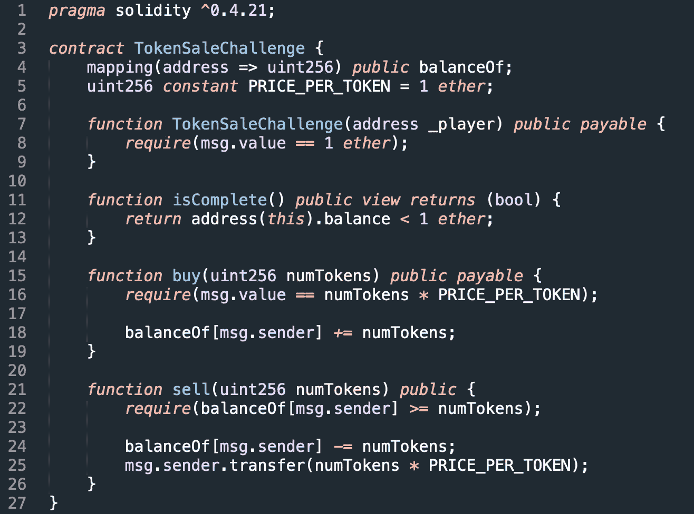
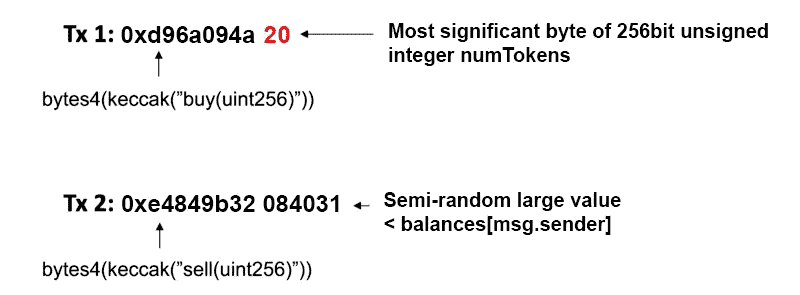
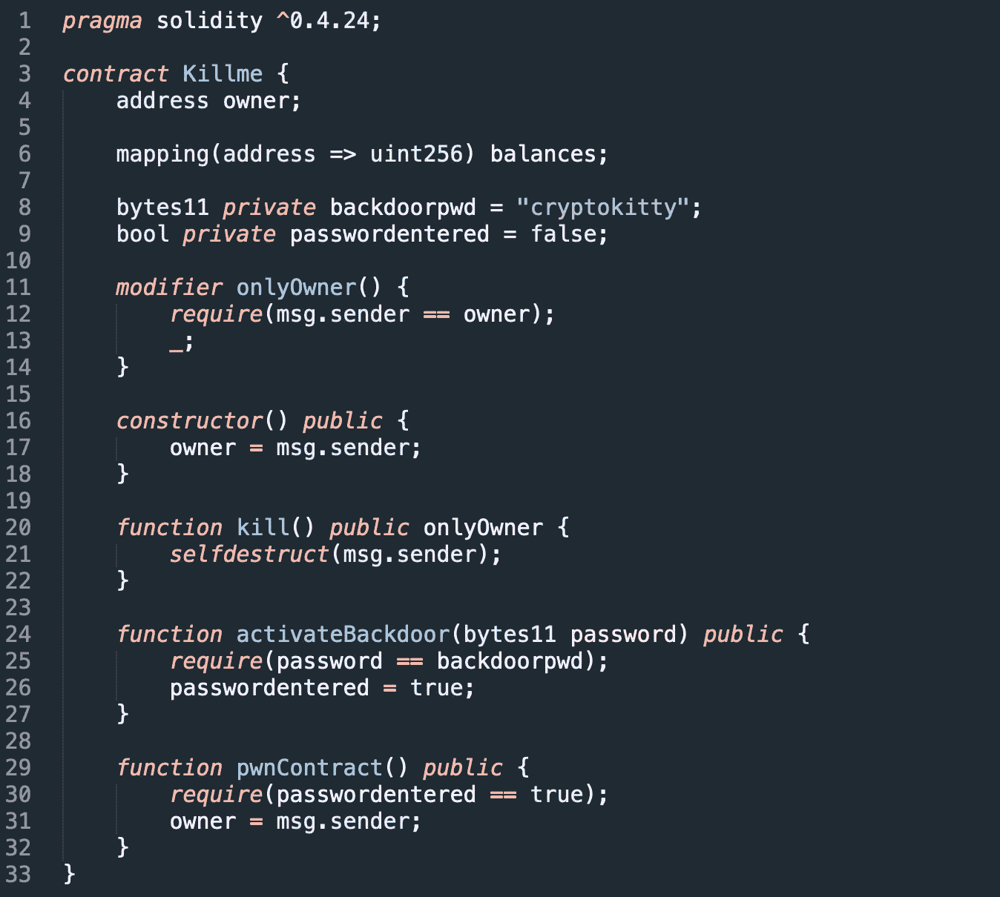
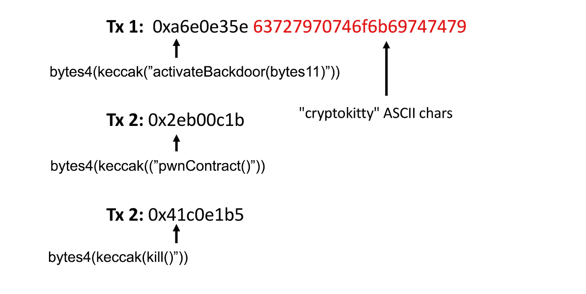

# 实用智能合约安全性分析与开发

> 原文：<https://medium.com/hackernoon/practical-smart-contract-security-analysis-and-exploitation-part-1-6c2f2320b0c>

***2019 年 7 月 6 日更新，反映新的命令行语法和功能。***

在这一系列文章中，我将解释如何使用[*myth RIL*](https://github.com/ConsenSys/mythril)*来发现部署在以太网上的 Solidity 代码和智能合约中的安全漏洞。我将介绍基本原理和高级技术，比如验证定制属性、分析多合同系统、检测有效合同中的 bug 以及自动生成漏洞有效载荷。*

本文是一系列文章中的第一篇，这些文章解释了使用 Mythril 和开源工具时应该熟悉的核心概念，开源工具被称为“智能契约安全的瑞士军刀”。

对于以前从未使用过 Mythril 的用户，我们通常建议第一步安装它。如果你想遵循本文中的例子，你也应该这样做(如果安装遇到麻烦，你可以在我们的 [Discord 服务器](https://discord.gg/E3YrVtG)寻求帮助)。在 Python 3 环境中，它通常应该像运行:

```
$ pip install mythril
```

成功安装后,`myth`命令行工具将在您的系统上可用。确保您的版本为 0.21.7 或更高版本:

```
$ myth version
Mythril version v0.21.15
```

执行安全分析的基本命令是`myth analyze`:

```
$ myth analyze <Solidity file>
$ myth analyze -a <contract address>
```

没有任何额外的参数，这将执行一个通用的分析，在大多数情况下工作得相当好。在我们开始之前，让我们先看看幕后发生了什么。

## Mythril 的工作原理

Mythril 通过在以太坊虚拟机的定制实现中运行智能合约字节码来检查安全问题。它使用一种叫做符号执行的技术来探索可能的程序状态。分析过程包括以下步骤:

1.  通过编译 Solidity 文件或从以太坊节点加载获得合约字节码；
2.  通过运行创建字节码(如果提供了源代码)或通过按需从以太坊节点检索数据来初始化契约帐户状态；
3.  象征性地执行代码以探索在 *n 个*事务中所有可能的程序状态，其中 *n* 默认为 2，但可以设置为任意数；
4.  每当遇到不期望的状态时(例如“合同被终止”)，在给定某些假设的情况下(例如“给定正确的输入*任何人*都可以终止合同”)，逻辑地证明或否定这些状态的可达性。

当找到一个易受攻击的状态时，我们可以计算达到该状态所需的输入事务。这不仅有助于确定问题的根本原因，也有助于发现漏洞。

如果你想知道更多关于符号执行是如何工作的，看看 Joran Honig 的[介绍文章](/@joran.honig/introduction-to-mythril-classic-and-symbolic-execution-ef59339f259b)。

## 基本用法

解决了这个问题，让我们来试试 Mythril 在[capturethether](https://capturetheether.com)中的智能合同开发挑战。 [TokenSale](https://capturetheether.com/challenges/math/token-sale/) 是一个简单的智能合约，允许用户以一生一次的特价 1 ETH 买卖代币。下面是源代码。



使用 Solidity 代码比使用链上契约实例更容易:如果您提供源代码，Mythril 可以向您展示它发现的每个 bug 的代码位置。将代码复制/粘贴到一个名为`tokensale.sol`的文件中，并运行以下命令(如果您安装了 solc 0.5.x，您可以编译[这个版本的代码](https://gist.github.com/b-mueller/a4bd649153c86aa74d21bfa498060ad4))。

```
$ myth analyze -mether_thief tokensale.sol
```

注意`-m`参数的使用，它接受要执行的[分析模块](https://github.com/ConsenSys/mythril-classic/tree/develop/mythril/analysis/modules)的逗号分隔列表。让我们仔细看看一个特别有用的模块，叫做*以太贼*。

## **偷那珍贵的 ETH**

顾名思义， *Ether Thief* 模块检查从契约中提取 ETH 的事务序列。具体来说，它查找满足以下条件的状态:

1.  可以从合同中提取非零金额的 ETH
2.  撤回 ETH 的发送方是*而不是*合同创建人；
3.  提取的 ETH 金额可能大于同一发送方先前支付给合同的总金额。

这是一种很好的方式来发现“泄露”给匿名攻击者的合同，不会产生很多误报。现在，我们来看一下令牌销售合同的这一模块:

```
$ myth analyze -m ether_thief tokensale.sol==== Unprotected Ether Withdrawal ====
SWC ID: 105
Severity: High
Contract: TokenSaleChallenge
Function name: sell(uint256)
PC address: 696
Estimated Gas Usage: 6373 - 27034
Anyone can withdraw ETH from the contract account.Arbitrary senders other than the contract creator can withdraw ETH from the contract account without previously having sent an equivalent amount of ETH to it. This is likely to be a vulnerability.
--------------------
In file: tokensale.sol:25msg.sender.transfer(numTokens * PRICE_PER_TOKEN)--------------------Transaction Sequence:Caller: [CREATOR], data: [CONTRACT CREATION], value: 0xde0b6b3a7640000
Caller: [ATTACKER], data: 0xd96a094ab000000000000000000000000000000000000000000000000000000000000000, value: 0x0
Caller: [ATTACKER], data: 0xe4849b323000180504000000000300013b45000000380000000002c00000020400801080, value: 0x0
```

Myhril 声称已经在取款功能中发现了一个问题，但根本原因并不明显。如果您还没有发现这个 bug，请再仔细查看一下代码，并尝试找出攻击。

您可能已经推断出这里存在整数溢出问题。为了利用这个问题，您需要向`buy()`函数传递一个非常具体的值。不过，现在还不要启动计算器，有一些好消息:Mythril 已经自动计算出了正确的输入事务。再看一下 Mythril 输出的“事务序列”部分:

```
Transaction Sequence:Caller: [CREATOR], data: [CONTRACT CREATION], value: 0xde0b6b3a7640000
Caller: [ATTACKER], data: 0xd96a094a2000000000000000000000000000000000000000000000000000000000000000, value: 0x0
Caller: [ATTACKER], data: 0xe4849b323000180504000000000300013b45000000380000000002c00000020400801080, value: 0x0
```

本节列出了三个事务:契约创建事务(由创建者发送)和攻击者发送的两个事务。查看`value`字段显示，攻击者没有将 ETH 转移到*合同中。让我们仔细看看通话数据:*



第一个事务包含`buy(uint256 num_tokens)`的函数签名散列的前四个字节，以及一个看起来没有恶意的额外字节——`0x20`——它表示`uint256 num_tokens` 的最左边的字节(剩余的零不必显式发送，因为 EVM 会将未初始化的调用数据解释为`0x00`)。传递给`num_tokens`的值算出为:

`buy(0x2000000000000000000000000000000000000000000000000000000000000000)`

让我们看看这个输入对第 16 行的`require`语句的影响:

```
require(msg.value == numTokens * PRICE_PER_TOKEN);
```

`PRICE_PER_TOKEN`设为 1 乙醚对应 1e18 卫。事实证明，将这个数量乘以 Mythril 为`numTokens`计算的值会导致整数溢出。更具体地说，二进制乘法`uint256(1e18) * uint256(numTokens)`的结果是零——注意，这里可以使用其他输入值。

因此`require`语句通过，大量令牌被记入发送者的账户，即使他们没有发送任何 ETH。

在交易二中，非法令牌随后被出售以换取 ETH(调用`sell(uint256)`)。因为 Mythril 象征性地表示合约余额，所以它为`numTokens`输出一个大的随机值。实际上，攻击者会使用与帐户中 ETH 的实际数量相对应的较低值。

如果你还没有这样做，现在是时候启动[超屏蔽](https://metamask.io)和[给挑战一个机会](https://capturetheether.com/challenges/math/token-sale/)。

## **配置交易计数**

使用 Mythril 时需要知道的一个重要概念是*事务计数*。这个变量象征性地指定要执行的事务数量。默认值 2 足以检测许多常见的错误，如整数溢出、未初始化的存储变量和命名错误的构造函数。然而，深入两个事务的搜索将*而不是*发现需要三个或更多事务才能发现的错误。

因为每个事务可以有多个有效的最终状态，所以要探索的状态空间随着事务的数量呈指数增长——至少在理论上是这样。幸运的是，Mythril 在处理多个事务方面很聪明:通过分析程序路径在读写状态变量时如何相互关联，它缩小了后续事务的搜索空间。这意味着您通常可以在合理的时间范围内运行多个事务。

为了证明这一点，我们来看另一个例子。看看你是否能发现安全问题(小心合同名称中的破坏者):



这个契约有一个“后门”,允许任何知道秘密密码的人成为所有者(但是正如我们所知，私有状态变量并不是真正的秘密——唯一的区别是 solc 没有为它们生成访问函数)。

另一个受欢迎的 Mythril 模块是*自杀*。该模块检查交易，如果交易由合同创建者之外的任何人发送，将“意外”终止合同。对上面的代码运行 Mythril 会返回以下输出([源代码](https://gist.github.com/b-mueller/e0eadc272d29aeff39627a70a7d4add3)):

```
$ myth analyze killme.sol
The analysis was completed successfully. No issues were detected.
```

Mythril 似乎忽略了这个漏洞。这样做的原因是至少需要三次交易才能杀死合同:发送者必须提供正确的密码以`activatePassword(bytes11 password),`呼叫`pwnContract()`成为所有者，最后呼叫`kill()`触发自杀。

让我们看看如果使用`-t` 参数增加执行的事务数量会发生什么:

```
$ myth analyze killme.sol -t3==== Unprotected Selfdestruct ====SWC ID: 106
Severity: High
Contract: Killme
Function name: kill()
PC address: 371
Estimated Gas Usage: 613 - 1038The contract can be killed by anyone.
Anyone can kill this contract and withdraw its balance to an arbitrary address.
--------------------
In file: killme.sol:19selfdestruct(msg.sender)
--------------------
Transaction Sequence:Caller: [CREATOR], data: [CONTRACT CREATION], value: 0x0
Caller: [ATTACKER], data: 0xa6e0e35e63727970746f6b69747479747474747474747474747474747474747474747474, value: 0x0
Caller: [ATTACKER], data: 0x2eb00c1b, value: 0x0
Caller: [ATTACKER], data: 0x41c0e1b5, value: 0x0
```

这一次检测到了问题，我们得到了三个事务的序列。更仔细地检查 calldata 可以发现被调用函数的名称和参数:



注意:事务 1 中的字节序列 `0x747474(…)`是用于填充`uint256`参数的随机数据，这部分调用数据可以是任意值。

## 执行超时

默认情况下，Mythril 将尝试完全执行用`-t`参数*配置的事务数量。然而，有时最好对执行时间设置一个界限。如果添加了`--execution-timeout`参数，Mythril 仍然会尝试完全执行所有事务，但是如果超时就会终止，并返回到那时为止发现的所有问题。*

请注意，您可以随时使用`CTRL+ C`中断分析，在这种情况下，Mythril 将返回到目前为止发现的所有漏洞。例如，您可以在奇偶校验的`WalletLibrary`上运行 myth RIL 10 分钟:

```
$ myth analyze --execution-timeout 600 -t2 -mether_thief,suicide -c [WALLETLIBRARY-BYTECOE]
==== Unprotected Ether Withdrawal ====
SWC ID: 105
Severity: High
Contract: MAIN
Function name: execute(address,uint256,bytes)
PC address: 4384
Estimated Gas Usage: 9518 - 32483
Anyone can withdraw ETH from the contract account.Arbitrary senders other than the contract creator can withdraw ETH from the contract account without previously having sent an equivalent amount of ETH to it. This is likely to be a vulnerability.
--------------------
Transaction Sequence:Caller: [CREATOR], data: [CONTRACT CREATION], value: 0x0
Caller: [ATTACKER], data: 0xe46dcfeb4000000000000000000000000000000000000000000000000000000000000000000000000000000000000000000000000000000000000000000000000000000080, value: 0x0
Caller: [ATTACKER], data: 0xb61d27f6000000000000000000000000deadbeefdeadbeefdeadbeefdeadbeefdeadbeef000000000000000000010000000000000000000000000000000000000000000108, value: 0x0real    10m3.260s
user    9m11.115s
sys     0m7.727s
```

# TL；速度三角形定位法(dead reckoning)

Mythril 的*乙醚窃贼*和*自杀*模块检测安全漏洞，这些漏洞允许攻击者窃取甚至杀死可怜的无辜智能合约。Mythril 还生成触发每个检测到的 bug 所需的输入事务的输出。增加*事务计数*有助于 Mythril 检测更多的 bug，但也会成倍增加执行时间。

# 关于 Mythril 和 MythX

Mythril 是一个免费的开源智能合同安全分析器。它使用符号执行来检测各种安全漏洞。

[MythX](https://mythx.io) 是一个基于云的智能合约安全服务，可以无缝集成到智能合约开发环境中并构建管道。它将多个领先的安全分析流程捆绑到一个易于使用的 API 中，允许任何人创建专门构建的智能合同安全工具。MythX 兼容以太坊、Tron、Vechain、Quorum、Roostock 和其他基于 EVM 的平台。