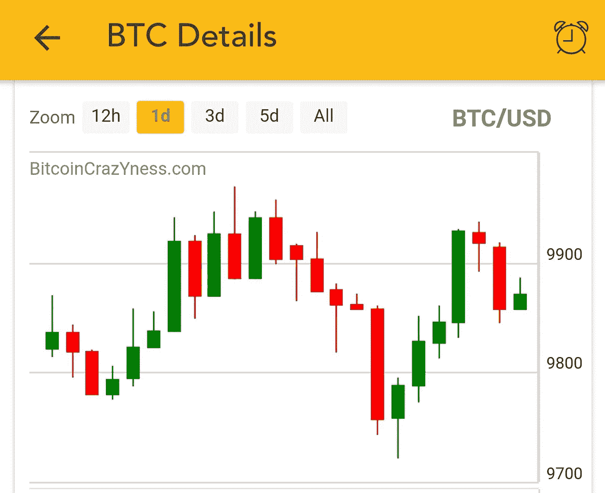
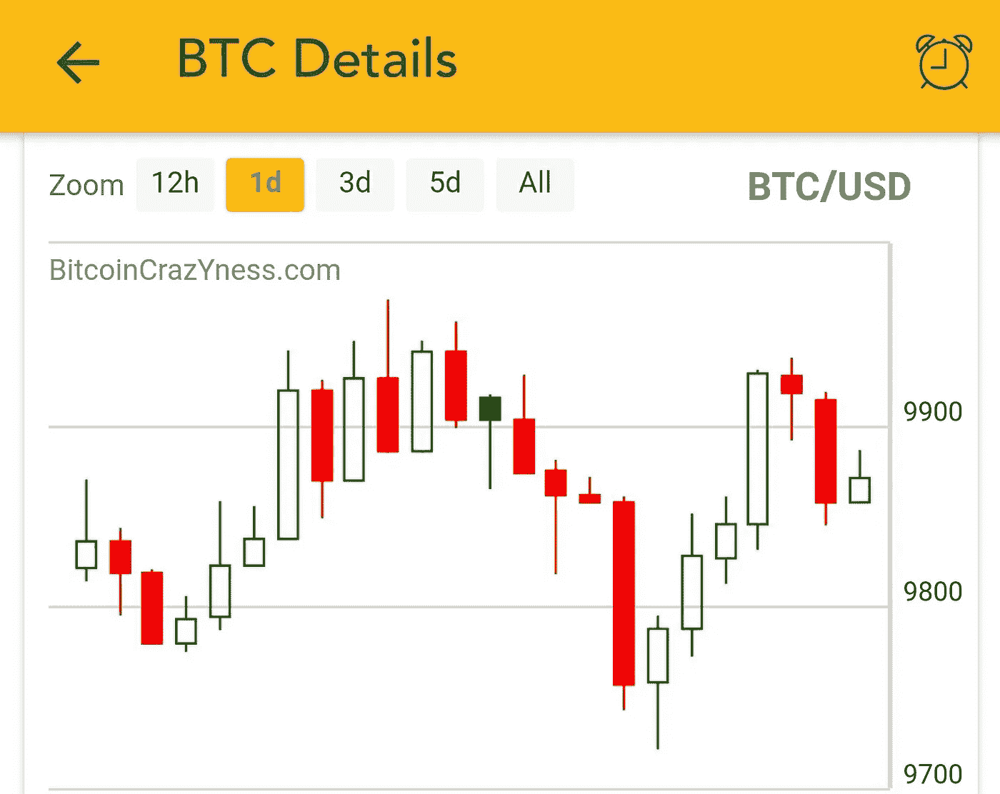
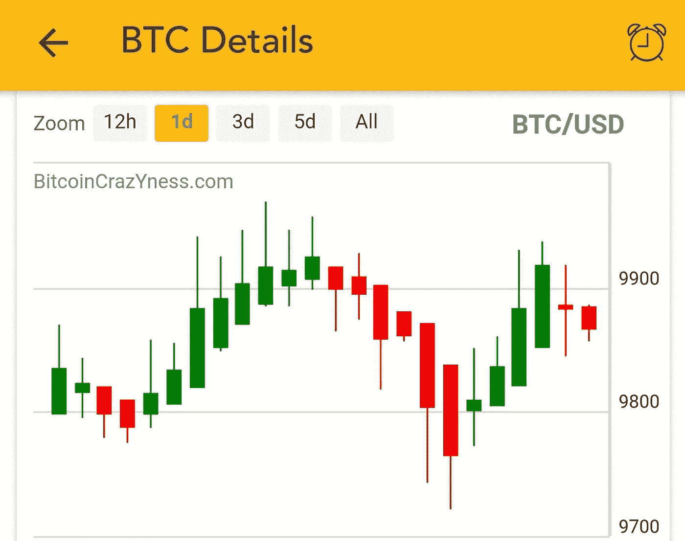
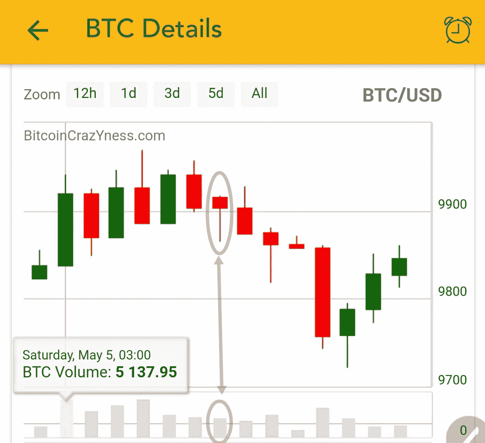
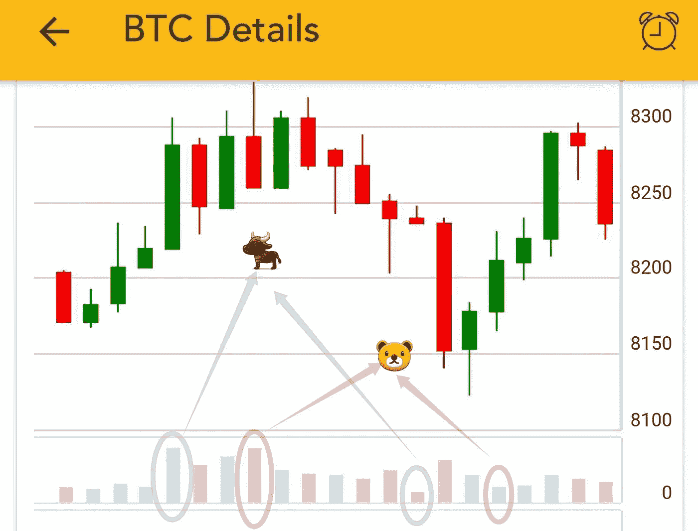

# 5 分钟实用技术分析

> 原文：<https://medium.com/hackernoon/practice-technical-analysis-for-cryptocurrency-in-two-minutes-d296e1c7eccd>

# 第 1 部分:烛台和卷图表

Photo by [rawpixel](https://unsplash.com/@rawpixel?utm_source=medium&utm_medium=referral) on [Unsplash](https://unsplash.com?utm_source=medium&utm_medium=referral)

**摘要** : *这些文章系列是为那些想快速学习技术分析的人准备的，重点是加密货币。我只提供实用的描述，略去细节。我使用的图片来自免费的 BitcoinCrazYness.com 手机应用程序***，它提供了快速技术分析的交互式图表。**

****免责声明*** *:本人不是理财顾问。以下不是理财建议。基于技术分析的预测并不总是正确的。投资前做好自己的研究。**

*技术分析(TA)的目标是通过分析历史数据来预测未来的价格和市场趋势。最终目标是预测趋势是上升(即看涨)还是下降(即看跌)。*

*技术分析通常在蜡烛图上进行。*

# ***烛台图表***

*每个蜡烛线代表一段时间内(如 1 天或 1 小时)资产的价格。有几种烛台图表样式:*

## ***标准烛台(又名日本烛台)***

*每根蜡烛表示这些值:*

*   ***开盘**:时间段开始**时的价格***
*   ***收盘**:时间段**结束**时的价格*
*   ***高位**:该时间段内**最高**价位*
*   ***低点**:该时间段内**最低**价位*

*颜色表示:*

*   ***绿**(或空或看涨):闭>开*
*   ***红色**(或充满或看空):关闭<打开*

***关于标准烛台，我需要了解些什么？***

*   *在**绿色**蜡烛上，**打开**在**底部**，而**关闭**在**顶部***
*   *在**红色**蜡烛上，**打开**在**顶部**上，**关闭**在**底部***
*   ***阀体**:在打开和关闭之间的称为阀体，它比较厚*
*   *灯芯:身体上下的细小部分*

**

*Standard Candlesticks — [BitcoinCrazYness.com](http://BitcoinCrazYness.com)*

## ***潮流烛台***

*除了开盘价和收盘价的比较之外，带有趋势的蜡烛图还显示了与前一时期相比的价格趋势。*

*在这种风格中，烛台要么是**空心的**要么是**实心的**。与标准烛台不同的是，颜色表示与前一时期相比价格的变化:*

*   ***绿色**:收盘<上期收盘*
*   ***红色**:收盘>上期收盘*
*   ***中空**:关闭>打开*
*   ***填充**:关闭<打开*

**

*Candlesticks with trend. The color indicates the changes compared to the previous period — [BitcoinCrazYness.com](http://BitcoinCrazYness.com)*

***关于潮流烛台，我需要了解什么？***

*   *连续的实心或空心蜡烛表示下跌或上涨趋势。*

## ***黑金阿希***

*这些值是根据标准开盘、收盘、盘高、盘低值计算得出的，如下所示:*

*   ***关闭** =(开+高+低+关)/ 4*
*   ***打开** =(上一 HA-打开+上一 HA-关闭)/ 2*
*   ***高** = **最大**(高，高-开，高-关)*
*   ***低** = **最小**(低，HA-开，HA-关)*

**

*Heikin Ashi Candlesticks. Usually has many consecutive candles of the same color — [BitcoinCrazYness.com](http://BitcoinCrazYness.com)*

**

*Standard Candlesticks. Compare to Heikin Ashi, it has more gaps between candles of the same color — [BitcoinCrazYness.com](http://BitcoinCrazYness.com)*

*关于 Heikin Ashi，我需要了解什么？*

*   *Heikin Ashi 过滤掉噪音，帮助发现趋势*
*   *每根蜡烛从前一根蜡烛的中点开始*

***常见解释***

*   *没有下灯芯:表明强大的购买压力*
*   *没有上灯芯:表明强大的抛售压力*
*   *几根相同颜色的蜡烛后两根不同颜色的蜡烛可能表示趋势反转*

# *体积图*

*每个条形代表每个周期的交易总数。对于自/至货币对(如 BTC/美元)，您可以选择查看从或**到**的**成交量。***

*这些颜色表示:*

*   ***绿色**:收盘<上期收盘*
*   ***红色**:收盘>上期收盘*

**

*Volume Chart — [BitcoinCrazYness.com](http://BitcoinCrazYness.com)*

*如上图所示，颜色并不总是与标准烛台的颜色相同。*

***常见解释:***

*人们可以用成交量和价格来解释趋势。*

*趋势是上升的(看涨),如果:*

*   ***与前几期相比，**成交量**和**价格**都在上涨***
*   ***与前几期相比**成交量**和**价格**都在下降***

*如果出现以下情况，趋势是下降的(熊市):*

*   ***成交量**上涨**上涨**，但**价格**下跌**下跌**(在成交量图中用一根**高** **绿**条或一根**短** **红**条表示)*
*   ***成交量**下降**下降**，但**价格**上升**上升**(代表与前期相比**高** **红**条或**短** **绿**条)*

*见下图:*

**

*Interpreting the trend being bullish or bearish from volume and price graphs— [BitcoinCrazYness.com](http://BitcoinCrazYness.com)*

# *第 1 部分结束*

*如果你喜欢这篇文章，请在评论中告诉我。另外，请查看免费的[*BitcoinCrazYness.com 手机应用*](http://BitcoinCrazYness.com) *，它为比特币和其他加密货币替代币提供互动图表。它发送价格、交易量、市值和 MACD、RSI 和 Ichimoku 等指标的警报。**