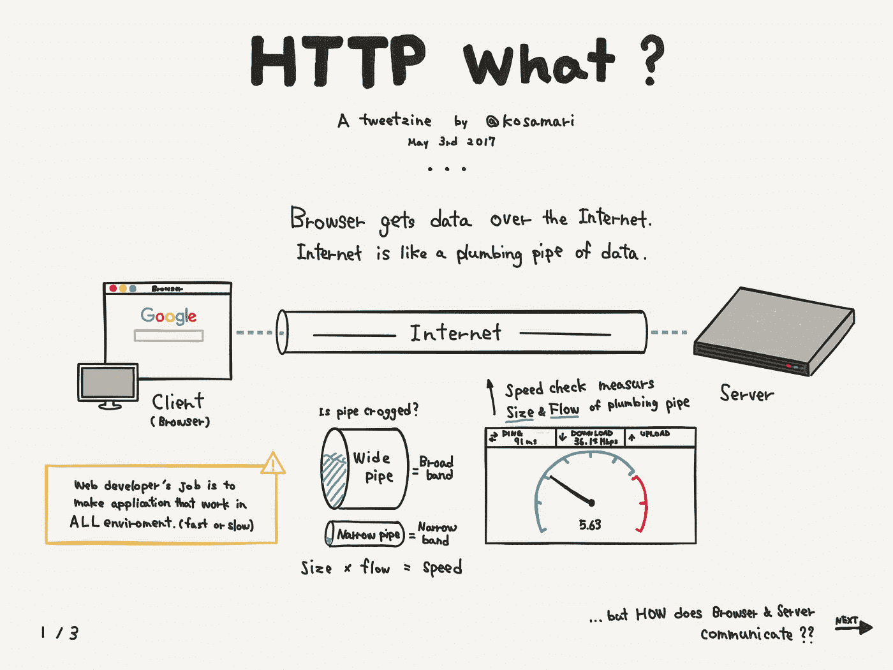
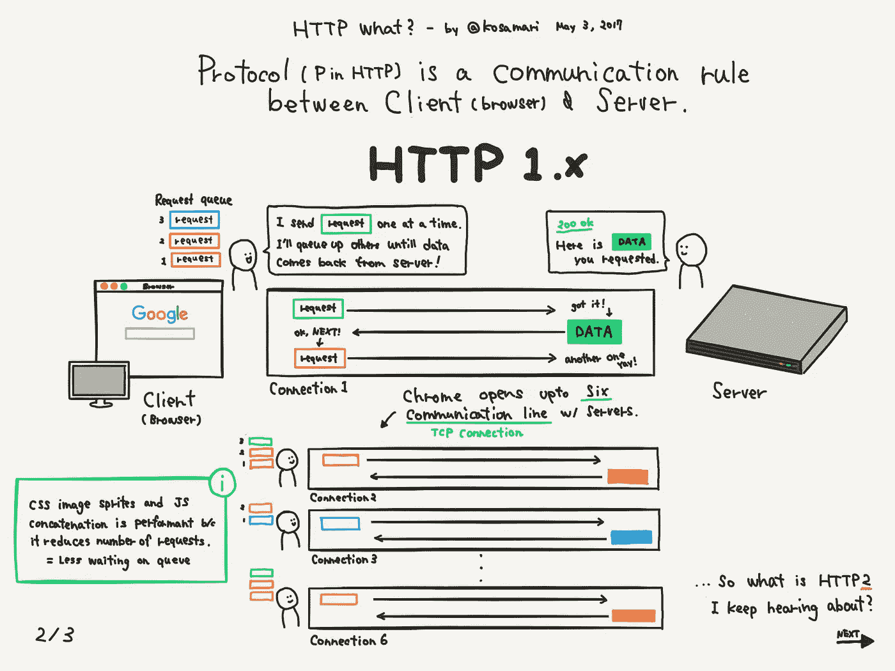
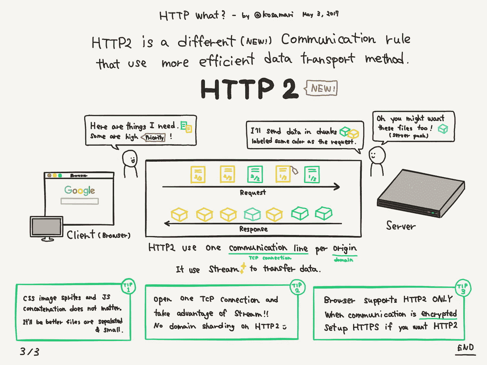

# 帮助你成为技术产品经理的实践

> 原文：<https://medium.com/hackernoon/practices-to-help-you-become-a-technical-product-manager-f4376c0ee983>

## ***成为技术产品经理的详细指南，包含相关资源和课程的链接。***

[Picture from Unsplash by Raj Eiamworakul](https://unsplash.com/@roadtripwithraj) . (You are like Spiderman’s Utility Belt)

好的项目经理会增加工程团队。你不需要知道如何很好地编码来理解网络浏览器下发生的事情的基本原理，或者如何查询 [API](https://hackernoon.com/tagged/api) 端点或者甚至设计数据库数据结构。理解[编程](https://hackernoon.com/tagged/programming)的基础，至少可以帮助你理解你团队中的工程师在和你交谈时所说的话。理解一个特性或产品的技术可行性是一个优势。

事实上，它有助于你更好地完成工作。举个例子，你正在开发一个 API 驱动的产品，你需要为它编写功能规范。您需要理解从托管 API 服务器获取数据的逻辑，而不需要前端经验以及其他概念，如协议、数据格式、身份验证、API 设计和实时通信。

在这样的环境中工作时，向工程师寻求帮助是没问题的，但如果你能预见到实际实施中会发生什么，这也会有所帮助。我发现能够理解编程的基本原则确实有助于产品思维的形成以及与工程师更直接的合作。如果你能清楚地交流一个特性的需求，你将从第一天开始就和你的团队在同一页上接近。

记住，擅长编码不重要。你不需要成为一名开发人员。你仅仅是在学习基本原理和概念，这样你就可以更成功地与你的团队沟通，并且还可以意识到和评估技术决策中的组织偏见。根据我与工程团队打交道的经验，我将尝试向您介绍最基本的概念和工具，这些概念和工具将帮助您在技术上进行改进，并提供指导您的资源。

## 1.面向产品经理的软件架构。

我一定会再次提醒你，这是你的工程团队的角色，所以没有必要彻底了解你的理解。然而，在产品构思阶段，您应该能够将业务需求转化为团队的技术规范，并且产品经理应该能够参与软件架构范围的讨论。你应该能够确定项目所需的利益相关者。识别具有影响产品的正确专业知识的领域架构师是很重要的。例如，如果您已经确定了包含数据管道和消息传递等组件的微服务架构。你通常需要一个对 Kafka 技术或其他发布-订阅系统有经验的工程师。另一个原因是为每个组件的实现和组件之间的连接选择技术。现在您已经有了一个项目团队，您将需要计划项目的实现和所需的资源。诸如何时使用开源软件或专利软件的讨论将会出现，你将需要浏览大量的问题，如技术成本，你需要软件做什么？技术应该具有什么属性？它在您的其余基础设施和业务目标中处于什么位置？这些问题指导着发现和推荐过程的其余部分。

你可以从阅读介绍软件架构的概念和最佳实践的书籍开始——软件系统是如何构建的，以及该系统的元素是如何交互的。Len Bass、Paul Clements 和 Rick Kazman 编写的《软件架构实践(第三版)》是一本很好的书，有实用的案例研究，可以帮助你入门。另一个有详细资源的网站是 Chris Richardson 的 Microservices.io。

Tweetzine from [Mariko Kosaka](https://twitter.com/kosamari) explaining browser/server comms (Cont….)

## 2.了解有关贵公司堆栈的更多信息。

你应该能够识别你的公司使用什么样的编程栈，或者什么样的栈适合于一个产品，甚至可以参与这样的讨论。同样，为项目选择合适的堆栈是您的工程团队的责任，但它有助于您了解贵公司的堆栈偏好、选择堆栈的原因以及它在您的特定用例中的工作情况。例如，如果您正在开发一个数据可视化和处理产品，您应该能够识别出 [ELK](https://www.elastic.co/elk-stack) 栈(Elastic search、Log-stash 和 Kibana)或任何其他栈作为首选技术，并识别出具有使用这些技术经验的工程师。

了解贵公司使用的语言的基本概念及其局限性，以及为什么它是首选语言。例如，如果您公司的前端是 React，那么了解 React 中的组件、元素和属性是很重要的。所有的编程语言都有一个[实用教程](https://reactjs.org/tutorial/tutorial.html)来帮助你入门，也有一个逐步学习语言概念的资源。

CodeMentor 为初学者提供的这个 [Javascript 教程](https://www.codementor.io/j2jensen/top-ten-things-beginners-must-know-about-javascript-aaeabailp)详细解释了 Javascript 属性如何与函数、循环、变量、线程等等一起工作。您也可以从这篇介绍 Mozilla Javascript 函数的友好文章[开始。](https://developer.mozilla.org/en-US/docs/Web/JavaScript/Reference/Functions)

有几个来自团队的工程博客，如[优步](https://eng.uber.com/)、 [Airbnb](https://medium.com/airbnb-engineering) 、[网飞、](https://medium.com/netflix-techblog) [脸书](https://www.facebook.com/Engineering/)和[谷歌](https://developers.googleblog.com/)，他们已经培养了一种文化，用一种你可以跟随的特定语言分享最佳实践和他们的经验。在寻求知识的过程中保持好奇心。

## **3。跟踪工程和最佳实践的新趋势。**

因为软件涉及到给抽象概念命名，所以技术领域有大量的术语，很难跟上它们。不要强调这一点，事实是很多工程师专注于精通一些技术，而不是学习每一项新技术。你不一定要成为一名工程师才能理解软件工程的变化趋势。几乎每次都有人致力于不断改进软件的构建方式，例如 [GraphQL](https://graphql.org/) 作为构建 API 的新标准正在获得动力，公司正在采用 [Kubernetes](https://kubernetes.io/) 进行容器编排， [Docker](https://www.docker.com/) 是容器化和服务虚拟化的领先技术， [FaaS](https://en.wikipedia.org/wiki/Function_as_a_service) (功能即服务)生态系统正在为公司提供按需付费模式来扩展其后端基础架构，并实现一个“[无服务器](https://en.wikipedia.org/wiki/Serverless_computing)”架构。这些都是非常相关的趋势，作为产品经理，你应该了解这些趋势，它们将帮助你更好地与你的团队沟通。

[新的堆栈](https://thenewstack.io/)是一个很好的资源，具有深入的分析，可以跟踪来自各种开发者和社区网络的新技术服务和基础设施。

Tweetzine from [Mariko Kosaka](https://twitter.com/kosamari) explaining HTTP 2

## 4.熟悉提供后端即服务的技术平台。

如果您在日常工作中直接与工程师一起工作。您应该熟悉实时通信技术，如 [Firebase](https://firebase.google.com/) 、 [Pusher](https://pusher.com/) 和 [Socket.io、](https://socket.io/)应用程序和 API 性能监控工具，如 [New Relic](https://newrelic.com/) 、 [Datadog](https://www.datadoghq.com/) 、 [Apigee](https://apigee.com/api-management/) 、 [Cloud watch](https://aws.amazon.com/cloudwatch/) 和[send grid](https://sentry.io/welcome/)、 [Twilio](https://www.twilio.com/) 和 搜索和发现工具如 [Algolia](https://www.algolia.com/) 和 [Elasticsearch](https://www.elastic.co/elk-stack) 和自动化平台如 [Zapier](https://zapier.com/) 和 [Airtable](https://try.airtable.com/creativeteams?utm_source=google&utm_campaign=airtable_deskdisc_r&utm_term=airtable&utm_content=242727462884&utm_extra2=1t1&gclid=CjwKCAjw0oveBRAmEiwAzf6_rFf-F2yErvq1kbhlKAetCxvQMSEr4j_Lnin9sHBJyDXXJdxRy8HSuhoCFZIQAvD_BwE&r=aHR0cHM6Ly93d3cuZ29vZ2xlLmNvbS5uZy8%3D) 和深度链接平台如 [Branch](https://branch.io/) 。 作为产品经理，您可以将这些工具引入到您的开发工作流中，以帮助您的团队自动化那些需要很长时间来启动甚至管理后端的任务。帮助你的团队专注于重要的事情，而不是管理你自己的基础设施，特别是如果你是一个小团队的初创公司。

你可以关注 [Stackshare](https://stackshare.io/feed) 和 [Siftery](https://siftery.com/) ，这两个网站都是社区第一资源网站，来自顶级技术公司的团队在这里分享他们的技术堆栈以及如何使用它们的建议。

## 5.API 以及它们如何为您的业务带来价值。

如果软件正在吞噬世界，那么 API 正在吞噬软件。API 基本上是软件的面包和黄油。很有可能你的理发师或发型师有一个他们想让你插入的 API。如果你正在开发一个 API 驱动的产品，理解基本的术语并有一个 API 是什么的心智模型是有益的。

每个人都使用 API，就企业利用技术交付价值、保持敏捷性和利用自己的数据的方式而言，这是当前构建抽象的方式。所以你不从事这类产品的可能性很小。你已经知道什么是 API，但是你还可以通过学习 API 是如何设计的，什么是 webhooks，客户端-服务器交互和认证的协议，如何将 API 捆绑到 SDK 中，数据格式化和什么是 API 网关模式来更进一步。甚至如何通过启动 HTTP 客户端向服务器发出一些请求来测试您的 API。

开始使用 API 的一个简单方法是使用像 [Postman](https://www.getpostman.com/) 这样的 HTTP 客户端，这是一个 API 开发环境程序，可以让你快速构建 HTTP 请求进行测试。您指定 URL、标题和正文，然后程序将其以正确的格式发送到服务器。即使你决定不尝试实现一个 API，当它们出现在对话中时，你也会感觉很舒服。 [Postman 的博客](http://blog.getpostman.com/?_ga=2.232232919.953606746.1539509804-954431380.1539393022)是开始学习什么是 API 以及如何开始自己查询 API 端点的好地方。另一个资源是 [Zapier 的——API 入门课程](https://zapier.com/learn/apis/)和 [API 学院](https://www.apiacademy.co/)，在那里你可以学到 API 管理的基础知识。

[在这里你可以看到邮递员的解决方案完整列表](https://www.getpostman.com/docs/v6/)。

## **6。了解持续集成和持续部署最佳实践。**

如果您热衷于在您的公司中采用最佳敏捷实践，那么您应该知道持续集成、交付和部署(CICD)是伟大的工程文化和质量的最佳工作流程。事实上，您应该是这种驱动自动化和持续改进的标准的倡导者。

最重要的是，这些运输软件产品的标准将导致一个更快乐的团队，这当然是你想要的。通过采用这样的标准，你将反过来推动一个更具协作性、实验性和质量第一的产品开发方法。事实上，您的工程团队并不期望您是实施 CI/CD 管道的人，但他们希望您在方法上积极主动。额外努力对 CI/CD automation suite 以及如何设置持续集成工作流有一个基本的了解。积极主动地接近，不要等着你的船出来，向它游去。

来自 [Mind the Product](https://www.mindtheproduct.com/2016/02/what-the-hell-are-ci-cd-and-devops-a-cheatsheet-for-the-rest-of-us/) 的这篇介绍性文章将帮助你作为一名产品经理轻松开始如何实现持续集成和交付，来自 [Martin Fowler 的](http://www.martinfowler.com/articles/continuousIntegration.html)的这篇指南是 CI/CD 上的一个易于阅读的资源。你可以额外努力去看看[奥雷利图书](https://www.oreilly.com/)的电子书。

## 7.利用数据分析和客户细分工具。

规模较小、联系更紧密的初创公司通常不会为每个角色都配备一名产品经理，而规模较大的科技公司会为增长和 SEO、客户体验、平台产品经理甚至每个产品配备一名产品经理。如果有销售和营销团队的话，你可能会首先与他们接触。学习多任务、在工作中发展自学技能、适应你每天戴的各种帽子的经历可能会让人精疲力尽。

足智多谋是你最大的优势，你利用什么工具来帮助你克服困难？借助工具和平台，如 [Optimizely](https://www.optimizely.com/) 、 [Segment](https://segment.com/) 、 [Mix panel](https://mixpanel.com/) 和 [Kissmetrics](https://www.kissmetricshq.com/) ，您可以在整个客户生命周期内创建实验和扩展 A/B 测试，以验证和衡量新功能或重新设计功能的影响，并在短时间内获得结果。以前，您必须充分利用公司的资源和团队才能做到这一点，但只需简单的设置和配置，您就可以在几个小时内开始收集和衡量用户参与度。您与这些平台和工具交互得越多，您就越熟悉它们，并且可以根据您的需求来修改它们。

## **8。查询和管理数据。**

存储、查询和操作数据是几乎每个产品经理都具备的技能，但是编写这样的 SQL 查询可能很困难，而且需要很长时间。您可以利用强大的数据库客户端，如带有友好 GUI 的 Postico 和 Tableplus，帮助您快速查询和操作数据库。Postico 是一个 PostgreSQL 桌面客户端，Tableplus 是一个用于关系数据库的工具，如 MySQL、PostgreSQL、SQLite 等。在数据库中运行快速查询不需要精通 SQL。Postico 提供了一个易于使用的界面，使得 Postgres 对于新手和专家来说都更容易使用。

## 结论

我已经提到了一系列可以学习的资源，但是到目前为止，我见过的最好的社区是本·哈尔彭、李佳薇和彼得·弗兰克的《实用开发》。就我个人而言，我认为这是最好的，因为它促进了包容的文化，鼓励了健康的讨论和辩论。

此外，注册并参加工程研讨会和网络研讨会。他们比阅读工程博客或论坛更注重实践。

对你来说很容易说“你没有责任找出最好的技术或者产品的软件架构”，但是话说回来，你在一个要求你成为完美主义者和多面手的行业工作。说“我不知道”不一定是件坏事，“我不知道”给了别人帮助你的机会。重要的是，你要与提倡团结文化和团队第一的工作方式的人一起工作。

培养好奇心的习惯。学习新事物远比大家想象的更容易，也更快。你会在某件事上遇到困难，但要坚持学习，只要有可能，就向队友寻求帮助。

自我教育是一生的好奇心。

# p . s——如果你需要书籍推荐，你可以在 [O'Reilly 的在线学习平台上查看这份 10 大软件架构资源列表，让你开始](https://www.oreilly.com/ideas/10-software-architecture-resources-on-oreillys-online-learning-platform)。