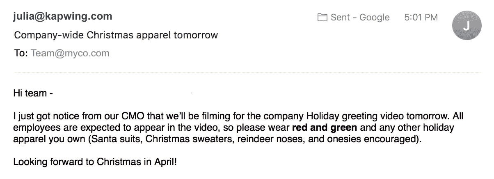

# 用这些邮件中的一封来捉弄你的同事

> 原文：<https://medium.com/hackernoon/prank-your-co-workers-with-one-of-these-emails-4f2d558a8195>

恶作剧是我在谷歌工作的第一个团队的一件大事，但很难想出无害、可行的噱头。既然我已经离开了谷歌，开始独立工作，我决定通过头脑风暴来补偿一些值得恶作剧的电子邮件，你可以在这个愚人节发给你的同事。

为了给本周的饮水机谈话增添趣味，从下面挑选一封电子邮件发给你的同事。找一个足够可信的，你的同事不会意识到他们在被恶作剧，直到他们意识到:)快乐 hijinks！

# 没有皮带了

主题:从明天开始，办公室里不穿皮革

*电子邮件*:人力资源部刚刚通知我，我们明天开始有一名新员工对皮革过敏。为了保护他的健康和工作效率，所有的**皮革都将被禁止带入办公室**。这包括包、鞋、裤子、皮带和任何其他皮革配件。请把你的皮革留在家里！谢谢你的支持。

# 吼吼吼

主题:明天全公司的圣诞服装

电子邮件:我刚接到 CMO 的通知，我们明天要拍摄公司的节日问候视频。所有员工都应该出现在视频中，所以请穿红色和绿色以及你拥有的任何其他节日服装(鼓励穿圣诞套装、圣诞毛衣、驯鹿鼻子和连体衣)。

# (德)为你的健康干杯！

*主题*:办公室新政策

电子邮件:这是一个特别糟糕的流感季节，我们担心疾病会如何影响生产力。经过大量的讨论和对最近研究的回顾，领导层决定发布一项反对打喷嚏的办公室政策。如果需要打喷嚏，请去卫生间，避免传播病菌，打喷嚏后要洗手。不要在你的桌子上打喷嚏！这项新政策明天开始实施。

# 色盲

*主题*:帮我好好护眼！

*电子邮件*:几年来，我的眼睛越来越差，处方越来越强，但我终于得到了诊断。我的验光师告诉我，黑色损害了我的视力，有点像过敏。在我接受治疗的接下来几周，我将戴上墨镜。请不要在任何团队文件或演示文稿中使用黑色(亮色也可以)。

# 社会公益

*主题*:支持我侄子！

电子邮件:嗨，朋友们——我的侄子阿德里安这个周末将在他的中学参加慈善的“趣味跑”5 公里比赛。他选择为美国人对抗便秘基金会(AACF)筹集资金，并且正在寻找赞助。请考虑为这项重要的事业捐赠 10-40 美元！感谢您的贡献。

# 拯救地球

主题:环保办公用品的改变

*电子邮件*:大家好！从本周开始，出于环保原因，我们的供应室将不再储存订书钉、回形针或胶带。对于固定纸张，我们将提供有机胶水。感谢您帮助我们减少办公室占地面积！

# 五金器具

*主题* : IT 互换

*电子邮件*:由于最近的安全泄露，我们的办公室**改用 chrome book**。明天，你会发现你的台式电脑已经被三星 Chromebook Plus 取代。如果您有公司的笔记本电脑，请在明天早上上班前更换。感谢我们的 IT 和运营团队组织了此次交换。

# 对毒品说不

*主题*:改喝茶改善心理健康

*电子邮件*:鉴于关于咖啡因对精神健康有害的研究，我们决定把咖啡换成草药茶。从明天开始，我们的办公室经理将在微型厨房里免费冲泡草药茶和红茶。我鼓励你选择无咖啡因的选择:)咖啡将不再提供。

# 王牌

*主题*:新董事会成员

*电子邮件*:从明天开始，我们将有一位新的董事会成员和顾问巡视办公室。雷克斯·蒂勒森先生是一位成功的商人和公务员，他最近决定投资我们即将到来的一轮。一如既往，当他四处走动时，请礼貌待人，乐于助人！

# 没有鞋子，没有衬衫

*主题:*夏季公司赠品！

电子邮件:为了庆祝春天，我们正在发放公司品牌的泳衣！明天来我的办公桌拿标志泳裤和比基尼。

# 岛民

*主题*:接受新公司办公室的调动申请

电子邮件:支持发展经济和促进边境开放对我们首席运营官来说很重要，所以我们决定在巴厘岛设立一个办事处！办公室的建设将于下周开始。新的南太平洋设施将包括海滨会议室、高端视频会议技术、一名在职女按摩师和员工的本地住所。如果你想被加入转移名单，请通知我。

# 德国慕尼黑的啤酒节(又称十月节)

*科目*:强制性无意识偏差训练

电子邮件:最近的一项分析显示，我们 60%的员工在 10 月份过生日。这一比例高得令人震惊，一个后续委员会正在调查发生了什么。与此同时，我们要求每个人完成**强制性无意识偏见训练**以确保出生在一年中其他月份的候选人得到公平对待。将很快发送链接；请在周末前复习！

# 噪音

*主题*:警告:约德尔公约

电子邮件:仅供参考，我们办公室经理今天早上通知我，明天在我们下面的三层将有一个**的约德尔年会**。如果噪音会打扰你，请带上耳塞或耳机。

# 安静的游戏

*主题*:走廊为午睡区

电子邮件:为了吸引顶尖科技人才并在招聘中保持竞争力，公司领导层决定将走廊改造成小睡区，作为员工的额外福利。欢迎您在一天中的任何时间在小睡区享受 20 分钟到 1 小时的强力小睡(提供枕头)。尊重你的同事，在走廊保持沉默——请不要打电话、交谈或开会。

# 热闹

*主题*:空间重组

电子邮件*:我们决定重组我们的小隔间，以实现更好的组织协同。根据我们的麦肯锡顾问最近的发现，将我们的工作区域重新塑造成一个五边形蜂巢将会改善团队之间的沟通和协作。我们要求你明天早上清理你的桌子以便于移动。*

# 扭转它

*主题*:转发:CEO 在圣诞晚会上工作的视频

LMFAO:我刚刚在我保存的照片中发现了这个

# 请稍等

*主题*:明天管道停电

电子邮件:我们大楼的管道系统将在中午到下午 5 点关闭。如果你在那段时间需要洗手间，请使用街尾地铁站的厕所(我已经给他们打过电话了，以确保没问题)。感谢并为给您带来的不便表示歉意

# 滚开

主题:请另作安排

根据一项新的郡法规，我们的停车场已经被限制，因为它是一种稀有鸟类的繁殖地。员工将不能再在我们的办公楼停车。请计划其他交通方式或不同的停车场。很抱歉给您带来不便。

# 李巽

*主题* : CTO 请求

*电子邮件*:我们的 CTO 已经决定开始学习普通话，以便更好地与工程团队沟通。如果你说普通话，他要求你只能用中文和他交谈。他可能会表现得很困惑，或者要求你用英语重复，但是他已经提前告诉我们不要对他手下留情；他想要真正身临其境的体验。

# 爱尔兰共和国

主题:摄制组明天开始

电子邮件:我很激动地宣布，我们的办公室被选为真人秀的一部分！从明天开始，你会注意到摄影团队在办公室里摆好姿势四处走动。真人秀的名字/前提是保密的，但是你不需要做什么特别的事情。表现正常，照常营业就好！

# 额外的

*主题*:香味小贩

电子邮件:我们的办公室经理已经决定为办公室尝试新的气味。明天，一个供应商将带来我们正在考虑的新气味和香水的样品。请到我的办公桌前测试并投票选出你最喜欢的。

Office antics in Silicon Valley

感谢大家的阅读！如果你喜欢，请分享一些中等的爱，并查看[的博客](https://www.kapwing.com/blog)和[的博客](https://www.kapwing.com)，我们的在线视频编辑网站。