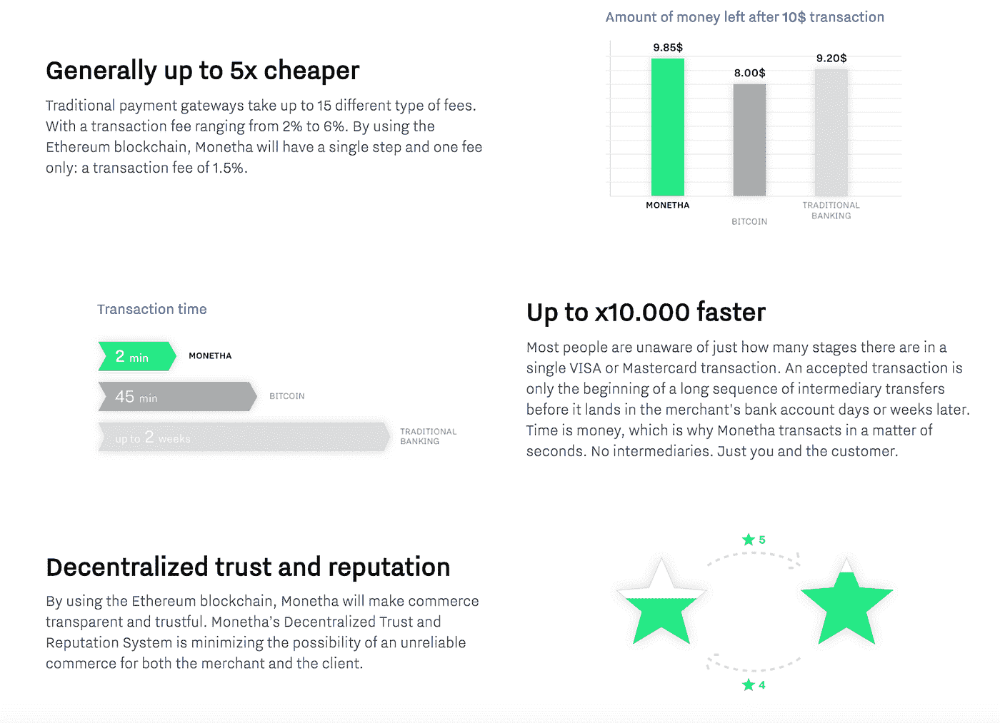
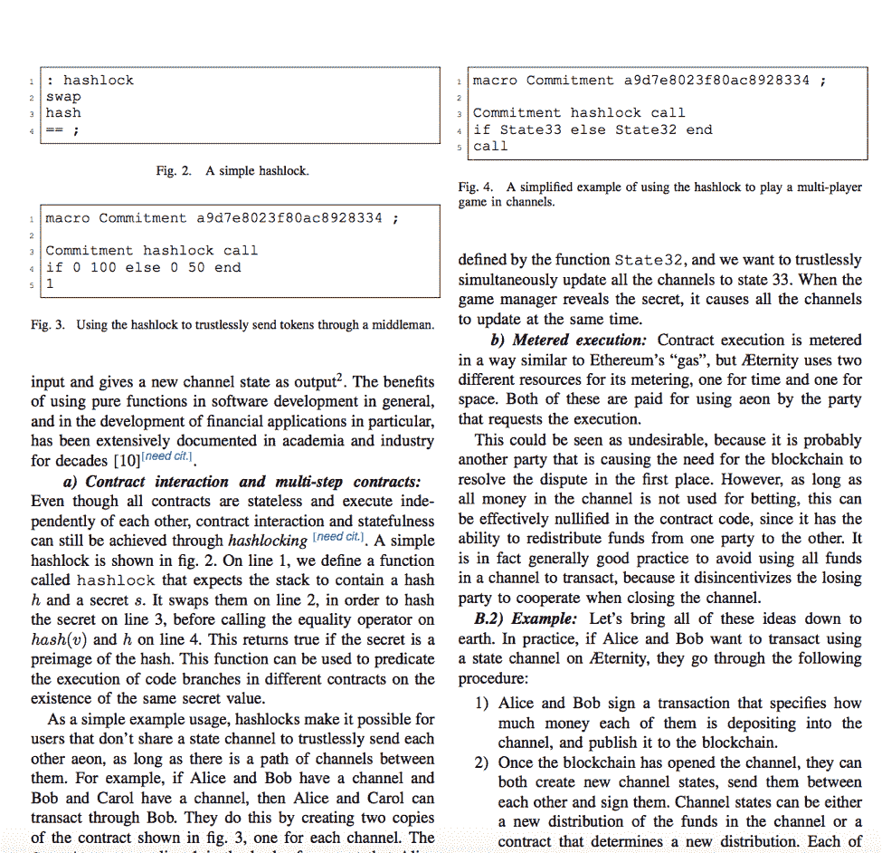
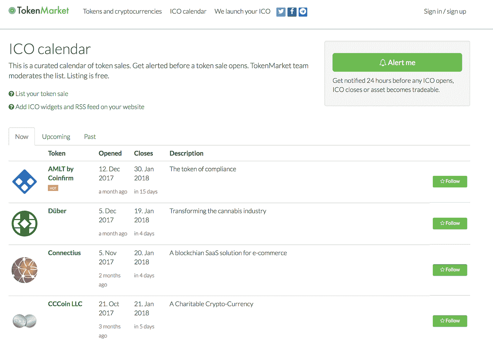
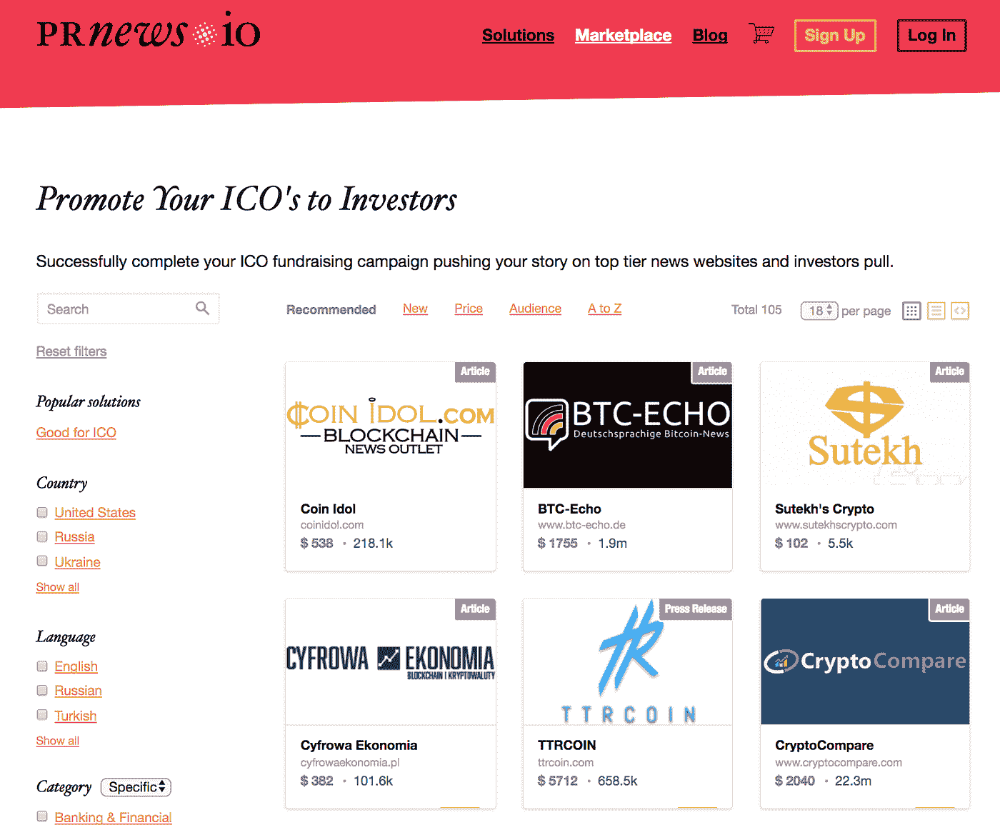

# 前 ICO 区块链创业营销和公关推广:4 个实用技巧

> 原文：<https://medium.com/hackernoon/pre-ico-blockchain-startup-marketing-and-pr-promotion-4-practical-tips-65f0bddac35a>

*图片来源:*

*今天，许多项目团队指望推出他们自己的 ICO。这是一个诱人的想法，因为互联网上充斥着区块链初创公司的信息，这些公司在短短几个小时内吸引了数百万美元。然而，实事求是地说，成功从来不是偶然的。光有好的技术是不够的，你还需要安排营销和 PR。我们来看看怎么做。*

# ***查看站点内容***

*成功最重要的因素之一是项目网站。今天，互联网上有无穷无尽的关于新创业公司使用区块链和“改变行业”的信息，同时计划通过 ICO 赚取数百万美元。但是，这类网站上的文字往往含糊不清，充满陈词滥调。*

*此外，令人困惑的是，为什么每个有自尊的项目团队都承诺用 50 页的篇幅写一份包含市场分析和前景的白皮书。与此同时，创业团队会犯不考虑白皮书读者的错误。*

*首先，网站要清晰地表现项目的目的和可达到的结果。这将有助于读者快速熟悉问题的范围，并了解项目的活动。不应该有模糊的措辞，如基于革命性的区块链技术的电子支付平台。*

*一个很好的例子是 Monetha 区块链支付系统 [ICO 网站](https://ico.monetha.io/)。该项目在 18 分钟内吸引了 3700 万美元，主要是因为良好的营销内容。特别是，该网站明确强调了他们的项目与传统工具相比的优势:*

**

*撰写白皮书时，最好考虑一下谁会阅读内容。例如，如果你正在为 IT 专业人员或技术能力强的人开发一个工具，他们可能不喜欢你的“统治世界”计划的长篇大论。他们可能更愿意在一篇简短的研究文章中浏览基本事实。这就是 Aeternity 项目所做的(ICO 3400 万美元)。他们的[白皮书](https://www.aeternity.com/aeternity-blockchain-whitepaper.pdf)没有花哨的设计——更像是一篇研究文章，只有简单的两栏文字。*

**

# ***从利基资源开始***

*从零开始接触大量观众并不是最好的目标。在分配你的营销和公关预算之前，你应该对你的信息进行加工，并获得一些初步的反馈。这可以做得相当快，没有重大成本，只是通过使用利基位置。*

*在社交媒体上获得第一次受众响应——只需在相关社区中放置项目描述或公司博客中的一篇文章。*

*热门论坛在这里派上用场。其中最著名的是 Bitcointalk，每个项目都在这里分享他们的 ICO 信息。Reddit 在不同的版块也有一些相关的话题:( [/r/ethtrader/](https://www.reddit.com/r/ethtrader/) 、 [/r/icocrypto](https://www.reddit.com/r/icocrypto/) )。*

*Quora 上也有很多主题讨论([例子](https://www.quora.com/topic/Initial-Coin-Offerings-ICO))。别忘了 LinkedIn[和脸书](https://www.linkedin.com/groups/6580131/profile)上的主题小组。将您的内容放在那里将有助于您确定已经熟悉区块链的观众不清楚的内容，处理可能的负面反应，并在面向更多观众之前调整您的策略。*

# ***传播 ICO 公告***

*将 ICO 公告放在专门的日历网站上，以便考虑参加 ICO 的用户能够注意到。*

**

**Typical ICO-calendar**

*有许多资源发布计划的 ICOs 时间表。此外，如果 ICO 使用任何流行的区块链技术(例如以太坊)，值得查找已经使用它的项目的日历。*

*在每个可用的 ICO 日历中发布公告。这里的另一个优势是渴望“投资者的 N 大新 ICO”等内容的记者和博客作者的增加。*

# ***自动化媒体协调***

*在顶级网络媒体上发布相关项目信息是“不可能完成的任务”。与媒体合作非常耗时，而且不能保证积极的结果。编辑可能要花几个月的时间才能知道公司的内容，但之后他们可能会拒绝或按照自己的方式编辑，这样只会带来伤害，而不是你所希望的商业利益。*

*用这种方法，公司很难提前计划促销。ICO 需要一个明确的计划，但也需要计划的实施，而如果在代币销售结束时发表这篇文章(即使在顶级媒体上)也不会有太大帮助。*

*原生广告解决了这个问题。它是在媒体上付费投放，向观众传递适当的信息。然而，ICO 需要大量的安置，甚至他们的付费安排也往往超出了一个小型创业团队的能力。*

*因此，公关自动化是优化工作的最佳方式。今天，有一些服务在所需的类别中寻找媒体，分析投放成本，并自动发送不同的文本进行发布，而不是针对每个版本与销售部门进行沟通。例如，【PRNews.io 是这样工作的:*

**

*这些工具只需点击几下就能找到低价主题平台和顶级期刊。*

# ***结论:时间决定一切***

*请记住，网络营销是一个漫长的过程。你不可能在几周之内把你的项目和即将到来的代币销售告诉全世界。推广应包括几个阶段:从内容制作到在小范围受众中进行信息测试，随后发布公告并吸引媒体关注。*

*这些技巧需要时间和努力，所以早点开始，你将有机会尝试和选择能带来效果的最佳营销渠道。*