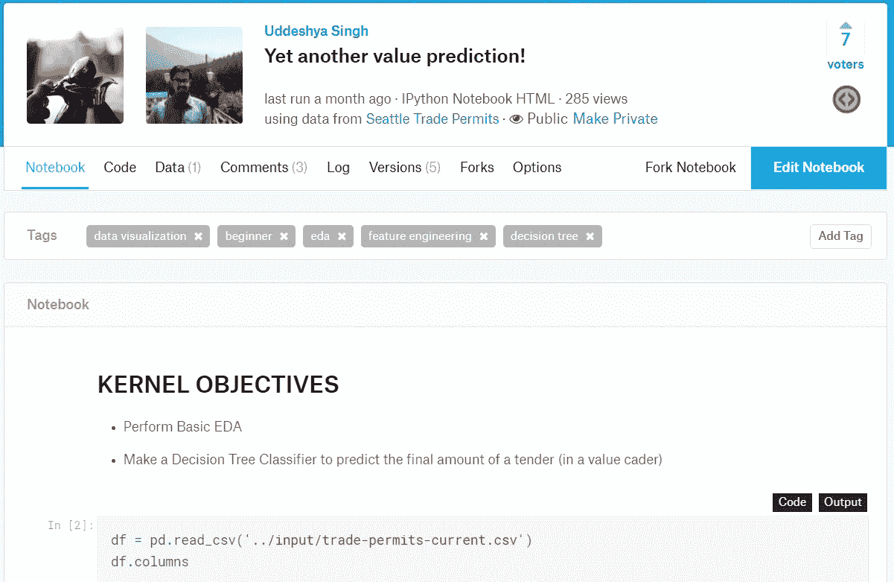
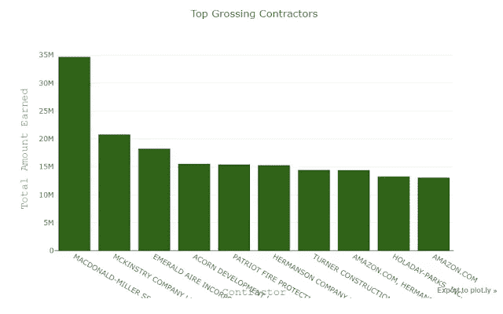
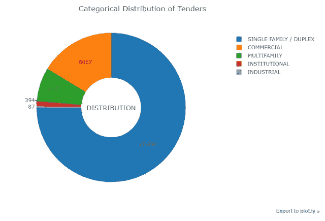
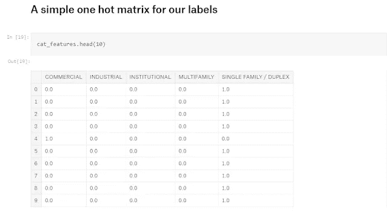
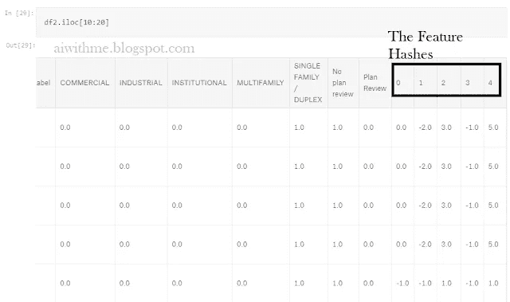
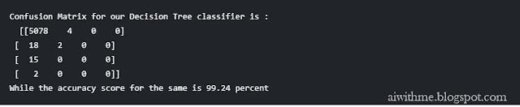
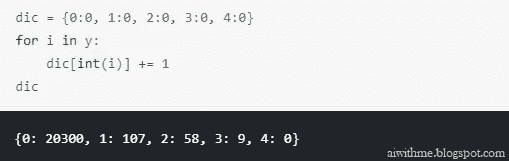

# 以 99.24%的准确率预测投标成本:奇迹！

> 原文：<https://medium.com/hackernoon/predicting-cost-of-tender-with-99-24-accuracy-miracle-6cc264621972>

[数据科学](https://hackernoon.com/tagged/data-science)正在达到新的水平，模型也是如此。但是使用简单的特征工程和简单的**决策树分类器**达到令人欢呼的 99.24%的准确率？

那是新的！

大家好，今天我将向大家展示我的模型，它可以预测[西雅图贸易许可](https://www.kaggle.com/city-of-seattle/seattle-trade-permits)中投标的价值范围，其高精度为 **99.24 %** (有一些明显的注意事项，我将在最后讨论)。

我的内核:[又一个值预测](https://www.kaggle.com/uds5501/yet-another-value-prediction)



The code reference for this blog

# 基础 EDA

这次，我将使用 Python 中的 plotly 库。这实际上是交互式剧情的最佳选择，如果你真的访问了内核，你就会明白为什么。

```
mySummingGroup = df.drop(columns=['Longitude', 'Latitude', 'Application/Permit Number']).groupby(by = 'Contractor').agg({'Value':sum})
x = mySummingGroup['Value'].nlargest(10)
data1 = [Bar(
            y=x,
            x=x.keys(),
            marker = dict(
            color = 'rgba(25, 82, 1, .9)'
            ),
            name = "Contractor's amount earned per project"
    )]layout1 = go.Layout(
    title="Top Grossing Contractors",
    xaxis=dict(
        title='Contractor',
        titlefont=dict(
            family='Courier New, monospace',
            size=18,
            color='#7f7f7f'
        )
    ),
    yaxis=dict(
        title='Total Amount Earned',
        titlefont=dict(
            family='Courier New, monospace',
            size=18,
            color='#7f7f7f'
        )
    )
)
myFigure2 = go.Figure(data = data1 , layout = layout1)
iplot(myFigure2)
```



首先，我们将重点检查西雅图地区总收入最高的承包商，他们从招标收购中获利最多。

```
catCount = df.groupby('Category')['Permit Type'].count()
fig = { 
    "data":[{
        "values":catCount,
        "labels":catCount.keys(),
        "domain": {"x": [0, 1]},
        "name": "Categories",
        "hoverinfo":"label+percent+name",
        "hole": .4,
        "type": "pie",
        "textinfo": "value"
    }],
    "layout":{
        "title":"Categorical Distribution of Tenders",
        "annotations": [
            {
                "font": {
                    "size": 15
                },
                "showarrow": False,
                "text": "DISTRIBUTION",
                "x": 0.5,
                "y": 0.5
            }]
    }
}trace = go.Pie(labels = catCount.keys(), values=catCount,textinfo='value', hoverinfo='label+percent', textfont=dict(size = 15))
iplot(fig)
```



类似地，人们可以绘制出另一个图表来显示每个项目的收入。但是另一件引起我注意的事情是一个非常高的单户型/复式组合(约占数据的 75%)

好了，有了这个基本的 EDA 计划，让我们移动到功能[工程](https://hackernoon.com/tagged/engineering)！

# 特征工程

首先，我们将通过下面列出的编码器对投标值进行编码，这很容易理解。它只是将价值分为 5 类。

```
# My Value Encoder
def valueEncoder(value):
    if value > 10000000:
        return 4
    elif value > 100000:
        return 3
    elif value > 10000:
        return 2
    elif value > 100:
        return 1
    else:
        return 0
df['ValueLabel'] = df['Value'].apply(valueEncoder)
```

在这之后，我们继续讨论分类变量的编码。

```
cat_ohe = OneHotEncoder()
cat_feature_arr = cat_ohe.fit_transform(df[['CategoryLabel']]).toarray()
cat_feature_labels = list(genLabel_cat.classes_)
cat_features = pd.DataFrame(cat_feature_arr, columns=cat_feature_labels)cat_features.head(10)
```



接下来的步骤是简单地对状态栏进行二进制编码。之后，如果我们查看 Action 列，它提到存在 21 个唯一条目。现在 21 个特征的二进制编码是不合理的。使用特征哈希怎么样？

```
from sklearn.feature_extraction import FeatureHasherfh = FeatureHasher(n_features = 5, input_type = 'string')
hashed_features = fh.fit_transform(df2['Action Type'])
hashed_features = hashed_features.toarray()
df2 = pd.concat([df2, pd.DataFrame(hashed_features)], 
          axis=1).dropna()
```



Example for feature hashing

既然我们所有的特性都准备好了，现在是模型开发的时候了！

# 模型编程

我们用`max_depth = 5`做一个简单的决策树分类器，防止过拟合！

```
from sklearn.tree import DecisionTreeClassifier
myClassifier2 = DecisionTreeClassifier(max_depth = 5, min_samples_leaf = 2)
myClassifier2.fit(X_train, y_train)
predictions2 = myClassifier2.predict(X_test)cnf2 = confusion_matrix(y_test, predictions2)
score2 = accuracy_score(y_test, predictions2)print ("Confusion Matrix for our Decision Tree classifier is :\n ", cnf2)print("While the accuracy score for the same is %.2f percent" % (score2 * 100))
```



如你所见，这对我很有效。高达 99.24%的准确率！

# 警告！

现在，现在，在电报讨论中，许多人被准确性得分震惊了。这个模型的召回率和精确度都很好。但是，哪里会出错呢？

现在，我想提醒大家注意，该数据集主要由一个类别控制:单/双工。在对数据集进行了深入了解后，我发现值标签分布如下:



这意味着约 99.15 %的数据集由单一价值标签的偿付所支配。

所以说实话。如果我的模型仍然在黑暗中射箭，它仍然有 98%的机会正确陈述给定的标签，输入是这个数据集的子集！

# 结论

最后，如果你选择的算法是正确的，那么在这样一个有偏差的数据集中获得一个高性能的分类器是非常容易的(你可能需要访问内核来真正理解我为什么这么说)