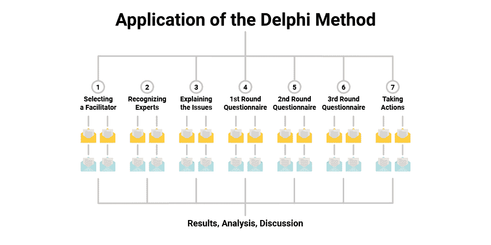
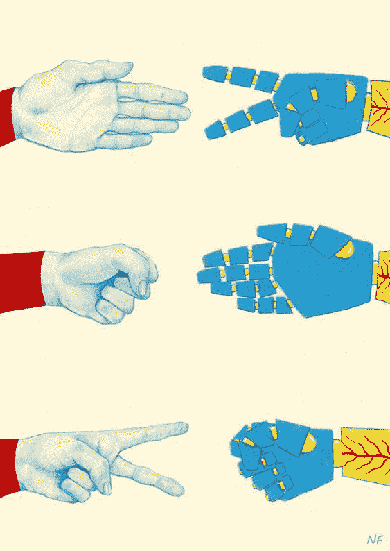

# 以分散的方式预测加密货币价格

> 原文：<https://medium.com/hackernoon/predicting-cryptocurrency-prices-in-a-decentralized-way-1d57a36d3dce>

source: [http://www.jacobstead.com/Research-World](http://www.jacobstead.com/Research-World)

如果你能对未来价格做出更好的预测，投资加密货币就不会是一件如此冒险的事情，对吗？幸运的是，新的选择正在向你走来，让你做到这一点。

在本文中，我们将探讨三种依赖于人们的判断和技术的预测技术:

1.  专家问卷(“德尔菲”法)
2.  基于 AI 的解决方案
3.  预测市场

我们将强调每种技术的基本信息，并尝试得出预测加密货币价格时成功率最高的结论。我们开始吧！

# 方法 1:依靠专家的判断——“德尔菲”法

德尔菲法(以希腊神话中的德尔菲神谕命名)是一种预测技术，基于几个专家小组完成的几轮问卷调查的结果。()一般来说，有[五到二十](https://link.springer.com/chapter/10.1007/978-0-306-47630-3_7)名专家分两到三轮回答问卷。专家是由一名协调员从学者、资深专业人士或其他主题专家中寻找处理该主题的专业人士来选择的。协调员联系他们并建议参与研究，通常是为了获得一些报酬。回答是匿名的，每个专家都可以对其他人的回答发表评论。

专家对提出的问题及其合理性给出了平均估计值。他们的回答被加权以得到一个总的结果。在每一轮中，专家可以根据上一轮中其他专家给出的反馈来修改他们的回答。

**应用领域**

最初，德尔菲法(由兰德公司于 20 世纪 50 年代开发)被用于[预测重大科技发展，如劳动自动化和太空计划。由于这种方法被证明是高效的，在随后的几年里，人们开始将其应用于更广泛的领域。它经常在商业中使用，尤其是在](https://www.rand.org/pubs/papers/P2982.html)[公共政策](http://martinhilbert.net/Hilbert_etal.eLACdelphi.pdf)决策中。例如，研究人员在一项关于“幸福”的研究中使用了德尔菲法，以发现提高人们整体满意度的最佳策略。

**成功率**

德尔福研究的成功率各不相同，在某些情况下非常准确。它对销售预测的准确性可以高达 [96%-97%](https://pubsonline.informs.org/doi/abs/10.1287/inte.7.3.18) ，在未来的技术预测中，它将不确定性从 100%降低到 [20%-30%](https://www.techcastglobal.com/accuracy/) ，这意味着预测的准确性为 70%-80%。

德尔菲法对于长期研究来说是相当准确的，然而，它对于短期目标的实现，例如预测加密货币价格，是有问题的。召集专家和重复几轮问卷调查需要时间。因此，很难使用德尔菲法来预测任何市场的即时波动。

**真实世界示例:**

*   [eLAC 行动计划](https://en.wikipedia.org/wiki/ELAC_Action_Plans)

电子拉丁美洲行动计划是一项依靠使用信息技术作为拉丁美洲社会经济发展主要支柱的倡议。2005 年，德尔菲法被用于确定该计划的主要挑战，1400 多名专家参与了五轮德尔菲问卷调查。这个案例展示了德尔菲法在参与性公共决策方面的潜力。

*   [TechCast 项目](https://www.techcastglobal.com/)

TechCast 是乔治·华盛顿大学的一个在线项目。它使用德尔菲法，依靠来自世界各地的 150 多名专家的意见来预测主要的技术发展。该项目收集专家的反馈来预测采用新技术的大概日期。例如，在一份[样本预测](https://www.techcastglobal.com/sample-forcast/)中，他们预测智能电网将在 2026 年被广泛采用。每一片森林都附有专家对其观点的解释。

*   [地平线项目](https://www.nmc.org/nmc-horizon/)

这是另一个依靠德尔菲法进行技术相关预测的在线项目。它由新媒体联盟管理，预测教育行业技术采用的主要趋势。根据专家使用德尔菲法收集的数据，Horizon 每年发布关于学校、高等教育、图书馆和博物馆技术趋势的[报告](https://www.nmc.org/nmc-horizon/)。

# 方法 2:依靠技术——基于人工智能的解决方案

技术辅助预测技术依赖于机器学习和大数据集。通常有一个基于计算机“学习”用于预测的主要模式的训练数据集。例如，用于基于一个人的身体特征预测某些疾病发展的可能性的训练数据集将包括用于预测的特征，例如关于年龄、身高、体重等的数据。在计算机学习了训练数据集中的模式后，可以使用一种算法根据给定的一组身体特征来预测一个人是否生病。然后可以将其与关于这些预测准确性的真实信息进行比较。

基于人工智能的解决方案正以极快的速度前进，并且变得高度精确。然而，与德尔菲法和其他依赖于人的判断的解决方案不同，基于人工智能的预测技术使预测的合理性变得模糊不清。计算机识别的模式并不明确，科学家们可以努力理解机器预测背后的潜在逻辑。

**应用领域**

人工智能辅助解决方案目前在从医疗保健到金融的广泛行业中使用。这些算法在处理数字、文本或图像时尤其成功。

**有多成功**

基于人工智能的预测算法的准确率对于每种情况都是不同的。它可能受到可用数据的数量和质量的影响，也可能受到特定机器学习技术对数据和问题的适合程度的影响。

总体而言，基于人工智能的解决方案在某些主题上实现了出色的准确性。例如，它可以预测最高法院的一项判决，准确率为 [83%](http://www.sciencemag.org/news/2017/05/artificial-intelligence-prevails-predicting-supreme-court-decisions) ，根据一个重病患者的年龄、医疗记录和用药史，准确率为 [90%](http://theantimedia.com/ai-algorithms-predict-death/) 。

然而，它并不适用于所有领域。在股票价格预测方面，它显示出特别差的结果，平均准确率为 [50%-60%](http://cs229.stanford.edu/proj2017/final-reports/5212256.pdf) 。这是因为算法[没有将](https://www.quora.com/Can-machine-learning-algorithms-models-predict-the-stock-prices-If-yes-which-are-the-best-machine-learning-algorithm-models-to-predict-the-stock-prices)考虑到市场修正、人类情绪和不可预见的事件。

**现实世界的例子:**

*   [谷歌的医疗保健人工智能](https://www.nature.com/articles/s41551-018-0195-0)

谷歌创造了一种算法，可以通过简单地“看”眼睛来预测一个人是否患有心脏病，准确率为 70%。该机器分析人们的眼部扫描，并特别关注眼底——眼睛的内部后部——它包含许多反映一个人年龄、血压和其他特征的血管。

*   预测奥斯卡获奖者

一家公司已经使用人工智能来预测谁将在 2018 年赢得奥斯卡奖。他们对主要奖项——最佳影片、最佳男演员和最佳女演员——的预测被证明是正确的。人工智能依赖于对奥斯卡相关公众情绪的分析。

*   贸易

虽然人工智能解决方案在预测股票价格方面做得不太好，但它们仍然被用于金融行业。例如，基于人工智能的预测机制被实现来允许自动交易。例如，其中一些算法[依赖](http://fortune.com/2015/12/07/dataminr-hedge-funds-twitter-data/)社交媒体数据来预测股票价格的即时波动，并做出自动交易决定。

# 方法 3:依靠人和技术——预测市场

预测市场化预测的核心是“群众的智慧”预测市场根据用户所下的赌注聚集公众对问题的看法。

在预测市场平台上，人们对事件的结果下“赌注”——例如，“谁将成为下一任美国总统？”然后，用户就他们认为最有可能的结果彼此“打赌”。在预测市场上，钱是赌注的证明。随着技术的进步，现在传统的预测市场和分散的预测市场之间有了区别。

在传统的预测市场中，单个赌注的价格通常在 0 美元到 1 美元之间，当前价格反映了基于总赌注的结果的概率。例如，如果价格目前设定为 0.36 美元，这意味着只有 36%的用户认为这种结果会发生。价格是动态的，随着平台上的赌注所表达的民意而变化。

在一个分散的预测市场中，选择获胜的“几率”是动态的，因为用户“押注”他们认为将是真实结果的结果。用户可以想冒多大风险就冒多大风险，而且“赔率”是动态设定的。例如，如果 100 个用户每人下注 1 美元，而一个用户下注 100 美元，那么赔率将保持为 1:1。分散式预测市场还有一个好处，就是允许用户对他们想要的任何话题下注，所以随着这些平台的发展，预测市场的应用领域将不可避免地变得更加广泛。它们可能涵盖从政治问题和体育博彩到股票市场或加密货币价格的任何内容。

**应用领域**

历史上，预测市场[主要用于政治预测。目前，主要预测市场主要用于科学目的，这些平台上“赌注”能够覆盖的参与者数量有限。](https://en.wikipedia.org/wiki/Prediction_market#History)

然而，现在情况正在改变，因为分散的预测市场平台，如菩提网络，开始发挥作用。我们在之前关于预测市场的[文章](https://howtotoken.com/explained/try-decentralized-prediction-markets-right-now/)中已经谈到了其中的几个。

**他们有多成功**

传统的预测市场平台，如[爱荷华州电子市场](https://iemweb.biz.uiowa.edu/)，已经被证明在预测政治事件的结果时非常高效。例如，在预测美国总统选举的结果时，他们比民调准确 74% 。从长远来看，预测市场要准确得多，因为当提前 100 多天预测时，它们总是胜过民意调查。

由于分散式预测市场刚刚出现，目前还没有关于其预测准确性的数据。尽管如此，仍有理由相信它们将比传统预测市场更准确。他们将不会有任何限制的人数或投注总额。此外，分散的预测市场可能对用户的居住地没有任何限制，从而使它们真正全球化。这些因素可能会提高预测的准确性。更重要的是，分散的预测市场可以防欺诈，这又一次使它们比传统的解决方案更有效率。

**现实世界的例子:**

*   [爱荷华电子市场](https://iemweb.biz.uiowa.edu/)

最古老的在线传统预测市场。它由爱荷华大学运营，主要用于科学目的。对市场的押注是由其所有者创造的，它们主要与美国政治有关。为了遵守美国法规，最高下注金额限制为 500 美元。

*   [菩提网](https://www.bodhi.network/)

一个使用加密货币的分散式预测市场平台。参与人数和最高赌注不受限制。赌注可以由用户创建，主题不受限制。人们可以在总统选举结果、体育赛事、加密货币价格和其他事情上下注。

# 结论:什么对加密货币价格预测最有效？

基于上述三种技术，我们认为预测市场将很好地预测加密货币的价格，原因如下:

**德尔菲法对加密货币的价格预测没有好处，因为预测需要太多时间**

它可能被用来预测，比如说，比特币的长期价格，但它对预测当前价格变化没有好处。人们根本没有时间召集一个专家小组，在他们之间进行几轮讨论，以准确地预测即时波动。

**基于人工智能的解决方案可能也不能很好地预测加密货币的价格**

正如我们上面提到的，人工智能预测尤其不擅长预测股价。鉴于加密货币市场的功能类似于股票市场，有理由相信人工智能在这方面也不会很好地发挥作用。当然，它仍然有一个 [50%-60%](http://cs229.stanford.edu/proj2017/final-reports/5212256.pdf) 的成功率，而且不像德尔福，它可以用来预测价格的即时波动。但相对较低的成功率仍然不会让 AI 成为当你有大量资金处于危险之中时的最佳选择。

**分散预测市场似乎是预测加密货币价格最合适的选择**

传统的预测市场不会为秘密价格预测工作，因为它们不涵盖这一领域。但在分散预测市场上，用户将能够创建任何他们感兴趣的赌注，包括加密货币价格。因此，人们将能够对任何加密货币的长期和短期价格下注。如果没有关于你感兴趣的货币的开放赌注，就创建它！

鉴于像 [Bodhi](https://www.bodhi.network/) 这样的分散预测市场可以拥有来自世界各地的大量参与者，预测很可能是高度准确的——至少与传统预测市场平台上的预测一样准确。在 Bodhi 上，预测结果是由整个参与者网络计算出来的，从而提高了准确性并降低了成本。

货币刺激将激励人们分享他们的知情预测，通过使用菩提，用户甚至可以比在其他预测市场平台上赢得更多，因为网络使用自己独特的[计算](https://howtotoken.com/explained/try-decentralized-prediction-markets-right-now/)方法。

这些平台的用户可能是区块链和加密爱好者，他们通常对加密货币领域非常了解，甚至可能对加密货币交易非常了解。潜在和实际秘密市场参与者对市场价格的综合预测可能会产生更准确的结果。

记住上面所说的一切，我们发现在这里涵盖的技术中，分散预测市场在预测秘密市场价格方面具有最大的潜力。感兴趣吗？继续阅读我们的[上一篇文章](https://howtotoken.com/explained/try-decentralized-prediction-markets-right-now/)关于为什么你现在应该尝试分散预测市场！

## 关于作者:

基里尔·希洛夫——geek forge . io 和 Howtotoken.com 的创始人[。采访全球 10，000 名顶尖专家，他们揭示了通往技术奇点的道路上最大的问题。加入我的**# 10k QA challenge:**](http://twitter.com/kirills4ilov)[geek forge 公式](https://formula.geekforge.io/)。

 [## 去中心化-黑客正午

### 阅读黑客午间关于去中心化的文章。黑客如何开始他们的下午？

hackernoon.com](https://hackernoon.com/tagged/decentralization)