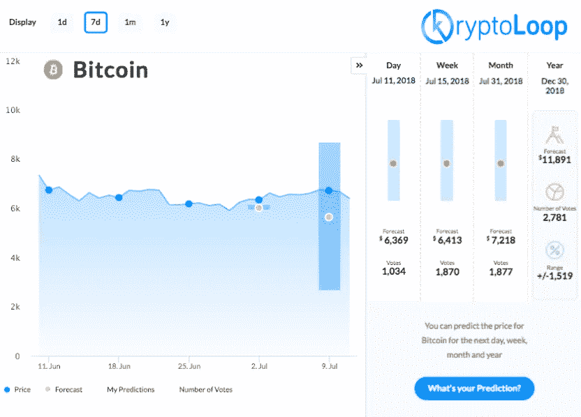
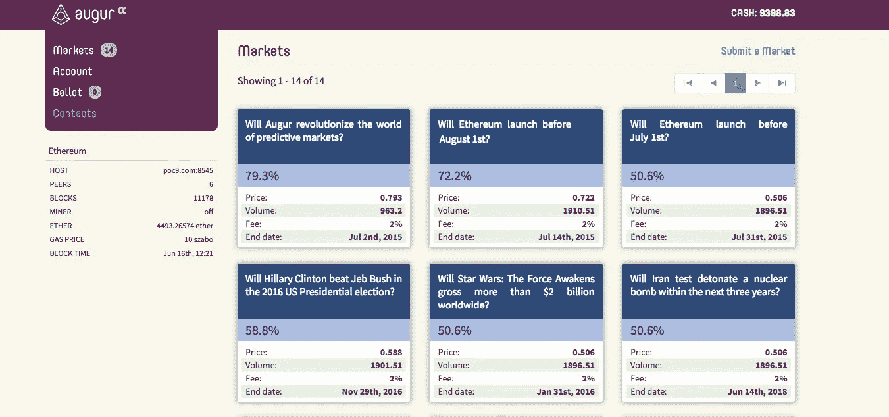

# 预测市场现在很热。

> 原文：<https://medium.com/hackernoon/prediction-markets-are-hot-af-right-now-a9f343b2239>

随着预测市场如[占卜者](http://augur.net)、[预言者](http://cindicator.com)、[氪环](http://www.kryptoloop.com)和其他一些预测市场的上线，很容易看到“**群体智慧**方法在预测未来事件方面变得多么有用。

[#LeverageTheFuture](http://www.kryptoLoop.com)

预测市场是一个有利的工具，可以帮助那些寻求洞察力的人利用未来。政府用它们来计算某些事件的概率。赌场用它们来赚钱，传统金融市场用它们来驱动投资者的回报。在所有情况下，他们为事件创造者和参与预测者提供了他们在其他地方得不到的见解。

以防万一，你不确定什么是预测市场，最简单的解释是最好的。它们是信息收集平台。参与者提交他们对任何一种事件的预测，并且(在某些情况下)用他们辛苦赚来的钱来支持他们的主张，从而把他们的钱付诸实践。

更有意思的是看到区块链和预测市场的结合。今天出现的平台利用区块链和加密基金会为公众提供透明、安全和廉价的访问。

## 聪明的分析师利用预测市场数据。

预测平台是数据的宝库，当被准确评估时，为评论者提供情绪细节、预测事件的概率，并作为识别可能的超级预测者或投资机会的监管工具。

## 预测市场有两种截然不同的风格。

**市场特定预测**平台是**市场特定的。(**我讨厌写这个句子，因为它是多余的，但是我没有别的选择)。

总之，举个例子，芝加哥商品交易所经营着一个商品、债券和其他金融工具的期货柜台。交易者通过购买未来某个特定日期的合约来押注未来的价格变动，如果价格超过了执行价格，他们就会获取差价。

顺便说一句，如果你是一个天气迷，商品期货交易者在预测准确的天气预报方面有极好的记录，因为他们必须了解气象学，以便知道商品价格何时或是否会受到天气的影响。

其他利基预测市场包括好莱坞证券交易所，以预测哪些电影将获得巨大的票房收入，而像 [KryptoLoop](http://www.kryptoLoop.com) 这样的风险投资公司利用“*群众的智慧”*和**预测加密价格**，并为交易员提供有价值的市场情绪分析，以帮助他们提高投资回报率。

**一般预测市场**是占卜者、预言者和灵知平台，允许任何人创建一个“**事件**”，并从特定的预测者群体中征求对该事件的预测，或利用人群得出答案。

让我们使用**August 和 KryptoLoop** 作为案例研究，更深入地回顾一下预测市场的两种风格。

# 人群驱动的加密价格预测引擎

[KryptoLoop](http://www.kryptoloop.com) 使用群体智慧方法帮助交易者评估市场情绪。他们通过收集交易者的预测价格，并将它们汇总，以找到平均值和标准差(即平均值的范围)。

一个具体的例子是在每周、每月和每年的范围内预测比特币价格。

他们询问了数千名交易员/分析师和投资者，他们认为 BTC 在 7 月底和年底的交易会是什么样的，并提出了一个非常简单的方法来查看交易员的头脑在哪里。下面是结果的一个例子。

交易者和投资者每天都在消化各种关于市场的信息。当他们来到 KryptoLoop 时，所有的知识都被浓缩成一个价格预测。因为他们要求成千上万的人在一周、一月和一年的时间框架内进行价格预测，用户获得的洞察力是市场情绪，也就是说，他们帮助交易者掌握脉搏

平台上的分析师**受到**奖励，他们在早期准确预测时获得积分。这种方法确保了他们在游戏中的皮肤，KryptoLoop 将在 2018 年冬天的 [ICO](https://hackernoon.com/tagged/ico) 期间将用户积分转换为令牌。可交易代币将用于获取优质服务，即访问超级预测者及其优质内容以进行交易推荐和市场分析。

# 占卜和一般预测市场

General Prediction Markets

另一方面，Augur 是一个**通用预测市场**，允许他们网络中的任何人创建一个事件，并要求预测者提交他们的答案。这些活动的范围从政治任命到公司内部产品开发，并已被证明有利于私营和公共部门的决策者。

所有预测事件的交易都在以太网中进行。代表(他们的令牌)只能由创建事件并担任该事件记者的人持有。用户可以从参与这些活动中赚取费用。

总而言之，即将上市的预测平台帮助了大家。交易者和投资者通过增加他们的代币投资组合价值和投资回报率而受益，而决策者和政策制定者通过改善他们的服务和产品而受益。

撬动未来，善待彼此。

我爱你，

—免疫球蛋白

在推特上用 [@iggsloop](https://twitter.com/IggsLoop) 找到我

查看我的另一篇关于[蒂姆·德雷珀斯 25 万美元价格预测](https://hackernoon.com/what-is-so-special-about-tim-drapers-btc-250k-prediction-47a42a1bb3bc)的帖子。