# 2018 年虚拟现实会怎么样

> 原文：<https://medium.com/hackernoon/predictions-for-this-2018-in-virtual-reality-9a6bcdf9734c>

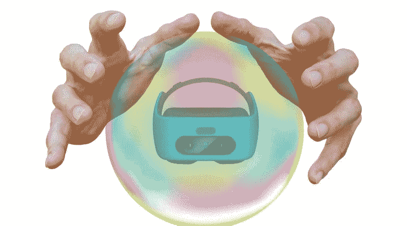

像每年一样，我喜欢对虚拟现实的未来做出花哨的预测:我对这项技术如此充满热情，以至于我喜欢幻想在未来几个月里我将能够尝试什么。

关于虚拟现实，**在 2017 年**我们已经看到了大量有趣的(有时是意想不到的)**新闻**……随着 **Vive Pro** 的发布，今年以正确的方式开始了。我想利用过去一年的所有这些数据，试着对 2018 年做一些预测。

我会把这篇文章分成各种感兴趣的话题，对于每个话题，我会说 2017 年发生了什么，以及我对 2018 年的预测。

开始吧！

# 独立耳机

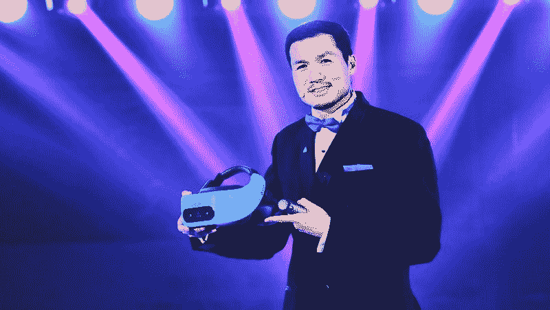

Vive China president Alvin Wang Graylin presents the Vive Focus on the stage (Image by HTC Vive)

我们都知道这个: **2018 年将是独立耳机年。**

**2017 年，许多公司已经开始投资独立外形**:英特尔(已经展示并随后放弃了其[合金项目](https://skarredghost.com/2017/01/06/project-alloy-virtual-reality-headset-at-ces-2017/))、高通(拥有 Snapdragon 835 VR 参考设计)、HTC Vive(已经在年底宣布了 [Vive Focus](https://skarredghost.com/2017/12/07/vive-focus-specifications-revealed-pre-orders-will-open-12-12-600/) )、Pico(已经发布了 [Pico Neo](https://skarredghost.com/2017/12/27/pico-announces-neo-completely-6dof-vr-headset-zense-depth-cameras/) )、谷歌(应该会与联想一起发布[这种耳机](https://skarredghost.com/2017/05/22/everything-need-know-google-io-2017-daydream-standalone-headsets-lot/) 有一个很酷的名字叫“幻影 Solo”)，尤其是脸书/Oculus(它曾经取笑过便宜的 Oculus Go 和 Oculus Santa Cruz)。

人们对独立外形如此感兴趣的原因是，独立外形有:

*   **易于使用**:您只需将耳机戴在头上，即可使用，无需安装和其他复杂操作；
*   **舒适**:因为他们去掉了线缆，那是目前 VR 体验最大的滋扰之一；
*   **便携**:你只需要随身携带一个设备；
*   **相当便宜**:因为单个单机的价格不如一个有线耳机+ VR ready PC 的价格。

因此，公司正在投资这种新的形式，因为**它解决了当前虚拟现实存在的许多问题**，这些问题阻碍了虚拟现实成为主流。

A user while playing with a Pico Neo and its two controllers (Image by Pico)

**2018 年将是独立设备年**:以上公布的耳机**都将在 2018 年**出货。它们将会有**不同的口味** : **Oculus Go 将会非常便宜**(仅 200 美元)，但它的功能将会非常有限:它只是一个 3DOF 耳机，只能用来看电影和尝试休闲游戏以及[社交虚拟现实体验](https://skarredghost.com/2017/02/15/social-vr-meeting-your-friends-in-virtual-reality-with-bigscreen-vr-and-vrchat/)； **Vive Focus 将为你提供 6 自由度**，但它只能通过 3 自由度遥控器提供互动；**刚刚宣布的联想 Mirage Solo** ，将是第一款使用谷歌 Worldsense 跟踪技术的耳机，在功能上与 Vive Focus 非常相似，使用 Daydream 平台；

**Pico Neo 和 Oculus Santa Cruz 是唯一提供完全自由移动** **和交互**的六自由度耳机和控制器:当然这些功能会使这些设备更加昂贵。

这些只是最受欢迎的几个:如果**独立外形将被证明是成功的，肯定其他公司会投资它**……考虑到微软已经生产了一款独立的 ar 耳机，具有 6DOF 跟踪功能，名为 [HoloLens](https://skarredghost.com/2016/09/21/microsoft-hololens-a-little-review/) ，如果它为独立的 Windows 10 VR 耳机创建了一个参考设计，我就不会觉得奇怪了**。此外，让我们都记住**高通刚刚宣布了它的骁龙 845 芯片组**，它针对增强现实和虚拟现实进行了优化:我设想他们为下一代独立虚拟现实耳机创建一个新的**骁龙 845 虚拟现实参考设计**，这将导致新的更强大的设备的创建。**

虽然设备会很多，但我认为其中大多数将服务于非常少的软件生态系统:Oculus 的设备将使用**Oculus Home**；所有中国人都会用 **Viveport，**而所有其他西方人都会用 **Daydream。此外，它们中的大部分都是基于骁龙的参考设计。**

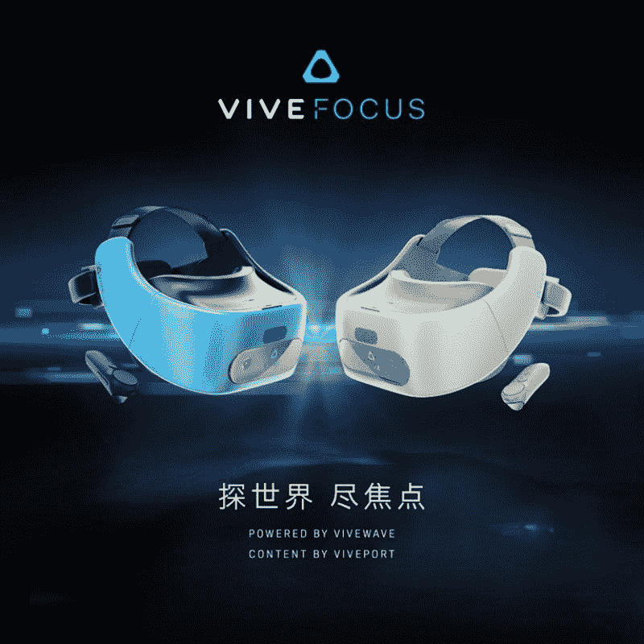

The Vive Focus device, with its two available colors. They should be released in the Western market too, even if it is not completely sure (Image by HTC Vive)

因此，在 2018 年，虚拟现实将走向独立，在我个人看来，独立的泡沫将会破裂。我的意思是，人们对独立的头戴设备有太多的信心，有人认为由于独立的头戴设备，虚拟现实最终将获得应有的主流成功。我有不同的看法:**我认为独立的外形非常非常有趣…但我也认为** [**它有问题**](https://skarredghost.com/2017/10/12/oculus-go-given-vr-identity-doubts-utility/) **会阻止它成为主流**:

*   **它太以虚拟现实为导向了**:当你为你的三星手机买一个 [Gear VR](https://skarredghost.com/2017/02/28/gear-vr-2017-remote-is-the-new-mouse/) 或者为你的 [Pixel 2](https://skarredghost.com/2017/10/07/crazy-week-vr-microsoft-sony-vive-daydream-updates/) 手机买一个 [Daydream viewer](https://skarredghost.com/2017/02/04/google-daydream-a-little-review/) 的时候，你是在为一个奇妙的手机买一个负担得起的浏览器。你可以用这款手机做很多其他事情，比如拍摄精彩视频、玩游戏和与朋友聊天。你为整个虚拟现实系统花了很多钱，但是你有一个通用设备。同样的道理也适用于个人电脑:我的虚拟现实个人电脑非常昂贵，但我也可以用它来快速开发和编辑视频。**一体机 VR 系统只是一个 VR 系统，你可以用它只做 VR** 。普通消费者不知道他/她为什么会对虚拟现实感兴趣:我所有的朋友都问我虚拟现实有什么用，他们不知道为什么他们应该买一个虚拟现实耳机。更有甚者，他们不知道为什么要使用别人给他们的免费纸板耳机。那么，他们为什么要花 200 美元买一个 Oculus Go 设备呢？就为了看一些 360 的视频？让我们都记住，Oculus Go 就像一个 Gear VR，大多数 Gear VR 设备都在它们主人的货架上除尘；

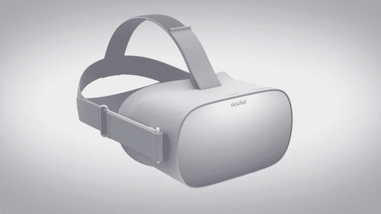

Oculus Go device render (Image by Oculus)

*   **表现平平**:有什么能说服人们购买 VR？有可能像《T2》中拍摄机器人一样感受令人惊叹的冒险，或者像《T4》中的《亲爱的安吉丽卡》一样感受深刻的情感。问题是**这些设备不能允许**:它们的计算能力有限，还有电池消耗和过热的问题。其中一些，尤其是最便宜的那些，**甚至只有有限的交互功能** …所以只能提供像样的虚拟现实体验。它们不能让你惊讶，因为优质的体验需要更强大的硬件(所以是一个系留耳机)，所以人们不能被带到购买一个由情绪驱动的独立耳机；
*   没有那么便宜:Vive Focus 售价 600 美元(考虑到中国的税收)，Pico 售价超过 700 美元，我认为 Oculus Santa Cruz 的价格也差不多。因此，除了像 Oculus Go(和 Pico Goblin)这样的真正基本的 3DOF 耳机，**价格并不低**:一个几乎可以与任何笔记本电脑一起工作的 [Windows 混合现实耳机](https://skarredghost.com/2017/09/02/latest-news-microsoft-vr-headsets-controllers-price-release-date/)的价格都低于这个价格。

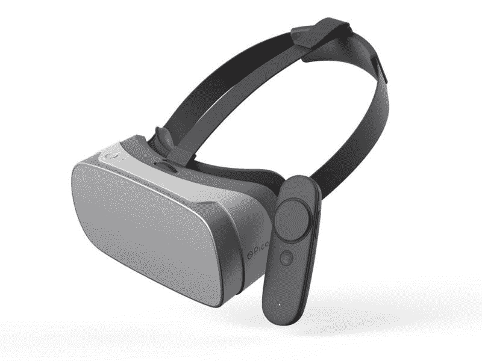

The Pico Goblin 3DOF Standalone headset: it is basically a Chinese Oculus Go: so, it has limited functionalities, but it is also very very cheap (Image by Pico)

**我预测单机会卖得很好**，在**专业人士**(例如，我认为它们可能会在展览中令人惊叹)和**虚拟现实爱好者**(他们中的一些人最终会买得起一个完整的虚拟现实耳机)之间都是如此。他们会卖出数百万台设备，但不会让虚拟现实成为主流。我认为 Oculus 关于 Go 销量将超过 Rift 但低于 Gear VR 的预测是现实的。当然，我希望被证明是错的，因为我热爱 VR！

# 无线适配器

**2018 年，我们还会看到更多虚拟现实耳机的无线适配器**。中国公司 [TPCast](https://skarredghost.com/2016/11/12/wireless-vive-is-now-a-reality/) (由 HTC 支持)已经在 2017 年预售了各种设备，以制造 Vive 和 Rift wireless，Vive 已经开始销售。**问题是这款设备仍然没有那么容易设置**:经过 UploadVR 的热烈评论，各种用户在 Reddit 上报告说，当这款设备工作时，它像一个魔咒一样工作，但以最佳方式设置它远非易事(不要说它是 a 中的痛苦……)。

这就是为什么 TPCast 在本次 CES 上宣布了这款设备的升级版本，以及将于今年晚些时候发布的全新版本。

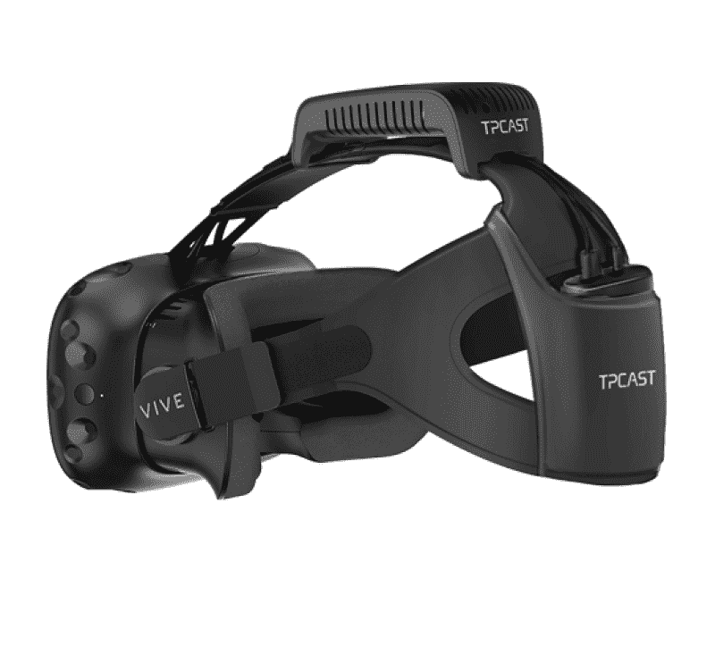

HTC Vive with TPCAST Wireless adapter on (Image by HTC)

**Intel 和 DisplayLink** [**已经展示了他们的替代方案**](https://skarredghost.com/2017/06/19/e3-2017-quick-round-fallout-4-vr-little/) **，应该会在今年年初发布。**刚刚宣布的 **Vive 无线适配器**正是基于这项技术，肯定会在使用 Vive 的专业人士中**证明是成功的**。

我敢打赌，即使在这个领域，如果这些无线解决方案被证明有兴趣，更多的球员将进入市场。

**当然，竞争将有利于改善此类无线适配器的问题**，从设置的简易性和电池持续时间开始:英特尔声称其解决方案的电池可持续 2 小时，这对于长时间的 VR 游戏会话甚至展览来说都有点太少。关于传输图像流的分辨率，根据一篇关于 [Upload VR](https://uploadvr.com/2018-the-year-virtual-reality-goes-wireless/) ，**的文章，我们必须等到 2019 年才有 802.11AY Wi-fi 协议能够传输每只眼睛的 4K。**

无线适配器很酷，因为它将用户从电缆中解放出来，同时仍然具有惊人的性能，因为 VR-ready PC 仍然在进行所有需要的计算，但是**它们增加了 VR 系统设置的成本和复杂性。所以我认为这些第一版将主要被专业人士、游戏玩家和发烧友使用。**2018 年，它们还不会对消费者友好。

# 移动耳机

老实说，我不知道该对这一类别说些什么:**它将继续过去几年的趋势**。**许多纸板**将被出售或免费赠送，**新的 Gear VR**将为新的三星旗舰手机发布，**新的 Daydream 观众将为新的 Daydream-ready 手机而来**。

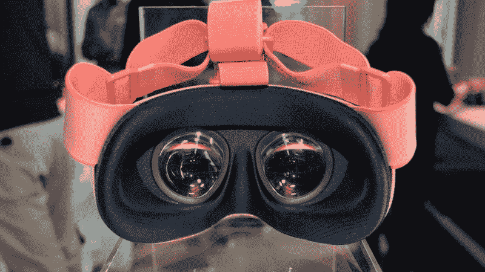

The new model of Daydream View (Image by Road To VR)

我认为我们会看到两个新的模型齿轮 VR 和一个遐想的观点。不过，老实说，我的看法是这些设备将和我们今年看到的那些几乎一模一样……移动耳机的问题在于，它们能做的没那么多:它们只是在手机上使用 VR 的两个镜头，所以它们不能添加功能。他们可以改善他们的散热方式，他们可以变得更舒适，但仅此而已。**唯一的革命可能会到来，如果像谷歌这样的公司将开始使用** [**ARCore**](https://skarredghost.com/2017/08/31/google-arcore-get-started/) **来执行对遐想观看者**的位置跟踪:在这种情况下，我们可能拥有 6 自由度移动耳机，而这可能是一个游戏规则的改变者。IMHO，这种情况不会在现在发生，特别是考虑到现在的“遐想视野”没有手机摄像头的洞……不过，也许在 2019 年，这是一种可能性。这样就能更好地融合独立耳机和移动耳机的优点，因为它们目前使用的软件平台完全一样。

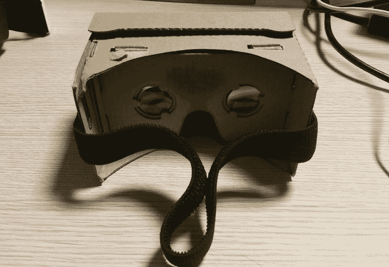

The dirty and cheap cardboard will probably still be the most sold VR device of 2018

**我认为移动耳机仍将是 2018 年最受欢迎的 VR 设备**。我曾看到分析师预测，随着上市时间的推移，越来越多的人会更喜欢独立或有线耳机，而忽视性能不佳的卡板。但在我看来，时代还没有为此做好准备。

# 系留耳机

2018 年，系绳耳机将失去舞台上的聚光灯，取而代之的是它们各自独立的同胞耳机。但这并不意味着它们会失去重要性。

**2017 年，我们目睹了一些有关系留式耳机的重要事件**，例如:

*   **Pimax 8K**的发布，这是一款拥有巨大的 200 FOV 屏幕和出色的 2*4K 分辨率的高端耳机；
*   Varjo 宣布在视觉中心展示一款具有**超高分辨率的耳机；**
*   **Windows Mixed Reality 头戴式受话器**的发布，这是一款全新的廉价头戴式受话器，由于采用了由内而外的跟踪技术，安装起来非常方便；
*   Oculus Rift 的巨大 [**价格下降让很多人进入 VR 成为可能。因此，甚至连 HTC 也降低了 Vive 的价格，索尼也采取了类似的措施。**](https://skarredghost.com/2017/07/17/oculus-reduces-virtual-reality-entry-cost-great-adoption/)
*   PSVR 达成**200 万销量大关**；
*   此次发布的有 [**阀门的新跟踪技术**](https://skarredghost.com/2017/06/07/need-know-steamvr-tracking-2-0-will-foundation-vive-2/) 和**新型人体工学 VR 控制器**(即[指关节](https://skarredghost.com/2017/06/30/new-infos-images-videos-valves-knuckles/))。

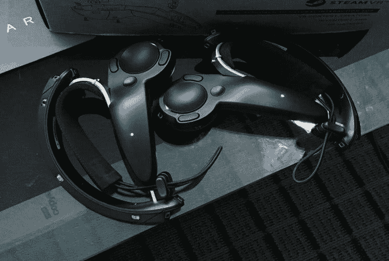

New Valve’s Knuckles controllers. They’re surely an evolution over the current Vive VR Controllers(Image by Cloudhead games)

2018 年，我想我们会看到很多有趣的事情。首先，**价格将继续下降**(尤其是 Vive 和 MS 耳机的价格)，这将使**VR 耳机的销售增长**，即使它们将低于无束缚耳机的销售。PSVR 仍将是市场的领导者，这要归功于其低廉的价格和开箱即用的能力(全球有 7000 多万台 PS4)。我还打赌微软会采取行动，宣布它的 VR 头戴设备可以与 Xbox 主机兼容。

**大玩家**(尤其是 Oculus 和 HTC) **将继续销售他们现在的设备**。我们已经看到 Oculus“Rift 之夏”的折扣价格是 VR 的一个非常重要的组成部分，因此这些公司没有兴趣发布一款没有市场的 1000 美元 v2 系留耳机。

你可能会认为**刚刚公布的**[**Vive Pro**](https://skarredghost.com/2018/01/09/vive-ces-2018-announces-new-vive-pro-headset-vive-wireless-adapter-viveport-vr/)**是反对这种说法**，但实际上它只是当前 Vive 的升级版(所以它更像是一个 v1.5 而不是 v2)**它显然是针对专业人士**(因此得名“Pro”)而不是针对广泛的消费者目标。此外，这将让 HTC **降低原始 Vive** 的价格，从而能够在消费者市场上更好地与 Oculus 竞争。

因此，正如我在另一篇文章中已经讨论过的那样，[我认为他们会等到 2019 年](https://skarredghost.com/2017/12/20/will-oculus-cv2-released-will-ever-come-santa-cruz-will-cv2/)发布一款新的负担得起的创新型耳机。但是**我也认为他们会在 2018 年宣布:例如，** Oculus IMHO **会在 Oculus Connect 5** 期间宣布 CV2。我认为 v2 版本的发布价格将在 400-500 美元左右(包括控制器)，并且非常容易使用和设置(当然，除了提供一套全新的功能)。

既然大玩家会等待，**是时候让小玩家提出一些创新的东西了** : Pimax 和 Varjo 会在那里，以高价出售他们的**高性能设备**(Pimax 8K X 需要的显卡还没有上市！).因此，小公司将为高端专业人士提供高端产品，而大公司将开始瞄准主流应用。

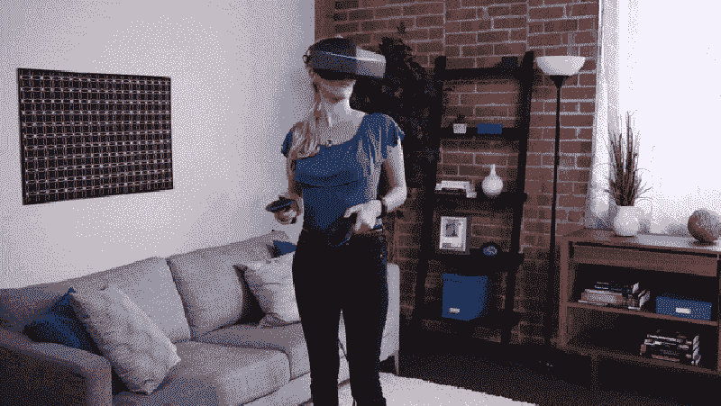

A nice girl playing with the Pimax 8K. Full scale tracking is included. (Image by Pimax)

LG 将发布其 Ultragear VR 耳机，Valve 的生态系统**将看到第一个使用 SteamVR 跟踪的设备和 Vive(由于 Pimax 8K，很快将成为两个)**。也许 Valve 最终会在这款设备或下一款 Vive 中部署其 Steam VR 追踪 2.0 技术。

**关于 OSVR/Razer HDK 项目的最后一句话:我认为在 2017 年缓慢死亡之后，2018 年将正式宣告死亡。**我要写一篇专门介绍它的帖子:它已经在硬件方面被 Rift 和 Vive 提供的最佳跟踪和人体工程学控制器打败，在软件方面被 Steam VR 打败。

# 配件

VR 设备的配件会延续目前的趋势:**会有很多，并且会服务于不同的用途**(你可以在我关于[虚拟现实礼物创意](https://skarredghost.com/2017/12/08/22-awesome-augmented-virtual-reality-gift-ideas-christmas-events/)的帖子里读到其中的一些)。我们在 2017 年看到的一些例子以及我们将在 2018 年继续看到的例子是:

*   触觉手套；
*   背心；
*   气味发射器(像[VAQSO](https://skarredghost.com/2017/07/20/vaqso-adds-smell-virtual-reality/))；
*   脑波阅读器(如[Neurable](https://skarredghost.com/2017/08/07/best-vr-news-siggraph-2017/))；
*   眼球跟踪系统(如 Tobii)；
*   VR 镜头和镜头适配器(如 [WIDMOvr](https://skarredghost.com/2017/08/01/widmovr-products-review-nice-accessories-virtual-reality/) 提供的)；
*   枪支和其他道具(由 [Vive 追踪器](https://skarredghost.com/2017/02/27/vive-reveals-tracker-price-and-other-stuff-at-mwc-2017/)等系统提供动力)；
*   跑步机；
*   特殊控制器(如[3d 舵](https://skarredghost.com/2017/12/18/3drudder-vr-controller-hands-review/))；
*   电缆管理系统；
*   VR 包和行李箱；
*   等等…

**我认为在 2018 年，我们会看到越来越多的配件，各种各样，各种价格**。谈论配饰需要一篇专门的超长帖子。我只想在这里强调，他们中的大多数(但不是全部)会努力服务于**主要是三个目的**:

*   **通过包含额外的感官(如将嗅觉添加到 VR 设备的 VAQSO)，为用户提供更好的沉浸感**；
*   **提供用户与 VR 生态系统更好的互动**(作为 Tobii，将让你使用眼睛凝视作为选择机制)；
*   **增加用户的舒适度**(作为让眼睛有问题的人使用 VR 的镜头适配器)。

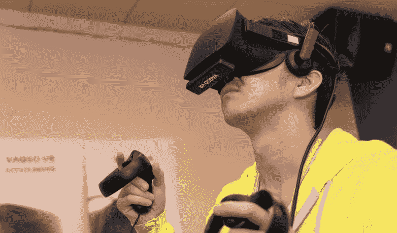

A user playing using VAQSO scents emitter. As you can see the device is very little and fits easily under the headset (image by VAQSO)

上面指定的大多数设备(VAQSO、Neurable 等……)都已在 2017 年宣布，但**最有可能在 2018 年发布，因此 2018 年将是购买 VR 配件的大好年份**。我还认为 Valve 将在今年开始销售其 Knuckles 控制器:因为它们可以与当前的 Lighthouse 站一起工作，**它们可以作为所有使用 SteamVR 跟踪的耳机的单独控制器出售**。由于更多的耳机将开始使用 SteamVR 跟踪技术，我们将开始看到 SteamVR 专用配件的数量增加。

更多的配件将意味着更多的定制和每个人更好的虚拟现实体验，无论是在家还是在商场。而且各种配件结合在一起使用，可能会让 VR 体验爽很多。

# 内容

**“内容为王”**。这句话你听过多少遍了？嗯，肯定是有原因的。

正如我在谈到独立虚拟现实头戴设备时强调的那样，**人们不知道为什么他们应该购买虚拟现实设备，因为他们觉得它不够有用。许多人一直在谈论神奇的虚拟现实杀手应用程序，这会让每个人都跑到商店去买一个虚拟现实耳机…但让我们诚实地说，这只是**

Exactly (image from Know Your Meme)

我们需要的是:

*   **越来越多的内容**；
*   **更多样化的内容**:大部分 VR 应用只是游戏或者讲故事的体验。我们需要更多的社交工具，更多的创作者工具，更多的教育工具，更多的工作工具，等等……此外，即使在游戏中，我们也需要为不同类型的人量身定制的**游戏**:因此更少的僵尸射手和更多的[女人](https://skarredghost.com/2017/06/23/women-vr-lets-make-vr-fairer-place/)；
*   **更多优质内容** : AAA 游戏和高度打磨的程序。数百万人看过 Tilt brush 的广告，每个人都瞠目结舌；

*   **更受欢迎的品牌**:说起游戏，像辐射、国际足联、CS、刺客联盟、超级马里奥等品牌……能够吸引很多人。

**2017 年，我们在这个意义上向前迈出了许多步伐**:一些很好的例子是发布了像 [Google Blocks](https://skarredghost.com/2017/07/10/google-blocks-review-3d-modeling-prototyping-made-easy/) 这样的伟大创作工具，像 Robo Recall 这样的高质量 VR 专属游戏，以及**三款有着巨大品牌的游戏，如辐射 4、Skyrim 和 Doom VFR** 。最后这三款游戏都是不错的游戏，但它们都只是标准 PC 游戏的虚拟现实移植，显示出它们是充满妥协的产品。

**2018 年我认为我们会继续看到这种趋势** : Valve 应该会发布 3 款致力于 VR 的游戏，Oculus 应该会对其资助的 VR wargame 做同样的事情。我认为我们会看到更多的 AAA 游戏的虚拟现实移植，但仍然不是专门为虚拟现实制作的 AAA 游戏。Oculus 在 2017 年宣布，它将提高资助内容的标准，因此它将开始资助更大的项目，所以**我认为我们将开始看到更长、更高质量的内容**……因此，一款独立 VR 游戏的平均价格可能会从 9.99 美元升至 14.99 美元。不幸的是，我仍然认为**游戏将是虚拟现实商店**上销售的大部分内容，并且排他性将持续一整年。

关于店外体验，**让我们不要忘记 VR 色情**:它是[目前在网络上观看最多的 VR 内容](https://skarredghost.com/2017/10/20/porn-taking-lead-virtual-reality/)，我认为**在 2018 年它的产品将会增加**，每天都会出现新的专用网站和应用程序。提议的视频质量和提供的体验类型也将大大增加。除了面向成人的视频，其他类型的讲故事体验和电影也将发展，变得更长、质量更高。2017 年，我们有了第一部中长虚拟现实电影 [Miyubi](https://skarredghost.com/2017/08/24/miyubi-review-long-vr-movie-nice-gaming-features/) ，我认为 2018 年我们可以达到更长的持续时间，只要**创作者将了解如何正确地创建虚拟现实视频，他们将获得创建更容易的此类体验的工具。**

我认为，在 2018 年底，虚拟现实可用的内容将足够好，远远好于现在可用的内容，这将使人们对虚拟现实更感兴趣。关于普通人群，**年轻男性将是最喜欢虚拟现实的人群**。

当然，我说的是消费者内容。**在我看来，虚拟现实的专业应用将在 2018 年飙升**，教育、培训、康复、心理学、营销、艺术和其他 1000 种可能的应用将开始变得非常流行。

# 网络虚拟现实

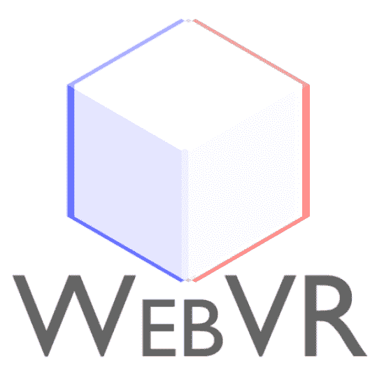

WebVR Logo

**特别提及 WebVR 内容**:在 **2017 年，我们已经看到对 WebVR 的兴趣越来越大**并且像 A-Frame 这样的框架已经变得非常流行，而像 Amazon Sumerian 这样的其他框架已经宣布但仍未发布。问题是网络虚拟现实仍然是粗糙的 T21，并不是所有的平台都支持它。

在 2018 年**,我的预测是所有的浏览器都将支持 WebVR，同时将成为 WebXR** ,因为这将成为制作 AR 和 VR 基于网络的应用程序的框架。创建 WebXR 应用程序的工具(如[罗丹](https://skarredghost.com/2017/04/04/make-webvr-development-easy-with-rodin/))数量将会增加，一些工具(如亚马逊苏美尔人)将允许用户创建 WebVR 应用程序，即使他们不知道如何编码。我认为 **Unity 也会在 WebVR** 中增加一个实验性的导出方式。这样基于 WebXR 的体验数量会增加很多。

# 拱廊

**VR 街机会像蘑菇一样继续冒出来**，就像 2017 年发生的那样，特别是在世界的东方(中国，日本等…)。我们将有两个**奇妙的虚拟现实主题公园和高科技仓库**，在那里你可以尝试将现实与虚拟融合在一起的令人惊叹的虚拟现实体验(就像在虚空中一样),还有**个地方，你可以付费尝试你在家里买不起的虚拟现实设备**(比如 HTC Vive)。当然，第一种会很少，而第二种会占大多数。

我认为 2018 年将延续虚拟现实商场的积极趋势，也许他们还会有更多的客户，因为 2018 年**人们对虚拟现实的认识将会大大提高**。但是我也认为这将是有这种趋势的最后一年。如果如我所想，2019 年将是虚拟现实技术的颠覆之年，那一年许多人将开始在家里拥有虚拟现实系统，不再需要去街机使用虚拟现实。所以，**我认为，再过两年，那些只是让人们尝试 VR 的街机，要么就得进化，要么就得消亡。相反，高质量的商场将继续存在，这要归功于它们将提供的梦幻般的现实体验。**

# 中国

唐纳德·特朗普最喜欢的国家**将继续其虚拟现实竞赛，并将像美国一样成为世界范围内的虚拟现实强国。**

我认为在 2017 年，我们已经帮助了中国虚拟现实生态系统的增长，包括其内部市场(对移动虚拟现实系统最感兴趣，因为它们更便宜)和外部市场。除了 HTC，这显然是这个领域的领导者，一些有趣的中国公司已经获得了全球虚拟现实环境的兴趣:

*   **TPCast** 为其无线适配器；
*   **Pimax** 为他精彩的 8K 耳机(也为其 5K 和[4K one](http://www.shareasale.com/u.cfm?d=468126&m=75815&u=1685371))；
*   Pico 因其廉价的独立耳机而闻名。

**In China, there is now an enormous VR theme park** and in Beijing, you can find [one of the first VR cinemas](https://skarredghost.com/2017/07/14/first-professional-vr-cinema-opens-beijing/). In China **the government has created some VR cities**, cities where there is a lot of R&D on VR and where everything from education to medical facilities makes an intensive use of VR, so to exploit the technology at its maximum. HTC is experimenting the use of cloud rendering so that people can save the money of a VR-ready PC. Alibaba is experimenting a VR experience for buying online. Furthermore, Xi Jinping has clearly stated some times ago that **AR and VR are a trend that the country should follow and so the government is investing a lot to make China a great XR country.** And he’s succeeding in his plan.

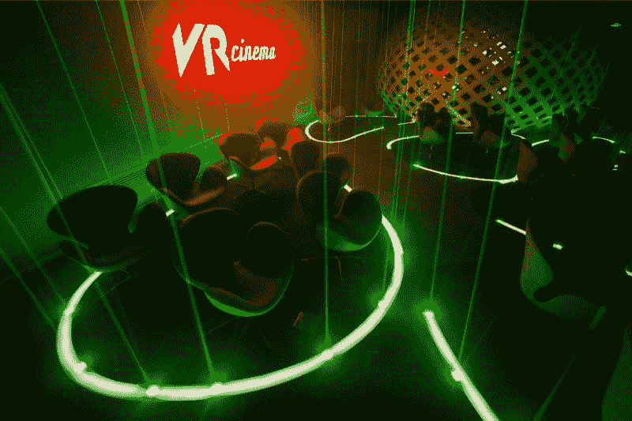

VR Cinema in Beijing (Image by Yue Cheng Media)

I think that **at the end of 2017 we have seen the first VR isolation of China from the western world**: HTC Vive has started creating an ecosystem with [Viveport+Vive Wave](https://skarredghost.com/2017/11/15/htc-announces-vive-focus-vive-wave/) that is particularly tailored to serve the Chinese market, as Google has created Daydream to rule the western world. The Vive Focus and Pico Neo for the first time are **interesting devices sold China-first** and not US-first.

**In 2018, China will continue this trend.** Chinese major companies like Alibaba and HTC will continue funding AR/VR startups worldwide ([Magic Leap](https://skarredghost.com/2017/12/22/magic-leap-announces-magic-leap-one-2018-need-know-im-not-hyped/) has been also funded by asian funds); **there will be a lot of new VR Chinese startups popping up, both on the hardware and software side**; we’ll have an enormous production of VR headsets (especially plastic cardboards) in China; we’ll see interesting products being created and being China-only at the beginning; **we’ll start seeing a VR-great wall starting to grow**: as it has happened for all the rest, **the VR Chinese ecosystem** will become more isolated from the one of the rest of the world, with some companies becoming big by just serving the enormous Chinese internal market.

The gigantic mecha in front of the enormous VR theme park in Guiyang (Image by Reuters)

**中国将成为全球第二个 VR 驱动者**。老实说，我一直认为他们不会是第一个，因为到目前为止，我已经看到所有最伟大的真正创新来自美国。只是说:HTC Vive 用的是 Valve(美国)发明的一种追踪技术；Vive Focus 和 Pico Neo 使用了高通(美国)发明的耳机参考设计。所以，我认为 2018 年我们会看到来自中国的惊人之举，但**我们将继续看到来自美国的最大破坏。**

# 安全

2017 年，我们有很多人质疑虚拟现实是否会伤害我们的眼睛，是否[会对我们的孩子造成危险](https://skarredghost.com/2017/05/02/is-virtual-reality-oculus-vive-etc-safe-for-kids/)或者[会上瘾](https://skarredghost.com/2017/10/25/virtual-reality-addictive-psychologist-gives-us-answer/)。《卫报》发表了一篇(极具偏见)的[文章](https://www.theguardian.com/technology/2017/oct/28/virtual-reality-headset-children-cognitive-problems)关于一项实验**第一次表明也许 VR 会对儿童产生副作用**。**我们也有了**[**VR 的第一个伤亡者**](http://www.pcgamer.com/man-dies-in-vr-accident-according-to-russian-news-agency/?utm_content=buffera6765&utm_medium=social&utm_source=facebook&utm_campaign=buffer_pcgamerfb) :一个在 VR 中摔倒在玻璃桌子上并因此死亡的家伙。

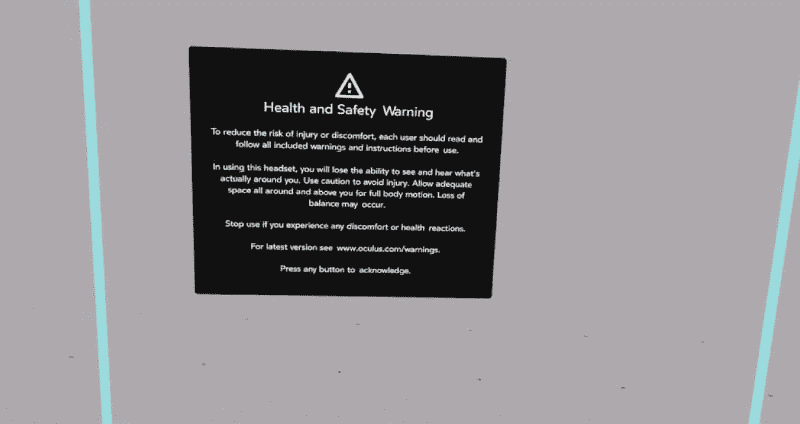

The dear health & safety warning of the Oculus Rift

2018 年，我们将有更多的用户和更多对虚拟现实的认识，所以所有这些事情都会变得更糟:更多的人会开始问虚拟现实是否会伤害我们自己，并且会在这方面进行更多的研究。我们将开始有更多的人因为 VR 而出现问题，或者出现他们认为是由 VR 引起的问题。我认为既然有“电子游戏使人变得暴力”的趋势，我们也会有类似的愚蠢的虚拟现实趋势:人们会开始说虚拟现实伤害我们的眼睛，使人上瘾。

**安全将成为虚拟现实**中的一个重要话题:除了研究这些设备是否会对我们造成伤害之外，**应该教育用户如何在家中正确使用虚拟现实**，以避免发生像俄罗斯男子死亡那样的事故。

# 标准化

VR 目前正处于一个没有标准的遥远的西方时代。SteamVR/OpenVR 已经成为各种系留耳机事实上的标准，但这是绝对不够的。

Khronos 基金会的 OpenXR 项目正是为此服务的。正如你在它的网站上看到的，它的范围是创建一个跨平台的虚拟现实标准:

> *跨平台 VR 标准通过使应用程序只需编写一次就可以在任何 VR 系统上运行，并访问集成到这些 VR 系统中的 VR 设备以供应用程序使用，从而消除了行业碎片化。*

我认为**在 2018 年，我们将开始看到标准化努力的第一个真实结果。**

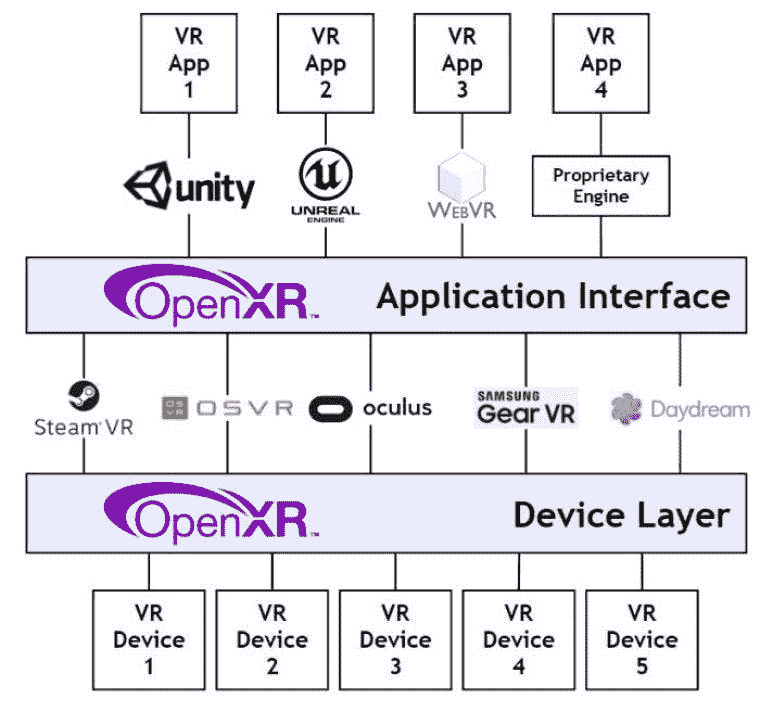

OpenXR standardization project (Image by Khronos group)

我们都希望达到虚拟现实在黑客帝国中的时刻，我们完全沉浸在虚拟世界中，我们感觉它是真实的。2018 年，我们将不会在那里(我们将需要[脑机接口](https://skarredghost.com/2017/10/01/need-know-brain-computer-interfaces-virtual-augmented-reality/)来做到这一点……这将需要几十年)，但**科学家将继续在这个意义上工作。**

**我想我们会看到很多关于 VR 各个方面的实验。它将特别关注显示器、渲染技术和眼球追踪**(因此特别关注高分辨率/高频显示器、有凹渲染和有助于解决聚散度调节问题的显示器等)，但也关注像 ASW 这样的优化，这些优化可以使虚拟现实复杂的应用程序甚至可以在中端计算机(和独立设备)上运行。

# 博客

[**鬼魂嚎叫**](http://skarredghost.com) **当然会统治世界**！:D·:D·:D

# 最终印象

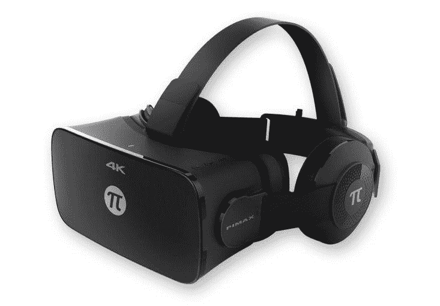

Pimax 4K Headset (Image by Pimax)

我认为 2018 年将是虚拟现实非常有趣的一年:这将是虚拟现实从流沙中走出来的一年，这一年人们将开始理解虚拟现实为什么有用。更多不同种类的耳机(移动、有线、独立)将被售出，更多的内容将被提供，更多的公司将对这个快速增长的市场感兴趣，创造一个良性的生态系统。虽然这不会是虚拟现实最终被颠覆的一年，但**这将是为 2019 年发生的起飞做准备的一年**(时间流逝得越多，我就越同意[约翰·里奇蒂洛的预测](https://skarredghost.com/2017/05/04/unity-ceo-john-riccitiello-says-that-vr-will-become-mainstream-in-2019-and-i-agree/))。

仅此而已。**以上都是我在 VR** 中对今年的预测。你觉得他们怎么样？你同意吗？你认为什么样的破坏会使这些预测立即变得过时？请在下面的评论中告诉我！

在你们离开之前，别忘了为这篇文章鼓掌，尤其是**来我的 XR 博客******！****

**(这是最初出现在[我的博客](https://skarredghost.com/2018/01/04/predictions-virtual-reality-2018/)上的一篇文章的更新版本)**