# 来自第一个 AR OS 的预测

> 原文：<https://medium.com/hackernoon/predictions-from-the-first-ar-os-94407773cc9>

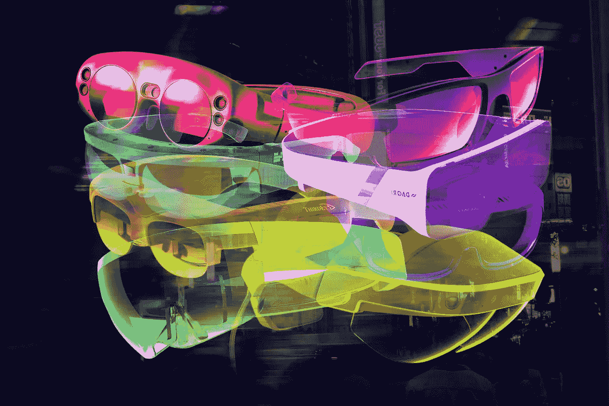

有很多关于 AR 眼镜的报道，传言将在未来几年推出，但没有太多关于操作系统和核心用户界面的报道。我们可以预测一些用例，一些被数据覆盖的世界的半反乌托邦式的愿景，但没有什么规则、权衡和能力将定义即时的用户体验的真正意义。

这一系列文章展望了一个投机的 HMD 的能力，它有一个为增强现实而从头构建的操作系统——它会是什么样子呢？哪些潜在的概念和考虑会影响用户的体验？对开发者有什么规定和限制？

作为一家初创公司的首席技术官，我必须为未来制定具体的计划，这些计划将由业内更大的参与者来决定。在像 AR 这样快速变化的环境中，这是很困难的，但是通过从可观察到的限制向后工作，就有可能猜测我们的软件可能运行的环境。

# 我们如何到达第一个 AR-OS

这篇文章对不久的将来做了一些假设:

## 增强现实眼镜制造商希望操作系统能够扩展功能

HMDs 将与从头构建的 AR-OS 一起发布，而不是移动 OS。AR 的价值不能仅仅作为现有 2D UX 之上的一个功能来充分实现(正如我们从移动 AR 的发现、UX 和商业化挑战中看到的)。

这个 AR-OS 中引入的基本概念将能够从短期使用的早期采用者阶段扩展到连续全天使用。

微软的赫萝用户界面是迈向完整增强现实操作系统的一个半步的例子，但正如稍后将变得清楚的那样，其“以任务为中心的方法”并不是真正的增强现实优先的 UX。

## AR 眼镜可以感知运动、位置和物体

这种眼镜将允许位置跟踪，传感器可以识别用户的环境和 3D 物体。人工智能将提供上下文信息和分类。网络服务将可用于从大型数据库中识别平面图像、3D 环境和物体。

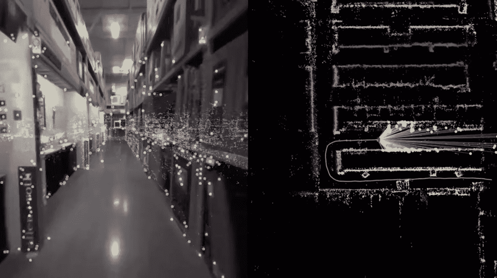

Googles VPS will allow pre-scanned environments to be detected, and exact location determined.

## 用例将随着时间的推移而发展和扩大

首先，AR 眼镜将用于单一的专业任务，如工厂车间的培训或监控设备。由于舒适性、体积和电池的限制，早期的会话时间会很短，但随着硬件的改进和软件解决更多问题，时间会增加。

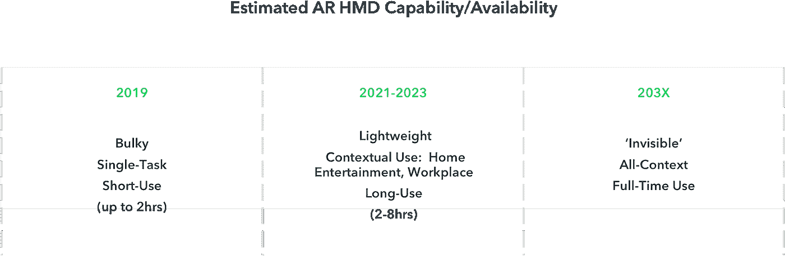

Progress from 2023 to 203X will move in fits and starts, dependent on hardware breakthroughs

# 应用和标签

AR-OS 上运行的软件可以分为两大类——应用和标签。

应用程序类似于当前的桌面/移动应用程序，它们由用户启动，可以定位(尽管是在 3D 空间)，可以执行多项任务，并且在关闭之前一直保持打开状态。

**例子**:一个木工参考应用，你打开它，把它放在你正在工作的物体旁边的桌子上。

标签更像是不断寻找特定环境、背景或对象的自主应用程序，它们可以用信息或通过视觉改变世界来增加这些信息。在那之前，他们是隐形的。

**示例**:楼宇管理人员进入房间时，会启用一个标签来突出显示任何报告有故障的设备。

## 任务—应用程序

今天，移动操作系统中的基本概念是自古以来在个人电脑和功能手机(我指的是 90 年代)上使用的隐喻的延续。专注于单一任务的应用程序从桌面或主屏幕启动，然后接受输入，直到关闭或暂停。

这种以任务为中心的模式不适用于 AR HMD。当你拿起电话的时候，你已经决定了你想要执行的任务，主屏幕上的 UX 围绕着这个任务进行了优化；一个应用程序网格准备启动并占据屏幕。一个手机操作系统只需要关心它自己的显示屏，让你尽快完成正确的任务。

然而，AR UI 是连续可见的，与用户可能正在执行的真实世界物理任务共享空间。**被管理的显示器是世界本身**:切菜时有一个图标网格浮在你的面前是一种糟糕的体验，而且在世界上一次只能显示一个任务是过分限制的。

AR-OS 的“主屏幕”是基于上下文的——主动与世界交互并增强世界，而不是等待用户选择单个任务。该设备上的大多数体验不是作为占据整个显示屏的独立任务运行，而是作为应用程序或标签显示在世界的上下文中:视频在墙上播放，而在柜台上，菜谱显示下一步的准备工作，恒温器在门边徘徊。

**我们组织物理世界的方式可能比我们组织 2D 界面的方式更与增强现实相关**。在现实世界中，我们被极低摩擦的消费信息和执行任务的方式包围着(现在我可以拿起电视遥控器、笔记本、科学书籍、外卖菜单、我的手机或咖啡，不用抬头)。我们同时执行多项任务，同时改变位置和环境，并依靠不熟悉的环境来指示我们在特定区域可以做什么。我们与环境的关系会影响我们的思维方式。

以任务为中心的全环境应用将会存在，但它们不是 AR-OS 的默认构建模块；相反，它们将是用户输入的特殊状态。AR-OS 的默认模式就像一个光线充足的客厅——所有可能的任务都可见，但不需要关注。以任务为中心的应用程序就像关灯看电影一样——这是一种暂时的状态，可以最大限度地减少注意力分散。

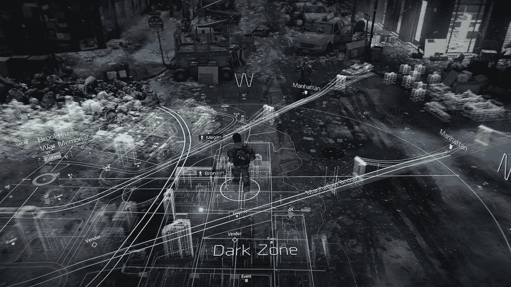

*Video games are a rich source of UX experiments possible when rendering in 3d space without limitations. Here is an example of a full-environment, task-focused navigation app (The Division)*

## 上下文—标签

AR 的部分功能是能够自然地发现任务和信息——通过在我们生活的空间中遇到它们。目前，这种能力被移动操作系统的限制所束缚。

移动 AR 最大的挑战是需要在正确的上下文中下载和打开单任务应用程序的摩擦。用户可能愿意为短暂的品牌体验做一次，但作为日常生活的一部分，它根本不可扩展。

对于移动和 AR-OS 中面向任务的 AR 应用程序来说，发现也是一个巨大的问题。用户需要在现实世界中得到提示(“嘿——下载我们的应用，扫描这个！”)，或者记得看过一些营销，甚至意识到在某个位置或某个对象上存在 AR 体验。

标签会自动将自己放置在环境中，不需要用户识别它们在某个特定地点是否有用并启动它们。标签可以包括植物名称标签、食物卡路里计数或历史名胜等内容。

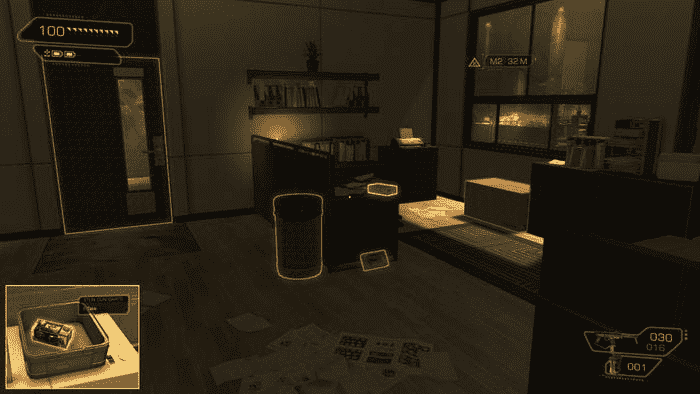

*A video game example of a tag highlighting possible interactions or information (Deus Ex: Human Revolution)*

更深奥的标签示例可能包括:

*   移除用户周围世界的所有广告
*   显示所有已安装设备的年龄和最后认证日期的建筑物维护标签。
*   允许其他人创建 AR 时尚和化妆品的社交标签，用户可以在他们的身上看到这些标签
*   给世界带来整体颜色分级和美学效果的标签
*   看到快空的消耗品时，贴上“订购更多”的标签

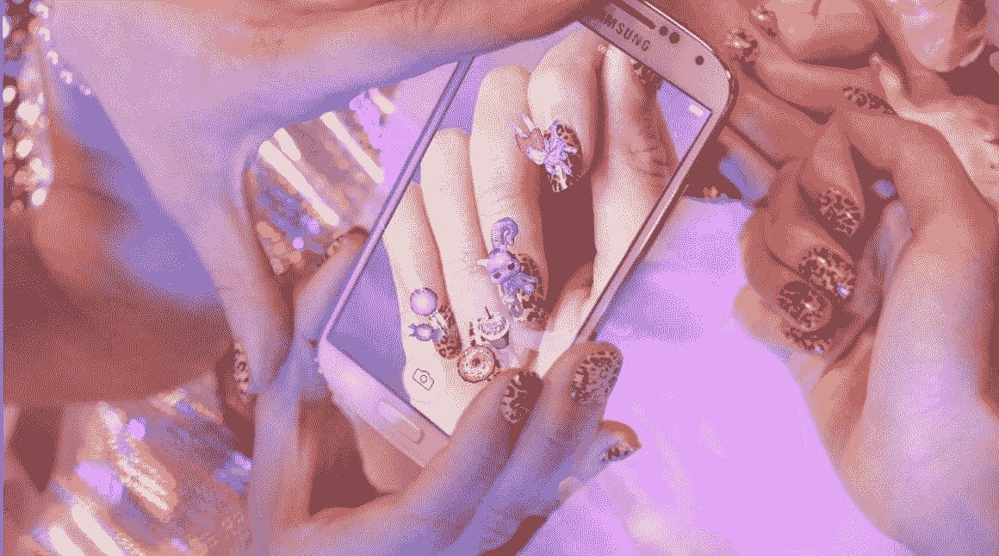

*One of my previous startups produced AR cosmetics that let you create an augmented digital self. (Metaverse Makeovers)*

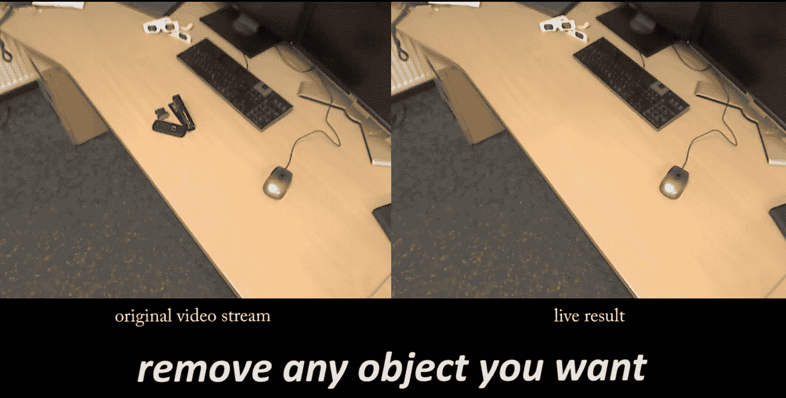

*From* [*http://diminishedreality.com/*](http://diminishedreality.com/)

除了用户安装的标签和默认情况下在 AR-OS 中启用的标签，基于位置的标签可以自动显示来自位置所有者的内容。想象一下博物馆里的扩大展览，或者在医院里找到指引你去指定地点的路。

基于上下文的增强——进入一个空间，并在上面添加额外的信息、交互和美学——在建筑和 UX 方面基本上是未知领域，因为只有通过 AR 才真正可能实现(尽管你可以说前身包括基于上下文的技术，如移动设备上的信标)。

一些可能性(包括 web 在 AR 中作为标签的作用，以及空间的所有权)将在本系列的下一篇文章中讨论。

# 管理资源——注意力和空间

手机屏幕的局限性迫使用户从窗口式多任务界面退回到单一任务界面。移动设备上的多任务处理是可能的，但直到今天仍然很尴尬——这是由于硬件的限制而做出的让步。

尽管有能力在任何地方以任何形式呈现信息，AR-OS 仍然会受到严格的限制。然而，这一次，让步主要是对用户而不是硬件——用户有感性/精神上的限制，如注意力和空间理解力，很容易被淹没，导致沮丧和不适。

AR-OS 将需要像管理设备本身的资源一样管理用户的资源，这将需要一些非常仔细、善解人意的 UX 设计。注意力需要被当作一种有限的资源来管理，并与现实世界的需求相平衡。物理空间也需要小心管理，以确保 AR-OS 总是易于理解。

# 注意力

对于当前的设备，操作系统可以假设如果用户正在看显示器，他们会将大部分注意力放在正在呈现的任务上。如果用户希望转移他们的注意力，转移视线就很简单。

在 AR 中,“显示”包括用户可以看到的一切，因此不能做出相同的假设。如果你在用户试图做另一个非增强现实任务的时候，在他们的空间里放满了令人眼花缭乱的信息，他们会变得心烦意乱和沮丧。

用户对世界的关注是有限的，所以 AR-OS 必须将注意力作为一种资源来管理。它的目标是在世界上只呈现用户需要的信息，尽可能减少精神负担。

那么，我们如何管理用户的注意力，以尽量减少分心？有些规则可以很容易地凭直觉理解:

**强度**

*   快速或持续的**运动**会分散注意力，尤其是当它们朝向用户或在视觉边缘时。
*   在触手可及的距离内的物体有更大的物理存在感(任何尝试过虚拟现实的人都可以证实)
*   明亮或饱和的颜色自然会吸引更多的注意力
*   **比例大的物体**会引起更多的注意

**复杂性**

*   在同一**空间体积**中重叠的物体将需要更多的精神努力来理解
*   复杂的**形状**需要更多的注意力去理解，比如非常详细的图标或者界面。

同样，因为我们处理的是用户的视觉皮层而不是他们的显示，所以比传统的 UI 设计更复杂。仅举一个例子，设计师需要避免让用户吃惊:

*   周边视觉中突然的小规模运动会吓到用户，因为我们已经进化到反射性地认为有一种生物需要我们的注意来判断它是否危险。
*   类似地，任何突然的大范围运动也可能惊吓用户

这些概念的推理是直观的，但它们可能需要 2D UI 设计的不同思维方式，包括来自建筑、寻路、产品设计、心理学和神经学的想法。

**注意和标签**

当用户专注于单个活动时，注意力很容易管理——因为用户已经启动了一个任务，我们可以假设他们打算给予它注意力，这是面向任务的软件的创建者可以设计的。例如，3D 编辑[工具](https://hackernoon.com/tagged/tool)可能会占据用户的大部分注意力和视野，但宜家建筑指南可能会合理地期望它所指的家具存在，并且需要可见。

然而，AR-OS 的许多用处来自于它能够根据用户周围的世界提供一系列信息和动作。为了避免分心和烦恼，这个环境用户界面的目标应该是达到尽可能低的注意力状态，同时仍然传递想要的信息。

由此可见**AR-OS 的理想“低能耗”状态是看起来尽可能接近真实**。值得一提的是，这与我们受电影影响对未来 AR UIs 外观的愿景直接相反——填满一个人面前的空间，或者在用户周围钉上密集设计的面板。

这也表明标签所呈现的信息应该是暂时的，但以后可以检索——例如，在识别一道菜时，卡路里计数标签可能只能在一段设定的时间内访问该菜周围的有限空间来显示计数。标签也可以限于用户直接交互的食物。作为这些限制的结果，这个标签不能一次永久地将计数放在超市中的每个物品之上。这可以防止垃圾邮件和设计不良的标签。

需要一个通知系统来管理这些事件，并微妙地提示用户，即使在最初的通知已经过去之后，在特定的空间内还有东西可用。这个通知系统将在本系列的后面进行扩展。

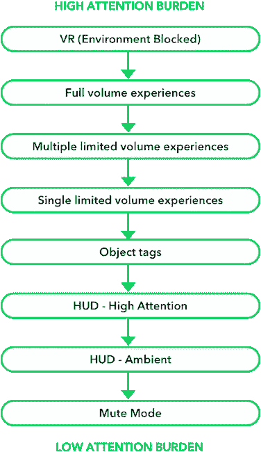

Assumed attention burden for the UI modes discussed

# 空间

操作系统将知道用户周围的可用空间，这将根据他们的位置而有很大的不同(例如，电话亭与公园)。

将虚拟对象放置在真实对象或墙壁的“内部”可能会在视觉上不舒服，特别是如果真实对象有大量图案，因为深度的差异会产生“斗鸡眼”的感觉。避免这一点意味着任务和标签可以占用的空间是有限的，并且在不同的环境中会有所不同。

人们期望操作系统选择最佳位置来放置信息和活动，以最大限度地减少不适和分心。由于 AR 的大部分都是上下文相关的，所以许多用例依赖于在被引用的对象旁边或之上呈现的信息，所以活动将需要能够请求特定的空间量。

如前所述，需要避免重叠体验，因此操作系统需要管理对同一卷的访问请求，或者向用户提供信息/活动可用的通知。

分配空间时，操作系统需要考虑活动类型、请求的总容量、请求的定位点、任务优先级和当前上下文等细节。

这个 UI 需要允许在一个位置有许多体验，而不占用用户的注意力。一些潜在的解决方案将在下一篇文章中讨论。

# 信任

可以理解的是，用户希望对自己的隐私以及第三方可以访问多少数据拥有决定权。信任将是 AR-OS 如何构建的一个重要因素，因为一个设备中存在摄像头、麦克风和其他传感器，可能会全天持续佩戴。

这个信任问题也延伸到用户周围的其他人。尽管我们大多数人已经随身携带麦克风和摄像头(并持续使用它们)，但对谷歌眼镜的反弹表明，头盔显示器与智能手机属于不同的精神类别(部分原因是它们侵入性和古怪的外观)。AR-OS 与已经负面的公众看法有一场艰苦的斗争，为了赢得任何信任，它需要在传感器访问方面比智能手机更加严格。

同样值得注意的是，信任也被放在系统中，因为它有能力改变视觉感知。恶意(或者只是设计不当)的 AR 软件可以掩盖环境中的危险，或者导致危险的突然视觉分散。

对于全职使用，用户需要对操作系统有一个接近航空公司自动驾驶仪或银行软件的信任度。如前所述，十年来，我们大多数人都把相机和麦克风放在口袋里，每天大部分时间都盯着它们，除了偶尔在笔记本电脑的网络摄像头上贴上标签之外，没有太多的安全保障。AR 眼镜的头戴性质更加个人化，任何入侵都将非常令人不安。能接触到这些传感器的人正在劫持我们的整个人生经历，在我们的大脑中搭便车。

Seemed unpleasant

# 权限/访问

设备上任何第三方代码的默认设置是，它不能访问原始传感器数据，包括来自摄像头的视频、深度/环境数据和麦克风。这对于保护用户的隐私至关重要。

从用户周围环境构建的环境网格可以由应用程序以有限的速率访问，并且在操作系统的空间管理分配的特定卷内。这可以防止恶意代码构建用户环境的高分辨率地图，同时仍然允许在表面上放置对象或进行其他基本的环境交互。

环境网格最常见的用途是用于遮挡，即当 3D 渲染对象位于真实世界中的某个物体后面(如桌子下面)时，遮挡它们。这由渲染器/合成器在操作系统级别安全地处理，允许与整个环境进行高分辨率的视觉交互，而不暴露数据本身。

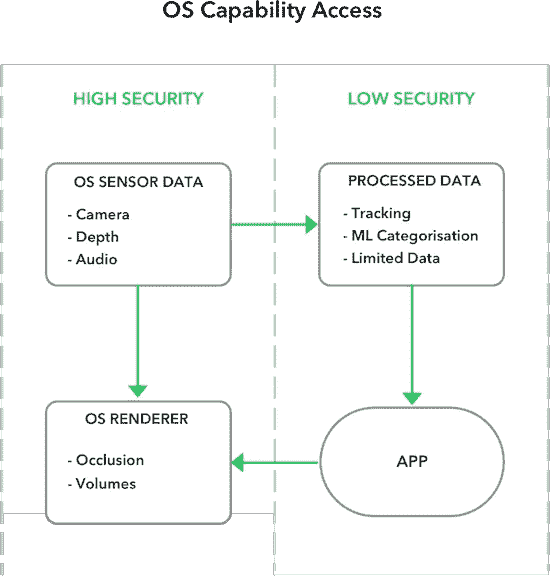

Third-party apps have access to low-security data, but not high-security sensor or render data

默认情况下，标签可以访问由操作系统标准化的小范围的通知/显示方法——当前的一个例子是推送通知如何在移动设备上工作；他们有固定的用户界面设计，他们的行为被限制在操作系统允许的范围内。

标签可以在环境使用模式下请求额外的通知特权，以允许更动态的行为。这允许标签将内容放置在紧邻感兴趣的对象的卷中，或者允许位置标签自动显示。

具有默认权限的旅行标签会弹出一个操作系统提供的文本框，上面写着“在 11 号登机口登机”，而具有更多权限的标签会显示一条通往登机口的发光路径。

面向任务模式的应用程序还可以请求额外的隐私权限，允许访问原始视频、深度和麦克风数据，而不仅仅是默认的位置跟踪数据。

应用程序还可以请求访问完整的环境网格和社交权限，这将允许一些功能，如将某个对象固定在家中，并让家庭成员在同一个地方看到它。

最重要的是，用户必须意识到，在整个访问期间，应用程序可以直接访问传感器数据。在操作系统级别可能需要一个可视指示器——想想现在通用的“红点=记录”。

**机器学习笔记&安全**

机器学习是 AR-OS 的一个强大工具，但也提出了自己的挑战，因为需要完全访问传感器数据，并具有广泛的可能用途。常见的包括识别和标记对象，执行视觉搜索，以及预测用户的需求/行动。

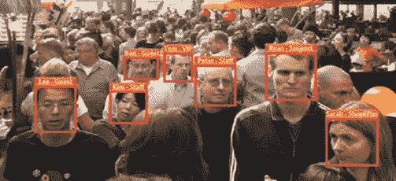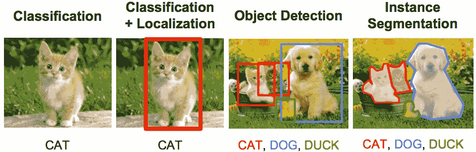

一系列简单、可组合的默认模型包含在操作系统中，可供应用程序使用，并且经过精心设计，不会泄露私人信息。

自定义 ML 模型也可以由第三方创建，但需要操作系统制造商的明确批准。测试这些模型的复杂性和泄露私人数据的高风险表明，这可能不是对公众开放的选项，而是特定的战略合作伙伴。

# 语境

上下文描述了创建一个操作系统级别的用户在那个时刻正在做什么的意识，并适当地转换信息的显示。

当你试图与某人进行真诚的交谈时，卡路里计数、歌曲名称和收到的电子邮件提醒在你的视野中跳跃是一种糟糕的体验。

移动设备通过手机上的“配置文件”——改变通知、铃声音量和振动设置的预设——来管理现实世界的环境。然而，由于这些需要手动设置，这给用户带来了根据他们的位置和动作不断改变设置的负担，这是不合理的摩擦量。

在所有情况下，都需要优先考虑环境中的人；假设用户的注意力集中在他们正在交谈的人身上。在对话过程中，通知需要调低，操作系统的注意力和音量管理需要调到最大。

幸运的是，机器学习可能是一个“足够好”的解决方案。包括面部识别、运动检测、位置标记和对象分类在内的一系列人工智能模型可以作为以上下文为中心的模型(或硬编码决策树)的输入，以确定用户是否正在进行对话。

比如说；面部识别模型报告用户面前有一张脸，运动模型报告用户很可能坐着，音频模型报告正在进行真实的(非视频)对话，位置模型报告环境类似于办公室，对象分类器识别笔、纸和会议桌。根据这些线索，有理由假设用户正在开会，或者至少在工作场所参与讨论，除非有重要的事情，否则不希望被分散注意力。

这里采用的方法可以不同，从硬编码的规则到试图推断用户可用注意力的模糊方法。

AR-OS 适应其行为的一些环境示例:

*   工作
*   吃
*   购物
*   家庭/放松
*   练习
*   睡着的
*   会话
*   浴室
*   通勤

上述情况都对用户有不同的期望:

**专注与探索** -用户对一项任务的专注程度，以及他们对额外信息和可能性的接受程度。

**隐私**——在这种情况下对隐私的合理预期。设备是否应该设置自己的静音模式，或者提示用户设置它。

**导航**——操作系统是否应该对用户的需求敏感，当他们在途中时，需要看到并导航他们要去的地方。

**移动性—** 由于用户是坐着还是自由活动，操作系统是否应该优先考虑对象上的标签&卷在伸手可及的范围内还是在世界的更远处。

**社交** —用户是否与其他人互动，以及这些互动是否不应该被打断。

上下文也可以用来触发某些标签，例如日历和笔记标签可能会在电话中出现，或者在进入火车站时出现最喜欢的路线规划。

**静音模式**

当上下文系统出现故障时，当用户预计到自己的需求时，或者当他们希望确保没有干扰时，他们可以启用“静音模式”。这将完全禁用摄像机、位置传感器和显示器，直到用户恢复它们。

开始时，这不是一个问题，因为用户正在为他们感到舒适的特定任务戴上 AR 眼镜，但一旦用户转向全职佩戴，敏感地处理上下文以及将传感器状态清楚地传达给用户和其他人将变得非常重要。开始时，这可能像戴上/摘下眼镜一样简单。

# 有些地方我可能弄错了

我做了一些潜在的假设，这些假设(如果是错误的)很容易改变 AR-OS 的性质:

## 第三方软件可以在应用商店买到

这个假设是大多数人认为理所当然的，但也是我最不确定的——毕竟 iPhone 本身推出时没有应用商店。第三方代码的复杂性、UX 考虑和隐私暗示使得应用商店对眼镜制造商的吸引力下降；至少在开始的时候。第一款存在安全缺陷、允许远程摄像头访问的眼镜将成为全球新闻事件。

然而，应用商店提供的数十亿美元的收入，以及构成硬件平台的纯粹文化动力，确实使应用商店成为可能，即使这些应用受到权限的严重限制。

## 大问题将通过魔法解决

我已经掩饰了我认为 AR 眼镜的两个最大障碍——社会耻辱和电池寿命。

我不认为美学上的缺陷将是不可克服的(我记得蓝牙耳机刚问世时人们的样子)，但我认为道路将是漫长的，铺着塑料提醒人们时尚本身是一门困难的学科。

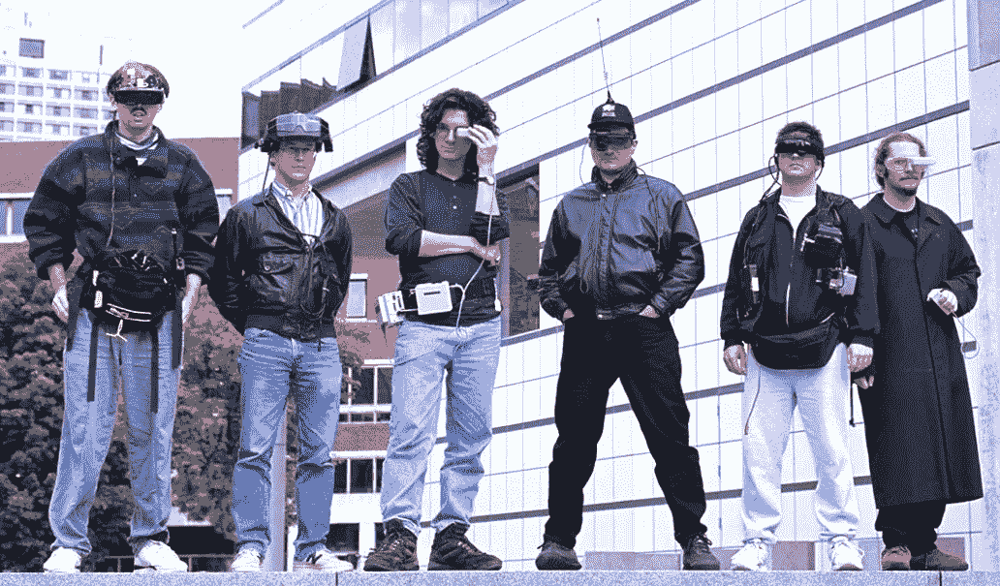

电池寿命是不言而喻的——全天使用根本不可能。直接投射到视网膜上的低能量显示器很有希望，但连续处理 3D 环境仍将是一个昂贵的过程。

# 下一个

在下一部分中，我将介绍到目前为止所讨论的想法是如何在实践中应用的——当应用程序和标签请求资源时会发生什么，UI 是如何划分为关注级别的，以及常见 UI(如通知系统)的线框示例。

我已经触及了一点关于架构、应用、安全和 UX 的内容，但是也跳过了非常大的部分(比如输入),所以请随意指出你认为在评论中遗漏的任何重要内容。