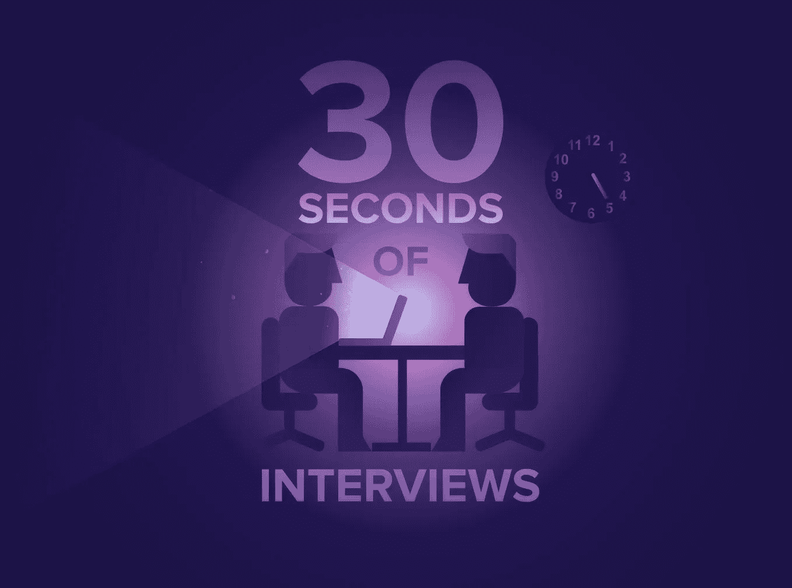
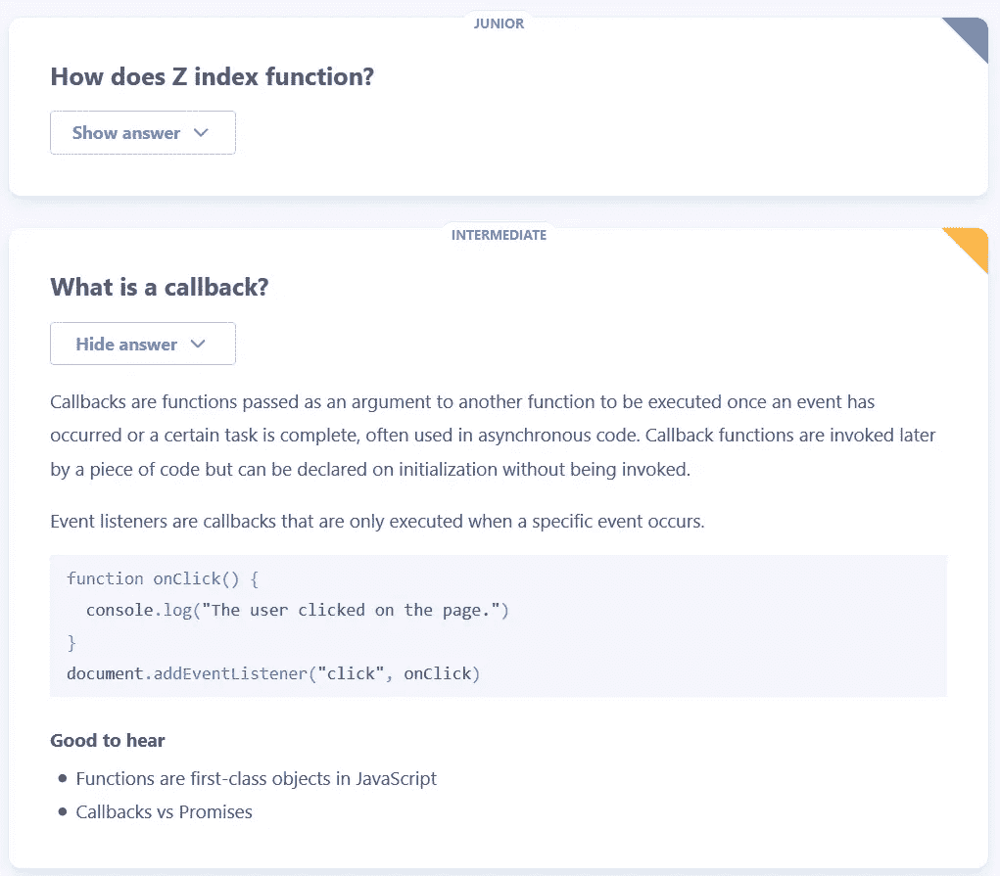
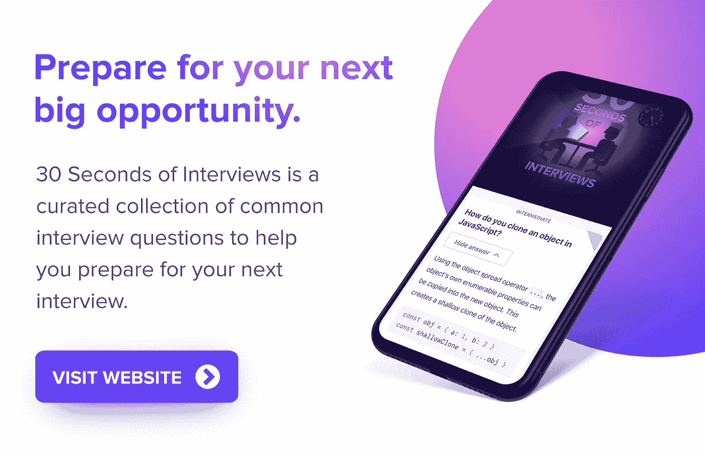

# 用 30 秒的面试时间为你的下一次面试做准备

> 原文：<https://medium.com/hackernoon/prepare-for-you-next-interview-with-30-seconds-of-interviews-fcc6c400826b>

你可能是这个世界上有史以来最优秀的网络开发者之一。或者你有足够的能力找到一份工作并保住它。不管怎样，为面试做准备从来没有坏处。

如果你和我一样，你会从接到面试电话时的极度兴奋，到两分钟后的瞬间恐慌和搜索所有面试问题的模式。寻找准备面试的材料可能会很难，因为你必须设法在很短的时间内浏览大量你已经知道的东西，同时努力寻找相关的最新信息。拥有一个经过适当管理的资源，并以一种可用的格式提供所有信息，这不是很好吗？

[30 seconds of interviews](https://github.com/fejes713/30-seconds-of-interviews) by [Stefan Feješ](/@fejes713).

> 了解一下 [30 秒面试](https://30secondsofinterviews.org/)，常见面试问题精选，将帮助你准备下一次面试！

## 为什么是 30 秒的采访？

我向准备面试的人推荐 30 秒面试有几个原因:

*   由[斯蒂芬·费杰斯](/@fejes713)创作，一个充满激情的 18 岁网络开发者，并得到了 [30 秒代码](https://github.com/Chalarangelo/30-seconds-of-code)背后的团队和社区的支持，30 秒采访承诺为你提供准备采访所需的信息，没有过时的内容、广告和无关的东西。随着时间的推移，将会有更多的内容出现，我们将始终精心策划，尽可能提供最佳的面试准备体验。
*   网站的 UI 非常有用，可以帮助你在需要的时候找到你需要的内容，并理解它。您可以轻松地按类别过滤问题，并按专业知识进行排序。这样你就可以专注于与你相关的内容，而不是阅读一长串不相关的问题。

Questions, answers and their associated metadata.

*   问题有很多相关的有用的元数据，并且很容易获得。专业知识、类别、主要观点的简短列表、其他网站上相关文档的链接都是你在阅读问答时可以立即找到的东西。这为你节省了很多时间去搜索更深入的信息，并试图找出与问题实际相关的内容。
*   整个项目由社区推动，是回馈社区的一种努力。如果你有一个问题和答案想要分享，一个你希望看到实现的特性，一些你认为应该做的改变或者任何有助于改进项目的事情，你可以很容易地前往 [Github 库](https://github.com/fejes713/30-seconds-of-interviews)并加入进来。这也确保了问题质量和相关性将随着时间的推移而保持较高水平。

总的来说，30 秒访谈的优势在于它背后的社区和一个团队为免费提供优质学习资源所做的不懈努力。希望随着时间的推移，这个社区会变得更大，更多的人会为任何想在编程世界找到工作的人提供有价值的信息。

*那么，你还在等什么？马上申请那份你喜欢的工作，开始用* [*30 秒面试*](https://30secondsofinterviews.org/) *为那个大日子做准备。或者，如果你已经有了一份工作，并且感觉像和平其他人一样在你的团队中找到了一份工作，那么就去* [*Github 资源库*](https://github.com/fejes713/30-seconds-of-interviews) *帮助项目正在进行的开发吧！*

如果你喜欢这个项目，一定要在 Github 上发布，这对开发它的人来说意义重大！

Click the image to go to the project’s website.