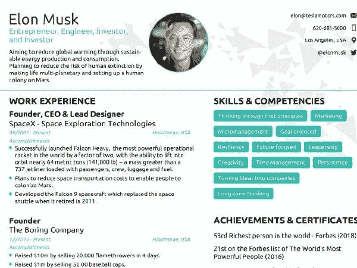

# 使用 your resume 在几分钟内快速轻松地准备您的简历

> 原文：<https://medium.com/hackernoon/prepare-your-resume-quickly-and-easily-in-a-matter-of-minutes-with-novor%C3%A9sum%C3%A9-20e39bf377a9>

Img source: [novoresume.com](https://novoresume.com/resume-templates)

尽管不同的招聘人员可能会通过 LinkedIn 联系你，但他们仍然会索要你的简历。在 LinkedIn 上找到你只是招聘过程的第一步。这就是为什么准备一份你可以使用的简历是很重要的。在准备简历时，新简历是一个非常好的选择。

这是一个非常好的工具，让你有机会在几分钟内准备好你的简历，它的布局简单易用，也非常方便用户。

它附带了您可以使用的可定制模板、可互换的字体、主题和布局。它还带有一个内置的实时内容优化器，可以分析内容、体验和地理位置，为最佳内容提供即时建议。

您可以添加您的形象，联系方式，简短的自我介绍，教育，专业知识，项目和技能。

以下是它的一些核心特性，正如[的首席执行官在 ProductHunt 中对](https://www.producthunt.com/posts/novoresume-2)的描述:

-我们的工具已经提供了所有需要的部分，因此您有更多的时间专注于创建高质量的内容

-布局优化器检查内容是否可读和对齐

-实时反馈将提供提示和示例

-自动同步

-多种语言—所有部分都可轻松定制为首选语言

-招聘人员和雇主批准模板

Novoré sumé是免费的，但是如果你想在简历中使用它，你需要付费。