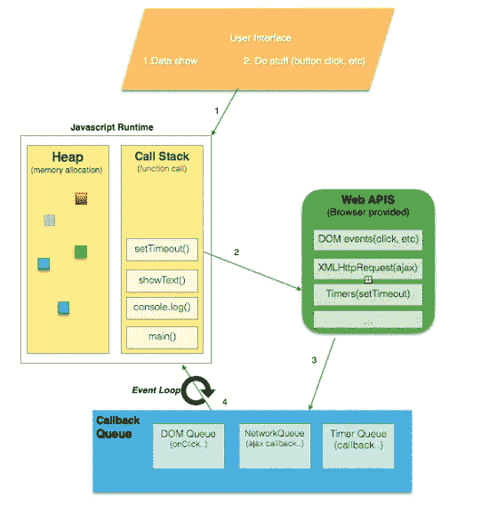
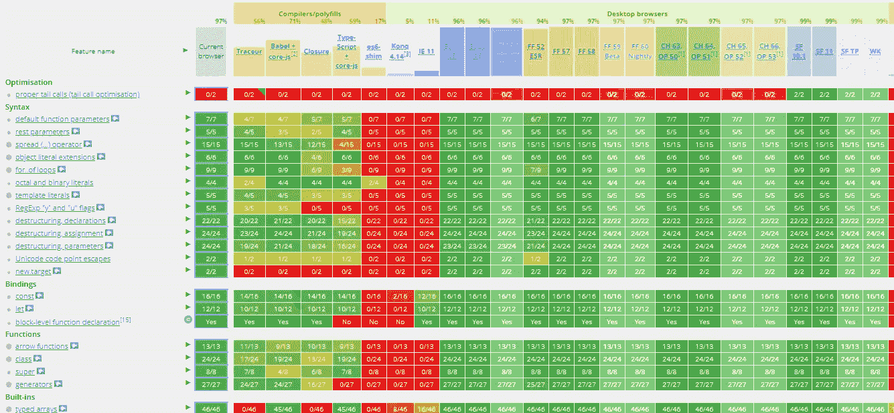

# 为 Web 开发人员面试准备你的技能集—第 1 部分

> 原文：<https://medium.com/hackernoon/prepare-your-skill-set-for-web-developer-interviews-part-1-75f625a37341>


Photo credit for thepitcher.org

***本*条** ***原本出现在***[***dormoshe . io***](https://dormoshe.io/articles/prepare-your-skill-set-for-web-developer-interviews-part-1-25)

不管你现在是不是求职者，作为一名网页开发人员，你都需要知道一些基本的和高级的话题。你需要了解它们，以便开发出具有良好性能和正确技术的高质量产品。

在这篇文章中，我们将回顾我作为一名求职者的经历，并了解为了准备好我们的技能并最大限度地增加获得理想工作的机会而需要学习的最重要的东西。

第 2 部分也可用(最后一部分):

[](https://dormoshe.io/articles/prepare-your-skill-set-for-web-developer-interviews-part-2-26) [## 为 Web 开发人员面试准备你的技能集-第二部分- Dor Moshe 的博客

### 不管你现在是不是求职者，作为一名网页开发人员，你都需要一些基本的和高级的话题…

dormoshe.io](https://dormoshe.io/articles/prepare-your-skill-set-for-web-developer-interviews-part-2-26) 

# **在我们开始之前**

无论你现在是在找工作还是在过去，你肯定记得这个或那些时期。许多恐惧、情绪、欲望、希望和困境。你可以喜欢，也可以不喜欢，但无论如何，你都需要注意一些顾虑，做好这样一个时期的准备。

在我的上一篇文章中，我们讨论了对求职者来说真正重要的一些事情，得到了最大化匹配机会的技巧，并学习了如何为获得理想工作做准备。如果你还没看，**我推荐从那里开始**。

[](https://dormoshe.io/articles/prepare-yourself-for-the-mental-phase-of-searching-your-dream-job-24) [## 为寻找理想工作的心理阶段做好准备

### 无论你现在是在找工作还是在过去，你肯定记得这个或那些时期。一个…

dormoshe.io](https://dormoshe.io/articles/prepare-yourself-for-the-mental-phase-of-searching-your-dream-job-24) 

# 回到基础

准备过程的复杂程度取决于你现在处理 JavaScript、HTML 和 CSS 的程度以及职位要求。理解基础和内部是非常重要的。很多时候，在一个简短的谈话中，很容易明白你不明白的东西。当事情不工作时，CSS 有时会很奇怪。JavaScript 也可能很奇怪，即使一切正常。面试官的目的是看你是如何思考的，你是如何应对棘手的问题的，并根据工作要求了解你对技术的了解程度。

让我们看一个例子。在很多面试中，你会被问到关于**闭包**的问题——这段代码的输出是什么:

```
for (var i = 0; i < 5; i++) {
  setTimeout(() => console.log(i), 1000);
}
```

输出是`5 5 5 5 5`而不是`0 1 2 3 4`。如果我们将使用`**let**` 而不是`**var**` 或者将使用`((j) => { return () => console.log(j); })(i)`—`i`的值将由新函数的作用域参数`j`中的`IIFE`保存。这个小问题非常相关，因为它收集了一些重要的语言概念。

当这个问题被广泛使用时，会有很多像为什么会发生这样的续问。在你的一些解释中，你可以提醒一下**事件循环**——哦，深入到 javascript 如何工作’的重要机制真的是一个很好的观点。

另一个问题可以是‘如何解决这个问题’。也许你知道如何解决这个问题，但是面试官会问你这个问题更多不同的答案。例如，`bind`功能是解决这个问题的解决方案之一，但是还有`apply`和`call`功能。这些功能有什么区别？因此，我们可以继续以各种方式了解 JavaScript 的内部。

# 它是如何工作的

一个好的开发者需要知道语言/技术是如何工作的。为了做出决策，尽我们所能保持良好的绩效和其他指标，以及更多的原因，这是很重要的。你需要知道为什么要使用这项技术，或者有什么其他的选择。这是你需要的实用知识，值得拥有。

## 网络是如何工作的

当你点击浏览器地址栏中的“转到”按钮时发生了什么？你有时会想到它吗？DNS 之类的…是的但是不仅仅是。诚然， [DNS 服务器通过他们的机制](https://www.verisign.com/en_US/website-presence/online/how-dns-works/index.xhtml)在这个过程中工作，但是还有更多部分。该过程包含对 4 个缓存的检查，以找到到正确 IP 的映射。然后，你记得在你的 BSc 学位期间来自讲师的 TCP 握手和 Ack 消息。

> stork 不会获取、加载和呈现页面。作为一名网站开发人员，你需要“知道如何做”

而当 HTML 返回到浏览器后，浏览器会做什么呢？有一个很大的过程[解析和渲染](https://varvy.com/pagespeed/display.html)资源，包括元素、外部和内部脚本和样式。在这个过程中有阻塞操作和类似于`defer`和`async`的服务字。对于放置外部资源标签和脚本的交互来说，这关系到性能和时间。有一个优先级，浏览器真的努力做到这一点。


A Stork and a Baby — photo credit for simplybabyfurniture.com

## JavaScript 是单线程的

好吧，然后呢？你可以想一想，并理解为什么它是如此重要的因素，我们只有一个线程。用起来有什么利弊？NodeJS 适合有很多 **I/O 和异步事件**的开发。是**事件驱动**。因此，像机器学习中那样繁重的同步计算可能不是 NodeJS 的最佳匹配。此外，还有其他已知的语言，如 Java 或 C#。这里每个连接都有一个新线程。知道使用哪一个非常重要。这取决于产品的用例。

## 事件循环、调用堆栈、队列、堆

“它是如何工作的”的另一部分是语言的内部流动和过程——机制。执行的顺序是什么，每个变量保存在哪里，调用栈和队列有什么不同，当你使用`setTimeout`时发生了什么。引领世界的机制是什么，又是如何做到的？当你回答这些问题时，你就理解了 JavaScript 流程。不了解这个机制就不要去参加 JavaScript 职位的面试。**很关键**。



JavaScript Event Loop Visual Representation — [photo credit for](/@gaurav.pandvia/understanding-javascript-function-executions-tasks-event-loop-call-stack-more-part-1-5683dea1f5ec) [Gaurav Pandvia](/@gaurav.pandvia?source=post_header_lockup)

[另一个在面试中最常被问到的热门词汇和事物](http://dmitrysoshnikov.com/ecmascript/javascript-the-core-2nd-edition)是范围、上下文、提升、如何在 ES5 和 prototype 中实现封装。当有人和你聊起他们的时候，你一定要控制住自己。

## 异步—回调、承诺、异步\等待和生成器

JavaScript 开发人员大量使用异步操作。HTTP 请求、调度程序、定时器和 I/O 操作只是异步操作的一部分。这不是语言的另一个属性——这是它的黄油面包。我们可以对新功能的最新发展留下深刻印象，并看到它们的演变。从带有回调地狱的回调到带有承诺地狱的承诺，再到生成器和异步\等待特性。你需要了解这种演变，并知道如何解释它。

## ES6/7/8

JavaScript 正在生产中，但它总是在更新。**采用规范的新特性的过程是非常有条理和从容的**。ECMAScript 是构成 JavaScript 基础的规范。ECMAScript 由 ECMA 国际标准组织在 ECMA-262 和 ECMA-402 规范中标准化。



[ES6 Features — Compatibility & Browser Support](http://kangax.github.io/compat-table/es6/)

[ECMAScript 2017 由 TC39 于 2017 年年中](https://dormoshe.io/articles/the-best-of-2017-on-dormoshe-io-23)正式发布。似乎我们在去年谈论了很多关于 ECMAScript 的内容。不是白来的。ES6 是 JavaScript 世界中最新鲜的事物之一。到处都是。ES6 现在很流行，因为它的改进通过新的语法和创新使开发者的体验更方便。ES 专区中最新的东西是 async\await、arrow 函数、spread 操作符、类结构等等。

## 语义 HTML

即使看不出`div, footer, main and article`之间的视觉差异，背后也有一整个巴别塔。语义 HTML 很重要。这很重要，原因有很多。残障人士使用屏幕阅读器时，语义会影响阅读顺序和可能采取的操作。作为开发人员，这是标准的一部分。很容易处理语义的 HTML 块，而不是 div 中的 div。这有助于一致性和你给访问者的感觉——例如，每一页中的 h2 将具有相同的外观和感觉。

你会发现自己有时会问以下问题

*   把`div`放在一个段落里正确吗？
*   我什么时候需要使用`article`标签？
*   在`main`标签中嵌套一个`main`标签可以吗？
*   上一页和下一页链接的最佳选择是什么— `a`标签还是`button`标签？

**许多类似问题的答案和许多建议**可以在[正式 HTML 规范](https://html.spec.whatwg.org/print.pdf)或 [W3C 网站](https://www.w3.org)中找到。

## Cookies vs 本地存储 vs 会话存储

Cookies、[本地存储和](https://msdn.microsoft.com/en-us/library/bg142799(v=vs.85).aspx)会话存储被广泛使用。几乎你访问的每个网站都使用它们的一部分。它可以用来保存本地首选项，如表列大小、顺序和收藏项目。本地数据(本地和会话存储)影响保存在其上的特定浏览器。如果您想在用户使用的所有浏览器和机器中影响用户，您需要将它保存在服务器中。

Cookies 可用于认证和确保请求的来源是可靠的。除非过期，否则 Cookies 将自动添加到请求中。本地和会话存储不会被添加到对服务器的请求中，它们只在客户端被**访问。会话存储将被保存，直到浏览器中的网站选项卡被关闭。本地存储将保存在浏览器中，供下次使用。**


Different type of storage — photo credit for blog.trustpilot.com

本地存储只能保存字符串键和值，而 cookies 可以保存复杂的对象。这三个都有大小限制。本地和会话存储可以包含高达 5MB 的**，而 cookie**则高达 4KB** 。三者之间有更多的限制和区别。这是一个采访中的常见话题，它可以作为一些问题的答案出现，也可以作为一个直接的问题出现。**

# **结论**

**面试是你可以为之做好准备的事情。这种准备有助于增强你的自信心，并提醒你不常用的话题。建议花点时间去做，但是需要专注。在下一部分，我们将继续看到更多相关和重要的主题，如架构，我会给你一些行动项目和一些来源，使准备工作尽可能简单。**

****

*****您可以关注我的***[***dormo she . io***](https://www.dormoshe.io)***或***[***Twitter***](https://twitter.com/DorMoshe)***阅读更多关于 Angular、JavaScript 和 web 开发的内容。*****