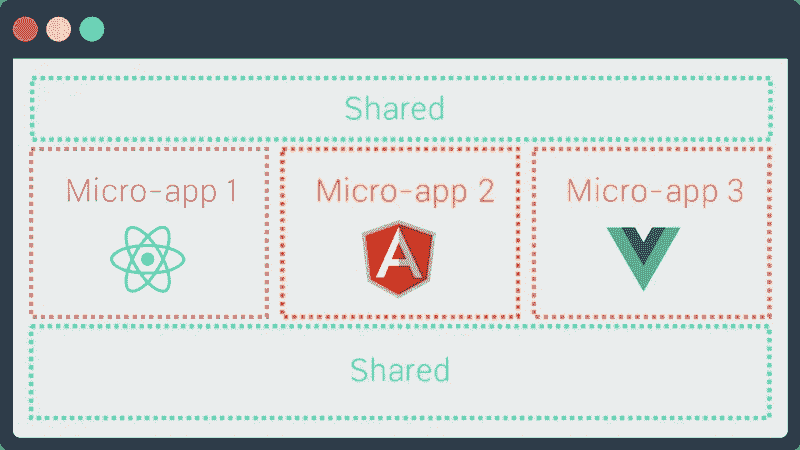
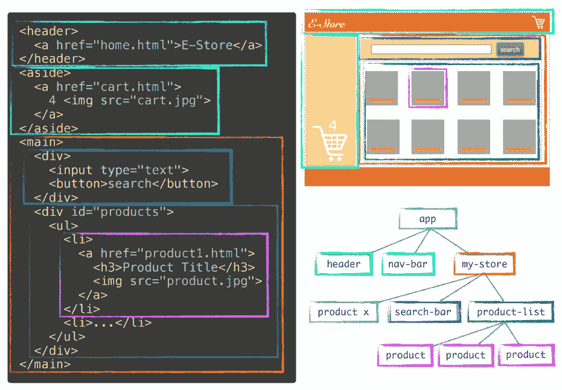
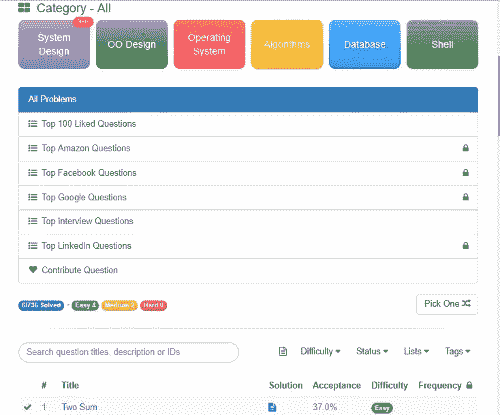
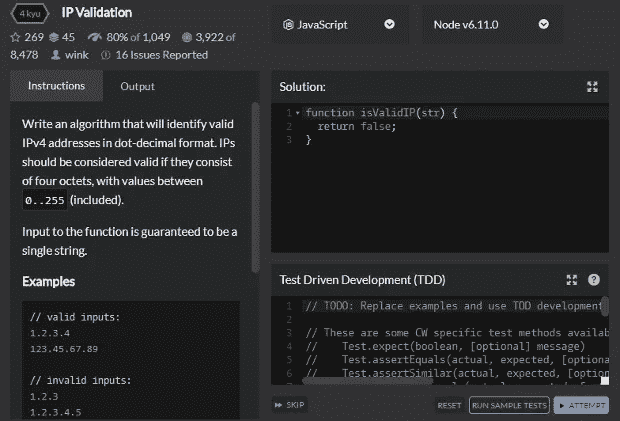
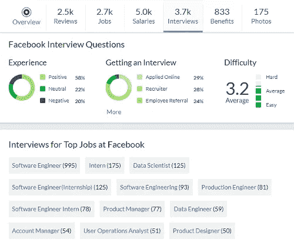

# 为 Web 开发人员面试准备你的技能集—第 2 部分

> 原文：<https://medium.com/hackernoon/prepare-your-skill-set-for-web-developer-interviews-part-2-a8bde7486093>

Photo credit for power-suppliers.info

***本*条** ***原本出现在***[***dormoshe . io***](https://dormoshe.io/articles/prepare-your-skill-set-for-web-developer-interviews-part-2-26?utm_source=medium&utm_campaign=prepare-your-skill-set-for-web-developer-interviews-part-2-26)

不管你现在是不是求职者，作为一名网页开发人员，你都需要知道一些基本的和高级的话题。你需要了解它们，以便开发出高质量的产品，这些产品具有良好的性能并使用最合适的技术。

在这篇文章中，我们将回顾我作为求职者的经历，我们将回顾需要学习的**最重要的事情，以便准备好我们的技能组合和**最大化**获得理想工作的机会。**

# 开始之前

在这篇文章之前有两篇**推荐文章**可以阅读。他们互不依赖。

*   为 Web 开发人员面试准备好你的技能组合— **第一部分**

 [## 为 Web 开发人员面试准备你的技能集-第 1 部分- Dor Moshe 的博客

### 不管你现在是不是求职者，作为一名网页开发人员，你都需要一些基本的和高级的话题…

dormoshe.io](https://dormoshe.io/articles/prepare-your-skill-set-for-web-developer-interviews-part-1-25) 

*   为寻找理想工作的心理阶段做好准备

 [## 为寻找理想工作的心理阶段做好准备

### 无论你现在是在找工作还是在过去，你肯定记得这个或那些时期。一个…

dormoshe.io](https://dormoshe.io/articles/prepare-yourself-for-the-mental-phase-of-searching-your-dream-job-24) 

# 体系结构

面试中最受欢迎的一个问题是“告诉我一些你建立的东西”。这是一个你可以在面试前在家里练习的问题。没有任何准备，有时甚至很难讨论这个请求。你需要选择一个你建造的东西或者一个你知道细节的项目的一部分。你不一定要选择你自己实现的东西，但是

> 随着您对解决方案更多部分的实现和理解，关于它的讨论将会更加容易和自然

当你要求这样做时，你需要画出架构的主要模块。这取决于它有多大。如果它不是很大，你可以画出你选择使用的类，如果有的话。否则，你可以画出**微服务**或者架构的其他部分。最好简短地解释一下**请求和限制**，您根据它们实现了解决方案。你需要能够解释流程的**流程。例如，服务可以服务的 REST APIs。**

面试的这一部分**在某些方面可以进化**。您可能会被要求详细实现解决方案的某些部分。你可能会被要求根据面试官给你的一些新的限制或信息对解决方案提出改进建议。例如，“在您的报告生成的大流程中有一些失败点，您如何应对它们？”或者‘有一个大规模的操作阻碍了其他请求的处理，你能做什么？’。一些答案可以是“实现队列”、“进行预处理”、“添加计划任务”、“添加更多服务实例”等等。

System Design and Flows — photo credit for visusllc.com

正如你所看到的，这一部分是非常动态的，可以飞向许多知识和经验的部分。有了这些，你需要记住这是你可以在面试前练习和学习的东西。我的建议是这样做。思考解决方案，利弊，可能出现的障碍和限制。因此，你对这一部分准备得越充分，你就会越有信心，也就越不紧张。我喜欢采访中的这类角色:)

# 微服务和微前端

当你的团队越做越大，项目中出现的困难就越多。开发人员在同一个代码基础上工作并不容易。出于生产目的，您只需要部署应用程序的某个部分，但是在 monolith 中，您必须部署整个项目。这就是微服务进入你生活的地方。微服务是一种**架构风格**，它将应用程序构建为一组**松散耦合的服务**。这些服务中的每一个都可以专注于应用程序的子域。

这种架构支持大型复杂应用程序的持续交付。它还使组织能够**发展他们的技术栈**，因为每个服务都是一个**自治**并且有一个定义好的 API 用于通信。微服务改善了故障隔离，消除了对单一技术堆栈的长期承诺，并使新开发人员更容易理解应用功能的特定部分。

作为后端的微服务，前端有[微前端](/@tomsoderlund/micro-frontends-a-microservice-approach-to-front-end-web-development-f325ebdadc16)。这些概念给组织带来很多好处。世界在那里行走，许多公司已经在那里。**展示这些话题的知识可以在面试中给你加分**。这可以表明你着眼于大局，而这正是公司所寻求的。但是如果我们正在寻找一个优先级，如果你在更重要的主题上有其他差距，并且你不是一个高级开发人员，我不会把它列为高优先级。所以，即使你不知道，也没关系。很高兴有。

Micro-Frontends — photo credit for [Tom Söderlund](/@tomsoderlund/micro-frontends-a-microservice-approach-to-front-end-web-development-f325ebdadc16)

# 基于组件的体系结构

SPA 和 JavaScript 框架成功地进入了我们的生活。MVC 是许多应用程序的通用架构，但是**有些东西已经被改变了**。2013 年，脸书发布了 **React 库**，重新定义了前端开发者构建应用的方式——[基于组件的架构](https://www.tutorialspoint.com/software_architecture_design/component_based_architecture.htm)。

> 你知道哪个框架并不重要——重要的是你是否理解它们背后的原则

组件将软件元素的功能和行为封装到一个可重用和自部署的二进制单元中。该架构缩短了上市时间，让开发人员的生活变得更加轻松。代码更容易理解。与多个团队一起开发一个应用程序非常方便。它更具可重用性、可替换性、可扩展性和封装性。基于组件的开发不仅仅是网络的未来。这是你现在应该做的，在任何网络应用程序中。

Component-Based Architecture

# 有角的，有角的，反应，反应纤维，Vue

SPA 是近年来网络发展的前沿。你所做的[走廊对话](https://dormoshe.io/articles/10-hallway-conversations-in-2017-about-web-development-9?utm_source=dormosheio&utm_campaign=prepare-your-skill-set-for-web-developer-interviews-part-2-26)的很大一部分是关于主要参与者——角度、反应和 Vue。 **SPA 框架在网络上占主导地位**。因此，它改变了 web 架构、软件课程的教学大纲和高科技招聘需求。

**React 和 Vue 的主要优势之一是虚拟 DOM 机制**。虚拟 DOM 是 DOM 的副本，用于检查当前 DOM 和渲染过程的新输出(新 DOM)之间的差异。React 和 Vue 使用这种机制只渲染真实 DOM 上的差异，因为 DOM 操作开销很大。因此，这是对应用程序性能的巨大提升。

要深入了解的更重要的事实:

*   Angular 有谷歌做后盾。React 得到了脸书的支持
*   React 和 Vue 是**唯一的**视图库**。Angular 是一个整体平台**
*   React Fiber 是 React 核心算法的**再实现**
*   Angular 与 AngularJS 有很大不同，因此它们作为两种不同的技术而受到关注

> 财富和各种各样的技术是网络空间中最棒的事情之一，我们是其中的一部分

知道如何在技术会谈中谈论他们是候选人的优势。**如果你引用博客上的广告语或者你对全局有所了解就很容易理解**。了解这些技术的发展是一个很好的起点。

# 设计模式

设计模式被广泛使用。如果你是一个有角度的开发人员，即使不是，你也可以思考很多你每天使用的设计模式。角度基于**模型-视图-控制器**模式。模块在 JavaScript 中广泛使用，用于保持特定的代码片段独立于其他组件。您使用的 ES6 类和继承是由**原型**模式实现的。服务大多是**单态的**，你通过**依赖注入**机制消费它们。

当您使用某个库并且希望将来能够替换它时，您使用**适配器**模式。Angular 的 HTTP 服务也是一种适配器。RxJS 是 Angular 的依赖项之一。当你使用 RxJS 的 Subject/Observer/Subscribers 时，你正在使用 **Observer** 模式。

> 我真的可以继续下去。设计模式无处不在

这不是留在大学课程里就可以忘记的东西。这是让我们成为优秀开发者的一部分。如果我们正确地使用设计模式，它会使我们的代码更易于维护、阅读和伸缩。我在这里的建议是了解常见的 DPs 和**确保你知道如何实现其中的至少三个**。

# 算法、数据结构和谜语

如果你是一个没有 web 经验的初级开发人员，这一节特别为你准备。当你没有这方面的经验时，大多数问题都集中在大学里学过的话题上。这些主题可能包含各种算法和数据结构问题。我建议**为排序算法**打下良好的基础，比如 TSP、图、树、搜索、递归和动态规划等问题。

你需要知道如何**分析时间和空间的复杂性**并根据面试给你的限制对一些问题的解决方案提出改进建议。大多数时候，你可以用伪代码或者你所知道的一些普通语言来写你的答案，比如 JavaScript、Java 和 C#。为了练习这一部分，您可以查看文章末尾的“行动项目”部分。

# 行动项目

当你继续阅读时，你可能会收集到一些你不太熟悉的流行词汇、术语和话题。将它们写在便笺上，并通过我在上面的段落中附上的**链接开始研究它们。在设计模式领域，确保你知道如何实现至少三种模式。**

## Leet 代码

[LeetCode](https://leetcode.com/) 的目的是为你提供真实编码面试问题的动手训练。在线裁判会对你的算法的正确性和效率给出即时反馈，这有助于获得良好的学习体验。LeetCode 帮助你提高编程技能，并快速找到工作。这是扩展你的知识面和为下一次面试做准备的最好地方之一。你可以在很多主题上找到问题，包括面向对象设计、操作系统、算法和数据库。

Leetcode

## 代码战争

[Codewars](https://www.codewars.com) 是一个开发人员社区，被称为代码战士(或者仅仅是战士)，他们接受**培训来提高他们的开发技能**。把它想象成一个编码道场——开发人员在那里互相训练，互相帮助，通过实践变得更好。Codewars 目前支持 21 种语言，包括 Go、Clojure、Haskell 和 Typescript，以及 11 种测试版语言，包括 Kotlin、Groovy、R 和 Scala。

Codewars

## 玻璃门

[玻璃门](https://www.glassdoor.com/index.htm)是我最喜欢去**找工作的地方**。你可以从现在和以前的员工那里看到各种公司的汇总信息、排名、评论和薪水。此外，你可以在一个很棒的用户体验中找到数百家公司的求职面试问题。我推荐你进入**练习你在那里面试的公司的相关问题**。我也推荐练习[脸书面试问题](https://www.glassdoor.com/Interview/Facebook-Interview-Questions-E40772.htm)——有很多而且很有趣。

Glassdoor

# 结论

面试是你可以做好准备的事情。这种准备可以帮助你提高自信心，还可以提醒你不常用的话题。建议花点时间去做，但是需要保持专注。

***您可以关注我的***[***dormo she . io***](https://dormoshe.io?utm_source=dormosheio&utm_campaign=prepare-your-skill-set-for-web-developer-interviews-part-2-26)***或***[***Twitter***](https://twitter.com/DorMoshe)***阅读更多关于 Angular、JavaScript 和 web 开发的内容。***