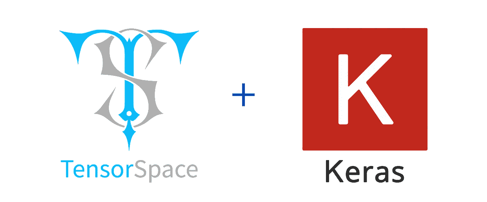
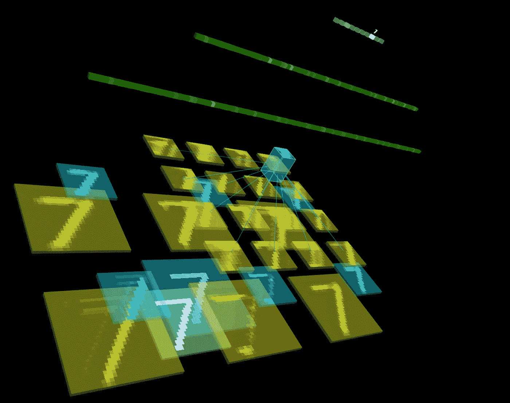
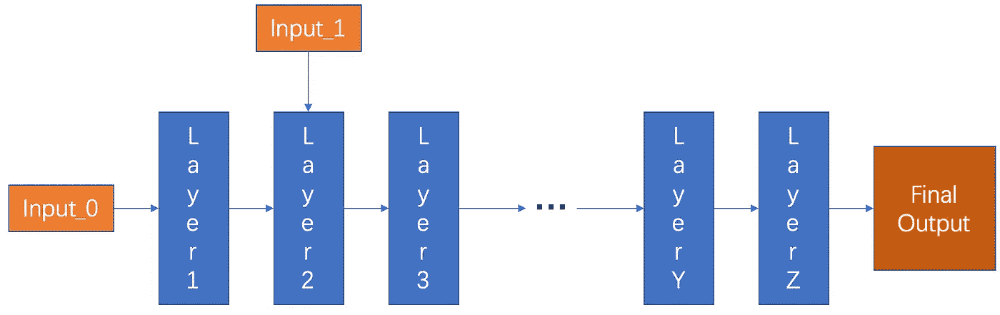
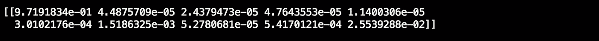
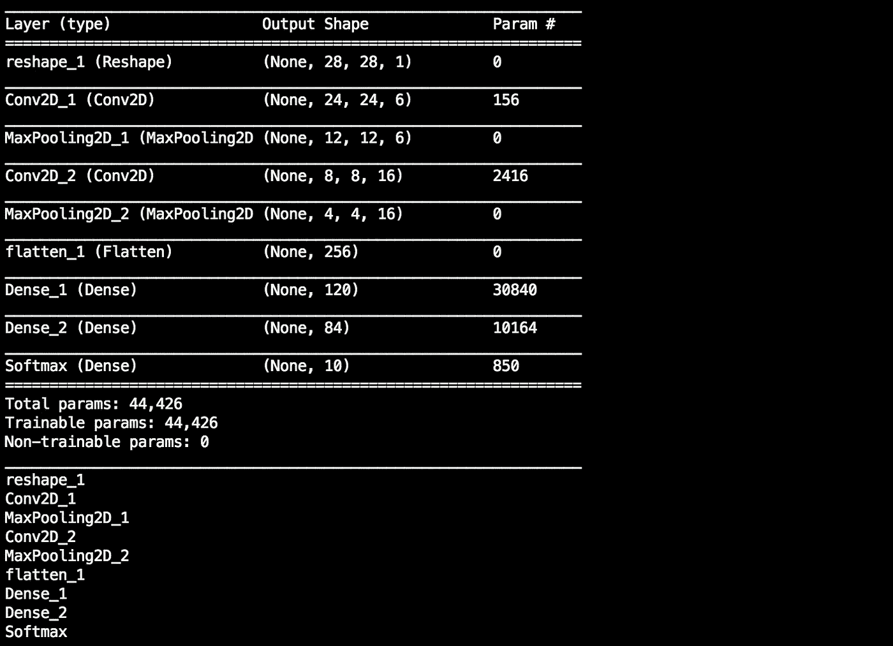
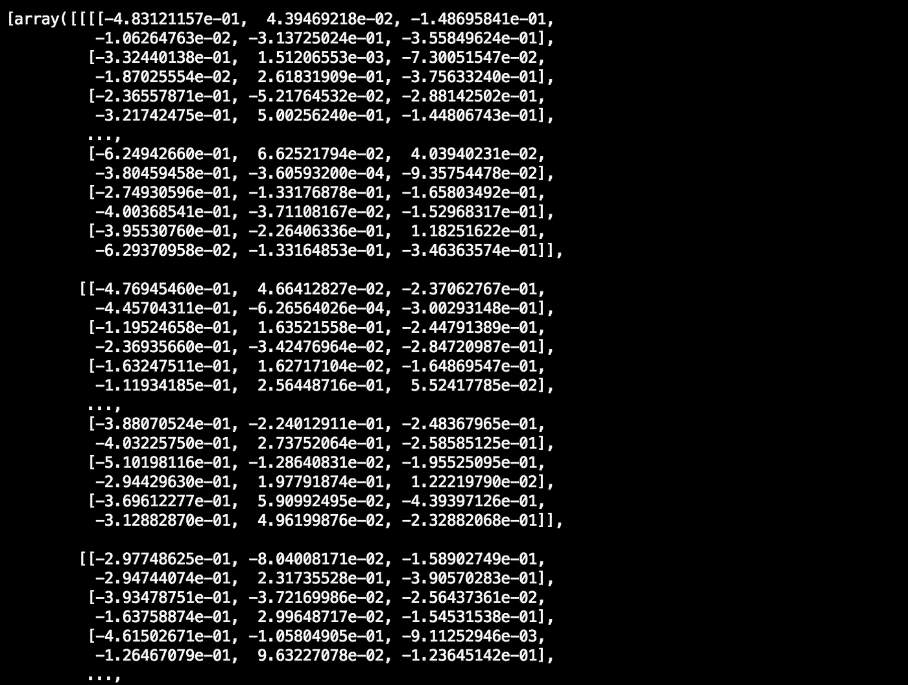
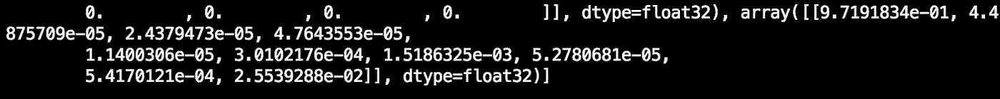
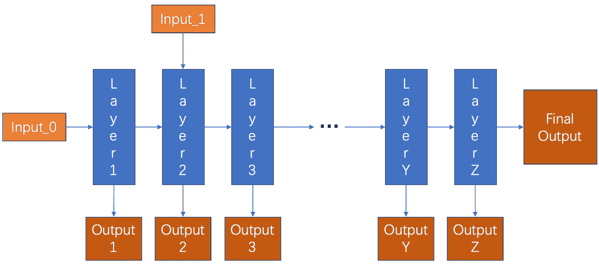

# 张量空间预处理 Keras 模型

> 原文：<https://medium.com/hackernoon/preprocess-keras-model-for-tensorspace-ed5e4db9a2a1>

## 神经网络三维可视化中 Keras 模型的张量空间兼容预处理



TensorSpace & Keras

*“tensor space 是一个神经网络 3D 可视化框架。— TensorSpace.org"*

*“Keras 是一个高级神经网络 API。— keras.io "*

# **简介**

你可能会了解到[张量空间](https://tensorspace.org/)可用于三维可视化神经网络。你可能看过我之前关于 TensorSpace 的[介绍。也许你会发现模型预处理有点复杂。](https://medium.freecodecamp.org/tensorspace-js-a-way-to-3d-visualize-neural-networks-in-browsers-2c0afd7648a8)

所以今天，我想详细谈谈张量空间的模型预处理。更具体地说，如何对 Keras 构建的深度学习模型进行预处理，使其与张量空间兼容。



**Fig. 1** — Use TensorSpace to visualize an LeNet built by Keras

# **我们应该拥有什么？**

为了使 Keras 构建的模型与张量空间兼容，我们需要模型满足两个关键点:

*   支持来自中间层的多个输出。
*   支持浏览器友好的 TensorSpace 兼容格式。

在接下来的部分中，我将以 LeNet 为例介绍预处理 Keras 模型的工作流程。

为了继续这个过程，我假设我们已经建立了一个适当的 Python 环境:

*   Python 3.6
*   导入 keras 和 numpy
*   已安装 tfjs 转换器。

你可以在 [TensorSpace 预处理 Keras 目录](https://github.com/tensorspace-team/tensorspace/tree/master/docs/preprocess/Keras)中找到例子中的所有资源，包括:

*   预处理 Keras 模型的源代码([src _ py](https://github.com/tensorspace-team/tensorspace/tree/master/docs/preprocess/Keras/src_py)&[src _ sh](https://github.com/tensorspace-team/tensorspace/tree/master/docs/preprocess/Keras/src_sh))
*   [模型 _ 之前 _ 预处理](https://github.com/tensorspace-team/tensorspace/blob/master/docs/preprocess/Keras/models/keras_model.h5)
*   [模型 _ 后 _ 预处理](https://github.com/tensorspace-team/tensorspace/tree/master/docs/preprocess/Keras/models/tfjs_model)

训练样本 LeNet 模式的源文件可以在 [keras_model.py](https://github.com/tensorspace-team/tensorspace/blob/master/docs/preprocess/Keras/src_py/keras_model.py) 中找到。您还可以尝试使用您自己的模型，该模型应该是有效的，并且可以正确处理样本输入数据。

# **在预处理之前，我们从模型中得到什么？**

在预处理之前，预训练的 LeNet 模型实际上是一个黑盒:它由一个 28x28 的图像提供，然后返回 10 个双精度值的列表。每个双精度数代表一个数字从“0”到“9”的概率。



**Fig.** 2 — Classic pre-trained model with single output

我们可以加载模型并执行预测，如下所示:

```
model = load_model("/PATH/TO/OUTPUT/keras_model.h5")
input_sample = np.ndarray(
    shape=(28,28), 
    buffer=np.random.rand(28,28)
)
input_sample = np.expand_dims(input_sample, axis=0)
print(model.predict(input_sample))
```

我们使用一个 28x28 的 numpy 数组来模拟一个随机的输入图像。示例输出如下所示:



**Fig.** 3 — Single list prediction output from trained model

如果模型预先训练得很好，它就足以用作应用程序——我们只需要添加一个手写输入面板和一个适当的输出函数来显示预测。

然而，就像“魔术”一样，人们很难了解模型预测的过程，因为输入和输出之间存在差距。预处理实际上是一种从间隙中暴露“魔术”的某些部分的方法。

# **张量空间的预处理是什么？**

张量空间的模型预处理是这样的过程:

*   检测必要的数据
*   从隐藏层提取中间输出
*   转换为 TensorSpace 兼容的模型格式

在将模型应用到张量空间框架之前，应该完成这一系列动作。张量空间的预处理是满足张量空间基本要求的途径。从预训练的深度学习模型收集的数据用于渲染张量空间可视化模型。

# **如何预处理一个 Keras 模型？**

从一个`model.summary()`的调用，更容易查到每一层的信息。



**Fig.** 4 — Model summary and layer names

例如，我们希望收集所有图层名称。

```
output_layer_names = [
    "Conv2D_1", "MaxPooling2D_1", "Conv2D_2", "MaxPooling2D_2", 
    "Dense_1", "Dense_2", "Softmax"
]
```

接下来，我们希望基于原始模型和我们刚刚收集的图层名称构建一个新模型。

```
def generate_encapsulate_model_with_output_layer_names(model, 
    output_layer_names):
    enc_model = Model(
        inputs=model.input,
        outputs=list(map(
            lambda oln: model.get_layer(oln).output,
            output_layer_names
        ))
    )
    return enc_modelenc_model = generate_encapsulate_model_with_output_layer_names(
    model, 
    output_layer_names
)enc_model.save("/PATH/TO/ENC_MODEL/enc_keras_model.h5")
```

然后，我们可以使用新的封装模型来检查最后的预测是否像以前一样有效。

```
input_sample = np.ndarray(
    shape=(28,28), 
    buffer=np.random.rand(28,28)
)
input_sample = np.expand_dims(input_sample, axis=0)
print(enc_model.predict(input_sample))
```

封装后的模型返回一个很长的输出列表，它代表了我们的“output_layer_names”列表中中间层的结果。



**Fig.** 5 — Multiple list outputs after preprocessing

最后一个输出是一个大小为 10 的 double 列表，它表示 LeNet 模型的原始输出。



**Fig.** 6 — Last list output is the same as the original inferences

最后，我们可以使用 tfjs-converter 将 Keras 模型转换为 TensorFlow.js 模型，TensorSpace 可以直接使用它。

```
tensorflowjs_converter \     
    --input_format=keras \     
    /PATH/TO/ENC_MODEL/enc_keras_model.h5 \     
    /PATH/TO/OUTPUT_DIR/
```

# **预处理之后，我们对封装模式有什么期待？**

预处理之后，我们应该有一个模型:

*   包含原始模型中的所有内容
*   能够从中间层提供数据输出
*   是张量空间兼容的格式

来自中间层的数据可以由张量空间收集，并用于在张量空间模型中渲染可视化对象。



**Fig.** 7 — TensorSpace compatible model with intermediate outputs

最后，我们可以将预处理后的模型应用到张量空间进行可视化！

[*CodePen*](https://codepen.io/syt123450/pen/667a7943b0f23727790ca38c93389689/)*中的视图。*

# **结论**

张量空间预处理是应用张量空间 API 的重要步骤。可以在预处理之后收集用于呈现 3D 可视化的必要中间数据。

现在，我们可以从深度学习模型中收集更多的数据。下一步是如何明智地使用和分析来自中间层的数据。数据可视化可以是一种观察数据的方式，这可能需要一些工具，例如 TensorSpace。

有关 TensorSpace.js 的更多信息，请查看:

*   预处理教程:[简介](https://tensorspace.org/html/docs/preIntro.html)、 [TensorFlow](https://tensorspace.org/html/docs/preTf.html) 、[Keras](https://tensorspace.org/html/docs/preKeras.html)&[tensor flow . js](https://tensorspace.org/html/docs/preTfjs.html)
*   官方网站:[TensorSpace.org](https://tensorspace.org/)
*   GitHub 资源库:[tensor space-Team/tensor space](https://github.com/tensorspace-team/tensorspace)