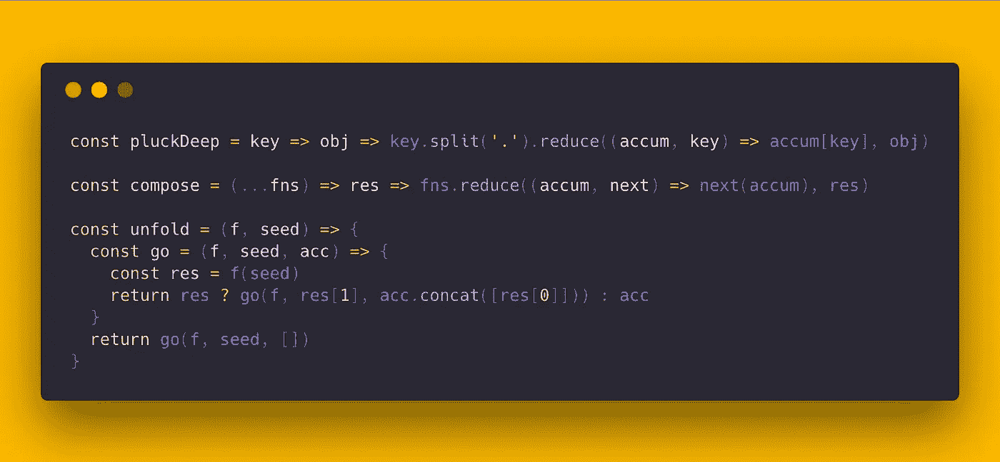
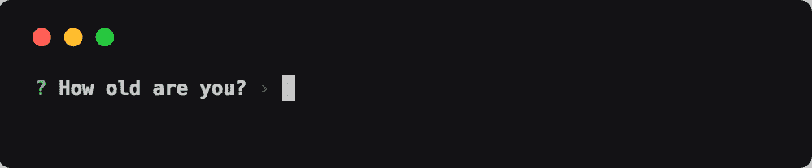

# 让你的代码变得漂亮

> 原文：<https://medium.com/hackernoon/presenting-your-code-beautifully-fdbab9e6fb68>

共享代码片段和截屏的最佳技术将有助于推动您的开源项目走向成功。

Animation Credit: [CSS-only coding animation](http://chrisdermody.com/css-only-coding-animation/) by [Chris Dermody](http://chrisdermody.com/)

创建你自己的开源项目会非常有回报，但是很难打破噪音，让其他开发者信任和使用你的软件。通过遵循[常见的最佳实践](https://opensource.guide/)，比如包含可靠的文档、添加单元测试、集成面向开源项目的 CI/CD(比如 [travis-ci](https://travis-ci.org/) 或 [circle-ci](https://circleci.com/) )，以及执行一致的风格惯例，你可以获得很多优势。

我发现让开源项目真正脱颖而出的最有效和最简单的方法之一是**添加高质量的截图或动画演示**。每当我看到这种对细节的关注，这不仅向我证明了作者关心项目，而且这是传达项目实际做什么的绝对最快的方式。

> 一张图胜过千言万语。—老生常谈，说这完全相关

包括高质量的截图和演示正成为我称之为**开发者 UX** 的越来越重要的一部分，这是一个潜在的开发者从考虑将你的项目作为一个依赖项添加到成功的集成和未来的维护中所采取的流程。

为此，我们将着眼于三个常见的用例，以提高媒体开源项目的开发人员 UX:

*   静态代码片段(图像)
*   动画代码演示(gif 或动画 SVG)
*   项目截屏(视频)

# 静态代码片段

共享少量的静态代码无疑是这个列表中最常见也是最重要的用例。每个开源项目的自述文件都应该包含一些容易解析的*示例用法*片段，所以让我们从那里开始吧。

## GitHub 风格的降价片段

在最简单的一端，GitHub 允许在 markdown 代码片段中突出显示[语法。希望这种嵌入风格对您来说是熟悉的，如果不是，我肯定会推荐从这里开始。](https://guides.github.com/features/mastering-markdown/)

Javascript snippet embedded in markdown from one of my favorite npm modules, [p-map](https://github.com/sindresorhus/p-map) by [sindresorhus](https://sindresorhus.com/).

## GitHub Gists

上面的代码片段还提供了一个非常流行的通过 [GitHub Gists](https://help.github.com/articles/about-gists/) 共享静态代码片段的例子，它有以下优点:

*   可链接
*   支持版本控制
*   通过评论支持讨论
*   语法突出显示

## 碳

Markdown snippets 和 GitHub gists 都很有用，但是如果你真的想让你的代码流行起来，那么只需要看看 [Carbon](https://github.com/dawnlabs/carbon) 就行了。

Image Credit: [Carbon](https://github.com/dawnlabs/carbon)

Carbon 是一个非常受欢迎的开源项目，它允许您轻松地创建美观的代码截图，以及大量的定制选项和社区插件。这是一个很好的选择，可以让英雄形象在你的自述文件中脱颖而出，增加在社交媒体上的参与度，或者撰写像这样的工程相关博客帖子😛。

# 动画代码演示

包含一个高质量的内联演示，快速展示你的项目的核心用例，这是我必须给出的最重要的建议。

然而，创建这些类型的演示有很多不同的方法，所以我想在这里讨论一下我发现的最好的方法。

> [**asci NEMA**](https://asciinema.org/)是一款免费工具，让你以正确的方式记录和分享你的终端会话。

[**asci NEMA**](https://asciinema.org/)提供了一种轻量级的、纯粹基于文本的终端录制方法，允许您进行无损录制，然后可以直接共享或渲染为动画 SVG、动画 GIF 或视频。GitHub 上有这么多流行的开源项目使用 Asciinema，这让我很惊讶——我强烈建议去看看。

Example Asciinema screencast converted to a GIF (credit: [create-react-library](https://github.com/transitive-bullshit/create-react-library)) Note that the quality of this embedded GIF is much lower than the animated SVG in the linked [readme](https://github.com/transitive-bullshit/create-react-library) as discussed below.

## 动画 SVG 还是 gif？

我们都知道 gif 是一种非常低效、有损的格式，但是让我们更深入地研究一下这个特殊的用例。

将上面嵌入的截屏 gif 与来自[自述文件](https://github.com/transitive-bullshit/create-react-library)的相同截屏的动画 SVG 进行比较。很难并排嵌入内联比较，但动画 SVG**明显更清晰、更小**，73kb，而低质量 GIF 只有 4.4MB。

那为什么还要讨论这个？嗯，你不能在一篇中型博客文章中包含自定义 HTML，不是吗？就此而言，有很多地方使用自定义动画 SVG 是行不通的，在可预见的未来，gif 将作为这些用例的后备。但是开源作者，请考虑在你的 GitHub 项目中使用动画 SVG 而不是 gif！

GitHub 上有一些非常受欢迎的开源项目已经开始在他们的演示中使用更高效的动画 SVG，例如 [create-react-app](https://github.com/facebook/create-react-app) ，但总的来说，你会发现 gif 更加常见。

Examples of using the excellent [svg-term-cli](https://github.com/marionebl/svg-term-cli) to generate our lossless animated SVG.

值得注意的是，当讨论动画 SVG 时，我们实际上是在谈论将 HTML 片段嵌入到 GitHub 风格的 markdown 中，该 HTML 片段链接到以每一帧作为 SVG 组编码的 SVG 文件以及通过 CSS 关键帧定义的动画(例如 SVG [source](https://raw.githubusercontent.com/transitive-bullshit/create-react-library/master/media/demo.svg) )。

Insert this HTML snippet into any GitHub-flavored markdown file to embed the linked animated SVG with optimal sharpness and low size overhead compared with a comparable GIF.

作为参考，这里是来自 [create-react-library](https://github.com/transitive-bullshit/create-react-library) 的截屏，我们已经用几种不同的格式作为例子:

*   原版[字幕](https://asciinema.org/a/167645)
*   使用 [svg-term-cli](https://github.com/marionebl/svg-term-cli) 创建的高质量[动画 SVG](https://camo.githubusercontent.com/3f38f2bacbc1a6b49a5172232e8a4ccb9f10173f/68747470733a2f2f63646e2e7261776769742e636f6d2f7472616e7369746976652d62756c6c736869742f6372656174652d72656163742d6c6962726172792f6d61737465722f6d656469612f64656d6f2e737667)
*   用 [asciicast2gif](https://github.com/asciinema/asciicast2gif) 创建的低质量 [GIF](https://cdn-images-1.medium.com/max/1600/1*6XX4DHE0HSHrGjiLFxmigQ.gif)

## 捕捉和优化 gif

Asciinema 非常适合基于终端的记录，但是如果您想记录一个 UI 组件或网站呢？嗯，我在这里的第一个也是最重要的答案是，如果可能的话，在你的项目旁边总是包括一个可用的演示，尤其是如果它是一个前端 web 项目。GitHub [Page 的](https://pages.github.com/)免费托管真的很容易上手！

如果你确实想包含一个 GIF，我建议使用 [GIPHY Capture](https://giphy.com/apps/giphycapture) 或 [Kap](https://getkap.co/) 来记录你的屏幕并输出一个 GIF。或者，如果你有从其他来源录制的视频，我建议使用 [Gifski](https://github.com/sindresorhus/gifski-app) 将视频转换为尽可能优化的 GIF，以便于嵌入。

Example of embedding a GIF into GitHub-flavored markdown files. (see the resulting gif below)

Quality demo GIF embedded in readme using the snippet above. (image credit: [prompts](https://github.com/terkelg/prompts) by [terkelg](https://github.com/terkelg))

# 项目截屏

如果您的项目变得越来越复杂，或者您正在向更广泛的受众推出您的项目，那么包含演练视频确实可以帮助用户入门和支持。

## 屏幕流

我的 go-to 屏幕录制软件是 [ScreenFlow](https://www.telestream.net/screenflow/overview.htm) ，129 美元的价格并不便宜，但它为你提供了许多功能强大、质量上乘的工具，包括精确的矩形屏幕录制、视频和音频轨道混合、音频画外音、过渡效果等等。这种截屏比我们之前看到的截屏和终端会话记录要复杂得多。

Example of a product walkthrough I made with ScreenFlow for my startup, [Automagical](https://automagical.ai/).

# 结论

开发人员 UX 对于推广和营销你的工作非常重要，这反过来会导致非常真实的后果，因为你的开源贡献引起注意肯定是获得恶名和作为软件工程师获得大量工作机会的最佳方式之一。

我希望我介绍的一些技术能够帮助您推广您的开源项目。如果你觉得这篇文章很有用，并最终创建了一个时髦的截图或动画演示，添加一个链接到你的项目的评论，让我知道！

当然，和往常一样，不要忘记以漂亮的编码演示的形式传播❤️…！

## 在你走之前…

*如果你喜欢这篇文章，点击👏下面，并与他人分享，这样他们也可以享受它。*