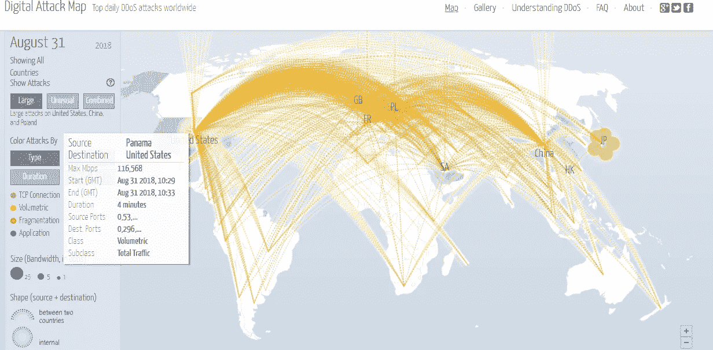
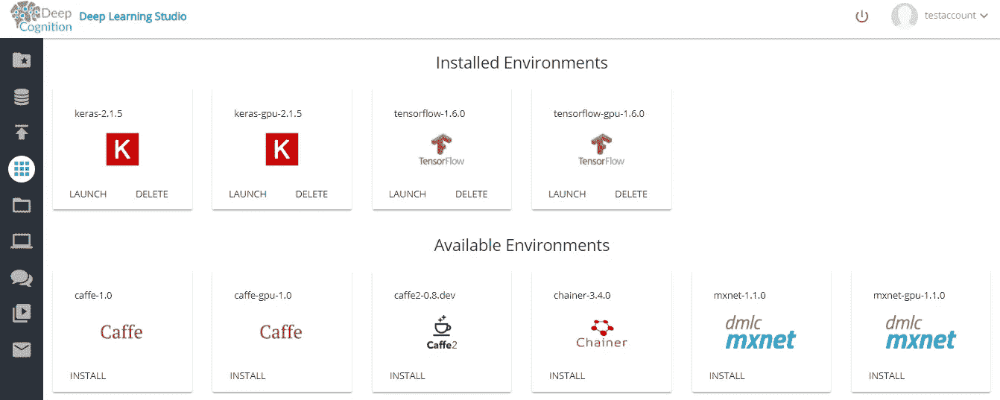

# 用带代码的 AI 防止物联网僵尸网络攻击。

> 原文：<https://medium.com/hackernoon/prevent-iot-botnet-attacks-using-ai-with-code-3817fb3fcf7e>

如果我说你的物联网设备在欺骗你呢？

> **僵尸网络**

僵尸网络是由“牧人”(僵尸网络的所有者)控制的受损系统的“互联网”。在您的系统中运行的任何类型的恶意软件都可能危及系统安全，并允许他人控制您的系统。你可能看起来工作正常，但实际上可能不是！

**Botnet attacks on Aug 31,2018 on USA from different parts of the world**

你也可以在看完这篇文章后观看我的视频，对利用 AI 防范僵尸网络攻击有更清晰的认识。

> **物联网僵尸网络:**

受损物联网设备的互联系统。这些可能包括受损的闭路电视摄像头，手机，空调..等等。

> **僵尸网络能做什么**

*   窃取并向他人发送您的个人数据。
*   删除您的数据
*   你会被你的设备监控！
*   您可能会完全失去对设备的访问权限。
*   发起攻击:僵尸网络可以产生巨大的流量淹没目标。这些洪水可以通过多种方式产生，例如向服务器发送超过其处理能力的请求，或者让计算机向受害者发送大量数据。一些攻击非常大，以至于可以耗尽一个国家的国际带宽容量。
*   可以用来影响政治事件

> **一些臭名昭著的僵尸网络**

*   **Bashlite** :又名 Gayfgt，发现于 2014 年，这个僵尸网络控制了超过 10 万台电子设备
*   **Mirai 未来组合**:2016 年，这个僵尸网络攻击了 OVH 的 Krebs，Dyn 产生了超过 1Tbps 的流量，引起了全世界的关注！。

# **数据集信息:**

我们将使用逻辑回归来解决这个问题。

所使用的数据集包含 75000+个样本，输出为 0/1。0 表示来自物联网设备的数据不是任何类型的攻击。1 表示它可能是 tcp/ip 泛滥、垃圾邮件/垃圾数据。

我从 UCI 机器学习库下载了数据集，并用于本研究论文。

 [## [1805.03409] N-BaIoT:使用深度自动编码器对物联网僵尸网络攻击进行基于网络的检测

### Y.梅丹、m .博哈达纳、y .马托夫、y .米尔斯基、d .布莱滕巴赫、a .沙卜泰和 y .埃洛维奇-恩-拜奥特:基于网络的……

arxiv.org](https://arxiv.org/abs/1805.03409) 

数据集包含 115 个要素，因此我不会解释每个要素是什么，而是解释这些要素是如何生成的。

**属性信息:**
**H** :统计总结最近从这个包的主机(IP)来的流量
**HH** :统计总结最近从这个包的主机(IP)到这个包的目的主机的流量。
**HpHp** :统计总结最近从该数据包的主机+端口(IP)到该数据包的目的主机+端口的流量。示例 192 . 168 . 4 . 2:1242->192 . 168 . 4 . 12:80
**HH _ JIT**:总结从该数据包的主机(IP)到该数据包的目的主机的流量抖动的统计信息。

这些统计数据
**L5、L3、L1、L0、L0.1** 中捕获了流的多少最近历史

*   从包流中提取的统计量:
    weight:流的权重(可以看作是最近历史上观察到的项数)
    **mean** :两个流的均值。
    **std** :两个流的标准差。
    **半径**:两个流的方差的平方根之和。
    **幅度**:两个流的平方根之和’表示
    **cov** :两个流之间的近似协方差
    **pcc** :两个流之间的近似协方差

> **平台:**

我使用**深度学习工作室**的 Jupyter 笔记本在这个数据集上训练我的模型。它实际上预先配置了所有的 ML/DL 框架。如果你不知道，请看看这个。

 [## 鸢尾属分类|DeepCognition| Azure ML studio

### 界:植物界分支:被子植物目:天冬目:鸢尾科亚科:环烯醚萜族:环烯醚萜属:鸢尾

towardsdatascience.com](https://towardsdatascience.com/iris-genus-classification-deepcognition-azure-ml-studio-4b930f54435a) 

**Different Environments on Deep Learning Studio**

# **代码:**

感谢您抽出宝贵的时间阅读我的文章。如果你真的喜欢它，请分享并鼓掌👏。

请订阅我的 [**YouTube 频道**](https://www.youtube.com/user/rajat4031/videos?view_as=subscriber) 关注我上 [**中**](/@maniksoni653) 和 [**LinkedIn**](https://www.linkedin.com/in/maniksoni) 。

快乐深度学习。

**Youtube channel**

 [## 马尼克索尼培养基

### 阅读媒介上的 Manik Soni 的作品。机器学习研究员。每天，Manik Soni 和成千上万的其他人…

medium.com](/@maniksoni653)  [## Manik Soni -机器学习实习生-Ace2three.com 印度信息技术有限公司负责人| LinkedIn

### 查看 Manik Soni 在全球最大的职业社区 LinkedIn 上的个人资料。Manik 有 3 个工作列在他们的…

www.linkedin.com](https://www.linkedin.com/in/maniksoni)