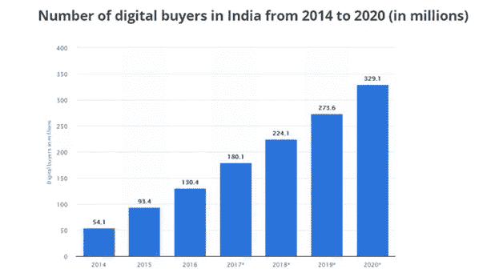
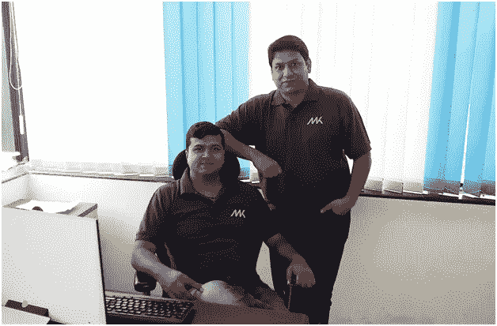
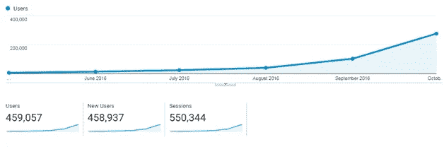
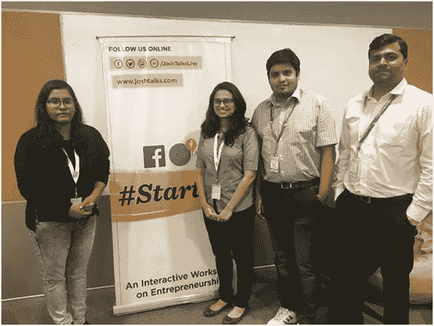
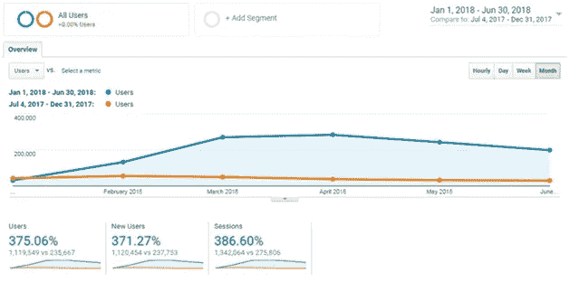
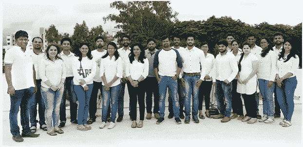

# Pricekart 的创业故事

> 原文：<https://medium.com/hackernoon/pricekart-s-startup-story-bb008acd5f89>

[Pricekart.com](https://www.pricekart.com/)

就网上购物而言，过去几年是印度的一个转折点。我们生活在一个数字世界，事物在不断发展。互联网几乎已经取代了我们买卖产品的方式。人们更喜欢在舒适的家中购物，而不是逛商场或商店。早在 2015 年，印度的网上购物就开始蓬勃发展，这都要归功于电子商务巨头 Flipkart、亚马逊和 Snapdeal。根据 Statista 的数据，[网上购物增加到 9340 万买家，](https://www.statista.com/statistics/251631/number-of-digital-buyers-in-india/)与 2014 年相比增长了约 40%。

由于每个在线商店都有各种各样的产品，在线购物者在做出购买决定之前必须访问多个电子商务网站，比较价格，阅读评论。正是在这段时间里，Ruturaj 意识到了通过多个网站寻找单一产品的繁琐。甚至价格比较网站也没能提供产品的实时价格。这成为网上购物者选择他们在网上看到的第一样东西的主要原因，最终花费超过他们应该花费的。这是一家名为“Pricekart”的印度初创公司的开端。

在完成毕业后的过程中，批量伙伴 Ruturaj Kohok 和 Nitin Nagar 意识到买家在网上找到最佳交易和最低价格的产品所面临的挑战。凭借他们的 IT 教育背景和之前与英国和美国电子商务客户合作的经验，他们萌生了创办一个名为“Pricekart”的价格比较网站的想法。该网站最初的动机是帮助买家在一个平台上找到产品的实时价格和最佳交易。

*Ruturaj and Nitin during the initial days of Pricekart*

**开始**[price kart](https://www.pricekart.com/)

2016 年初，这对创业二人组凭借名为 Mobikart 的 Pricekart 测试版进入了电子商务领域，该产品专门用于移动设备。测试版允许用户比较并找到各种电子商务网站上各种智能手机的最低价格和实时价格。该网站在推出的头六个月内，每月有近 50 万人访问。

*Mobikart Google Analytics data for 6 months*

通往成功的道路从来都不容易。每个新的创业公司和企业家都会经历很多起起落落。旅程从一个小团队开始，每个成员都非常渴望看到自己的公司成长。正是这些成员的多任务处理能力和 Ruturaj 在 SEO 和数字营销方面的丰富知识使 Mobikart 走上了成功之路。

在推出的最初几个月内，Mobikart 被 MetrixLab 提名为价格比较类别下的 2016 年最佳网站奖。2016 年，Ronnie Screwvala 先生和 rad hika Agarwal(shop clues 的联合创始人)在 Upgrad 向 Ruturaj Kohok 颁发了“最有前途的企业家”奖

*Ruturaj receiving the ‘Most Promising Entrepreneur’ Award during the Upgrad event in 2016*

**与其他品类一起进入市场**

在看到测试版的成功后，Pricekart.com 于 2017 年推出，增加了电视、冰箱、笔记本电脑、洗衣机等类别。Pricekart 是一个在线门户网站，从 100 多家在线商店收集价格、优惠券和交易等数据。这个平台将帮助用户比较价格，阅读评论，并为各种产品找到最佳交易和优惠券。

Pricekart 是一套机器学习算法和数据智能的结果，旨在充当其用户的购物助手。此外，各种在线商店不断更新产品的实时价格。这使得网上购物者更容易在一个地方找到最好的交易和最低的产品价格，从而节省大量的时间和金钱。

除了分类，甚至 Pricekart 的扩展和应用程序也让用户更容易在旅途中比较产品价格。这最终导致 Pricekart 在前 18 个月内成为印度十大领先的价格比较网站之一。该网站最近还加入了语音搜索功能，用户只需发出简单的指令就能找到产品。

**商户系统**

Pricekart 在价格比较市场立足后，Ruturaj & Nitin 都发现主要的在线销售被亚马逊、Flipkart、Snapdeal 等电子商务巨头抢占了。而小型在线零售商尽管有更好的交易和客户服务，却完全被忽视了。当时，两人决定提供一个平台，让那些没有预算来营销产品的小规模商业零售商受益。因此，Pricekart 上引入了商人中心，以帮助他们提升业务。虽然其他价格比较网站只允许用户比较前 5 大在线商店的价格，但 Pricekart 旨在通过整合这些小型在线零售商，为用户提供广泛的产品和交易。这不仅为用户提供了更多的选择，也有助于这些零售商在更大的平台上展示他们的产品。

一份名为“2020 年数字零售”的报告预测，网购用户总数将增加 1.75 亿，为了满足不断增长的需求，[网购用户将增加 5 倍以上](https://www.atkearney.in/documents/4773014/8192273/Digital+Retail+in+2020%E2%80%93Rewriting+the+Rules.pdf/392551c2-7b43-4666-938e-2168a6bd7f6d)。随着数量的增加，Pricekart 将整合这些小型在线商店的数据，这些商店的网站基于 Shopify、WooCommerce、Magento、KartRocket 和 GetMeAShop 等平台。

Pricekart 的商家中心允许这些零售商只需点击一下就可以上传他们的产品。然而，在网站上注册的零售商首先由 Pricekart 的专门团队进行评估和验证，以确保他们的真实性，从而确保用户只获得最好的交易和产品。

**成长阶梯**

每一个创业公司都需要初始资本和资金来让市场了解他们的存在。然而，Ruturaj 和 Nitin 决定摆脱这种趋势，并选择开始 Pricekart 作为一个自举创业公司。Pricekart 作为一家自助创业公司开始了它的旅程，其中该公司在没有任何外部帮助的情况下自筹资金，这使它成为迄今为止令人难忘的旅程。

除了 Pricekart 的测试版被 MetrixLabs 提名为“2016 年价格比较网站”之外，它还在最初的几个月里获得了超过 10，000 名社交粉丝。

该公司的首席执行官 Ruturaj Kohok 作为演讲者被邀请到 [Josh talks](https://joshtalks.com/) 和 Sumago Infotech。

*Ruturaj along with the team of Josh Talks*

2017 年，在 650 多名申请人中，Pricekart 是被选中参加在香港举行的“ [Rise Conf](https://riseconf.com/) ”活动的前 60 名申请人之一。

Ruturaj presenting Pricekart at Rise Conf 2017

Ruturaj and Nitin at Rise Conf 2017, Hong Kong

这家初创公司的另一个里程碑是，Pricekart 在头 8 个月获得了超过 150 万的页面浏览量，并为其合作伙伴带来了超过 1.5 亿的销售额。最近，Pricekart 还出现在一些网站上，如 [DNA](http://www.dnaindia.com/business/report-pricekart-to-help-online-shoppers-save-rs-1000-crores-here-s-how-2588069) 、[印度快报](http://www.newindianexpress.com/business/press-releases/2018/feb/23/online-shoppers-to-save-rs-1000-crore-this-year-aims-pricekartcom-1779578.html)、[商业标准](http://www.business-standard.com/article/news-ani/pricekart-to-help-online-shoppers-save-rs-1000-crores-118022400251_1.html)、 [ANI 新闻](https://www.aninews.in/news/business/business/pricekart-to-help-online-shoppers-save-rs-1000-crores201802241241150002/)等等。

**今日 Pricekart】**

最初几个月，Pricekart 每月有 1000 名观众，从庆祝和兴奋到现在，每天有超过 16，000 名观众。对于网站和整个团队来说，这无疑是一个巨大的里程碑。看到 Pricekart 登顶的梦想让团队有动力和动力一起工作，实现他们的目标。

*Pricekart users increased by 375.06% in 2018*

根据这一使命，Pricekart 一直专注于为用户提供实时价格，并为小型在线零售商提供一个平台。同时，致力于成为印度领先的购物前价格比较目的地。Pricekart 的下一个议程是包括各种类别，如时尚，金融，旅游，家具，儿童区等。，同时将其业务扩展到国际各地。

*Pricekart Team in 2018*

根据研究，印度将在未来 3 年内看到小型零售商的快速增长。这家初创企业的下一个目标是为超过 18000 家小型在线商店提供一个平台。预计这一数字将在未来 3 年内快速增长。为了提升用户体验，Pricekart 目前正在开发一款网购助手 bot。这个购物机器人会在任何时候与用户交流，帮助他们锁定正在搜索的产品。但事实并非如此！Pricekart 也将很快与亚马逊的 Alexa 整合，这样用户就可以随时随地携带他们的购物助手。

Pricekart 获得了快速增长，并将继续增长。该网站已经在印度的价格比较类别中占有一席之地。随着 Pricekart 进入市场，用户将不必担心在网上购物时花费过多。它将继续其愿景，到今年年底帮助 1 亿在线购物者节省 10 亿印度卢比。