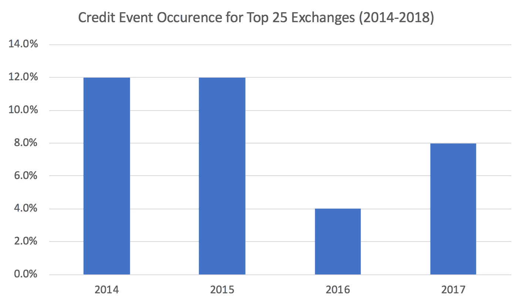

# 定价加密交易所信用风险

> 原文：<https://medium.com/hackernoon/pricing-crypto-exchange-credit-risk-f91b5996eaad>

## 加密货币交易违约的历史研究

## **快速总结**

*   交易所信用风险是一个巨大的、被忽视的风险，所有 T2 的地下交易者都面临这个风险
*   一家交易所过去的黑客攻击记录可以预测未来的黑客攻击
*   外汇盈利能力是客户能否得到偿还的预测指标
*   其他需要考虑的主要因素:网络安全、法规和银行业
*   我们将利用本文中概述的研究发布排名前 150 位交易所的月度信用评级。*在下面注册即可免费使用*:

## **加密信贷风险介绍**

加密资产的主要用途是交易。每天超过 100 亿美元的交易量，没有其他应用程序可以与 trading 的压倒性人气相媲美。交易者包括购买自己喜爱的另类硬币的个人、采用算法策略的量化基金，以及为大宗交易寻找流动性的主要场外交易平台。

交易就是管理风险。具体来说，活跃的短线加密交易者面临三大类风险:

*   **市场风险**:与不利价格变动相关的损失风险
*   **流动性风险**:与无法退出头寸相关的损失风险
*   **信用风险**:与交易对手违约相关的损失风险

前两种风险——市场风险和流动性风险——是众所周知的、高度可见的风险类型，加密交易员愿意承担这些风险。只需查看 CoinMarketCap 等网站上的每日价格变动和交易量，就能迅速判断出它们的价值。

然而，后一种风险，即信用风险，是密码交易者不愿意承担的一种几乎未知和看不见的风险。然而，这是一种高度不对称、负向倾斜的风险，直接导致了许多加密交易员面临的最大单日损失。

生态系统中信用风险的主要来源是集中交易所对其储户违约的风险。当黑客掏空交易所的钱包，交易所的创始人窃取资金，或者当局关闭交易所时，就会发生这种情况。

本文的目标是**提供关于如何对信用风险定价的研究**，以便更广泛的加密交易社区能够理解、量化和减轻这种持续的威胁。

## 度量信用风险的概念模型

信用风险是与“信用事件”相关的损失风险信贷事件大致可分为个人或组织(“参考实体”)未能履行重大义务的情况。

客户与交易所的关系类似于传统的借据。客户在交易所托管资产，作为回报，他们有权随时提取资产。

因此，如果一家交易所拒绝允许客户在一段延长的时间内提取资产，他们实际上就违反了这一义务。因此，我们将信用事件定义为加密交易所**禁止所有客户**提取比特币至少五天的情况。

然而，并不是每一个遭受信用事件的加密交易所都将损失转移到他们的客户身上。因此，当务之急是衡量客户因外汇信贷事件遭受的损失(如果有的话)。

因此，计算整体信贷风险包括以下两个指标的乘积:

*   *信用风险=* 信用事件的概率*信用事件的预期损失

## **计算信用事件的概率**

衡量交易所信用风险的第一步是预测交易所发生信用事件的概率。

两位研究人员之前在 2013 年初解决了这个问题，发表了一篇名为“[当心中间人:比特币交易风险的实证分析](https://link.springer.com/chapter/10.1007/978-3-642-39884-1_3)”的论文。

在他们的论文中，他们研究了截至 2013 年 1 月已经存在的 40 种不同的加密交易所。他们发现，交易所的交易量可以预测它是否会关闭，即不知名的交易所比受欢迎的交易所更有可能被关闭。他们还发现，过去被黑客攻击的交易所未来更有可能被黑客攻击。

为了测试这两个命题，我们首先需要一个[生存偏差](https://en.wikipedia.org/wiki/Survivorship_bias)自由交换数据集来测试。为此，我们来看看 2014 年、2015 年[、](https://web.archive.org/web/20150808004157/http://coinmarketcap.com:80/exchanges/volume/24-hour/) [2016 年](https://web.archive.org/web/20160807204037/https://coinmarketcap.com/exchanges/volume/24-hour/)和 [2017 年](https://web.archive.org/web/20170829064453/https://coinmarketcap.com/exchanges/volume/24-hour/all/)8 月份成交量排名前 25 位的交易所的快照。然后，我们记录他们的姓名、数量，以及他们之前是否遭遇过与黑客攻击相关的事件。

接下来，我们对每个交易所在快照日期之后的 12 个月中是否面临信用事件进行分类，忽略交易所在关闭前退还押金的情况。我们只寻找客户资产滞留至少 5 天的事件。

有了这个由 100 个不同数据点组成的数据集(四年来排名前 25 的交易所)，我们可以比较交易量和过去黑客攻击发生率与后续信用事件发生率之间的联系。

**i)汇总统计&趋势**

在开始分析这些关系之前，我们发现展示这个数据集的概括统计信息是有帮助的。下图显示了按年度排名的前 25 家交易所的信用事件的历史发生情况:

Zaif 交易所最近的黑客攻击发生在 8 月至 8 月测量期之后仅仅几天。考虑到 Zaif 黑客攻击，2017 年将与 2014 年和 2015 年保持一致，为 12%，并使 2016 年看起来更像是一个异常值，而不是下降趋势的开始。

在 100 个交易数据点上总共发生了 9 起信用事件，表明**在 4 年内信用事件基础利率为 9.00%**。

**ii)用成交量预测信用事件发生**

我们研究的第一个关系是每日交易所交易量和信贷发生之间的关系。根据前一篇论文的结果，大型交易所预计将遭受更多的信用事件，因为它们对黑客来说是更有吸引力的目标。对此，一个合乎逻辑的反驳观点是，更大的交易所会有更好的安全措施。

在散点图上绘制这两个变量如下所示:

对上述数据进行回归分析表明，这种关系基本上不存在。

**日交易量低于 50 万美元的交易所(如**[**gate coin**](https://www.coindesk.com/gatecoin-2-million-bitcoin-ether-security-breach/)**)与日交易量超过 5 亿美元的交易所(如**[**bith umb**](https://www.coindesk.com/bithumb-exchanges-31-million-hack-know-dont-know/)**)**)一样可能遭遇信用事件。

简而言之，交易量是信贷事件发生的不可靠预测指标。

**iii)使用过去的黑客历史来预测信用事件的发生**

接下来，我们研究论文中概述的第二个命题:过去曾公开披露过黑客攻击相关事件的交易所，未来更有可能遭遇信用事件。

这背后的逻辑很简单。已经遭受重大黑客攻击的交易所更有可能成为其他黑客的目标，因为过去的黑客攻击反映了内部安全程序的不足。这两者都使它们暴露于更高的随后的黑客攻击风险，因此相对于“干净的”交易所，更高的信用事件发生率。这反映在以下数据中:

以前被黑客攻击的交易所每年遭受信用事件的比率为 22.2%。相比之下，以前从未被黑客攻击过的“干净”交易所遭受信用事件的比率为每年 6.1%。

这意味着，相对于“干净”的交易所而言，之前遭到黑客攻击的交易所遭受后续信用事件的可能性几乎是“干净”交易所的四倍。

## **预测信用事件损失**

信用风险定价的下一步是计算违约时的预期损失。

这种关系更容易建模。根据这篇论文的逻辑，在发生信用事件时，规模较大的交易所更有可能向客户还款，因为它们更有利可图。这使得它们更有可能用内部资金弥补任何损失，或者能够将自己出售给另一家交易所，以使客户完整。

为了分析这种关系，我们记录了加密交易历史中每一个公开披露的信用事件，以分析**日均交易量和还款率**之间的关系。该数据如下图所示:

使用对数回归将数据绘制在对数标度散点图上(因此趋势线看起来是线性的)。这种关系虽然有点弱，但清楚地表明了交易所的日均交易量和信用事件偿还率之间的正趋势。

交易量较高的交易所更有可能向客户进行回报。中间点在 70 万美元左右，在这一点上，信用事件发生后，交易所将从客户每 1 美元的存款中支付 0.5 美元。

## 主观因素调整

到目前为止，该模型在设计时完全依赖于历史数据。虽然这使我们能够相对客观，并为我们提供历史基本利率来锚定我们的预期，但也有许多没有历史先例的主观风险因素需要考虑。

因为这些风险因素本质上是主观的，所以很难量化它们的影响并根据历史数据进行测试。

对于每个特定的交易所，有三个主观风险因素需要考虑:

*   网络安全程序
*   监管风险
*   银行风险

我们提出一个简单的方法来考虑这些因素。

**i)网络安全程序**

网络安全是一个特别难以量化的因素。一份最近的报告出炉了，它详细描述了一种衡量不同外汇安全程序的方法。

我们感兴趣的是总体的交换风险，而不是单个用户的安全性，因此这种方法的两个方面非常重要:注册商和域安全性& web 协议安全性。幸运的是，有些网站可以为互联网上的每个网站提供快速的定量评估。

这些评级的主要问题是，它们提供了表面水平的洞察力，因此鉴于它们的粗糙性，不能完全依赖它们。不过，它们确实提供了一种对交易所进行客观排名的方法，并通过标记安全性特别差的交易所来提供价值。

**二)监管风险**

监管风险是另一个难以量化的因素。然而，考虑到[最近监管机构推动的关闭](http://fortune.com/2018/05/21/regulators-cryptocurrency-ico-scams/)和[的增加，一些业内人士预测](https://prestonbyrne.com/2017/09/01/the-bear-case-for-crypto/)这些将在未来继续增加，这显然是一个尾部风险，交易员不能忽视。

监管风险最明显的例子是【2017 年 7 月 BTC 证券交易所被关闭和查封。

Bad way to start the day if you’re a BTC-e customer

美国司法部在希腊警方的帮助下，逮捕了该交易所的涉嫌创始人，并查封了该网站。反过来，BTC e 的客户失去了对其资产的访问权。监管机构之所以采取行动，是因为该交易所公开违反了美国反洗钱(AML)法律，并且不要求用户在进入该交易所时进行 KYC。

监管风险的另一个例子是 crypto CFD exchange 1Broker 最近被关闭。在 1Broker 的例子中，尤为重要的是，他们主要是因为提供衍生品和证券的使用权而违反了美国证券法。同样的论点也可以用在其他一些现有的加密交易所上，这些交易所要么提供衍生品，要么提供非常明确的证券代币交易。

因此，衡量监管风险的快速方法如下:

*   交易所是否要求 KYC 进入平台？
*   它是否提供可能被归类为证券的代币交易？
*   交易所是否提供保证金和/或衍生品？
*   交易所是否做了潜在非法的 ICO 来资助运营？
*   交易所是正式监管环境的一部分吗？

通过回答这五个问题，并根据它们的重要性进行加权，交易者可以了解每个交易所的相对监管风险。

**三)银行风险**

最后一个主观风险因素与支持法定计价存款和交易的交易所失去其银行合作伙伴的风险有关。这在历史上是上述风险因素中最不严重的，因为它至少使交易所能够找到新的银行合作伙伴。

跟踪这种风险也有些容易，因为担心这种风险的交易者会以高于市场的价格购买 BTC，以撤出资产，导致交易所的 BTC/美元现货价格溢价。

最近一个很好的例子是，在 Bitfinex 交易所早些时候宣布暂时失去与银行合作伙伴的联系后，该交易所相对于其他交易所的 BTC/美元溢价不断上升:

应该提到的是，这种风险也适用于任何使用依赖银行业务的稳定货币(如 Tether)作为其交易所的交易对货币的交易所。这是因为，如果稳定的货币永远无法进入银行系统，它的价值就会直线下降，依赖它的交易所和客户将遭受严重损失。

## 结论

据估计，目前大约有四分之一的加密资产价值被集中的加密货币交易所持有。目前加密资产的市值约为 2000 亿美元，其中有 500 亿美元的未保险资产存在于交易所，这些交易所在保护客户资金方面的记录相对较差。

这篇文章代表了我们在量化加密生态系统中的信用风险方面提供更大清晰度的使命的第一步。

展望未来，我们将使用本文阐述的理念和方法，发布最大的 150 家加密交易所的月度信用评级。

然而，真正推动加密生态系统中信用风险实际规模透明化的唯一方法是创建可交易的信用风险市场。通过允许交易者专门押注信用风险并从中获利，我们可以获得市场驱动的加密信用风险定价。

作为 CDx 的创始人，我们的使命就是创造这些信用风险市场。加入社区，帮助我们使加密生态系统对每个人都更安全。

*   **电报** : [CDx](https://t.me/joinchat/IdMlFRAIrFxrHdoKaL08ig)
*   **Reddit**:[r/cdx project](https://www.reddit.com/r/CDxProject)
*   **推特** : [@CDx_Project](https://twitter.com/CDx_Project)

 [## CDx 更新

### CDx 更新电子邮件表单

eepurl.com](http://eepurl.com/dF7XJr)