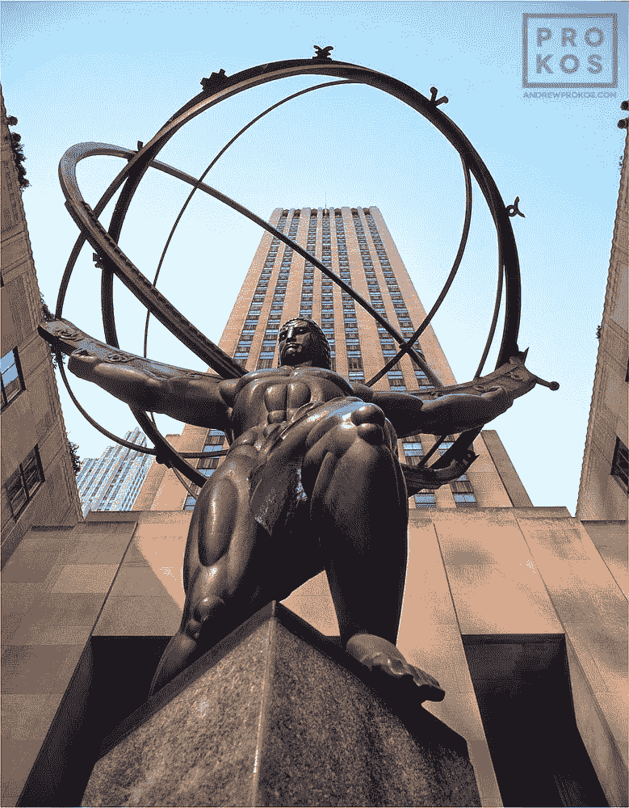
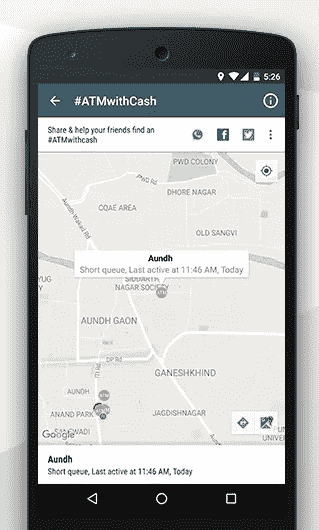
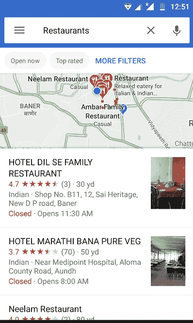

# 设计互联网产品的原则

> 原文：<https://medium.com/hackernoon/principles-for-designing-internet-products-fc751ddc1214>

## 构建消费者应用的一些经验。4

Atlas Statue at The Rockefeller Centre. The orbits are the principles under which the product can roam. Image: Google

我已经做了将近 5 年的互联网产品了。最后 4 年花在了开发消费者应用上。我通常在行动迅速的小型灵活团队中工作。史蒂夫·辛诺夫斯基(Steve Sinofsky)的一篇漂亮的文章——这里有一个链接[https://medium . learning by shipping . com/frictionless-design-choices-FEA 3b 40 f 8588](https://medium.learningbyshipping.com/frictionless-design-choices-fea3b40f8588)让我开始思考我解决问题的方法。

我解决问题的一般方法由 3 个步骤组成(确定它是否是一个值得解决的实际问题是第 0 步:)

1.定义问题

2.寻找解决问题的可能方法

3.迭代方法，直到一个出现，快速勾画出它&填补拼图中缺失的部分。

一套通用的原则有助于让所有利益相关者/团队成员达成共识，并在做出棘手的设计/产品决策时充当指路明灯。

# 最重要的原则是什么？

1.它必须简单

2.这必须是一个普遍的模式

3.它必须很好地适应现有的设计

我最大的设计灵感之一是 Instagram 产品。我只是对新功能与现有产品融合得如此之好，从而使整个产品变得更好感到敬畏。他们推出了 stories、live stories、creator formats for live、stories、boomerang，现在又增加了一个在个人资料上展示热门故事的方式。他们似乎为这些特征找到了完美的位置。而所有这些功能都让 Instagram 整体变得更好。

# 它必须简单

在我们的日常生活中，我们做了一大堆决定。没有人想增加这种认知负荷。简约的第一部分是极简主义。仅保留必要的数据，设计中的层数或选项数。简单的第二部分是背景。在当前情况下，最佳选择是什么？我举个例子解释一下。

决策示例->
当我们设计#ATMwithCash 功能时，我们面临一个问题——我们如何在地图上显示不同的 ATM？

1.在地图上显示彩色编码的 ATMS
2。显示您附近所有自动取款机的列表

选项 B 就是谷歌地图所做的。当你在谷歌地图上搜索“我附近的餐馆”时，它会给出一个地点列表，通常是按照距离和一系列其他属性排序的。

选项 A 只是用不同的颜色编码显示了你附近的不同 ATM。当您选择了一个特定的地方，底部的酒吧将显示详细信息。

Option A. Since the name wasn’t available only the address is shown.

Option B: Google Maps

每个 ATM 有 3 个不同的属性——名称和地址、状态(用颜色(绿色、黄色或灰色)表示)、最后一次活动和队列长度。我们后来还增加了 500、1k、2k 纸币的可用性。在这些属性中，最重要的是名字和身份。最后活动和队列长度是状态的属性。

用户的典型思维过程是这样的——我附近有什么东西吗->啊，没有绿色的->有黄色的吗->是的，好像在一个小时前是活动的->我们去看看。

当我们不得不做出决定时，我们遵循格言选择 B——保持简单愚蠢，保持上下文相关。谷歌地图有不同的地点类型——自动取款机、餐馆、医院。我们只有一个。每个地方都有一系列的属性——名称和地址、地点的图像等等。<add-different-attributes->，我们没有那么多属性。此外，atm 的距离和位置也是决定是否值得一游的一个关键因素——在地图上工作流程更简单。所以我们继续看地图。在谷歌的例子中，事情就没那么简单了——因为距离不是选择餐馆的唯一因素，你可能会对评级、菜肴等感兴趣。事后看来，这是一个正确的决定。</add-different-attributes->

另一个简单的最好例子是 Medium。在 Medium 出现之前，任何创建新博客平台的人都会认为定制主题、字体和媒体视图的能力是必不可少的功能。然而《灵媒》却一个都没有。

几天前，我写了一篇关于 WhatsApp 如此成功的原因的文章——[https://growthbug.com/why-whatsapp-is-right-64ad28c9d0b7](https://growthbug.com/why-whatsapp-is-right-64ad28c9d0b7)——简单。

# 2.它必须是一个通用/本地模式

一些设计师会反对这种说法，说它限制了创造力。我相信它给了设计一个结构。这使得它在平台上更“有用”。

想象一下，如果给一个只用过 Windows 的人一个 Linux 系统，会发生什么。那个人很困惑。现在，使用脸书、Whatsapp 和 UC 浏览器的人与使用 Windows 的人类似——他们的导航、UI 元素都基于这些应用。类似的系统是最好的——你让用户关注价值主张而不是导航。当唯一的增值可能是导航/设计或较小的交互/UI 元素的变化时，这个规则有时会被打破。

# 3.它必须适合现有的产品

这对于功能优先级和设计来说是正确的。新作品如何适应现有的设计？设计以适应产品的未来版本是一件非常困难的事情。

考虑 Snapchat。它最初是作为一种互相分享会消失的图像的方式。酷——一个人只能聊天，所以占了很大空间。然后是故事，他们在恰当的互动中找到了一个舒适的角落空间。突然，出版物上出现了一些故事，它们在下面有了一些空间。但是我们也需要一种添加好友的方式！哦，给你看看你身边的故事——我们把它放在搜索中——因为我们不知道把它发到哪里。现在我们有一个烂摊子。

因此，新的设计必须与现有的设计相融合——这是做好设计的先决条件之一。其中一个窍门是有一个地方添加奇怪的动作——可能是个人资料页面或低优先级导航菜单。

**我的其他一些最爱:**

1.  重点看文案！—正确的词语对于优秀的设计至关重要。
2.  神奇之处在于运动——我可以就此写一整篇文章。但是运动是必不可少的。它传达变化，帮助抓住注意力，传达等级等等。
3.  接受失败——我们偶尔会犯错。让一个糟糕的决定死去是很重要的。
4.  表明立场——经常有走中间路线的诱惑——这很容易让人们同意，感觉就像是好与坏的恰当搭配。但是打个赌很重要。
5.  闭环——最好的功能在循环中工作——作为一个反馈系统。你评价一家餐馆，我们会给你更多你喜欢的餐馆。更有动力给餐厅打分！
6.  通知是你的朋友——我们喜欢红色的通知点。

这些只是最上面的。我会尝试用更多具体的产品和设计选择的例子来跟进。

# 如果你喜欢我的文章，请多次点击鼓掌按钮。

At Comic Con, 2 years ago! Hello 👋