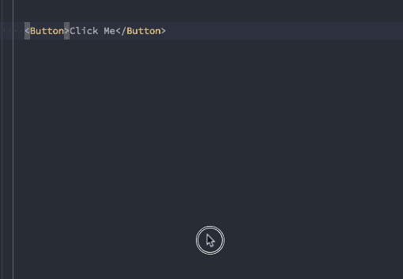

# 组件 API (Prop)设计原则

> 原文：<https://medium.com/hackernoon/principles-of-component-api-prop-design-bb20cd58da54>

使用设计良好和维护良好的组件是令人愉快的。当事情*正常工作*并且你能够用预先存在的组件快速构建一个漂亮的 UI 时，这种感觉很棒。

另一方面，我们可能都感受过使用设计不佳的组件的痛苦。这导致了混乱，并且要花费很多额外的精力去弄清楚如何使用你所需要的构建模块。我发现自己说了以下的话:

*   我这里需要的道具叫什么？
*   为什么现在是红色的，不应该是蓝色的吗？
*   我希望有一个道具来…

有无数种不同的方法可以为你的组件设计 API，并且很难知道什么能提供最好的开发者体验。幸运的是，我认为可以遵循一些原则，让其他人更容易消费和贡献您的组件。

# 让做错事变得困难

允许互相冲突或互相覆盖的属性组合是很容易的。我看到的一个常见的例子是，一个`Button`组件可以有[不同的强调级别或颜色](https://react.semantic-ui.com/elements/button/#types-emphasis)。

对于消费者来说，意外使用错误的布尔道具组合是很常见的(例如`secondary`和`negative`)。使用布尔道具的语法非常好，但是要注意不要给用户太多的道具组合来选择。

作为替代，考虑使用枚举来表示颜色、间距和大小。例如，不要使用`small`、`medium`和`large`作为布尔属性，而是使用接受`"small"`、`"medium"`和`"large"`的`size`属性。

# 少即是多

我们都使用过看似拥有无数道具的组件。如果你把正确的道具组合传递给一个组件，你会发现它会按照你需要的方式运行，这是很好的，但是工程师有时不可能记住所有的选项。在文档和代码之间进行上下文切换的成本很高，所以尽量避免组件的消费者陷入这种时间陷阱。

我认为一个组件上的大量道具有点代码味道。当我看到为什么一个组件上有这么多的道具时，我发现这通常是因为它试图做太多的事情。尝试在组件中遵循单一责任原则(SRP ),并考虑将大型组件分解为解决单一问题的较小组件。

**快速提示:**考虑通过主组件的点符号来访问这些组件。例如`Table.Row`和`Table.Cell`而不是`TableRow`和`TableCell`。向我的同事[斯潘塞·米斯科维奇](https://medium.com/u/778a0d27a9c1?source=post_page-----bb20cd58da54--------------------------------)致敬，因为他最近写了一篇关于这个主题的文章[。](/@skovy/using-component-dot-notation-with-typescript-to-create-a-set-of-components-b0b2aad4892b)

# 使用类型

有了 TypeScript、Flow 和 PropTypes，就没有理由不对组件提供某种级别的类型安全。这不仅可以确保组件得到正确使用，还可以让您利用额外的工具，让消费者更容易看到可用的道具并正确分配它们。

**快速提示:**对道具类型使用枚举而不是字符串，这样你就可以很容易地传递你的道具所允许的特定值。

# 保持一致

如果你有在你的整个组件系统中做同样事情的道具，确保你给它们起同样的名字。不要在一个道具中使用`disabled`，而在下一个道具中使用`enabled`。

如果您在多个组件上有颜色、大小或间距属性，请尝试让它们从一个组件到下一个组件接受相同的值。例如，不要在一个组件上有一个`variant="primary|secondary|danger”`支柱和一个`color="blue|grey|red"`。

# 要清楚

尤其是使用布尔型道具时，使用读起来很好但意思不清楚的词会很有诱惑力。例如，我们曾经有一个`fitted`支柱来移除一些组件上的余量。这是有问题的，原因如下:

1.  开发者不清楚`fitted`是做什么的。我们总是不得不解释它，人们不得不思考“那个去除利润的道具叫什么？”🤔
2.  随着时间的推移，这个道具的用法变得不一致。视觉上，它只是删除了元素周围的一些额外的空间，但有时是底部空白，有时是顶部空白，有时是填充。没有关于何时或如何使用它的明确指导方针。
3.  我们开始收到来自设计部门的请求，要求创建具有不同填充和边距的组件的附加变体。我们考虑过增加像`tight`、`heavy`、`fluffy`、`relaxed`和`loose`这样的道具。像这样引入专有名称肯定会使☝️提到的问题更加复杂

如果一个道具要控制填充，通常最好是明确的，这就是我们用像`padding="small|large"`这样的道具所做的。你可以争辩说这读起来不太好，但是它很容易记住，我们的工具让我们能够从可用选项中快速选择。

# 结论

我可以满怀信心地说，这些原则帮助我构建了更易于维护、使用起来更愉快的组件，但它们仍在不断发展。我从队友的反馈和反复试验中学到了很多，但我也想从你和你的经历中学习。请分享对你和你的团队有用的东西！

在起草这篇文章的时候，我看到 [Kent C. Dodds](https://medium.com/u/db72389e89d8?source=post_page-----bb20cd58da54--------------------------------) 写了[一篇关于我提到的第一个原则的深度文章](https://blog.kentcdodds.com/make-impossible-states-impossible-cf85b97795c1)。值得一读！