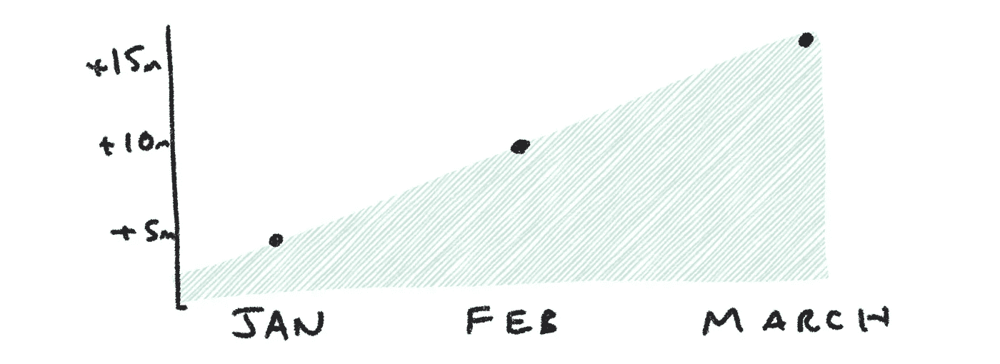

# 优先考虑“非特性”工作和持续改进

> 原文：<https://medium.com/hackernoon/prioritizing-non-feature-work-and-continuous-improvement-bad2a612d860>

注意:我从一次辅导/培训会议上转录了这篇文章。希望这种对话式的风格还可以，而且不会太不连贯。此外，我非常缺乏睡眠，因为新的婴儿！也就是说我不擅长校对。但是本着连续交货的精神……:)

今天，我们将讨论如何倡导、区分优先级以及对非功能性工作(例如，重构、工具和基础设施项目)进行量化。讨论同样适用于招聘人手不足的职位，实际上，也适用于一般的持续改进。

所以，你的组织有一系列有价值的，所谓的“面向客户”或“面向业务”的工作。你试图倡导把你重要的“非面向客户”的事情放在清单上(在某些环境中，我听说这被称为“非增值工作”…这是我非常不喜欢的)。

让我们用每段时间的延迟成本…美元来说明这个列表中的项目(面向客户的东西)的价值。这是每个时间段内不采用这一方案的成本。在这种情况下，我们将使用月。

Note: We might change the order of these items based on expected duration (using WSJF — weighted shortest job first).

像大多数公司一样，你在这个列表中有很多潜在的机会。有些降低成本或防止成本增加。一些增加收入，或保护收入。有些做一些有趣的事情，比如购买信息和购买选项。

但是现在让我们保持简单。

我们有名单了。现在，我们必须设计一个系统来最大化所有有价值工作的价值吞吐量。但是，让我们假设这个系统现在存在于您的组织中。

冒着危险的过度简化的风险，这个系统最大化价值吞吐量，它有两个组成部分…从机会中提取尽可能多的价值和吞吐量…这些项目在系统中移动的速率。当然有一个反馈回路…我会画出来，因为它很重要。

所以…我们有一个创造价值的系统。这个系统以一定的速度创造价值。在我们的例子中，假设它每月增加约 500 万美元的价值。因此，在三个月内，由于我们的工作，我们每月多赚 1500 万美元

现在，让我们假设有什么东西减缓了价值创造。

它的流动速度没有我们需要的那么快。也许……反馈回路变得更加嘈杂。或者我们误判了一些机会。或者我们已经有了很多人，很难让他们跟上速度。或者某个角色—例如 QA 或 Ops 过载。或者质量问题正在向系统中注入大量计划外的工作。或者可能是士气正在下降，有价值的团队成员正在离开。可能有很多事情。

这降低了价值的吞吐量。如果它使系统变慢了 20% …那么，每月价值创造就少了 100 万美元。

如果情况变得越来越糟，就像这些事情中的许多一样，可能很快就会恶化 50%。如果不处理，速度会慢 75%。这无疑是最重要的工作之一！组织会立即解决这个问题，对吗？我见过 50%+的例子…答案是…不总是。那是礼貌的。很少。这有点疯狂。

任何提倡重构、工具化、持续改进、雇佣 QA、雇佣 Ops 的人都知道这里的挑战。

原因和结果往往不是立即可见的。首先，这是一个显而易见的问题，它只是不可想象。组织关注的不是可视化流程，而是资源分配、评估、庞大的年度计划、项目状态报告、整洁的“官方”组织结构图(不是真正的组织结构图)，以及基于推动的目标和承诺。这些有意义的工具根本不关注价值的流动。以及系统的延迟成本、队列、步骤等。是未知的。这是个大问题。

这是一个问题，因为它导致了错误的结论和反应。例如，当事情开始变得缓慢时，以下是一些常见的反应:

*   我们需要雇用更多的人！
*   增加正在进行的工作！(这让问题变得更糟)
*   非官方快速通道和官方快速通道的出现
*   团队抄近路以达到他们的估计(使事情变得更糟)
*   团队围绕一个饥饿的 QA 和 Ops 团队工作…给人以吞吐量的印象，并进一步加剧了问题
*   雇佣更多的本地管理人员，因为我们倾向于认为这是一个管理/责任/流程问题
*   传统的项目管理/投资组合/项目管理……通过不关注工作，不关注围绕工作的系统，使得问题更加不透明
*   指责个人而不是关注系统。人都变懒了！他们已经退房了！

**大多数方法都没有考虑到个人之间和工作之间的空间。如今的工作更像是价值创造网络，而不是装配线……边缘是信息/知识转移。**你可以从上面看到，我们的本能往往会让问题变得更糟、更不透明。

可视化流程——并添加光照限制(WIP 限制)——有助于我们理解实际发生了什么。

即使当我们观想心流时，我们也经常会碰到一个难以忽视的事实并退缩。现实是，大多数组织结构图并不是为应对这些跨职能和系统性挑战而设计的。他们擅长从高层设定高水平的目标。并且擅长团队的本地运作。但是中间的任何东西都是模糊的。

我在职业生涯中观察到的难以忽视的事实的例子

*   你真的需要在每个团队中嵌入 QA
*   您需要在支持 DevOps 文化方面进行大量投资
*   或者产品团队没有做好优先排序的工作
*   或者产品的复杂性需要大量的维护和重构
*   或者营销主管不应该微观管理产品的推出
*   或者商业模式根本不起作用

所有这些都不能在真空中解决。可能没有一个人直接负责，或者可以单方面决定这一点…直到有人在他们的头衔中有一个 C，即使这样…它可能需要首席执行官来解决这个问题。只要看看你的平均“产品开发”组织…

但是回到原来的话题。

持续改进的关键价值在于解决等式中的价值和价值产出部分。像重构、重组、工具化、更好的客户研究、更多的工具化、债务削减、邀请客户参与设计过程等等都有非常真实的价值。这可能是你能做的最重要的事情。这就是为什么任意%的分配或副项目，或。“每个 sprint 一个项目”的指导方针有点偏离主题。

要真正倡导…你需要有一种意识:

*   在你的环境中价值的定义。
*   通过系统的价值数量
*   某些事情如何影响…理解系统

价值需要用时间来衡量。它需要一个苹果到苹果的衡量标准…美元被证明是一个比手动波浪形电子表格好得多。我建议[多了解一下延误的成本](http://blackswanfarming.com/cost-of-delay/)。这是一个关于你的商业模式和真正的美元是如何创造的对话的巨大催化剂。

然后感知。视觉化是一种工具。WIP 限制另一个。伟大的回顾——团队层面和整个组织——是另一个例子。透明度是关键，透明度需要心理安全和跨越边界和筒仓工作的强烈愿望。你不能解决/谈论你感觉不到的事情。说到感应…

一旦你有了这些东西，接下来就是做一个简单的商业案例了。示例:

> 现在[某个问题]正在将我们的价值吞吐量全面降低 X。如果我们不采取任何措施，这一比例将会上升。

这带来了最后的——也许是最大的挑战。大多数组织没有针对中长期结果和可持续性进行优化。它们针对增长和短期结果进行了优化。这意味着他们可能会根据价值对短期收入的影响(或对投资者、风投公司的看法)来判断价值。这就像为了给约会对象留下深刻印象而进行喷雾晒黑，或者进行速成节食。那就是说…也许那会让你留在游戏中。

我不能为你解决这个问题…但我知道，通过感知系统，创造安全，并真正深入地讨论价值…你可以就“非功能性”或“非功能性”或“非增值性”工作的价值展开讨论。

简而言之，找出对价值吞吐量的影响，这意味着找出什么是有价值的。祝你好运！