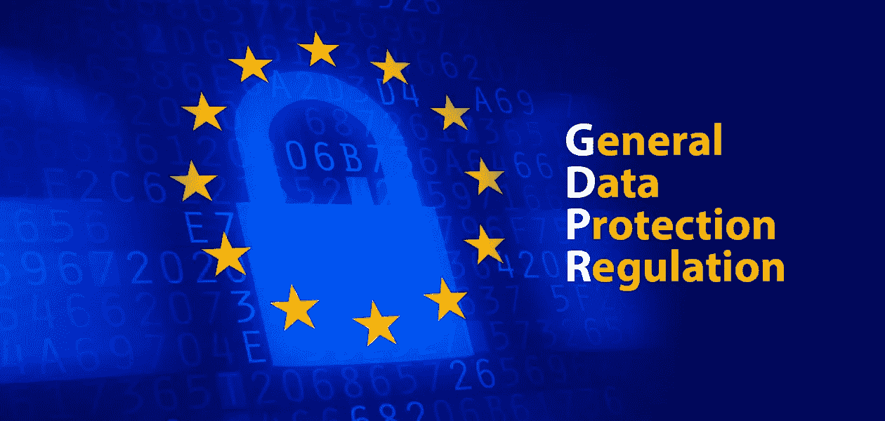

# GDPR:解决隐私疲劳的轻推？

> 原文：<https://medium.com/hackernoon/privacy-fatigue-81682aafd32e>

随着 GDPR 落户我们的行业，这是一个反思我们如何来到这里的好时机。我们是如何结束自上而下、政府强制执行的数据管理和保留政策的？

在很大程度上，这是为遭受隐私疲劳的全球用户群体解决集体行动问题的一种方式。每个人都知道他们的数据漂浮在空中，被买卖，甚至连数字身份的“所有者”都没有点头同意。但事实是，面对服务数十亿用户的公司，个人没有力量去强行改变。

更重要的是，大多数用户都非常喜欢这些遍布全球的社交媒体服务的便利和功能。其结果是，沮丧的用户已经放弃了争夺对其数字身份的控制权。

# **隐私疲劳让你更加脆弱**

[梅奥诊所将“疲劳”](https://www.mayoclinic.org/symptoms/fatigue/basics/definition/sym-20050894)定义为“几乎持续的疲倦状态……影响你的情绪和心理健康。”

现在将这种昏睡状态应用到你的私人数据不在你的控制之下并且不再是私人的认识上。面对这种灰暗的认识，很容易理解“隐私疲劳”这个概念。

隐私疲劳已经在学术界讨论了至少十年，一些研究人员认为这是对身份数据易受攻击和机构冷漠的世界的自然反应。

直到最近，隐私疲劳还只是一种假设，但最近的一项研究表明这种情况是真实的。来自韩国国家科学技术研究所的三名研究人员研究了 324 名在线用户的习惯，并确定隐私疲劳是真实的，更糟糕的是，它产生了一种无用感，使身份数据面临更大的风险。

# **感受“无用的隐私”**

在研究 2017 年的“[隐私疲劳在在线隐私行为中的作用](http://iranarze.ir/wp-content/uploads/2018/04/E6393-IranArze.pdf)”时，Hanbyul Choi、Jonghwa Park 和 Yoonhyuk Jung 确定隐私疲劳是一系列复杂事件的结果。

首先，在一个充满隐私威胁和永无止境的数据泄露的环境中，人们面临着管理个人数据的挑战。在这种背景下，消费者觉得他们无法控制自己的身份，引发了期待在线隐私的“无用感”。这种无用性滋生了犬儒主义，反过来，教授们总结道，这导致了一个自我实现的预言，即在线用户几乎不努力保护他们的凭证。结果，他们进一步成为黑客和出售其个人数据的匿名公司的受害者。

这不完全是新闻。事实上，2017 年的研究引用了 2010 年的研究，当时手机用户正在努力应对将数字优惠券直接发送到他们的设备上的兴奋感，同时承认他们发现这种做法“令人讨厌”。

Choi，Park 和 Jung 说，自 2010 年以来，这种不安只会加剧。他们认为，没完没了的高调数据泄露的新闻加剧了隐私疲劳。他们特别指出，2013 年影响 10 亿用户的灾难性雅虎数据泄露事件是一个关键的转折点。他们表示，2013 年的入侵让许多用户认为，他们只是“无法控制自己的在线信息”。

两位教授引用了雅虎事件后的另一项研究，该研究的结论是:“人们感觉自己似乎无法控制个人信息，最终(迫使)他们对网络隐私采取顺从态度。”

他们写道，从那以后，这种无助感只会增长，导致消费者的“情绪衰竭和愤世嫉俗”。这种心态造成了当前的环境，即“用户…不愿意花大力气管理他们共享的信息。”

事实上，研究人员得出结论:“**高度隐私疲劳的人更有可能在他们的个人信息被滥用时‘什么都不做’**”

简而言之，人们只是默认了他们的身份不再是他们自己的这一观念。

# **脸书似曾相识**

2009 年，[脸书发现自己处于守势](https://www.eff.org/deeplinks/2009/12/facebooks-new-privacy-changes-good-bad-and-ugly)，因为该公司被发现共享私人用户数据。当时，这家社交媒体巨头承诺推出新的复杂隐私功能，以帮助用户保护他们的身份。([这可能听起来很熟悉](/@lifeID_io/despite-ceo-assurances-facebook-data-mining-will-continue-6162b15ecbc)。)

这促使杨百翰大学的马克·j·基思和考特尼·m·埃文斯；香港城市大学保罗·本杰明·劳里；和西德克萨斯 A&M 大学的 Jeffry S. Babb 完成了[隐私疲劳:隐私控制复杂性对消费者电子信息披露的影响](https://pdfs.semanticscholar.org/e732/d6805cbcdd867c6e506db2c1a82724e9b1c2.pdf) *，* a 2104 检查“功能疲劳”他们确定，这是一种阻碍用户保护其身份凭证的情况。

虽然脸书的新安全功能承诺更好地保护用户身份，但研究发现这些功能产生了相反的效果。

“当脸书在 2009 年引入新的隐私设置时，电子前沿基金会(EFF)指责社交媒体网站迫使用户披露比以往更多的信息，”作者写道。“然而，很少有研究表明这种做法是有效的……”

相反，研究人员发现，隐私控制越复杂，“随着时间的推移，消费者披露更多信息的倾向”就越大(EFF 在 2009 年得出了类似的结论，称“这些变化将导致脸书用户向世界发布比他们预期更多的关于他们自己的信息。”)

无论是功能疲劳还是隐私疲劳，事实仍然是，我们的身份信息现在比 2009 年更容易受到攻击，作为用户，我们越来越不倾向于保护它。

# **GDPR:向“自我主权身份”迈进**

GDPR 服务于一个有用的目的。它为监管提供了一个正确的方向——我们的行业称之为区块链的“T4”自我主权身份**用户无法单独解决隐私疲劳问题**。通常情况下，我们需要一种动力或强制功能来推动行业朝着正确的方向发展。毕竟，需要是发明之母。

基于区块链的身份解决方案可以帮助用户克服隐私疲劳，为他们提供一个简单、方便的工具箱来管理身份数据。区块链作为一套工具的基础，可以向日常用户提供隐形加密的好处——这是让加密突然被每个人使用的缺失环节。使用已建立的加密技术，这些新工具允许人们使用分散的、可验证的凭证来证明关于他们自己的事情，就像他们在离线时一样。我们将在以后的文章中深入探讨“验证的凭证”是如何工作的，但是现在，我们终于有了允许用户收回对他们未来交易的身份数据的控制权所需的工具。

时机不可思议。这就好像是基于区块链的身份解决方案是专为提供向 GDPR 合规性的轻松过渡而创建的。尽管 GDPR 自上而下的监管与区块链去中心化的风气截然相反，但这真正意味着你可以更可靠、更有效地控制你在网上和现实世界中的身份数据。或许，GDPR 将带领我们踏上旅程，帮助我们克服疲劳，到达隐私天堂。