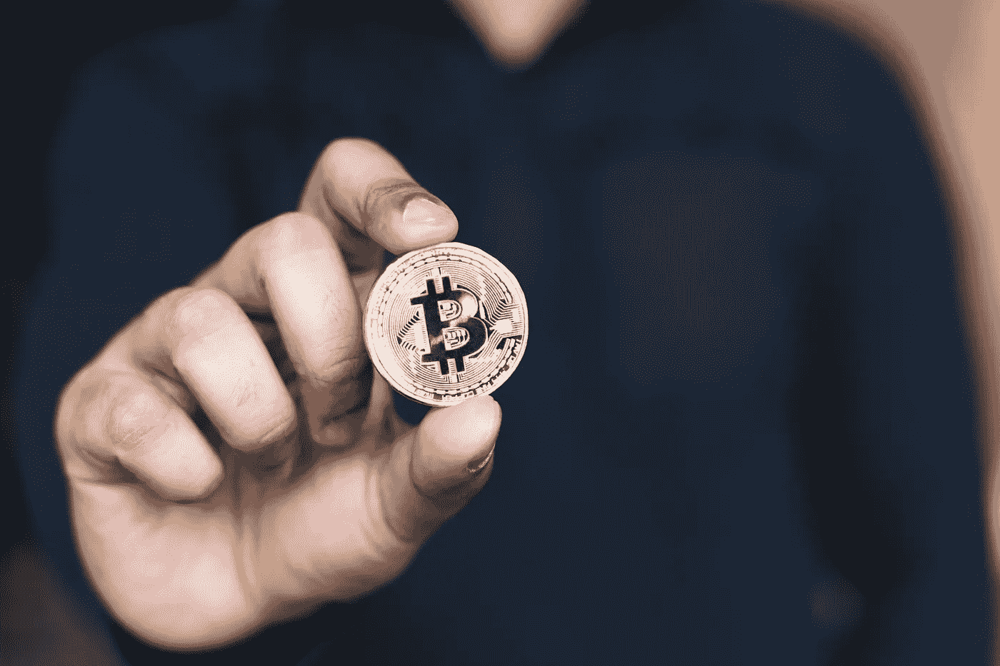
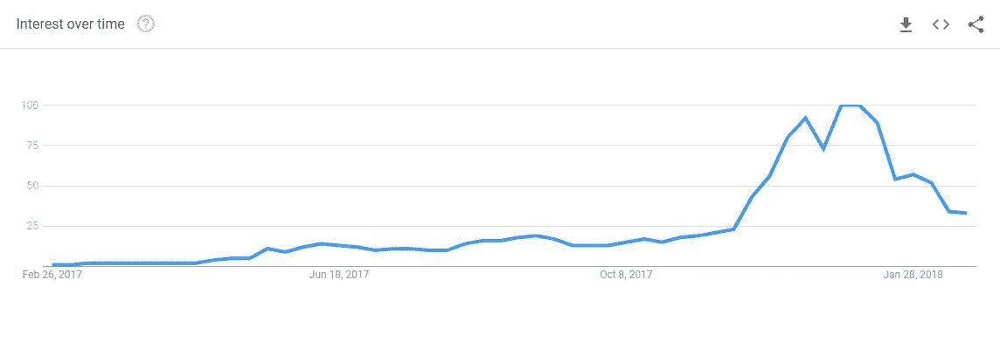
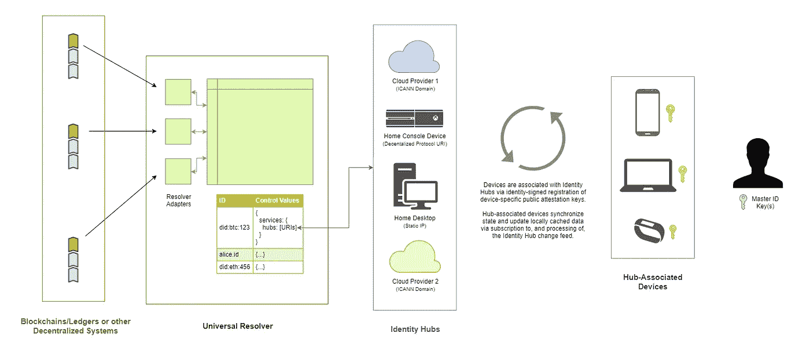
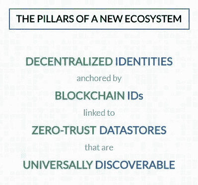

# 隐私可能是加密货币和区块链的最佳用途

> 原文：<https://medium.com/hackernoon/privacy-may-be-cryptocurrency-blockchains-best-use-73719649eda3>

在过去的几个月里，加密货币和区块链已经大规模起飞。关于加密货币及其广泛使用的合法性、可靠性和未来，有无数种观点。一个争议较少的观点是区块链和加密货币保护用户数据免受公司和政府攻击的能力。

## 什么是加密货币？

据 [*维基*](https://en.wikipedia.org/wiki/Cryptocurrency) :

> “一种**加密货币**(或**加密货币**)是一种[数字资产](https://en.wikipedia.org/wiki/Digital_asset)，它被设计作为一种[交易媒介](https://en.wikipedia.org/wiki/Medium_of_exchange)，使用[加密技术](https://en.wikipedia.org/wiki/Cryptography)来保护其交易，控制额外单位的创建，并验证资产的转移。”

如果你正在阅读这篇文章，很有可能你已经对 crypto 有所了解。

据皮尤研究中心(Pew Research Center)称，2016 年 12 月，“大约一半的美国人听说过替代货币比特币——但只有 1%的人实际上使用过比特币。”现在每天大约有 20 万个比特币( [BTC](https://www.cnbc.com/quotes/?symbol=BTC=) )交易。甚至还有像 T21 这样的秘密投资公司和对冲基金疯狂涌现！

# 什么是隐私币？

隐私和匿名是近几个月来加密货币受到如此多关注的几个原因。然而，最知名的货币比特币并没有那些不熟悉其工作原理的人所认为的隐私。隐私币为拥有它们并完成交易的用户增加了一层保护。

因为比特币是在公共的区块链账本上运行的，任何有权限的人都可以看到每一笔交易以及交易的地址。钱包地址，或简称为地址，是一个 26–35 个字符的字母数字 ID。虽然这个代码本身并不能透露多少钱，以及发送到哪个地址，但如果这个 ID 与一个人或组织相关联，它可能是一个隐私威胁。

## 隐私加密硬币如何隐藏用户身份？

这些硬币有几种隐藏用户身份和交易的方法。大多数使用某种加密技术，如隐形互联网项目(I2P)，或 Tor。其他人使用类似于零知识证明的加密方法或地址加密方法来保持匿名。

****[**排名前 5 的隐私币**](https://steemit.com/crypto/@crypto-oracle/top-5-privacy-cryptocurrencies) **:******

1.  ******破折号(*破折号* )******
2.  ******莫内罗( *XMR* )******
3.  ******Zcash ( *ZEC* )******
4.  ******PIVX ( *PIVX* )******
5.  ******边缘( *XVG* )******

********

****如今，加密货币的知识甚至使用更加广泛。仅比特币目前的市值就约为 1730 亿美元，而 crypto 整体市值已增长至约 4700 亿美元******峰值超过**【8250 亿美元】。************

************

******Interest in “Cryptocurrency” via Google Trends******

******2017 年底，人们对加密货币的兴趣达到了过去五年来的最大峰值。加密和它的基础技术区块链正稳步进入越来越多的人的日常生活。******

# ******区块链对数据安全很有帮助******

******[经济学家](https://medium.com/u/bea61c20259e?source=post_page-----73719649eda3--------------------------------)在[这篇文章](https://www.economist.com/news/briefing/21677228-technology-behind-bitcoin-lets-people-who-do-not-know-or-trust-each-other-build-dependable)中解释道，“支撑比特币的加密技术被称为‘区块链’，其应用远远超出了现金和货币的范畴。”草根组织可以利用区块链来削弱大型数据公司，如谷歌和脸书。******

******[构建区块链](https://medium.com/buildingblockchain)向我们简单易懂地解释了区块链做了什么以及它是如何工作的:******

****** [## N00bs 的区块链

### 这是了解区块链的一种简单、完美的方式。

medium.com](/buildingblockchain/blockchainfornoobs-c3e42a9e5645) 

[大多数](https://www.digitaltrends.com/computing/microsoft-plans-blockchain-decentralized-identity/)[互联网服务](https://hackernoon.com/is-it-really-possible-to-use-the-internet-privately-16dbbbcfee9)的问题在于用户信息[被收集](https://choosetoencrypt.com/privacy/search-engine-collect-user-information/)并存储在服务器上。这些服务器是黑客的目标，黑客可以渗透到这些服务器并窃取数据。

通过将数据转移到区块链，分散对全球数据的控制，降低了存储用户信息的公司的风险。你不必再将你的私人数据托付给个别公司。另一个好处是，你不会有多个提供商的个人资料，比如 Twitter、脸书和谷歌。你所有的信息都将被储存在一个安全、更加私密的地方。

Source: [The Rising Tide of Decentralized Identity](/decentralized-identity/the-rising-tide-of-decentralized-identity-2e163e4ec663)

[分散身份基金会](https://medium.com/u/8e27100ab66?source=post_page-----73719649eda3--------------------------------) ( [DIF](http://identity.foundation/) )正致力于建立“一个面向个人、组织、应用和设备的开源分散身份生态系统。许多大公司都支持 DIF 的使命，包括微软和 IBM。

Pillars of a New Decentralized Data Ecosystem

微软身份识别部门的安库尔·帕特尔说:

> “如今，应用、服务和组织提供便捷、可预测、定制的体验，这些体验依赖于对身份绑定数据的控制。我们需要一个安全的加密数字中枢，能够与用户数据进行交互，同时尊重用户隐私和控制。”

全面采用区块链可能会彻底改变互联网的工作方式。用户将最终受益最大，因为他们的数据不再受存储他们信息的许多公司的支配。

 [## 区块链是“1%”的对话，这需要改变

### 现在包容性和多样化的对话将如何有助于建立未来的这一体系。

hackernoon.com](https://hackernoon.com/designing-blockchain-equitably-55420e2951f5) 

赛亚裙·岩崎解释说，加密和区块链市场的知识和影响力仅限于特定人群。这是一个问题，因为将区块链的所有权力集中在几个人手里可能只是将现有的数据权力转移给那些新的团体，而不是真正的分散。

# 区块链的去中心化是巨大的技术进步

因为在过去的几十年里，互联网用户不得不依赖脸书或谷歌这样的大数据公司来安全地存储他们的数据，这些公司已经取得了巨大的权力。然而，这意味着对互联网(以及从中收集的数据)的控制落入了少数私人手中。有了区块链，用户可以决定他们的数据去哪里，并且知道这些数据不会被卖给第三方。

**区块链对互联网变得更加民主和由用户管理的长期影响，可能会超过它对世界货币体系的影响。********