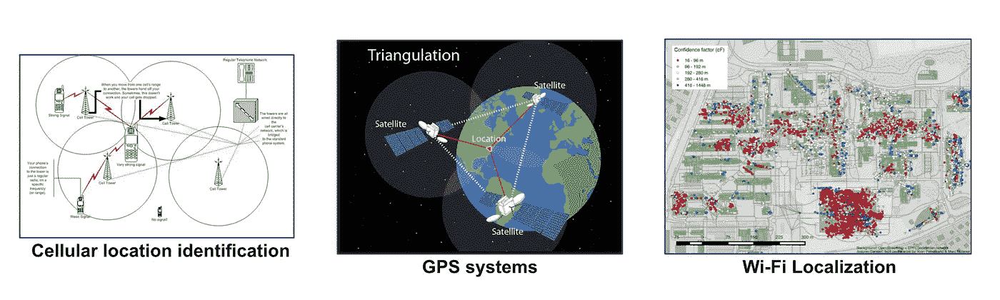
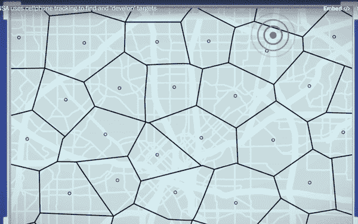

# 隐私，跟踪，谁遇见谁？

> 原文：<https://medium.com/hackernoon/privacy-stalking-who-meets-whom-3ed4c4d9f24b>

大多数人通过电子邮件和电话了解*虚拟会议*的[隐私](https://hackernoon.com/tagged/privacy)含义。我们中的一些人甚至意识到他们一直在被跟踪。然而，我们假设我们的*物理会议*仍然是私人的。一个坏演员会一直跟随在地球上每个人身边的可能性极小。因此，我们似乎不太关心，如果不是完全不关心，我们身体接触的隐私。

有人整天跟着你，或者至少有类似的事情正在发生。可悲的是，我们应该担心。

就在我们说话的时候，有多个系统正在记录你的位置。政府机构，电信。和技术。公司使用技术(如图所示)以惊人的精确度跟踪用户的移动性，通常是在用户不知情或不同意的情况下。早在 2014 年，《华盛顿邮报》披露，美国国家安全局通过隐藏的手机公司后门收集居住在美国的人的位置数据。[谷歌](https://hackernoon.com/tagged/google)最近承认秘密追踪安卓设备的位置数据，甚至在 GPS 明确关闭的情况下。(*在某些情况下，世界上每月有超过 20 亿活跃的 android 设备用户，谷歌可能会跟踪他们的位置历史。*)

User location identification methodologies

可以肯定的是，这种跨越 zettabytes 的数据量可能太多，没有任何意义。讲道理就相当于在干草堆里找针。在位置隐私领域也有重要的研究，客户的抵制导致一些公司在收集数据时采用了最新的隐私技术[ [3](https://static.googleusercontent.com/media/research.google.com/en//pubs/archive/42852.pdf) ]。

然而，这是摩尔定律赶上了 ***精密的计算机算法*** 进来。计算机非常擅长学习模式，并通过梳理这些数据来建立人类分析师通常看不见的深层联系。此外，这些隐私技术还处于相对萌芽的阶段[ [4](https://arxiv.org/pdf/1709.02753.pdf) 和*它们* ***不会隐藏*** ***关于用户的一切*** *。*

最近的研究指出，我们可以从位置数据中推断出个人用户及其物理连接的惊人敏感信息。

从根本上说，一个整天跟着你的人会了解你什么？跟踪一个人，揭示了一个人的个人，专业，通过时间和地点的物理会议明显的秘密联系。实时跟踪整个人群的位置相当于以很小的代价跟踪每个人。

*Washington post: NSA Co-Traveller Program*

由于用户位置数据的规模，组织不可避免地要跟踪几乎每个人的实际会议。就在我们说话的时候这正在发生。《华盛顿邮报》披露的文件记录了美国国家安全局的同路人项目，该项目在全球范围内寻找已知犯罪者之间的身体接触，以识别潜在的同谋者。

经常见面的夫妇可能有社会关系，如朋友、亲戚、同事、伙伴等。利用这种直觉，研究人员表明，人们可以从重要人群的位置数据中准确地推断出用户的社会关系。此外，人们在何时何地相遇也能揭示夫妻关系的本质。例如，深夜在汽车旅馆的一次会面可能暗示着一段风流韵事。

在南加州大学的信息实验室工作时，我和我的合作者介绍了这个问题，并提出了一些保护会议隐私的方法。

公众对这些推论的理解程度以及对泄露信息的敏感性的了解，将推动对新型隐私保护机制的研究和资助。