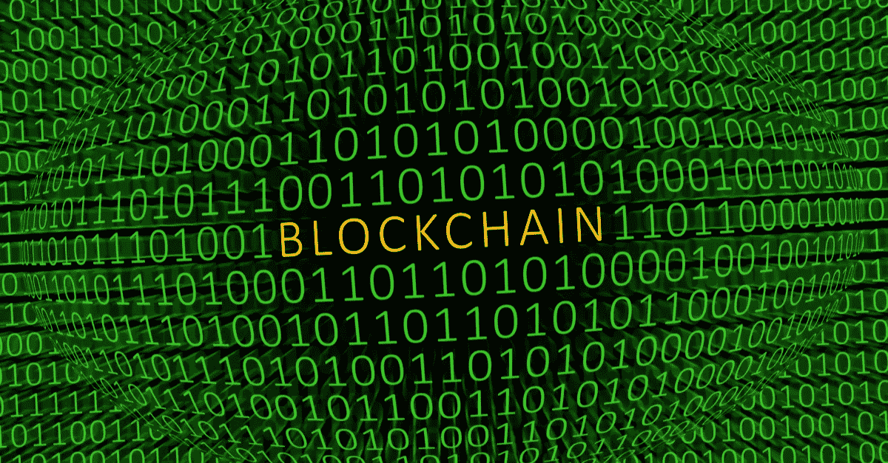
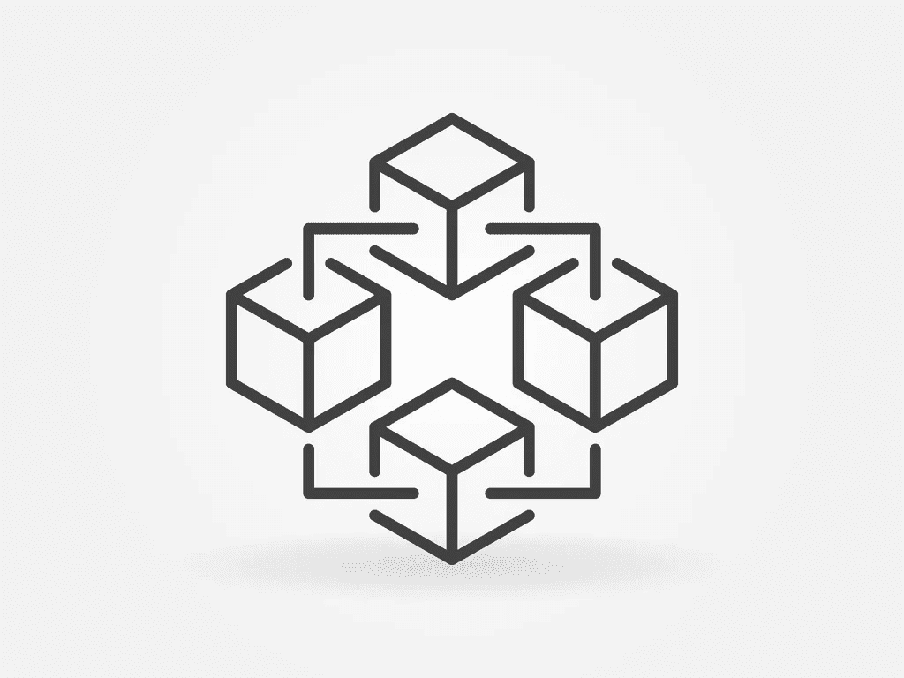

# 私有区块链 vs 公有区块链

> 原文：<https://medium.com/hackernoon/private-blockchain-vs-public-blockchain-cc3b71bc95f8>

如果你没有真正理解这些类型的区块链之间的区别以及它们的含义，你就不可能成为秘密投资者或企业家。即使它们基于相似的原理，它们的操作实际上对于所有级别都是不同的。因此，这些区块链发行的代币不会以同样的方式进行评估。

**主要区别是什么？**

一个**区块链就是所谓的** **(或者开放)的时候任何人都可以成为网络的一员而不需要准入条件**。换句话说，任何希望使用网络提出的服务的人都可以在本地下载协议，而不必暴露他或她的身份或满足预定的标准。[协议](https://www.blockchains-expert.com/en/decoding-a-revolutionary-business-model/)是一种计算机程序，它定义了基于区块链的网络操作规则，可以比作宪章。例如，比特币网络的成员(通过其“钱包”的中介)下载比特币协议，以便能够加入网络并兑换比特币，但唯一的条件是要有互联网连接。

与**专用区块链(或封闭的** ) **不同，因为网络成员是在能够下载协议并因此使用网络提出的服务**之前被选择的。采矿能力和共识系统作为一个整体集中在同一个实体手中。因此，基于私有区块链的网络本身并不是分散的。

Private blockchain

最后，区块链财团提供了私人区块链的许多好处，而没有集中同一实体之手之间的共识机制。

在本文中，我们将主要关注公立和私立区块链的区别。

**这些类型的区块链之间的差异基于网络成员之间存在的信任级别以及由此产生的安全级别。**事实上，网络成员之间的信任水平越高，共识机制就越轻(其目的是将区块安全地添加到区块链中)。正如我们将会看到的，公共区块链的成员之间没有信任，因为它对每个人都开放，相反，私人区块链的信任要强得多，因为成员是预先选定的。因此，在基于区块链的网络中，成员之间的信任程度直接影响网络的结构和机制。

**这些不同类型区块链的优缺点**

**公共区块链**

当网络必须真正去中心化时，公共区块链是理想的，这意味着没有中央实体控制网络成员的进入，并且共识机制是民主的。协商一致的民主机制意味着所有成员都可以成为未成年人，并且这些未成年人在竞争中为区块链添砖加瓦(至少在使用工作证明机制时)。

但是这种权力下放是有代价的:

- **块的有限大小**:每个块中可以添加的事务数量是有限的，这涉及到向区块链添加事务的速度的重要限制。

- **每笔交易的成本可能很高**:未成年人只参与采矿过程，因为他们希望获得分配给未成年人的奖励(硬币和费用)，他们为区块链增加了一个区块。对他们来说，这是一项业务，这种奖励将资助他们在采矿过程中发生的费用(电力、计算机设备、互联网连接)。分配给他们的令牌由协议直接发放，但费用由用户支付。例如，在比特币的情况下，未成年人每添加一个区块可获得 12.5 个比特币，此外还有用户为将其交易添加到区块而支付的费用。这些费用是可变的，增加交易的需求越高，费用越高。

Public Blockchain

- **添加到区块链的交易是公开的**:全世界(网络成员作为非成员)都可以访问添加到区块链的交易。交易信息对不认识其他成员的未成年人公开，以检查一致性(例如，创建交易的人持有足够的比特币)。这些事务显然不是记名的，只有你的公钥出现，但如果有人知道你的公钥，他就能找到你创建的所有事务。

**财团**

联合体是一个网络，其中可以参与共识机制的成员是预先选择的。这种类型的区块链一般被认为是部分去中心化的，以至于未成年人的身份是已知的，并且有可能公开或不公开添加到区块链的交易。

这种类型的区块链以与我们下面描述的私有区块链相同的方式实现，但是不同之处在于共识过程不集中在单个实体的手中。

**二等兵区块链**

共识机制集中在单个实体手中，该实体的任务是验证所有交易并将其添加到区块链中。因此，基于私有区块链的网络不需要使用诸如“工作证明”或“利益证明”之类的机制，这些机制实现起来复杂且昂贵。在私人区块链的情况下，安全问题要简单得多，有可能采用协商一致的机制，这种机制更轻、更有效，因此也更容易部署，例如 BFT。

这种对共识的控制有几个优点:

- **操纵区块链**:确实有可能在任何时候回到已经加入区块链的交易上，从而改变成员的平衡。在公共区块链中，这种操作将要求 51%的散列权力(即开采能力)集中在同一实体手中。这不再是理论，因为它发生在 2014 年初，当时 GHash minor 的合作社达到了 51%的门槛。

- **没有费用**:采矿过程没有竞争性，没有未成年人可以获得报酬，交易没有成本和回报。

- **达成共识要快得多:**共识机制是集中式的这一事实使得达成共识要快得多。事实上,“共识”一词已不再适用，因为它是区块链交易的记录。注意，负责管理区块链的实体可以决定改变区块链的参数，特别是增加块的大小，以便能够添加更多的事务。

- **私有数据:**负责管理区块链的实体也可以决定控制谁可以进入网络，以及交易是否公开。

Blockchain

你可能会问，是什么让私有区块链比我们今天所知的共享数据库更好呢？

这种类型的区块链的灵活性可能对面临运营或监管限制的大量行业非常有用。

例如，希望使用区块链跟踪其库存的每种产品的分销公司可能会选择使用私有区块链，因为它具有不变性、透明性、安全性和灵活性。这样的企业没有兴趣使用公共区块链。

类似地，希望使用区块链来执行和记录交易的银行网络将受到保密义务的约束，因此被迫使用私人区块链或财团，正如 R3 网络通过其智能合同平台“Corda”所做的那样。

如果你喜欢这篇文章，请不要犹豫，喜欢它，并在社交媒体上分享！！