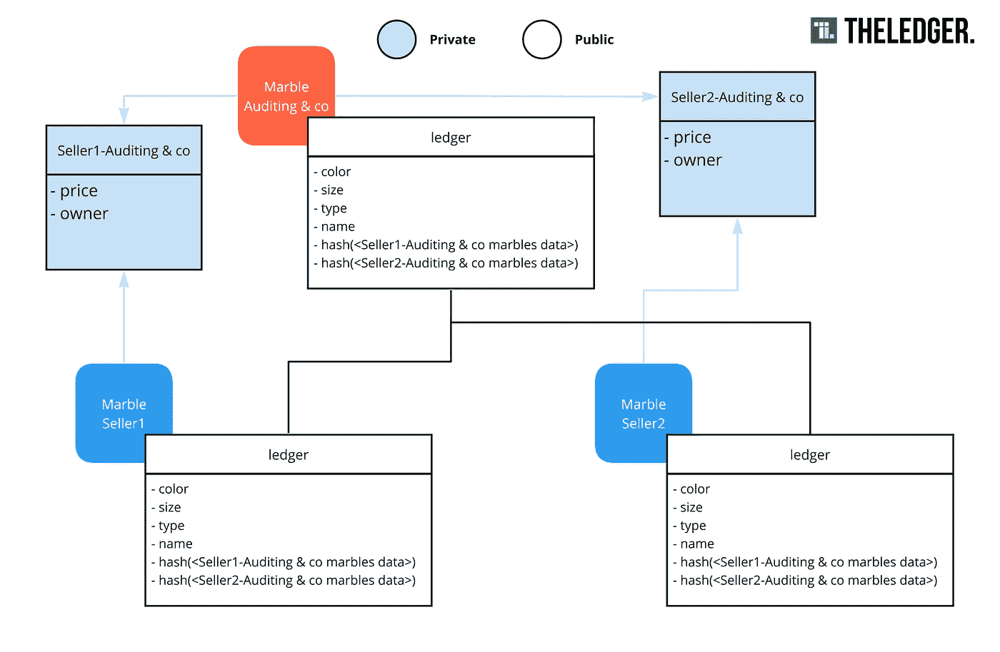

# 私有数据，Hyperledger 结构的内置“GDPR 兼容”解决方案

> 原文：<https://medium.com/hackernoon/private-data-a-built-in-gdpr-compliant-solution-for-hyperledger-fabric-5a35b91e6aaa>


在最新发布的 [Hyperledger Fabric](https://hackernoon.com/tagged/hyperledger-fabric) v1.2 中，他们引入了私有数据的概念。这个特性可以解决当今技术中存在的一系列保密问题。其中之一是 GDPR 合规性。以下文章需要一些一般的织物知识。如果你还不熟悉 Hyperledger Fabric，我建议你看看这个[视频系列](https://www.youtube.com/watch?v=7EpPrSJtqZU&list=PLjsqymUqgpSRXC9ywNIVUUoGXelQa4olO)或者官方文档上的[介绍](http://hyperledger-fabric.readthedocs.io/en/release-1.1/blockchain.html)。

> 快速说明:我不是 GDPR 专家。您实施这项技术的方式并不保证符合 GDPR 标准。但是私有数据支持符合 GDPR 标准的区块链应用。

# 那是什么？SideDBs？区块链的私人数据？

目前实现机密性的方法是使用通道。不鼓励仅仅为了实现保密性而为大型网络创建大量通道。为每个交易方创建通道会带来很多开销，比如管理策略、链代码版本控制和成员资格服务提供者。所有的数据要么是公开的，要么是私人的。如果你想把一项资产转移给渠道外的一方，这将是一种负担。这就是私人交易的用武之地。私有数据允许您使用策略创建数据集合，以定义渠道中的哪些方可以访问数据。这种访问可以简单地通过向集合添加策略来管理。这允许一些数据对某些方是公开的，而一些是私有的。

## 即期

想象一下弹珠的例子。你想保存哪些弹珠属于谁。除了所有者和价格，所有大理石数据都可以公开。出于隐私原因，这些不能被任何人看到。未来交易的价格不应公开。也许您需要跟踪这些数据，因为您需要验证出售弹珠的人是否是实际所有者。一家(虚构的)marble 审计公司将成为合作伙伴来验证欺诈行为。如果你没有使用频道，在 1.1 中，你所做的一切都将被记录到分类帐中。这不符合 GDPR 的要求。

## 私有数据如何解决这个问题？


Image 1: From slidedeck “Privacy Enabled Ledger” [https://jira.hyperledger.org/browse/FAB-1151](https://jira.hyperledger.org/browse/FAB-1151)

第一组“*通道读写组*”是当前架构的样子。每笔交易都记录在状态和历史中。

第二组显示了两个对等体之间的共享私有状态，每个对等体都在各自的组织中。这种状态根据策略在这些对等体之间复制。

第三组展示了私人交易的真正力量。某些成员可以省略这些集合。这意味着你可以为每一个**Marble seller-Marble auditor**关系建立单独的私人收藏。这些集合允许添加一些数据，而主数据仍然存储在主状态和分类帐中。


Image 2: Private state [https://hyperledger-fabric.readthedocs.io/en/release-1.2/private-data/private-data.html](https://hyperledger-fabric.readthedocs.io/en/release-1.2/private-data/private-data.html)

授权的对等方将看到主分类帐中数据的散列，以及私有数据库中的实际数据。未经授权的对等方不会同步私有数据库，只能看到分类帐中的散列。由于散列是不可逆的，他将无法看到实际的数据。

概括地说，使用私有数据解决的问题如下所示。



Image 3: Marbles issue made GDPR compliant

# 这如何适用于 GDPR？

*我的同事* [*Andries*](https://medium.com/u/97ae5eb6d988?source=post_page-----5a35b91e6aaa--------------------------------) *，对 GDPR 和*[](https://hackernoon.com/tagged/blockchain)**的问题做了明确的文章。我将在这里简要描述这个问题，但如果你想阅读全文，请点击这里*[](/wearetheledger/the-blockchain-gdpr-paradox-fc51e663d047)**。***

## **问题是**

**已经添加到分类帐的数据不能删除。所以在添加个人数据时，这是 GDPR 的问题。人们不能简单地删除块。一种常用的解决方案是离线存储数据，如下图所示。但是这种解决方案相当复杂，因为您必须手动查找数据的有效性以及区块链上的数据链接。**

****

## **私有数据作为解决方案**

**私有数据基本上是上述结构本身的解决方案，不需要额外的工作。它解决了 GDPR 的多个问题。**

****数据限制****

**你不应该访问你不使用的数据**

**私有数据通过不使用类似于背书的策略来控制访问，从而解决了这个问题。通过使用 fabric 中已经存在的策略逻辑，我们可以使用 OR、AND 运算符来定义哪些方可以访问。**

```
**// collections_config.json[
  {
       "name": "collectionFarmer-Store",
 **"policy": "OR('FarmerMSP.member', 'StoreMSP.member')",**       "requiredPeerCount": 0,
       "maxPeerCount": 3,
       "blockToLive":1000000
  }
]**
```

****使用限制****

***您应该只保留您需要的数据***

**对于集合，您可以在策略中指定一个 *blockToLive* 。这就像它听起来的那样。您可以根据块来定义集合应该保留多长时间。这意味着，私有数据库中的旧数据将在 x 个块之后自动清除，您不必担心有未使用的数据。实际块中的散列将不会被删除。**

```
**// collections_config.json[
  {
       "name": "collectionFarmer-Store",
       "policy": "OR('FarmerMSP.member', 'StoreMSP.member')",       "requiredPeerCount": 0,
       "maxPeerCount": 3,
 **"blockToLive":1000000**  }
]**
```

****被遗忘的权利****

**这与前一项相同，但可以手动删除项目。因为除了散列之外，没有任何东西被写入分类帐，所以在这个过程之后，这个项目将不存在于任何地方。**

# **警告**

## **此解决方案仅在以下情况下符合 GDPR 标准**

1.  ****当事人并无恶意****

**如果他们有不良意图，他们可以复制这些数据并与外部方共享。这是一个普遍问题，并不是区块链技术公司特有的。这就是你的财团中的规则发挥作用的地方。您需要定义清晰的规则和明确的后果，以确保节点不会变得恶意。**

****2。正确实施时****

**就像本文开头提到的。如果你写的正确，它是 GDPR 兼容的。你必须小心你把什么放在公共账本上，什么放在私人账本上，以及你将这些数据保留多久。**

## **它还不是防弹的**

**您的链码将在所有对等机之间复制。其他配置文件也是如此。这意味着 *collections_config.json* 也将被复制到所有对等体，以便系统正确设置和了解这些私有集合。这意味着每个成员都可以看到谁在做生意或与谁共享秘密数据。他们看不到实际数据，但透露参与者的信息仍然是一个保密问题。这个[问题](https://jira.hyperledger.org/browse/FAB-7593)应该在 1.3 中解决。**

## **集合必须预先定义**

**目前，私有集合必须预先定义。当存在大量不同的交易方对交易方时，这很难维持。但是可以用。1.3 版本将[引入](https://jira.hyperledger.org/browse/FAB-10889)隐式集合，这些集合基本上是可以动态创建的集合，甚至可以传递给其他成员。**

***原*贴于[边缘](https://medium.com/wearetheledger)**