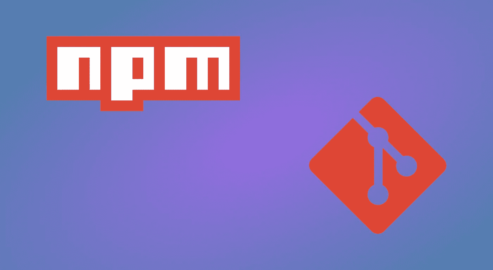

# 二等兵 NPM 用简单的方式打包

> 原文：<https://medium.com/hackernoon/private-npm-packages-2e6579b37616>

## *如何在内部共享公司 npm 模块*

假设您刚刚编写了一个惊人的[节点](https://hackernoon.com/tagged/node)模块，您希望将其分解成一个包，以便可以重用。问题是，它包含一些超级机密的公司资料，不能共享，你不能，或者不想，创建一个私人的 npm 组织。那你现在做什么？